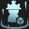

# Augment: silver, Count: 46
| key                        | name                    | icon                                                                        | desc                                                                                                                                                       |
| -                          | -                       | -                                                                           | -                                                                                                                                                          |
| AFK                        | AFK                     |                                                | You cannot perform actions for the next 3 rounds. Afterwards, gain 18 gold.                                                                                |
| ArmyBuilding               | Team Building           |                              | Gain a Lesser Champion Duplicator. Gain another after 7 player combats.                                                                                    |
| BardPlaybook1              | Caretaker's Ally        |                            | Each time you level up, gain the same random Tier 2 champion.                                                                                              |
| BloodMoney                 | Blood Money             |                                  | Gain 3 gold per 10 Health your Tactician loses.                                                                                                            |
| BronzeTicket               | Sliver Ticket           |                              | Gain a free Shop reroll after every 4 rerolls.                                                                                                             |
| BuildingACollection        | Buried Treasures I      |                | At the start of the next 2 rounds, gain a random item component.                                                                                           |
| Commander_PartialAscension | Partial Ascension       |  | After 15 seconds of combat, your units deal 30% more damage.                                                                                               |
| Commander_RollingForDays   | Rolling For Days I      |      | Gain 9 free Shop rerolls that never expire.                                                                                                                |
| CustomerIsAlwaysRight      | Component Buffet        |            | Gain a random component. Whenever you would get a random component, instead gain a component anvil.                                                        |
| CuttingCorners             | Cutting Corners         |                          | Leveling up costs 3 XP less.                                                                                                                               |
| CyberneticBulk1            | Cybernetic Bulk I       |                        | Your champions holding an item gain 200 health.                                                                                                            |
| CyberneticUplink1          | Cybernetic Uplink I     |                    | Your champions holding an item gain 80 Health and restore 2 Mana per second.                                                                               |
| DangerousToGoAlone         | Parting Gifts           |                  | When a champion dies, the nearest ally with open slots receieves a temporary copy of an item they were holding and a 10% max Health Shield.                |
| DravenSpoilsOfWar          | Spoils of War I         |                    | Enemies have a 25% chance to drop loot when killed.                                                                                                        |
| Formation1                 | Unified Resistance I    |                                  | If you have 3 or more champions in the same row at the start of combat, they all gain 15 Armor and Magic Resist.                                           |
| Harmacist1                 | Harmacist I             |                                  | Your team has 10% Omnivamp and convert 20% of excess healing to true damage on their next attack.  (Omnivamp: healing for a percent of damage dealt) |
| HealingOrbsI               | Healing Orbs I          |                              | When an enemy dies, the nearest allied unit is healed for 225.                                                                                             |
| IndomitableWill            | Indomitable Will        |                        | When your units score a Takedown they shed all negative effects and become immune to Crowd Control for 10 seconds.                                         |
| IronAssets                 | Iron Assets             |                                  | Gain a Component Anvil and 4 Gold.                                                                                                                         |
| ItemGrabBag1               | Item Grab Bag I         |                              | Gain 1 random completed item.                                                                                                                              |
| LategameSpecialist         | Late game Specialist    |                  | When you reach Level 9, gain 33 gold.                                                                                                                      |
| LongTimeCrafting           | Latent Forge            |                      | Gain an Ornn Item Anvil after 8 player combats.                                                                                                            |
| MissedConnections          | Missed Connections      |                    | Gain a copy of each Tier One champion.                                                                                                                     |
| OnARoll                    | On a Roll               |                                        | Whenever you star up a champion, gain up to 3 free Shop rerolls per round. Gain 3 gold.                                                                    |
| OneTwoFive                 | One, Two, Five!         |                                  | Gain 1 random component, 2 Gold, and 1 random Tier 5 champion.                                                                                             |
| OneTwosThree               | One Twos Three          |                              | Gain 3 1-cost champion, 2 2-cost champions, and 1 3-cost champion.                                                                                         |
| PandorasItems              | Pandora's Items         |                            | Round start: items on your bench are randomized (except Tactician's Crown and Spatula).  Gain a random component.                                    |
| PumpingUp                  | Pumping Up I            |                                    | Your team gains 8% Attack Speed now. Each round after, they gain 0.5% more.                                                                                |
| Recombobulator             | Recombobulator          |                          | Champions on your board permanently transform into random champions 1 cost Tier higher. Gain 2 Magnetic Removers.                                          |
| RedBuff                    | Blistering Strikes      |                                        | Your team's attacks burn their targets for 5% of their maximum Health over 5 seconds. Attacks also reduce their targets' healing received by 33%.          |
| RiskyMoves                 | Risky Moves             |                                  | Your Tactician loses 20 Health, but after 7 Player combats, gain 30 Gold.                                                                                  |
| SilverSpoon                | Silver Spoon            |                                | Gain 10 XP.                                                                                                                                                |
| StationarySupportI         | Stationary Support I    |                  | After 8 player combats, gain 1 Training Dummy(s) equipped with 1 random Support item(s), which cannot be removed.                                          |
| TeamingUpI                 | Teaming Up I            |                                  | Gain 1 random component and 2 random Tier 3 champions.                                                                                                     |
| TinyTitans                 | Tiny Titans             |                                  | Increase your current and maximum player health by 30.                                                                                                     |
| YoungAndWildAndFree        | Young and Wild and Free |                | You can always move freely on Carousel rounds. Gain 3 Gold.                                                                                                |
| Keepers1                   | Keepers I               |                                      | Combat start: units with adjacent allies gain a 150 Health shield for 8 seconds. This shield stacks.                                                       |
| Vampirism                  | Vampirism I             |                                    | Your team gains 20 Health. Gain another 2 Health and 1% Omnivamp per 5 missing player health. (Omnivamp: healing for a percent of damage dealt)         |
| SilverVeil                 | Silver Veil             |                                  | Your team gains 5% Attack Speed and is immune to the first crowd control effect in combat.                                                                 |
| ReachTheSummit             | Reach The Summit        |                          | When you reach Level 9, gain 10 gold and 50.                                                                                                               |
| HelpIsOnTheWay             | Help Is On The Way      |                          | After 8 player combats. choose 1 of 4 Support items.                                                                                                       |
| GoodForSomethingSilver     | Good For Something I    |          | Champions that aren't holding items have a 35% to drop 1 gold on death.                                                                                    |
| SwitchingGears             | Switching Gears         |                          | Gain 3 gold whenever you break your win or loss streak.                                                                                                    |
| SticksAndStones            | Sticks And Stones       |                        | Champions that aren't holding items Shred and Sunder enemies for 3 seconds. Physical damage Sunders for 30%, and magic damage Shreds for 30%.              |
| Stimpack                   | Stimpack                |                                      | Gain 4 components after you lose 50 player health.                                                                                                         |
| BestFriends1               | Best Friends I          |                              | Units isolated in pairs gain 12% Attack Speed and 10 Armor at the start of combat.                                                                         |
# Augment: gold, Count: 97
| key                       | name                  | icon                                                                      | desc                                                                                                                                                                                            |
| -                         | -                     | -                                                                         | -                                                                                                                                                                                               |
| ACutAbove                 | A Cut Above           |                                  | Gain a Deathblade. Champions holding this item have a 20% chance to drop 1 gold on kill.                                                                                                        |
| BalancedBudget2           | Balanced Budget II    |                      | At the start of the next 4 rounds, Gain 7 Gold.                                                                                                                                                 |
| BardPlaybook2             | Caretaker's Favor     |                          | Gain a component anvil when you reach level 5, 6, 7, and 8.                                                                                                                                     |
| BigGrabBag                | Big Grab Bag          |                                | Gain 3 random components, 2 gold, and a Reforger.                                                                                                                                               |
| BuildingACollectionPlus   | Buried Treasures II   |      | At the start of the next 3 rounds, gain a random item component.                                                                                                                                |
| CapriciousForge           | Capricious Forge      |                      | Gain a Blacksmith's Gloves, which equips two temporary Artifacts each round.                                                                                                                    |
| ClearMind                 | Clear Mind            |                                  | If you have no champions on your bench at the end of player combat round, gain 3 experience points.                                                                                             |
| ClutteredMind             | Cluttered Mind        |                          | If your bench is full at the end of player combat round, gain 3 experience points. Gain 4 random Tier 1 champions.                                                                              |
| CombatCaster              | Combat Caster         |                            | Your team gains a 90-170 Health shield for 6 seconds after casting their Ability. The shield amount scales with round of the game.                                                              |
| Commander_Ascension       | Ascension             |              | After 15 seconds of combat, your units deal 50% more damage.                                                                                                                                    |
| Contagion                 | Contagion             |                                  | Combat Start: Infect the highest health enemy, increasing their damage taken by 18%. Every 5 seconds and on death, the infection spreads to 2 nearby units.                                     |
| CyberneticBulk2           | Cybernetic Bulk II    |                      | Your champions holding an item gain 300 health.                                                                                                                                                 |
| CyberneticUplink2         | Cybernetic Uplink II  |                  | Your champions holding an item gain 120 Health and restore 2.5 Mana per second.                                                                                                                 |
| DravenSpoilsOfWar2        | Spoils of War II      |                | Enemies have a 30% chance to drop loot when killed.                                                                                                                                             |
| EnshroudingStillness      | Mana Burn             |            | All enemies take 1% of their max Health as true damage each second until they cast their Ability. Gain a Shroud of Stillness.                                                                   |
| EscortQuest               | Escort Quest          |                              | Gain a Training Dummy. Each round, if it survives combat, gain 3 gold.                                                                                                                          |
| Formation2                | Unified Resistance II |                                | If you have 3 or more champions in the same row at the start of combat, they all gain 25 Armor and Magic Resist.                                                                                |
| GargantuanResolve         | Gargantuan Resolve    |                  | Gain a Titan's Resolve. Your Titan's Resolves can continue stacking to 40 instead of 25.                                                                                                        |
| GiftsFromTheFallen        | Gift from the fallen  |                | Your units gain 3% Attack Damage, 3 Ability Power, 3 Armor, and 3 Magic Resist. When one of your units dies, all your units gain these stats again.                                             |
| Harmacist2                | Harmacist II          |                                | Your team has 15% Omnivamp and convert 25% of excess healing to true damage on their next attack.  (Omnivamp: healing for a percent of damage dealt)                                      |
| HealingOrbsII             | Healing Orbs II       |                          | When an enemy dies, the nearest allied unit is healed for 450.                                                                                                                                  |
| Idealism                  | Idealism              |                                    | Gain a Hand of Justice. Champions holding this item deal 12% increased damage.                                                                                                                  |
| ImpromptuInventions       | Scrappy Inventions    |              | Combat start: Up to 5 equipped components turn into completed items for the rest of combat. Gain a component at the start of the next 2 stages.                                                 |
| Infusion                  | Infusion              |                                    | Your team restores 20 Mana every 5 seconds.                                                                                                                                                     |
| JeweledLotus              | Jeweled Lotus II      |                            | Your units' Abilities can critically strike. Your units gain 15% Critical Strike chance.                                                                                                        |
| JustKeepRolling           | Frequent Flier        |                      | After you reroll your shop 8 times, reroll only cost 1 gold.                                                                                                                                    |
| KnowYourEnemy             | Know Your Enemy       |                          | Your team deals 10% more damage. Deal 15% more damage instead if you and your opponent have any of the same traits active.                                                                      |
| LastStand                 | Last Stand            |                                  | The first time you would be eliminated, you escape death and your team permanently gains 160 Health, 16 Armor and Magic Resist, and 16% Omnivamp.                                               |
| LearningFromExperience2   | Patient Study         |      | After player combat, gain 2 XP if you won or 3 XP if you lost.                                                                                                                                  |
| LongDistanceRelationship2 | Long Distance Pals II |  | Combat start: Your two furthest champions form a bond, sharing 20% of their Armor, Magic Resist, Attack Damage, and Ability Power with each other.                                              |
| Martyr                    | Martyr                |                                        | Whenever one of your units dies, all allies heal for 9% of Maximum health                                                                                                                       |
| MetabolicAccelerator      | Metabolic Accelerator |            | Gain 2 player health after every player combat. Your Tactician also moves faster.                                                                                                               |
| NotToday                  | Not Today             |                                    | Gain an Edge of Night. Champions holding this item gain 35% Attack Speed.                                                                                                                       |
| OldMansWalkingStick       | Magic Wand            |              | Gain a Needlessly Large Rod. Your units gain 18% Ability Power.                                                                                                                                 |
| PandorasItems2            | Pandora's Items II    |                        | Round Start: items on your bench are randomized (excluding Tactician's Crown, Spatula, and consumables).  Gain 1 random completed item.                                                   |
| PortableForge             | Portable Forge        |                          | Choose 1 of 2 Artifacts.                                                                                                                                                                        |
| PortableForgePlus         | Portable Forge+       |                  | Choose 1 of 3 Artifacts.                                                                                                                                                                        |
| PortableForgePlusPlus     | Portable Forge++      |          | Choose 1 of 4 Artifacts.                                                                                                                                                                        |
| PumpingUp2                | Pumping Up II         |                                | Your team gains 8% Attack Speed now. Each round after, they gain 1% more.                                                                                                                       |
| ReturnOnInvestment        | Return on Investment  |                | When you reroll your Shop 16 times, gain a Tactician's Crown.                                                                                                                                   |
| RichGetRicher             | Rich Get Richer       |                          | Gain 12 gold. Your max interest is increased to 7.                                                                                                                                              |
| RichGetRicherPlus         | Rich Get Richer+      |                  | Gain 18 gold. Your max interest is increased to 7.                                                                                                                                              |
| SalvageBin                | Salvage Bin           |                                | Gain 1 random completed item now, and 1 component after 7 player combats. Selling champions breaks apart their full items into components (excluding Tactician's Crown).                        |
| SalvageBinPlus            | Salvage Bin+          |                        | Gain 1 random completed item now, and 1 component after 4 player combats. Selling champions breaks completed items into components (excluding Tactician's Crown).                               |
| SilverTicket              | Golden Ticket         |                            | Each time your Shop is rerolled, you have a 30% chance to gain a free reroll.                                                                                                                   |
| Sleightofhand             | Sleight of Hand       |                          | Gain a Thief's Gloves. Champions holding this item gain 200 Health and 20% Attack Speed.                                                                                                        |
| StarsAreBorn              | Stars are Born        |                            | The first 1-cost and 2-cost champions you buy are instantly upgraded to 2-star. Gain 5 gold.                                                                                                    |
| StationarySupportII       | Stationary Support II |              | Gain 1 Training Dummy with 1 permanently attached Support item(s).                                                                                                                              |
| SupportCache              | Support Cache         |                            | Choose 1 of 4 Support items.                                                                                                                                                                    |
| TeamingUpII               | Teaming Up II         |                              | Gain 1 random Support item and 2 random 4-cost champions.                                                                                                                                       |
| ThreesACrowd              | Three's a Crowd       |                            | Your team gains 75 Health for each unique 3-cost champion on your board.                                                                                                                        |
| ThreesCompany             | Three's Company       |                          | Gain 4 random 3-cost champions.                                                                                                                                                                 |
| TonsOfStats               | Tons of Stats!        |                              | Your team gains 44 Health, 4% Attack Damage, 4 Ability Power, 4 Armor, 4 Magic Resist, 4% Attack Speed, and 4 Mana.                                                                             |
| TradeSector               | Trade Sector          |                              | Gain a free Shop reroll every round. Gain 2 gold.                                                                                                                                               |
| TwoHealthy                | Two Healthy           |                                | Your team gains 110 Health for each unique 2-cost champion on your board.                                                                                                                       |
| WhatDoesntKillYou         | What Doesn't Kill You |                  | Gain 2 gold after losing a player combat. Gain a random component after every 4 losses.                                                                                                         |
| YouHaveMyBow              | You Have My Bow       |                            | Gain a Recurve Bow. Your units gain 12% Attack Speed.                                                                                                                                           |
| YouHaveMySword            | You Have My Sword     |                        | Gain a B.F. Sword. Your units gain 15% Attack Damage.                                                                                                                                           |
| RememberYourRoots         | Remember Your Roots   |                  | Allies sharing a trait with your Headliner gain 200 Health and 10% Attack Speed.                                                                                                                |
| BiggerShot                | Bigger Shot           |                                | Every 3 attacks, Big Shots also fires a bomb that deals 100% Attack Damage to enemies within 1 hex of the target. Gain a Kaisa.                                                                 |
| BestFriends2              | Best Friends II       |                            | Units isolated in pairs gain 15% Attack Speed and 20 Armor at the start of combat.                                                                                                              |
| InsertCoin                | Insert Coin           |                                | Your 8-Bit champions execute targets below @ExecuteThreshold*100@% Health. Executions have a 10% chance to drop 1 gold, increased by 2% for each high score achieved. Gain a Corki and a Garen. |
| EncoreHeadliner           | Encore!               |                      | The first time your Headliner dies, they become invulnerable and heal 60% of their max Health over 1.5 seconds instead.                                                                         |
| MetalHeads                | Metal Heads           |                                | Your Pentakill champions are immune to crowd control for the first 12 seconds of combat. They heal 4% of their max Health on takedown. Gain a Kayle and a Gnar.                                 |
| InspiringEpitaph          | Inspiring Epitaph     |                    | When a unit dies, the nearest ally gains a 25% max Health shield and 10% stacking Attack Speed.                                                                                                 |
| LiveForDanger             | Live For Danger       |                          | Edgelords attacks deal 40% of their damage to enemies within 1 hexes of their target. Gain a Yasuo and a Kayle.                                                                                 |
| FullyAdapted              | Fully Adapted         |                            | Gain an Adaptive Helm. Champions holding this item gain both effects.                                                                                                                           |
| TwinTerror1               | Twin Terror I         |                              | When you field exactly 2 copies of a champion, they both gain 300 Health, 30% Attack Speed. Anytime you 3-star, gain a 2-star copy.                                                             |
| ThatsJazzBaby             | That's Jazz, Baby!    |                          | Gain a Bard. Combat start: Jazz champions gain permanent bonuses based on the number of active traits. 3: 20 max Health
5: and 2% Attack Speed
7: and 2% Attack Damage and 2 Ability Power    |
| CrashTestDummies          | Crash Test Dummies    |                    | Gain 2 Target Dummies. Combat start: Your Target Dummies launch themselves towards the largest clump of enemies and Stun them for 1.25 seconds.                                                 |
| BlankSlate                | Blank Slate           |                                | Immediately sell your team (including bench) for double their value. Your next 8 Shop rerolls are free only for this round.                                                                     |
| HeavyHitters              | Heavy Hitters         |                            | Your units with at least 1500 max Health gain Attack Damage and Ability Power equal to 1% of their max Health.                                                                                  |
| VampirismPlus             | Vampirism II          |                          | Your team gains 50 Health. Gain another 6 Health and 1% Omnivamp per 5 missing player health. (Omnivamp: healing for a percent of damage dealt)                                              |
| LearningToSpell           | Learning To Spell     |                      | Your team gains 10 bonus Ability Power, and permanently gains 1 Ability Power every 2 takedowns.                                                                                                |
| DoubleTheFunk             | Double The Funk       |                          | Your Disco Balls affect allies up to 2 hexes away and pulse every 2.5 seconds. Gain a Nami and a Gragas.                                                                                        |
| ExecutionerExposeWeakness | Expose Weakness       |  | Damage from Executioners' attacks and spells Shred and Sunder enemies by 30% for 3 seconds. Gain a Twitch.                                                                                      |
| Scapegoat                 | Scape goat            |                                  | Gain a Training Dummy and 2 gold. If it is the first to die each player combat, gain 1 gold.                                                                                                    |
| ShockTreatment            | Shock Treatment       |                        | Gain a Statikk Shiv. Your Stikk Shivs' chain lightning effect deals 40~125% more damage.                                                                                                        |
| GuardianHeroicPresence    | Heroic Presence       |        | Enemies that attack a Guardian's shield take magic damage equal to 7% of the shielded unit's max Health (up to once per second). Gain a Pantheon.                                               |
| Bedazzled                 | The Ol' Razzle Dazzle |                                  | The damage over time effect from your Dazzlers lasts 2 seconds longer and deals 100% more damage. Gain a Nami and a Bard.                                                                       |
| BigGains                  | Big Gains             |                                    | Your team gains 80 bonus Health, and permanently gains 10 Health every 2 takedowns.                                                                                                             |
| GoodForSomething          | Good For Something II |                    | Champions that aren't holding items have a 50% to drop 1 gold on death.                                                                                                                         |
| LittleBuddies             | Little Buddies        |                          | Your 4-cost and 5-cost champions gain 75 and 9% Attack Speed for each 1-cost and 2-cost champion on your field.                                                                                 |
| CrownGuarded              | Crown Guarded         |                            | Gain a Crownguard. Your Crownguards' start of combat effect is 75% stronger.                                                                                                                    |
| TooBigToFail              | Too Big To Fail       |                            | On death, Bruisers deal 35% of their max Health to enemies within 1 hex. After 15 seconds, expand the range to 2 hexes. Gain an Olaf and a Gragas.                                              |
| SpellweaverHalftimeShow   | Raise the Tempo       |      | When your Spellweavers cast their 2nd Ability each combat, they instantly cast it again at 50% effectiveness. Gain a Gragas and a Seraphine.                                                    |
| LowInterestRates          | Low Interest Rates    |                    | Your max interest is capped at 3 gold but you gain 2 gold at the start of every player combat.                                                                                                  |
| CountryBountyHunters      | Bounty Hunters        |            | Country champions have a 20% chance to drop 1 gold on kill. Your Dreadsteed's chances are doubled. Gain a Samira.                                                                               |
| LuckyStreak               | Lucky Streak          |                              | Gain a Gambler's Blade and a Magnetic Remover.                                                                                                                                                  |
| RampingRhythm             | Ramping Rhythm        |                          | Rapidfire champions can gain Attack Speed from their trait up to 30 stacks. (Now starts Rapidfire champs at 4 stacks immediately) Gain a Jinx and a Senna.                                      |
| SubmitToThePit            | Submit To The Pit     |                        | For each adjacent ally, Moshers gain 4 Armor, 4 Magic Resist, 4% Attack Damage, 4 Ability Power, and 4% Attack Speed. Gain a Jax and a Gnar.                                                    |
| EmotionalConnection       | Emotional Connection  |              | Allies of your Emo champions gain 60% of the Emo Mana bonus when any ally dies. Gain an Annie and a Vex.                                                                                        |
| BlingedOut                | Blinged Out           |                                | Your True Damage champions gain 80 Health and 8% Attack Speed for each item they are holding. Gain a Yasuo and a Senna.                                                                         |
| Keepers2                  | Keepers II            |                                    | Combat start: units with adjacent allies gain a 220 Health shield for 8 seconds. This shield stacks.                                                                                            |
| SuperfanForTheFans        | Do It for the Fans    |                | Your Headliner's damage heals your Superfans for 22% of the damage dealt. Gain a Gnar.                                                                                                          |
| Heroicgrabbag             | Heroic grab bag       |                          | Gain 2 Lesser Champion Duplicators and 4 gold.                                                                                                                                                  |
| BalancedBudget2Plus       | Balanced Budget II+   |              | At the start of the next 4 rounds, Gain 9 Gold.                                                                                                                                                 |
# Augment: prismatic, Count: 49
| key                           | name                   | icon                                                                              | desc                                                                                                                                                                       |
| -                             | -                      | -                                                                                 | -                                                                                                                                                                          |
| BardPlaybook3                 | Caretaker's Chosen     |                                  | As you level, gain more powerful items. Level 4: Component Anvil Level 6: Completed Item Anvil Level 8: choose 1 of 5 Radiant items.                              |
| BinaryAirdrop                 | Binary Airdrop         |                                  | Combat start: champions holding 2 items gain a random 3rd completed item. Gain a 2 Gold.                                                                                   |
| BirthdayPresents              | Birthday Present       |                            | Gain a 2-star champion every time you level up. The champion's tier is your level minus 4 (min: Tier 1).                                                                   |
| BlindingSpeed                 | Blinding Speed         |                                  | Gain a Red Buff and a Guinsoo's Rageblade, a Recurve bow, a Magnetic Remover.                                                                                              |
| BuildingACollectionPlusPlus   | Buried Treasures III   |      | At the start of the next 6 rounds, gain a random item component.                                                                                                           |
| Commander_FinalAscension      | Final Ascension        |            | Your team deals 15 more damage. After 15 seconds, they deal 45% more damage.                                                                                               |
| CursedCrown                   | Cursed Crown           |                                      | Gain +2 max team size, but take 100% more player damage when you lose a player combat.                                                                                     |
| CyberneticBulk3               | Cybernetic Bulk III    |                              | Your champions holding an item gain 500 health.                                                                                                                            |
| CyberneticUplink3             | Cybernetic Uplink III  |                          | Your champions holding an item gain 200 Health and restore 3.5 Mana per second.                                                                                            |
| DravenSpoilsOfWar3            | Spoils of War III      |                        | Enemies have a 40% chance to drop loot when killed.                                                                                                                        |
| FinalReserves                 | Final Reserves         |                                  | The first time you would be eliminated, you instead remain alive. After this happens, gain 70 XP and set your gold to 50. Excess gold is converted to XP.                  |
| GachaAddict                   | Prisimatic Ticket      |                                      | Each time your Shop is rerolled, you have a 45% chance to gain a free reroll.                                                                                              |
| GreaterJeweledLotus           | Jeweled Lotus III      |                      | Your units' Abilities can critically strike. Your units gain 40% Critical Strike chance.                                                                                   |
| Harmacist3                    | Harmacist III          |                                        | Your units heal for 25% of the damage they deal, and they convert 30% of excess healing to true damage on their next attack.                                               |
| HedgeFund                     | Hedge Fund             |                                          | Gain 20 gold. Your max interest is increased to 10.                                                                                                                        |
| HedgeFundPlus                 | Hedge Fund+            |                                  | Gain 30 gold. Your maximum interest is increased to 10.                                                                                                                    |
| HedgeFundPlusPlus             | Hedge Fund++           |                          | Gain 40 gold. Your maximum interest is increased to 10.                                                                                                                    |
| HighEndSector                 | Shopping Spree         |                                  | Gain 1 gold per round. When you level up, gain a number of free shop refreshes equal to your level, which carry over between rounds.                                       |
| ImpenetrableBulwark           | Impenetrable Bulwark   |                      | Gain a Bramble Vest, a Dragon's Claw, a Giant's Belt, and a Magnetic Remover.                                                                                              |
| InfernalContract              | Infernal Contract      |                            | Your max level is 7. Gain 90 Gold.                                                                                                                                         |
| LivingForge                   | Living Forge           |                                      | Gain an Artifact anvil now and after every 10 player combats.                                                                                                              |
| LuckyGloves                   | Lucky Gloves           |                                      | Thief's Gloves will always give your champions ideal items. Gain 2 Sparring Gloves.                                                                                        |
| LuckyGlovesPlus               | Lucky Gloves+          |                              | Thief's Gloves will always give your champions ideal items. Gain 3 Sparring Gloves.                                                                                        |
| MaxLevel10                    | Level Up!              |                                        | When you buy XP, gain an additional 2. Gain 8 immediately.                                                                                                                 |
| MoneyHealsAllWounds           | Wellness Trust         |                      | Round Start: Gain 3 gold. If you have at least 40 gold, heal 2 player Health.                                                                                              |
| NewRecruit3                   | New Recruit            |                                      | Gain +1 max team size and a Champion Duplicator.                                                                                                                           |
| OneHundredDuckSizedHorses     | Endless Hordes         |          | Gain +3 maximum team size, but your units can only hold 1 item and their total health is reduced by 15%. Gain 4 gold.                                                      |
| OneHundredDuckSizedHorsesplus | Endless Hordes+        |  | Gain +3 maximum team size, but your units can only hold 1 item and their total health is reduced by 15%. Gain 4 gold.                                                      |
| OverwhelmingForce             | Overwhelming Force     |                          | Gain a Deathblade and an Infinity Edge, a BF Sword, and a Magnetic Remover.                                                                                                |
| PandorasRadiantBox            | Pandora's Items III    |                        | Round Start: items on your bench are randomized (excluding Tactician's Crown, Spatula, and consumables).  Gain a random Radiant item.                                |
| PhreakyFriday                 | Phreaky Friday         |                                  | Gain an Infinity Force. After 5 player combats, gain another.                                                                                                              |
| PhreakyFridayPlus             | Phreaky Friday+        |                          | Gain an Infinity Force. After 3 player combats, gain another.                                                                                                              |
| PumpingUp3                    | Pumping Up III         |                                        | Your team gains 12% Attack Speed now. Each round after, they gain 2% more.                                                                                                 |
| RadiantRelics                 | Radiant Relics         |                                  | Choose 1 of 5 Radiant items. Gain a Magnetic Remover.                                                                                                                      |
| RollTheDice                   | Roll The Dice          |                                      | Gain a Rascal's Gloves item. This equips 2 random Radiant items every round.                                                                                               |
| SacrificialPact               | Cruel Pact             |                              | Buying XP costs 6 Health instead of 4 gold. Heal 3 player health before each player combat.                                                                                |
| SlowAndSteady                 | March of Progress      |                                  | Gain 3 XP now, and bonus XP equal to your level at the start of every player combat round. You can no longer use gold to level up.                                         |
| StarterKit                    | Starter Kit            |                                        | Gain a 4-cost champion and a 2-star 1-cost champion that shares a trait with them.  At the start of the next 2 stages, gain that 4-cost champion again. Gain 4 gold. |
| StationarySupportIII          | Stationary Support III |                    | Gain 1 Training Dummy with 2 permanently attached Support item(s).                                                                                                         |
| TheGoldenEgg                  | The Golden Egg         |                                    | Gain a golden egg that hatches in 11 turns for a huge amount of loot. Winning player combat speeds up the hatch timer by an extra turn.                                    |
| TiniestTitan                  | Tiniest Titan          |                                    | Gain 2 player health and 1 gold after every player combat. Your Tactician also moves faster.                                                                               |
| TiniestTitanPlus              | Tiniest Titan+         |                            | Gain 2 player health and 1 gold after every player combat. Your Tactician also moves faster.  Gain 15 gold now.                                                      |
| UnleashedArcana               | Unleashed Arcana       |                              | Gain a Jeweled Gauntlet, a Rabadon's Deathcap, a Needlessly Large Rod, and a Magnetic Remover.                                                                             |
| WhatTheForge                  | What The Forge         |                                    | Completed items you own (except Tactician's Crown and Emblems) are transformed into random Artifacts. Champions gain 110 Health per equipped Artifact.                     |
| TalentSearch                  | Talent Search          |                                    | All of your champions gain their unique Headliner effect. In Addition, your Headliner gains 100 Health and 10% Attack Speed.                                               |
| Determinedinvestors           | Determined investors   |                      | The first time you have 40 gold at the end of combat, gain Diamond Hands and 2 item component(s).  This defensive item helps you gain more gold.                     |
| TwinTerror2                   | Twin Terror II         |                                      | When you field exactly 2 copies of a champion, they both gain 450 Health, 45% Attack Speed. Anytime you 3-star, gain a 2-star copy.                                        |
| GoingLong                     | Going Long             |                                          | Gain 8 gold. You no longer gain interest. Round start: gain 4 XP.   <rules>Interest is extra gold you gain per 10g saved.                                            |
| HeadlinerWoodlandCharm        | Hologram               |                | Create a clone of your Headliner champion with 100%-130% of its base health (based on stage level). You cannot equip items on the clone.                                   |
