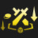

# Augment: silver, Count: 49
| key                        | name                    | icon                                                                        | desc                                                                                                                                                       |
| -                          | -                       | -                                                                           | -                                                                                                                                                          |
| ArmyBuilding               | Team Building           |                              | Gain a Lesser Champion Duplicator. Gain another after 7 player combats.                                                                                    |
| BandofThievesI             | Band of Thieves I       |                          | Gain 1 Thief's Gloves.                                                                                                                                     |
| BardPlaybook1              | Caretaker's Ally        |                            | Gain a random 2-cost champion now. Gain the same one again every time you level up.                                                                        |
| BestFriends1               | Best Friends I          |                              | Units isolated in pairs gain 12% Attack Speed and 12 Armor at the start of combat.                                                                         |
| BranchingOut               | Branching Out           |                              | Gain a random Emblem and a Reforger.                                                                                                                       |
| BronzeTicket               | Silver Ticket           |                              | Gain a free Shop reroll after every 4 rerolls. Gain 3 gold.                                                                                                |
| BuildingACollection        | Buried Treasures I      |                | Gain a random item component at the start of the next 2 rounds (including this round).                                                                     |
| Commander_PartialAscension | Partial Ascension       |  | After 15 seconds of combat, your units deal 30% more damage.                                                                                               |
| Commander_RollingForDays   | Rolling For Days I      |      | Gain 9 free Shop rerolls that never expire.                                                                                                                |
| CustomerIsAlwaysRight      | Component Buffet        |            | Whenever you would get a component, gain a component anvil instead. Gain a random component.                                                               |
| CyberneticBulk1            | Cybernetic Bulk I       |                        | Your champions holding an item gain 200 health.                                                                                                            |
| Distancing                 | Exiles I                |                                  | Your units that start combat with no adajacent allies gain a 25% maximum Health shield for 10 seconds.                                                     |
| Featherweights1            | Featherweights I        |                        | Your 1 and 2 cost champions gain 15% Attack Speed and Move Speed.                                                                                          |
| Formation1                 | Unified Resistance I    |                                  | If you have 3 or more champions in the same row at the start of combat, they all gain 15 Armor and Magic Resist.                                           |
| GoodForSomethingSilver     | Good For Something I    |          | Champions that aren't holding items have a 35% to drop 1 gold on death.                                                                                    |
| Harmacist1                 | Harmacist I             |                                  | Your team has 10% Omnivamp and convert 20% of excess healing to true damage on their next attack.  (Omnivamp: healing for a percent of damage dealt) |
| HealingOrbsI               | Healing Orbs I          |                              | When an enemy dies, the nearest ally is healed for 225.                                                                                                    |
| HelpIsOnTheWay             | Help Is On The Way      |                          | After 8 player combats. choose 1 of 4 Support items.                                                                                                       |
| IronAssets                 | Iron Assets             |                                  | Gain a Component Anvil and 4 Gold.                                                                                                                         |
| ItemGrabBag1               | Item Grab Bag I         |                              | Gain 1 random completed item.                                                                                                                              |
| Keepers1                   | Keepers I               |                                      | Combat start: grant units with adjacent allies a 175 Health Shield for 8 seconds. This Shield stacks.                                                      |
| LategameSpecialist         | Lategame Specialist     |                  | When you reach Level 9, gain 33 gold.                                                                                                                      |
| LongTimeCrafting           | Latent Forge            |                      | After 8 player combats, gain an Artifact anvil.                                                                                                            |
| MissedConnections          | Missed Connections      |                    | Gain a copy of each 1-cost champion.                                                                                                                       |
| OneTwoFive                 | One, Two, Five!         |                                  | Gain 1 random component, 2 gold, and 1 random 5-cost champion.                                                                                             |
| OneTwosThree               | Ones Twos Three         |                              | Gain 3 1-cost champion, 2 2-cost champions, and 1 3-cost champion.                                                                                         |
| PandorasItems              | Pandora's Items         |                            | Round start: items on your bench are randomized (except Tactician's Crown and Spatula).  Gain 1 random component.                                    |
| PumpingUp                  | Pumping Up I            |                                    | Your team gains 6% Attack Speed now. Each round after, they gain 0.5% more.                                                                                |
| Recombobulator             | Recombobulator          |                          | Champions on your board permanently transform into random champions 1 cost tier higher. Gain 2 Magnetic Removers.                                          |
| RedBuff                    | Blistering Strikes      |                                        | Your team's attacks burn their targets for 5% of their maximum Health over 5 seconds. Attacks also reduce their targets' healing received by 33%.          |
| RiskyMoves                 | Risky Moves             |                                  | Your Tactician loses 20 Health, but after 7 Player combats, gain 33 Gold.                                                                                  |
| SilverSpoon                | Silver Spoon            |                                | Gain 10 XP.                                                                                                                                                |
| SilverVeil                 | Silver Veil             |                                  | Your team gains 5% Attack Speed and is immune to the first crowd control effect in combat.                                                                 |
| StationarySupportI         | Stationary Support I    |                  | After 8 player combats, gain 1 Training Dummy(s) equipped with 1 permanently attached Support item(s).                                                     |
| SticksAndStones            | Sticks And Stones       |                        | Champions that aren't holding items Shred and Sunder enemies for 3 seconds. Physical damage Sunders for 30%, and magic damage Shreds for 30%.              |
| Stimpack                   | Stimpack                |                                      | Gain 4 components after you lose 50 player health.                                                                                                         |
| SwitchingGears             | Switching Gears         |                          | Gain 3 gold whenever you break your win or loss streak.                                                                                                    |
| TeamingUpI                 | Teaming Up I            |                                  | Gain 1 random component and 2 random 3-cost champions.                                                                                                     |
| TinyTitans                 | Tiny Titans             |                                  | Increase your current and maximum player health by 30.                                                                                                     |
| TriForce                   | Tri Force I             |                                      | Your Tier 3 champions gain 150 Health, 10 starting Mana, and 10% Attack Speed.                                                                             |
| YoungAndWildAndFree        | Young and Wild and Free |                | You can always move freely on Carousel rounds. Gain 2 Gold.                                                                                                |
| BloodBank                  | Lunch Money             |                                    | Every 8 damage you deal to enemy tacticians gives you 2 gold.                                                                                              |
| FineVintage                | Fine Vintage            |                                | Completed items left on your bench for 4 rounds transform into Support items.                                                                              |
| OverEncumbered             | Over Encumbered         |                          | For the next stage, you only get 1 bench slots. After, get 3 item components.                                                                              |
| PickoftheLitter            | Pick of the Litter      |                        | Open a special shop with three free 3-cost champions. You can only pick one, but you get 2 copies of it.                                                   |
| PickoftheLitterplus        | Pick of the Litter+     |                | Open a special shop with three free 4-cost champions. You can only pick one, but you get 2 copies of it.                                                   |
| SharingIsCaring            | Sharing Is Caring       |                        | Combat start: You gain 1 gold and your opponent gains 1 gold.                                                                                              |
| TheGoldenRemover           | The Golden Remover      |                      | Gain a Golden Remover and component item anvil.  Golden Remover is an Item Remover with infinite uses.                                               |
| LongTimeCraftingHR         | Latent Forge            |                  | After 4 player combats, gain an Artifact anvil.                                                                                                            |
# Augment: gold, Count: 123
| key                       | name                   | icon                                                                      | desc                                                                                                                                                                                           |
| -                         | -                      | -                                                                         | -                                                                                                                                                                                              |
| ACutAbove                 | A Cut Above            |                                  | Gain a Deathblade. Champions holding this item have a 20% chance to drop 1 gold on kill.                                                                                                       |
| BalancedBudget2           | Balanced Budget        |                      | At the start of the next 4 rounds, Gain 7 Gold.                                                                                                                                                |
| BalancedBudget2Plus       | Balanced Budget+       |              | At the start of the next 4 rounds, gain 9 gold.                                                                                                                                                |
| BardPlaybook2             | Caretaker's Favor      |                          | Gain a component anvil when you reach level 5, 6, 7, and 8.                                                                                                                                    |
| BestFriends2              | Best Friends II        |                            | Units isolated in pairs gain 15% Attack Speed and 20 Armor at the start of combat.                                                                                                             |
| BigGains                  | Big Gains              |                                    | Your team gains 100 bonus Health, and permanently gains 10 Health every 2 takedowns.                                                                                                           |
| BigGrabBag                | Big Grab Bag           |                                | Gain 3 random components, 2 gold, and 1 Reforger.                                                                                                                                              |
| BuildingACollectionPlus   | Buried Treasures II    |      | Gain a random item component at the start of the next 3 rounds (including this round).                                                                                                         |
| CapriciousForge           | Capricious Forge       |                      | Gain a Blacksmith's Gloves, which equips two random Artifacts each round.                                                                                                                      |
| ClearMind                 | Clear Mind             |                                  | If there are no champions on your bench at the end of player combat round, gain 3 XP.                                                                                                          |
| ClutteredMind             | Cluttered Mind         |                          | Gain 4 random 1-cost champions now. If your bench is full at the end of player combat, gain 3 XP.                                                                                              |
| CombatCaster              | Combat Caster          |                            | Your team gains a 90-170 Shield for 4 seconds after casting their Ability. The Shield amount scales with round of the game.                                                                    |
| Commander_Ascension       | Ascension              |              | After 15 seconds of combat, your units deal 50% more damage.                                                                                                                                   |
| CrashTestDummies          | Crash Test Dummies     |                    | Gain 2 Target Dummies. Combat start: Your Target Dummies launch themselves towards the largest clump of enemies and Stun them for 1.25 seconds.                                                |
| CrownGuarded              | Crown Guarded          |                            | Gain a Crownguard. Your Crownguards' start of combat effect is 100% stronger.                                                                                                                  |
| CyberneticBulk2           | Cybernetic Bulk II     |                      | Your champions holding an item gain 300 health.                                                                                                                                                |
| CyberneticUplink2         | Cybernetic Uplink II   |                  | Your champions holding an item gain 120 Health and restore 2.5 Mana per second.                                                                                                                |
| Diversify2                | Stand United II        |                                | Your units gain 2.5% Attack Damage and 2.5 Ability Power for each non-unique Trait active across your team.                                                                                    |
| EscortQuest               | Escort Quest           |                              | Gain a Training Dummy. You gain 3 gold every time it survives player combat.                                                                                                                   |
| Formation2                | Unified Resistance II  |                                | If you have 3 or more champions in the same row at the start of combat, they all gain 25 Armor and Magic Resist.                                                                               |
| FullyAdapted              | Fully Adapted          |                            | Gain an Adaptive Helm. Champions holding this item gain both effects, regardless of position.                                                                                                  |
| GargantuanResolve         | Gargantuan Resolve     |                  | Gain a Titan's Resolve. Your Titan's Resolves can continue stacking to 40 instead of 25.                                                                                                       |
| GiftsFromTheFallen        | Gifts from the fallen  |                | Your team gains 3% Attack Damage, 3 Ability Power, 3 Armor, and 3 Magic Resist.  Each time an ally dies, gain these stats again.                                                         |
| Harmacist2                | Harmacist II           |                                | Your team has 15% Omnivamp and convert 25% of excess healing to true damage on their next attack.  (Omnivamp: healing for a percent of damage dealt)                                     |
| HealingOrbsII             | Healing Orbs II        |                          | When an enemy dies, the nearest ally is healed for 450.                                                                                                                                        |
| HeavyHitters              | Heavy Hitters          |                            | Your units with at least 1500 max Health gain Attack Damage and Ability Power equal to 1% of their max Health.                                                                                 |
| Heroicgrabbag             | Heroic grab bag        |                          | Gain 2 Lesser Champion Duplicators and 6 gold.                                                                                                                                                 |
| Idealism                  | Idealism               |                                    | Gain a Hand of Justice. Champions holding this item deal 12% increased damage.                                                                                                                 |
| InspiringEpitaph          | Inspiring Epitaph      |                    | When a unit dies, the nearest ally gains a 20% max Health shield and 10% stacking Attack Speed.                                                                                                |
| JeweledLotus              | Jeweled Lotus II       |                            | Your team gains 15% Critical Strike chance, and their Abilities can critically strike.                                                                                                         |
| Keepers2                  | Keepers II             |                                    | Combat start: grant units with adjacent allies a 260 Health Shield for 8 seconds. This Shield stacks.                                                                                          |
| KnowYourEnemy             | Know Your Enemy        |                          | Your team deals 10% more damage. Deal 15% more damage instead if you and your opponent have any of the same traits active.                                                                     |
| LearningFromExperience2   | Patient Study          |      | After player combat, gain 2 XP if you won or 3 XP if you lost.                                                                                                                                 |
| LearningToSpell           | Learning To Spell      |                      | Your team gains 18 bonus Ability Power, and permanently gains 1 Ability Power every 2 takedowns.                                                                                               |
| LittleBuddies             | Little Buddies         |                          | Your 4-cost and 5-cost champions gain 65 Health and 9% Attack Speed for each 1-cost and 2-cost champion on your board.                                                                         |
| LongDistanceRelationship2 | Long Distance Pals     |  | Combat start: Your 2 units furthest form each other form a bond, sharing 20% of their Armor, Magic Resist, Attack Damage, and Ability Power with each other.                                   |
| LowInterestRates          | Low Interest Rates     |                    | Your max interest is capped at 4 gold but you gain 2 gold at the start of every player combat.                                                                                                 |
| LuckyStreak               | Lucky Streak           |                              | Gain a Gambler's Blade and a Magnetic Remover.                                                                                                                                                 |
| Martyr                    | Martyr                 |                                        | Whenever one of your allies die, your team heals for 9% of their amx Health.                                                                                                                   |
| MetabolicAccelerator      | Metabolic Accelerator  |            | Gain 2 player health after every player combat. Your Tactician also moves faster.                                                                                                              |
| NotToday                  | Not Today              |                                    | Gain an Edge of Night. Champions holding this item gain 35% Attack Speed.                                                                                                                      |
| OldMansWalkingStick       | Magic Wand             |              | Gain a Needlessly Large Rod. Your units gain 18 Ability Power.                                                                                                                                 |
| PandorasItems2            | Pandora's Items II     |                        | Round Start: items on your bench are randomized (excluding Tactician's Crown, Spatula, and consumables).  Gain 2 random component items.                                                 |
| PortableForge             | Portable Forge         |                          | Choose 1 of 4 Artifacts.                                                                                                                                                                       |
| PumpingUp2                | Pumping Up II          |                                | Your team gains 8% Attack Speed now. Each round after, they gain 1% more.                                                                                                                      |
| SalvageBin                | Salvage Bin            |                                | Gain 1 random completed item now, and 1 component after 7 player combats. Selling champions breaks completed items into components (excluding Tactician's Crown).                              |
| SalvageBinPlus            | Salvage Bin+           |                        | Gain 1 random completed item now, and 1 component after 4 player combats. Selling champions breaks completed items into components (excluding Tactician's Crown).                              |
| Scapegoat                 | Scapegoat              |                                  | Gain a Training Dummy and 4 gold. If it is the first to die each player combat, gain 1 gold.                                                                                                   |
| ShockTreatment            | Shock Treatment        |                        | Gain a Statikk Shiv. Your Stikk Shivs' chain lightning effect deals 40~125% more damage (based on stage level).                                                                                |
| Sleightofhand             | Sleight of Hand        |                          | Gain a Thief's Gloves. Champions holding this item gain 200 Health and 20% Attack Speed.                                                                                                       |
| StarsAreBorn              | Stars are Born         |                            | The first 1-cost and 2-cost champions you buy are instantly upgraded to 2-star. Gain 7 gold.                                                                                                   |
| StationarySupportII       | Stationary Support II  |              | Gain 1 Training Dummy with 1 permanently attached Support item(s).                                                                                                                             |
| SupportCache              | Support Cache          |                            | Choose 1 of 4 Support items.                                                                                                                                                                   |
| TeamingUpII               | Teaming Up II          |                              | Gain 1 random Support item and 2 random 4-cost champions.                                                                                                                                      |
| ThreesACrowd              | Three's a Crowd        |                            | Your team gains 66 Health for each unique 3-cost champion on your board.                                                                                                                       |
| ThreesCompany             | Three's Company        |                          | Gain 4 random 3-cost champions.                                                                                                                                                                |
| TonsOfStats               | Tons of Stats!         |                              | Your team gains 44 Health, 4% Attack Damage, 4 Ability Power, 4 Armor, 4 Magic Resist, 4% Attack Speed, and 4 Mana.                                                                            |
| TradeSector               | Trade Sector           |                              | Gain a free Shop reroll every round. Gain 4 gold.                                                                                                                                              |
| Traitless2                | Built Different II     |                                | Your units with no Traits active gain 240-530 Health and 45-60% Attack Speed (based on current Stage).                                                                                         |
| TwoHealthy                | Two Healthy            |                                | Your team gains 90 Health for each unique 2-cost champion on your board.                                                                                                                       |
| WanderingTrainerGold      | Wandering Trainer I    |            | Gain 1 gold and a Training Dummy with 2 permanently attached Emblems.                                                                                                                          |
| WhatDoesntKillYou         | What Doesn't Kill You  |                  | Gain 2 gold after losing a player combat. Gain a random component after every 4 losses.                                                                                                        |
| YouHaveMyBow              | You Have My Bow        |                            | Gain a Recurve Bow. Your units gain 12% Attack Speed.                                                                                                                                          |
| YouHaveMySword            | You Have My Sword      |                        | Gain a B.F. Sword. Your units gain 15% Attack Damage.                                                                                                                                          |
| AltruistCrest             | Altruist Crest         |                          | Gain an Altruist Emblem and a Riven.                                                                                                                                                           |
| ArcanistCrest             | Arcanist Crest         |                          | Gain an Arcanist Emblem and a Lux.                                                                                                                                                             |
| BehemothCrest             | Behemoth Crest         |                          | Gain a Behemoth Emblem, a Shen, and a Thresh.                                                                                                                                                  |
| Porcelain                 | Boiling Point          |                                  | Porcelains' attacks grant 3 bonus Mana. While boiling, their attacks also Burn and Wound. Gain a Lux and an Amumu.                                                                             |
| BruiserCrest              | Bruiser Crest          |                            | Gain a Bruiser Emblem and an Aatrox.                                                                                                                                                           |
| Storyweaver               | Call to Adventure      |                              | Every 2 takedowns, Storyweaver Kayle permanently gains 3 Ability Power and 18 Health. Gain a Garen and a Sivir.                                                                                |
| Heavenly                  | Divine Rolls           |                                    | At the start of every stage, including this one, gain 4 free rerolls + 1 for each of your Heavenly champions. Gain a Kha'Zix and a Malphite.                                                   |
| DragonsSpirit             | Dragon's Spirit        |                          | Gain a Dragon's Claw. Every time you heal 7000 Health with Dragon's Claws, gain an item component, up to 4.                                                                                    |
| DragonlordCrest           | Dragonlord Crest       |                      | Gain a Dragonlord Emblem, a Janna, and a Diana.                                                                                                                                                |
| NeekoCarry                | Drop Blossom!          |                                | Gain a Neeko. Your strongest Neeko's spell Heals 35% more, and slams for 35% increased damage. Each cast increases the spell radius by 1.                                                      |
| DryadCrest                | Dryad Crest            |                                | Gain a Dryad Emblem and a Gnar.                                                                                                                                                                |
| DuelistCrest              | Duelist Crest          |                            | Gain a Duelist Emblem and a Qiyana.                                                                                                                                                            |
| DynamicDuo                | Dynamic Duo            |                                | Get a random 5-cost champion and a random champion that shares a trait with them. Get 20 gold.                                                                                                 |
| Duelist                   | Extended Duel          |                                      | Your Duelists start combat with 2 stacks. At max stacks, they gain 10% Omnivamp. Gain a Darius and a Yasuo.                                                                                    |
| Dragonlord                | Enter the Dragon       |                                | After the dragon strikes, Dragonlords deal 20% bonus true damage. Gain a Janna.                                                                                                                |
| Epoch                     | Epoch                  |                                          | Now, and at the start of every stage, gain 6 XP and 2 free rerolls for that round only.                                                                                                        |
| Epochplus                 | Epoch+                 |                                  | Now, and at the start of every stage, gain 8 XP and 3 free rerolls for that round only.                                                                                                        |
| ShenCarry                 | Ethereal Blades        |                                  | Gain a Shen. Your Strongest Shen gains +3 Range and his spell does 85% increased damage.                                                                                                       |
| FatedCrest                | Fated Crest            |                                | Gain a Fated Emblem and a Kindred.                                                                                                                                                             |
| FortuneCrest              | Fortune Crest          |                            | Gain a Fortune Emblem and a Teemo.                                                                                                                                                             |
| GhostlyCrest              | Ghostly Crest          |                            | Gain a Ghostly Emblem and an Shen.                                                                                                                                                             |
| Reaper                    | Grim Harvest           |                                        | Your Reapers gain 8% Critical Strike chance and 5% Omnivamp. They gain this bonus again every time they get a takedown. Gain a Kindred and Yone.                                               |
| Ghostly                   | Haunted House          |                                      | Enemies that die while haunted by Ghostly pass 2 extra spectre to a nearby enemy. Gain a Caitlyn and a Shen.                                                                                   |
| HeavenlyCrest             | Heavenly Crest         |                          | Gain a Heavenly Emblem and a Neeko.                                                                                                                                                            |
| InkshadowCrest            | Inkshadow Crest        |                        | Gain an Inkshadow Emblem and a Senna.                                                                                                                                                          |
| InvokerCrest              | Invoker Crest          |                            | Gain an Invoker Emblem and a Janna.                                                                                                                                                            |
| Mythic                    | It's Going to be Epic  |                                        | Every time a unique Mythic champion becomes Epic, gain 2 player health and 3 gold. Gain a Cho'Gath and Kog'Maw.                                                                                |
| Sniper                    | Long Shot              |                                        | Snipers gain 15% Attack Speed. Gain a Caitlyn and a Kog'Maw. After Snipers have attacked a total distance of 1200 hexes, gain a Sniper's Focus.                                                |
| KobukoCarry               | Lucky Paws             |                              | Gain a 2-star Kobuko. Your strongest Kobuko's Ability deals 225% damage. If Kobuko kills an enemy, they have a 100% chance to drop 1 gold.                                                     |
| Trickshot                 | Lucky Ricochet         |                                  | Trickshots bounce 1 additional time for 40% of original damage. Gain a Sivir and Teemo.                                                                                                        |
| Invoker                   | Mana Shield            |                                      | Whenever an Invoker casts, grant the lowest Health ally Shield equal to 200% of Mana spent. Gain a Janna.                                                                                      |
| YorickCarry               | Midnight Siphon        |                              | Gain a Yorick. Your Strongest Yorick gains 25% max Health and additionally deals 20% of his max Health with his ability.                                                                       |
| Dryad                     | Mulched                |                                          | Every round, gain 2 Dryad stacks. If a Dryad deals 8% additional damage. Gain a Rek'Sai and a Gnar.                                                                                            |
| MythicCrest               | Mythic Crest           |                              | Gain a Mythic Emblem and a Neeko.                                                                                                                                                              |
| PorcelainCrest            | Porcelain Crest        |                        | Gain a Porcelain Emblem and a Lux.                                                                                                                                                             |
| Prizefighter              | Prizefighter           |                            | Gain 1 item component(s). Every 3 wins gives you an item component.                                                                                                                            |
| Behemoth                  | Raid Boss              |                                    | Combat start: Your strongest Behemoth gains 20% Health. When other Behomoths die, they transfer 20% of their Armor and Magic Resist to it. Gain a Cho'Gath and a Malphite.                     |
| RainingGold               | Raining Gold           |                              | Gain 8 gold now and 1 gold every round.                                                                                                                                                        |
| RainingGoldplus           | Raining Gold+          |                      | Gain 18 gold now and 1 gold every round.                                                                                                                                                       |
| ReaperCrest               | Reaper Crest           |                              | Gain a Reaper Emblem and a Kindred                                                                                                                                                             |
| ReinFOURcement            | ReinFOURcement         |                        | The next 4-cost champion you buy is instantly upgraded to 2-star. Get 12 gold.                                                                                                                 |
| SageCrest                 | Sage Crest             |                                  | Gain a Sage Emblem, a Zyra, and a Diana.                                                                                                                                                       |
| ScoreboardScrapper        | Scoreboard Scrapper    |                | Every round, if you're in the bottom 4, your team permanently gains 1.5% Attack Damage and Ability Power. If you're in the top 4, they have 10% more Health.                                   |
| Slammin                   | Slammin'               |                                      | Gain 1 Component Anvil. After each player combat, if there are no items on your bench (other than Consumables), gain 2 XP.                                                                     |
| Slamminplus               | Slammin'+              |                              | Gain 1 Component Anvil and 10 XP now. After each player combat, if there are no items on your bench (other than Consumables), gain 2 XP.                                                       |
| SniperCrest               | Sniper Crest           |                              | Gain a Sniper Emblem and a Senna.                                                                                                                                                              |
| Warden                    | Spirit Guardians       |                                        | Wardens' start of combat damage reduction is increased by 12%. 20% of damage dealt to non-Wardens is instead distributed across your Wardens. Get a Garen and a Jax.                           |
| GarenCarry                | Storied Champion       |                                | Gain a 2-star Garen. Your strongest Garen's Ability now grants stacking max Health instead of Shield. If he has more max Health than his target, his Ability deals 45% bonus true damage.      |
| StoryweaverCrest          | Storyweaver Crest      |                    | Gain a Storyweaver Emblem and a Garen.                                                                                                                                                         |
| Sage                      | The Road Less Traveled |                                            | Gain 1 XP. Each unique Sage that starts combat in the middle 2 rows grants 1 XP. Gain a Zyra.                                                                                                  |
| TooMuchCandy              | Too Much Candy         |                            | Your rerolls cost 0 gold. Every 6 rerolls, the cost goes up by 1 gold. At the start of each stage your reroll cost is reset to 0.                                                              |
| UmbralCrest               | Umbral Crest           |                              | Gain an Umbral Emblem and a Yorick.                                                                                                                                                            |
| Exalted                   | Venerable Piggy Bank   |                                      | Gain 2 Exalted Champions. Your Exalted Soul Core gains gold instead of XP. If you lose combat, it gets 3 bonus gold.  If there no 1 or 2-cost Exalted champions, get one 3-cost instead. |
| WardenCrest               | Warden Crest           |                              | Gain a Warden Emblem, a Jax, and an Amumu.                                                                                                                                                     |
| Bruiser                   | Well Fed               |                                      | Bruisers heal 2% of their max Health every 1 second. Gain a Kobuko and a Rek'Sai.                                                                                                              |
| Umbral                    | Wrath of the Moon      |                                        | Umbral champions deal 3.5% more damage every second they continue attacking an enemy. Resets when they swap targets. Gain a Darius and a Yorick.                                               |
| NeekoCarryPlus            | Drop Blossom!+         |                        | Gain a 2-star Neeko. Your strongest Neeko's spell Heals 35% more, and slams for 35% increased damage. Each cast increases the spell radius by 1.                                               |
| ShenCarryPlus             | Ethereal Blades+       |                          | Gain a 2-star Shen. Your Strongest Shen gains +3 Range and his spell does 100% increased damage.                                                                                               |
| YorickCarryPlus           | Midnight Siphon+       |                      | Gain a 2-star Yorick. Your Strongest Yorick gains 25% max Health and additionally deals 20% of his max Health with his ability.                                                                |
# Augment: prismatic, Count: 65
| key                         | name                   | icon                                                                          | desc                                                                                                                                                                                                                                                                                                                                                                                                                                                       |
| -                           | -                      | -                                                                             | -                                                                                                                                                                                                                                                                                                                                                                                                                                                          |
| BardPlaybook3               | Caretaker's Chosen     |                              | As you level, gain more powerful items. Level 4: Component Anvil Level 6: Completed Item Anvil Level 8: choose 1 of 5 Radiant items.                                                                                                                                                                                                                                                                                                              |
| BirthdayPresents            | Birthday Present       |                        | Gain a 2-star champion every time you level up. The champion's cost is your level minus 4 (min: 1-cost).                                                                                                                                                                                                                                                                                                                                                   |
| BlindingSpeed               | Blinding Speed         |                              | Gain a Red Buff, a Guinsoo's Rageblade, a Recurve bow and a Magnetic Remover.                                                                                                                                                                                                                                                                                                                                                                              |
| BuildingACollectionPlusPlus | Buried Treasures III   |  | Gain a random item component at the start of the next 6 rounds (including this round).                                                                                                                                                                                                                                                                                                                                                                     |
| Commander_FinalAscension    | Final Ascension        |        | Your team deals 15% more damage. After 15 seconds, they deal 45% more damage.                                                                                                                                                                                                                                                                                                                                                                              |
| CyberneticBulk3             | Cybernetic Bulk III    |                          | Your champions holding an item gain 500 health.                                                                                                                                                                                                                                                                                                                                                                                                            |
| CyberneticUplink3           | Cybernetic Uplink III  |                      | Your champions holding an item gain 200 Health and restore 3.5 Mana per second.                                                                                                                                                                                                                                                                                                                                                                            |
| GachaAddict                 | Prismatic Ticket       |                                  | Each time your Shop is rerolled, you have a 50% chance to gain a free reroll.                                                                                                                                                                                                                                                                                                                                                                              |
| GoingLong                   | Going Long             |                                      | You no longer gain interest. Gain 10 gold now. Round start: gain 4 XP.                                                                                                                                                                                                                                                                                                                                                                                     |
| GreaterJeweledLotus         | Jeweled Lotus III      |                  | Your team gains 40% Critical Strike chance, and their Abilities can critically strike.                                                                                                                                                                                                                                                                                                                                                                     |
| Harmacist3                  | Harmacist III          |                                    | Your team has 25% Omnivamp and converts 30% of excess healing to true damage on their next attack.                                                                                                                                                                                                                                                                                                                                                         |
| HedgeFund                   | Hedge Fund             |                                      | Gain 20 gold. Your max interest is increased to 10.                                                                                                                                                                                                                                                                                                                                                                                                        |
| HedgeFundPlus               | Hedge Fund+            |                              | Gain 30 gold. Your max interest is increased to 10.                                                                                                                                                                                                                                                                                                                                                                                                        |
| HedgeFundPlusPlus           | Hedge Fund++           |                      | Gain 40 gold. Your max interest is increased to 10.                                                                                                                                                                                                                                                                                                                                                                                                        |
| HighEndSector               | Shopping Spree         |                              | Gain 4 gold. When you level up, gain a number of free shop refreshes equal to your level, which carry over between rounds.                                                                                                                                                                                                                                                                                                                                 |
| ImpenetrableBulwark         | Impenetrable Bulwark   |                  | Gain a Bramble Vest, a Dragon's Claw, a Giant's Belt, and a Magnetic Remover.                                                                                                                                                                                                                                                                                                                                                                              |
| LivingForge                 | Living Forge           |                                  | Gain an Artifact anvil now and after every 8 player combats.                                                                                                                                                                                                                                                                                                                                                                                               |
| LuckyGloves                 | Lucky Gloves           |                                  | Thief's Gloves will always give your champions ideal items. Gain 2 Sparring Gloves.                                                                                                                                                                                                                                                                                                                                                                        |
| LuckyGlovesPlus             | Lucky Gloves+          |                          | Thief's Gloves will always give your champions ideal items. Gain 3 Sparring Gloves.                                                                                                                                                                                                                                                                                                                                                                        |
| MaxLevel10                  | Level Up!              |                                    | When you buy XP, gain an additional 2. Gain 8 immediately.                                                                                                                                                                                                                                                                                                                                                                                                 |
| NewRecruit3                 | New Recruit            |                                  | Gain +1 max team size and a Champion Duplicator.                                                                                                                                                                                                                                                                                                                                                                                                           |
| OverwhelmingForce           | Overwhelming Force     |                      | Gain a Deathblade, an Infinity Edge, a BF Sword, and a Magnetic Remover.                                                                                                                                                                                                                                                                                                                                                                                   |
| PandorasRadiantBox          | Pandora's Items III    |                    | Round Start: items on your bench are randomized (excluding Tactician's Crown, Spatula, and consumables).  Gain 1 random Radiant item.                                                                                                                                                                                                                                                                                                                |
| PhreakyFriday               | Phreaky Friday         |                              | Gain an Infinity Force. After 5 player combats, gain another.                                                                                                                                                                                                                                                                                                                                                                                              |
| PhreakyFridayPlus           | Phreaky Friday+        |                      | Gain an Infinity Force. After 3 player combats, gain another.                                                                                                                                                                                                                                                                                                                                                                                              |
| PumpingUp3                  | Pumping Up III         |                                    | Your team gains 10% Attack Speed now. Each round after, they gain 2% more.                                                                                                                                                                                                                                                                                                                                                                                 |
| RadiantRelics               | Radiant Relics         |                              | Choose 1 of 5 Radiant items. Gain a Magnetic Remover.                                                                                                                                                                                                                                                                                                                                                                                                      |
| RollTheDice                 | Roll The Dice          |                                  | Gain a Rascal's Gloves item. This equips 2 random Radiant items every round.                                                                                                                                                                                                                                                                                                                                                                               |
| SlowAndSteady               | March of Progress      |                              | Gain 3 XP now, and bonus XP equal to your level at the start of every player combat round. You can no longer use gold to level up.                                                                                                                                                                                                                                                                                                                         |
| StarterKit                  | Starter Kit            |                                    | Gain a 4-cost champion, a 2-star 1-cost champion that shares a trait with them, and 4 gold.  At the start of the next 2 stages, gain that 4-cost champion again.                                                                                                                                                                                                                                                                                     |
| StationarySupportIII        | Stationary Support III |                | Gain 1 Training Dummy with 2 permanently attached Support item(s).                                                                                                                                                                                                                                                                                                                                                                                         |
| TheGoldenEgg                | The Golden Egg         |                                | Gain a golden egg that hatches in 11 turns for a huge amount of loot. Winning player combat speeds up the hatch timer by an extra turn.                                                                                                                                                                                                                                                                                                                    |
| TiniestTitan                | Tiniest Titan          |                                | Gain 2 player health and 1 gold after every player combat. Your Tactician also moves faster.                                                                                                                                                                                                                                                                                                                                                               |
| TiniestTitanPlus            | Tiniest Titan+         |                        | Gain 2 player health and 1 gold after every player combat. Your Tactician also moves faster.  Gain 15 gold now.                                                                                                                                                                                                                                                                                                                                      |
| UnleashedArcana             | Unleashed Arcana       |                          | Gain a Jeweled Gauntlet, a Rabadon's Deathcap, a Needlessly Large Rod, and a Magnetic Remover.                                                                                                                                                                                                                                                                                                                                                             |
| Accomplice                  | Accomplice             |                                    | Get a Support Thief's Gloves and 2 gold.                                                                                                                                                                                                                                                                                                                                                                                                                   |
| AltruistCrown               | Altruist Crown         |                              | Gain an Altruist Emblem, a Bloodthirster, and a Riven.                                                                                                                                                                                                                                                                                                                                                                                                     |
| ArcanistCrown               | Arcanist Crown         |                              | Gain an Arcanist Emblem, a Statikk Shiv, and a Lux.                                                                                                                                                                                                                                                                                                                                                                                                        |
| AtWhatCost                  | At What Cost           |                                    | Immediately go to level 6. You don't get to choose your future augments. Gain 1 gold.                                                                                                                                                                                                                                                                                                                                                                      |
| BaBOOM                      | Ba-BOOM!               |                                            | Your champions deal 90% more damage for 2 seconds on every other cast.                                                                                                                                                                                                                                                                                                                                                                                     |
| BehemothCrown               | Behemoth Crown         |                              | Gain a Behemoth Emblem, a Sunfire Cape, a Yorick, and a Thresh.                                                                                                                                                                                                                                                                                                                                                                                            |
| BruiserCrown                | Bruiser Crown          |                                | Gain a Bruiser Emblem, a Bloodthirster, and an Aatrox.                                                                                                                                                                                                                                                                                                                                                                                                     |
| BuildaBud                   | Build a Bud!           |                                      | Gain a random three star 1-cost unit and 8 gold.                                                                                                                                                                                                                                                                                                                                                                                                           |
| CalltoChaos                 | Call to Chaos          |                                  | Gain a powerful and random reward.
(Randomly gain one of the following:)
[58 gold], [64 experience], [40 rerolls that do not expire], [Training dummy with 2x Zeke's Herald], [Training dummy with 2x Locket of the Iron Solari], [3x Hullcrushers and an item remover], [3x Snipers focus and an item remover], [Random 3-star 3-cost unit and 20 gold], [3x Thief's Gloves and an item remover], [5 random emblems(no duplicates) and an item remover] |
| DragonlordCrown             | Dragonlord Crown       |                          | Gain a Dragonlord Emblem, a Guinsoo's Rageblade, a Janna, and a Diana.                                                                                                                                                                                                                                                                                                                                                                                     |
| DryadCrown                  | Dryad Crown            |                                    | Gain a Dryad Emblem, a Titans Resolve, and a Gnar.                                                                                                                                                                                                                                                                                                                                                                                                         |
| DuelistCrown                | Duelist Crown          |                                | Gain a Duelist Emblem, a Giant Slayer, and a Qiyana.                                                                                                                                                                                                                                                                                                                                                                                                       |
| FatedCrown                  | Fated Crown            |                                    | Gain a Fated Emblem, a Sunfire Cape, and a Kindred.                                                                                                                                                                                                                                                                                                                                                                                                        |
| FortuneCrown                | Fortune Crown          |                                | Gain a Fortune Emblem, a Sunfire Cape, and a Teemo.                                                                                                                                                                                                                                                                                                                                                                                                        |
| GhostlyCrown                | Ghostly Crown          |                                | Gain a Ghostly Emblem, a Bramble Vest, and a Shen.                                                                                                                                                                                                                                                                                                                                                                                                         |
| HeavenlyCrown               | Heavenly Crown         |                              | Gain a Heavenly Emblem, a Hand of Justice, and a Neeko.                                                                                                                                                                                                                                                                                                                                                                                                    |
| InkshadowCrown              | Inkshadow Crown        |                            | Gain an Inkshadow Emblem, an Evenshroud, and a Senna.                                                                                                                                                                                                                                                                                                                                                                                                      |
| InvokerCrown                | Invoker Crown          |                                | Gain an Invoker Emblem, a Rabadon's Deathcap, and a Janna.                                                                                                                                                                                                                                                                                                                                                                                                 |
| MythicCrown                 | Mythic Crown           |                                  | Gain a Mythic Emblem, a Guardbreaker, and a Neeko.                                                                                                                                                                                                                                                                                                                                                                                                         |
| PorcelainCrown              | Porcelain Crown        |                            | Gain a Porcelain Emblem, an Adaptive Helm, and an Amumu.                                                                                                                                                                                                                                                                                                                                                                                                   |
| RadiantRefactor             | Radiant Refactor       |                          | Gain a Masterwork Upgrade and 1 component anvils.  Masterwork Upgrade upgrades an item to Radiant!                                                                                                                                                                                                                                                                                                                                                   |
| ReaperCrown                 | Reaper Crown           |                                  | Gain a Reaper Emblem, a Hand of Justice, and a Kindred.                                                                                                                                                                                                                                                                                                                                                                                                    |
| SageCrown                   | Sage Crown             |                                      | Gain a Sage Emblem, an Adaptive Helm, a Zyra, and a Diana.                                                                                                                                                                                                                                                                                                                                                                                                 |
| SniperCrown                 | Sniper Crown           |                                  | Gain a Sniper Emblem, a Guinsoo's Rageblade, and a Senna.                                                                                                                                                                                                                                                                                                                                                                                                  |
| StoryweaverCrown            | Storyweaver Crown      |                        | Gain a Storyweaver Emblem, a Gargoyle Stoneplate, and a Riven.                                                                                                                                                                                                                                                                                                                                                                                             |
| TinybutDeadly               | Tiny, but Deadly       |                              | Your units are 50% smaller, but move and attack 30% faster.                                                                                                                                                                                                                                                                                                                                                                                                |
| TwoforOne                   | Two for One            |                                      | Each round, get a copy of the first champion you buy that costs 3 or less.                                                                                                                                                                                                                                                                                                                                                                                 |
| UmbralCrown                 | Umbral Crown           |                                  | Gain an Umbral Emblem, a Redemption, and a Yorick.                                                                                                                                                                                                                                                                                                                                                                                                         |
| WardenCrown                 | Warden Crown           |                                  | Gain a Warden Emblem, a Redemption and a Gnar.                                                                                                                                                                                                                                                                                                                                                                                                             |
| WanderingTrainer            | Wandering Trainer II   |                        | Gain 6 gold and a Training Dummy with 3 permanently attached Emblems.                                                                                                                                                                                                                                                                                                                                                                                      |
