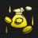

# Augment: silver, Count: 69
| key                      | name                    | icon                                                                    | desc                                                                                                                                                                                                                                                             |
| -                        | -                       | -                                                                       | -                                                                                                                                                                                                                                                                |
| ArmyBuilding             | Team Building           |                          | Gain a Lesser Champion Duplicator. Gain another after 5 player combats.  This item allows you to copy a 3-cost or less champion.                                                                                                                           |
| BandofThievesI           | Band of Thieves I       |                      | Gain 1 Thief's Gloves.                                                                                                                                                                                                                                           |
| BardPlaybook1            | Caretaker's Ally        |                        | Gain a random 2-cost champion now. Gain the same one again every time you level up.                                                                                                                                                                              |
| BeggarscanbeChoosers     | Beggars Can Be Choosers |          | You get +3 Augment rerolls for all other augment choices. Gain 7 gold.                                                                                                                                                                                           |
| BloodBank                | Lunch Money             |                                | Every 8 damage you deal to enemy tacticians gives you 2 gold.                                                                                                                                                                                                    |
| BranchingOut             | Branching Out           |                          | Gain a random Emblem and a Reforger.  Reforgers allow you to remake any item.                                                                                                                                                                              |
| CalledShot               | Called Shot             |                              | Set your win streak to +4. Gain 4 gold.                                                                                                                                                                                                                          |
| Commander_RollingForDays | Rolling For Days I      |  | Gain 11 free Shop rerolls.                                                                                                                                                                                                                                       |
| CustomerIsAlwaysRight    | Component Buffet        |        | Whenever you would get a component, gain a component anvil instead. Gain a random component.  The anvil offers 4 choices.                                                                                                                                  |
| DravenSpoilsOfWar        | Spoils of War I         |                | Enemies have a 25% chance to drop loot when killed.                                                                                                                                                                                                              |
| FindYourCenter           | Find Your Center        |                      | Your champion that starts combat in the center of the front row gains 15% Damage Amp and 15% max Health.                                                                                                                                                         |
| FineVintage              | Fine Vintage            |                            | Completed items left on your bench for 4 rounds transform into Support Anvils.                                                                                                                                                                                   |
| GoodForSomethingSilver   | Good For Something I    |      | Champions that aren't holding items have a 50% to drop 1 gold on death.                                                                                                                                                                                          |
| HeadStart                | Delayed Start           |                                | Sell your board and bench. Gain 4 random 2-star 1 cost champions. Disable your Shop for the next 3 rounds.                                                                                                                                                       |
| IronAssets               | Iron Assets             |                              | Gain a component anvil and 4 gold.  The anvil offers 4 choices.                                                                                                                                                                                            |
| ItemCollectorI           | Item Collector I        |                      | Your team gains 10 Health. For each unique item they are holding, your team gains bonus 2 Health, 1 Attack Damage, and 1 Ability Power.                                                                                                                          |
| ItemGrabBag1             | Item Grab Bag I         |                          | Gain 1 random completed item.                                                                                                                                                                                                                                    |
| LategameSpecialist       | Lategame Specialist     |              | When you reach Level 9, gain 33 gold.                                                                                                                                                                                                                            |
| LongTimeCrafting         | Latent Forge            |                  | After 8 player combats, gain an Artifact anvil.  The anvil offers 4 choices. Artifacts are more powerful items with a unique effect.                                                                                                                       |
| MentorshipI              | Mentorship I            |                            | If an ally starts combat next to a higher-cost ally, it gains 12% Attack Speed and 120 Health.                                                                                                                                                                   |
| MissedConnections        | Missed Connections      |                | Gain a copy of each 1-cost champion.                                                                                                                                                                                                                             |
| OneTwoFive               | One, Two, Five!         |                              | Gain 1 random component, 2 gold, and 1 random 5-cost champion.                                                                                                                                                                                                   |
| OneTwosThree             | Ones Twos Three         |                          | Gain 2 1-cost champion, 2 2-cost champions, and 1 3-cost champion.                                                                                                                                                                                               |
| OverEncumbered           | Over Encumbered         |                      | For the next stage, you only get 1 bench slot. After, get 3 item components.                                                                                                                                                                                     |
| PandorasBench            | Pandora's Bench         |                        | Gain 2 gold. At the start of every round, champions on the 3 rightmost bench slots transform into random champions of the same cost.                                                                                                                             |
| PandorasItems            | Pandora's Items         |                        | Round start: items on your bench are randomized.  Gain 1 random component.                                                                                                                                                                                 |
| PatienceIsaVirtue        | Patience is a Virtue    |                | Each round, gain 2 free rerolls if you did not buy a champion last round.                                                                                                                                                                                        |
| Placebo                  | Placebo                 |                                    | Gain 8 gold. Your team gains 1% Attack Speed.                                                                                                                                                                                                                    |
| PlaceboPlus              | Placebo+                |                            | Gain 15 gold. Your team gains 1% Attack Speed.                                                                                                                                                                                                                   |
| PumpingUp                | Pumping Up I            |                                | Your team gains 6% Attack Speed now. Each round after, they gain 0.5% more.                                                                                                                                                                                      |
| Recombobulator           | Recombobulator          |                      | Champions on your board permanently transform into random champions 1 cost tier higher (max 5). Gain 2 Magnetic Removers.                                                                                                                                        |
| RedBuff                  | Blistering Strikes      |                                    | Your team's attacks Burn their targets for 5% of their max Health over 5 seconds. Attacks also reduce their targets' healing received by 33%.                                                                                                                    |
| RestartMission           | Restart Mission         |                      | Remove all champions on your board and bench. Gain 2 random 2-star 3-costs, 3 2-star 2-costs, and 1 2-star 1-cost champion.                                                                                                                                      |
| RiskyMoves               | Risky Moves             |                              | Your Tactician loses 20 Health, but after 7 player combats, gain 30 gold.                                                                                                                                                                                        |
| SilverSpoon              | Silver Spoon            |                            | Gain 10 XP.                                                                                                                                                                                                                                                      |
| TeamingUpI               | Teaming Up I            |                              | Gain 1 random component and 2 random Tier 3 champions.                                                                                                                                                                                                           |
| YoungAndWildAndFree      | Young and Wild and Free |            | You can always move freely on Carousel rounds. Gain 5 gold.                                                                                                                                                                                                      |
| Backup                   | Backup                  |                                      | Your team gains 12% Attack Speed if at least 4 allies start combat in the back two rows.                                                                                                                                                                         |
| BladeDance               | Blade Dance             |                              | Gain an Irelia. Your strongest Irelia gains 60% Attack Speed and gains a brand new Ability that dashes her between two targets, dealing physical damage to both.                                                                                                 |
| BulkyBuddiesI            | Bulky Buddies I         |                        | Allies that start combat next to exactly 1 other ally gain 100 Health. When that champion dies, the other gains a 10% max Health Shield for 10 seconds.                                                                                                          |
| ClimbTheLadderI          | Climb The Ladder I      |                    | Each time an ally dies, allies that share at least one trait with them gain 3 Ability Power, 3% Attack Damage, 3 Armor, and 3 Magic Resist.                                                                                                                      |
| CombatMedic              | Combat Medic            |                            | Gain a Steb. Your strongest Steb's Ability's Mana cost is reduced by 10, but no longer heals. Steb's spell grants 30% Omnivamp and strikes 3 times, each dealing 65%.                                                                                            |
| Corrosion                | Corrosion               |                                | Enemy champions in the first two rows lose 3 Armor and Magic Resist every 2 seconds.                                                                                                                                                                             |
| CraftedCrafting          | Crafted Crafting        |                    | Whenever you craft a completed item, gain 2 rerolls.                                                                                                                                                                                                             |
| DiversifiedPortfolio     | Diversified Portfolio   |          | Each round, gain 1 gold for every 3 non-unique traits active. Gain 1 gold.                                                                                                                                                                                    |
| DiversifiedPortfolioplus | Diversified Portfolio+  |  | Each round, gain 1 gold for every 3 non-unique traits active. Gain 4 gold.                                                                                                                                                                                    |
| Dummify                  | Dummify                 |                                    | Lose all champions on your board and bench. Gain a Training Dummy with 100% of their combined health. The dummy gains 1000 Health per stage.                                                                                                                     |
| EyeForAnEye              | Eye For An Eye          |                            | For every 15 ally champions that die, gain a random component (max 4).                                                                                                                                                                                           |
| EyeForAnEyeplus          | Eye For An Eye+         |                    | Gain a random component. For every 16 ally champions that die, gain another component (max 3).                                                                                                                                                                   |
| Firesale                 | Firesale                |                                  | Each round, steal a random 3-cost or lower champion from the shop. Gain 1 gold.                                                                                                                                                                                  |
| GlassCannonI             | Glass Cannon I          |                          | Units that start combat in the back row begin combat at 90% health but gain 15% Damage Amp.                                                                                                                                                                      |
| HealthisWealthI          | Health is Wealth I      |                    | Your team gains 10% Omnivamp. Get a bonus of 8 gold when your team first accumulates 10000 total champion healing.                                                                                                                                               |
| IHopeThisWorks           | This Will Work          |                      | Gain a Powder. Your strongest Powder's explosion radius is increased by 5 hexes, Increases damage dealt.                                                                                                                                                         |
| Kingslayer               | Kingslayer              |                              | After winning player combat, gain 1 gold. If they had more health than you, gain 6 Gold instead. Gain 1 gold now.                                                                                                                                                |
| Lineup                   | Lineup                  |                                      | Your team gains 2.5 Armor and Magic Resist for each unit that starts combat in the front two rows.                                                                                                                                                               |
| MadChemist               | Mad Chemist             |                              | Gain a Singed. Your strongest Singed cannot attack but constantly runs, leaving a poison trail dealing magic damage over time. His Ability will always target himself and instead grants 30% Omnivamp and Move Speed. Magic Damage: 140% / 210% / 315% / 420% |
| ManaflowI                | Manaflow I              |                                | Your units that start combat in the back row gain 2 additional Mana per attack.                                                                                                                                                                                  |
| OneForAllI               | One For All I           |                              | Your team gains 2% max Health and 1.5% Damage Amp for each unique one-cost champion on your board. Gain 2 one-costs.                                                                                                                                             |
| PowerUp                  | Power Up                |                                    | Your next augment is one tier higher.                                                                                                                                                                                                                            |
| RerollTransfer           | Reroll Transfer         |                      | For every 1 unused Augment Reroll, gain 3 free shop rerolls. Gain 3 gold.  Does not include the round this augment is selected.                                                                                                                            |
| RiggedShop               | Rigged Shop             |                              | Your next shop and every 4 shops will contain all 3-cost champions.                                                                                                                                                                                              |
| RiggedShopplus           | Rigged Shop+            |                      | Your next shop and every 4 shops will contain all 3-cost champions. Gain 9 rerolls.                                                                                                                                                                              |
| SuperstarsI              | Superstars I            |                            | Your team deals 5% more damage, increased by 2% for every 3-star champion on your team. Gain 2 rerolls.                                                                                                                                                          |
| SupportMining            | Support Mining          |                        | Gain a Training Dummy. When it dies 7 times, gain a random Support Item and remove the Training Dummy.                                                                                                                                                           |
| SupportMiningplus        | Support Mining+         |                | Gain a Training Dummy. When it dies 5 times, gain a random Support Item and remove the Training Dummy.                                                                                                                                                           |
| Survivor                 | Survivor                |                                  | After 3 players are eliminated, gain 92 gold.                                                                                                                                                                                                                    |
| TableScraps              | Table Scraps            |                            | After the next 3 carousels, gain one unit that was not taken and its item. Gain 1 gold.                                                                                                                                                                          |
| TitanicTitan             | Titanic Titan           |                          | Increase your current and max player health by 25. On carousel rounds you are released earlier, but are much slower.                                                                                                                                             |
| Trolling                 | Trolling                |                                  | Gain a Trundle. Your strongest Trundle's Ability no longer heals, but grants him 140% Attack Speed for 5 seconds, and permanently grants him 1.5% Attack Damage. His maximum mana is reduced by 50.                                                              |
# Augment: gold, Count: 144
| key                       | name                      | icon                                                                      | desc                                                                                                                                                                                                                           |
| -                         | -                         | -                                                                         | -                                                                                                                                                                                                                              |
| AllThatShimmers           | All That Shimmers         |                      | Choose a gold-generating Artifact items and gain a Magnetic Remover.                                                                                                                                                           |
| AllThatShimmersPlus       | All That Shimmers+        |              | Choose a gold-generating Artifact. Gain a Magnetic Remover and 4 gold.                                                                                                                                                         |
| BardPlaybook2             | Caretaker's Favor         |                          | Gain a component anvil when you reach level 5, 6, 7, and 8.  The anvil offers 4 choices.                                                                                                                                 |
| BigGrabBag                | Big Grab Bag              |                                | Gain 3 random components, 2 gold, and 1 Reforger.  Reforgers allow you to remake any item.                                                                                                                               |
| Category5                 | Category Five             |                                  | Gain a Runaan's Hurricane. Your Runaan's Hurricanes shoot 1 extra bolts, each dealing 85% of the original damage.                                                                                                              |
| ClearMind                 | Clear Mind                |                                  | If there are no champions on your bench at the end of player combat, gain 3 XP.                                                                                                                                                |
| ClockworkAccelerator      | Clockwork Accelerator     |            | Your team gains 10% Attack Speed every 3 seconds in combat.                                                                                                                                                                    |
| ClutteredMind             | Cluttered Mind            |                          | Gain 4 random 1-cost champions now. If your bench is full at the end of player combat, gain 3 XP.                                                                                                                              |
| CrownGuarded              | Crown Guarded             |                            | Gain a Crownguard. Your Crownguards' start of combat effect is 100% stronger and the shield lasts 5 seconds longer.                                                                                                            |
| DragonsSpirit             | Dragon's Spirit           |                          | Gain a Dragon's Claw. Champions equipped with a Dragon's Claw gain 100 Health and 10% Durability.                                                                                                                              |
| DravenSpoilsOfWar2        | Spoils of War II          |                | Enemies have a 30% chance to drop loot when killed.                                                                                                                                                                            |
| DuoQueue                  | Duo Queue                 |                                    | Gain 2 random 5-cost champions and 2 copies of a random component.                                                                                                                                                             |
| Epoch                     | Epoch                     |                                          | Now, and at the start of every stage, gain 6 XP and 2 free rerolls.                                                                                                                                                            |
| Epochplus                 | Epoch+                    |                                  | Now, and at the start of every stage, gain 8 XP and 3 free rerolls.                                                                                                                                                            |
| Heroicgrabbag             | Heroic Grab Bag           |                          | Gain 2 Lesser Champion Duplicators and 9 gold.  This item allows you to copy a 3-cost or less champion.                                                                                                                  |
| HighVoltage               | High Voltage              |                              | Gain an Ionic Spark. Your Ionic Sparks have +3 hex radius and do 25% more damage.                                                                                                                                              |
| InspiringEpitaph          | Inspiring Epitaph         |                    | When a unit dies, the nearest ally gains a 20% max Health Shield and 10% stacking Attack Speed.                                                                                                                                |
| ItemCollectorII           | Item Collector II         |                      | Your team gains 20 Health. For each unique item they are holding, your team gains bonus 5 Health, 1.5 Attack Damage, and 1.5 Ability Power.                                                                                    |
| LearningFromExperience2   | Patient Study             |      | After player combat, gain 2 XP if you won or 3 XP if you lost.                                                                                                                                                                 |
| LittleBuddies             | Little Buddies            |                          | Your 4-cost and 5-cost champions gain 65 Health and 7% Attack Speed for every 1-cost and 2-cost champion on your board.                                                                                                        |
| LongDistanceRelationship2 | Long Distance Pals        |  | Combat start: Your 2 units furthest from each other form a bond, sharing 22% of their Armor, Magic Resist, Attack Damage, and Ability Power with each other.                                                                   |
| MentorshipII              | Mentorship II             |                            | If an ally starts combat next to a higher-cost ally, it gains 18% Attack Speed and 220 Health.                                                                                                                                 |
| NotToday                  | Not Today                 |                                    | Gain an Edge of Night. Champions holding this item gain 35% Attack Speed.                                                                                                                                                      |
| PandorasItems2            | Pandora's Items II        |                        | Round start: items on your bench are randomized.  Gain 2 random components.                                                                                                                                              |
| Pilfer                    | Pilfer                    |                                        | Each round, gain a 1-star copy of the first champion you killed last combat.                                                                                                                                                   |
| PortableForge             | Portable Forge            |                          | Choose 1 of 4 Artifacts.  Artifacts are more powerful items with a unique effect.                                                                                                                                        |
| Prizefighter              | Prizefighter              |                            | Gain 2 item components. Every 5 wins gives you an item component.                                                                                                                                                              |
| PumpingUp2                | Pumping Up II             |                                | Your team gains 8% Attack Speed now. Each round after, they gain 1% more.                                                                                                                                                      |
| RainingGold               | Raining Gold              |                              | Gain 8 gold now and 1 gold every round.                                                                                                                                                                                        |
| RainingGoldplus           | Raining Gold+             |                      | Gain 18 gold now and 1 gold every round.                                                                                                                                                                                       |
| ReinFOURcement            | ReinFOURcement            |                        | The next 4-cost champion you buy is instantly upgraded to 2-star. Get 12 gold.                                                                                                                                                 |
| Replication               | Replication               |                              | Choose 1 of 3 components. For the next 2 rounds, gain a copy of that component.                                                                                                                                                |
| SalvageBin                | Salvage Bin               |                                | Gain 1 random completed item now, and 1 component after 7 player combats. Selling champions breaks completed items into components (excluding Tactician's items and Emblems).                                                  |
| SalvageBinPlus            | Salvage Bin+              |                        | Gain 1 random completed item now, and 1 component after 4 player combats. Selling champions breaks completed items into components (excluding Tactician's items and Emblems).                                                  |
| Scapegoat                 | Scapegoat                 |                                  | Gain a Training Dummy and 4 gold. If it is the first to die each player combat, gain 1 gold.                                                                                                                                   |
| ScoreboardScrapper        | Scoreboard Scrapper       |                | Every round, if you're in the bottom 4, your team permanently gains 1.5% Attack Damage and Ability Power. If you're in the top 4, they have 10% more Health.                                                                   |
| Slammin                   | Slammin'                  |                                      | Gain 1 random Component(s). After each player combat, if there are no items on your bench (other than Consumables), gain 2 XP.                                                                                                 |
| Slamminplus               | Slammin'+                 |                              | Gain 1 random component(s) and 10 XP now. After each player combat, if there are no items on your bench (other than Consumables), gain 2 XP.                                                                                   |
| SupportCache              | Support Cache             |                            | Choose 1 of 4 Support items.                                                                                                                                                                                                   |
| TeamingUpII               | Teaming Up II             |                              | Gain 1 random Support item and 2 random 4-cost champions.                                                                                                                                                                      |
| ThornPlatedArmor          | Thorn-Plated Armor        |                    | Gain a Bramble Vest. Your Bramble Vests deal 5-100% more damage (based on Stage) and heal the holder for 50% of the damage dealt.                                                                                              |
| TradeSector               | Trade Sector              |                              | Gain a free Shop reroll every round. Gain 4 gold.                                                                                                                                                                              |
| Traitless2                | Built Different           |                                | Your units with no Traits active gain 300-600 Health and 45-75% Attack Speed (based on current Stage).                                                                                                                         |
| TraitTracker              | Trait Tracker             |                            | The first time you activate 8 non-unique traits for 1 combat, gain 6 random emblems.                                                                                                                                           |
| UnleashtheBeast           | Unleash The Beast         |                      | Gain a Sterak's Gage. When its effect triggers, the holder gains 35% Attack Speed for the rest of combat and immunity to crowd control for 5 seconds.                                                                          |
| WanderingTrainerGold      | Wandering Trainer I       |            | Gain 1 gold and a Training Dummy with 2 permanently attached Emblems.                                                                                                                                                          |
| WhatDoesntKillYou         | What Doesn't Kill You     |                  | Gain 2 gold after losing a player combat. Gain a random component after every 4 losses.                                                                                                                                        |
| WorththeWait              | Worth the Wait            |                            | Gain a random two-star 1-cost champion. After 2 rounds, gain another copy of them at the start of each round for the rest of the game.                                                                                         |
| AGoldenFind               | A Golden Find             |                              | Champions evolved by the Anomaly drop 2 gold every 3 kills. Gain 10 free rerolls.                                                                                                                                              |
| AMagicRoll                | A Magic Roll              |                                | Roll 3 dice. Gain rewards based on their total.                                                                                                                                                                                |
| AcademicResearch          | Academic Research         |                    | Whenever you build an item, gain a completed item anvil instead. That anvil always offers an Academy item and the item built. Gain 1 random components. Gain a Lux and an Ezreal.                                              |
| AcademyCrest              | Academy Crest             |                            | Gain an Academy Emblem and a Leona.                                                                                                                                                                                            |
| AdrenalineBurst           | Adrenaline Burst          |                      | Combat start and every 6 seconds, all Quickstrikers attack 85% faster for 2.5 seconds. Gain a Nocturne and Akali.                                                                                                              |
| AmbusherCrest             | Ambusher Crest            |                          | Gain an Ambusher Emblem and a Camille.                                                                                                                                                                                         |
| ArtilleristCrest          | Artillerist Crest         |                    | Gain an Artillerist Emblem and a Tristana.                                                                                                                                                                                     |
| AutomataCrest             | Automata Crest            |                          | Gain an Automata Emblem and a Nocturne.                                                                                                                                                                                        |
| BadLuckProtection         | Bad Luck Protection       |                  | Your team can no longer critically strike. Convert each 1% Critical Strike Chance into 1% Attack Damage. Gain a Sparring Gloves.                                                                                               |
| BlackRoseCrest            | Black Rose Crest          |                        | Gain a Black Rose Emblem.                                                                                                                                                                                                      |
| BlazingSoulI              | Blazing Soul I            |                            | Combat start: Your highest Attack Speed champion gains 20 Ability Power and 20% Attack Speed. Repeat on another ally every 3 seconds.                                                                                          |
| BRB                       | BRB                       |                                              | You cannot perform actions for the next 3 rounds. Afterwards, gain 2 completed item anvils.                                                                                                                                    |
| BronzeForLifeI            | Bronze For Life I         |                        | Your team gains 3% Damage Amp for each Bronze-tier trait.                                                                                                                                                                      |
| BruiserCrest              | Bruiser Crest             |                            | Gain a Bruiser Emblem and a Sett.                                                                                                                                                                                              |
| BrutalRevenge             | Brutal Revenge            |                          | Gain 2 Rennis. Your strongest Renni's Ability costs 10 less and causes her to lunge towards the farthest enemy within 2 hexes, dealing 110% damage to the target and reduced damage to enemies in her path.                    |
| BulkyBuddiesII            | Bulky Buddies II          |                        | Allies that start combat next to exactly 1 other ally gain 175 Health. When that champion dies, the other gains a 15% max Health Shield for 10 seconds.                                                                        |
| ClimbTheLadderII          | Climb The Ladder II       |                    | Each time an ally dies, allies that share at least one trait with them gain 6 Ability Power, 6% Attack Damage, 6 Armor, and 6 Magic Resist.                                                                                    |
| CloningFacility           | Cloning Facility          |                      | Empower the hex in the center of the third row. Summon a clone of the champion in it with 80% base Health and 10% increased Mana cost.                                                                                         |
| ConquerorCrest            | Conqueror Crest           |                        | Gain a Conqueror Emblem and a Rell.                                                                                                                                                                                            |
| CookingPot                | Cooking Pot               |                                | At the start of each turn, all units holding a Frying Pan or Spatula item grant the nearest champion 50 permanent Health. Gain a Frying Pan.                                                                                   |
| CrimsonPact               | Crimson Pact              |                              | Gain a Vladimir. Your strongest Vladimir gains +3 Range and gains 5 bonus Mana each attack. His Ability no longer heals but grants 10% Damage Amp, deals 80% bonus damage, and spreads additional damage to the nearest enemy. |
| CrownsWill                | Crown's Will              |                                | Gain a Needlessly Large Rod. Your units gain 10 Ability Power and 10 Armor.                                                                                                                                                    |
| Domination                | Domination                |                                | Dominators gain 10% Attack Speed while shielded. When a Dominator gets a kill, all Dominators gain 100 Shield for 3 seconds. Gain a Cassiopeia.                                                                                |
| DominatorCrest            | Dominator Crest           |                        | Gain a Dominator Emblem and a Blitzcrank.                                                                                                                                                                                      |
| EnforcerCrest             | Enforcer Crest            |                          | Gain an Enforcer Emblem.                                                                                                                                                                                                       |
| FamilyCrest               | Family Crest              |                              | Gain a Family Emblem.                                                                                                                                                                                                          |
| FirelightCrest            | Firelight Crest           |                        | Gain a Firelight Emblem and a Zeri.                                                                                                                                                                                            |
| ForbiddenMagic            | Forbidden Magic           |                        | Every 2 takedowns by Black Rose champions or Sion grant Sion permanent 3% Attack Damage and 15 Max Health. Gain 3 Black Rose champions. (Stacks: )                                                                             |
| ForwardThinking           | Forward Thinking          |                      | Lose all your gold. After 5 player combats, gain back the original amount and another 70 gold.                                                                                                                                 |
| FracturedCrystals         | Fractured Crystals        |                  | When an Automata champion fires their blast, they fire a second blast at the closest enemy dealing 70% of the original damage. Gain an Amumu and Nocturne.                                                                     |
| GlassCannonII             | Glass Cannon II           |                          | Units that start combat in the back row begin combat at 90% health but gain 25% Damage Amp.                                                                                                                                    |
| GlovesOff                 | Gloves Off                |                                  | Gain a Vander. Your strongest Vander gains a brand new Ability that no longer grants resistances, but deals 70% increased damage and punches the target backwards, dealing 35% of the original damage to all enemies hit.      |
| GoldForDummies            | Gold For Dummies          |                        | Gain a Training Dummy. Every 10 seconds, all Training Dummies grant 1 gold.                                                                                                                                                    |
| Golemify                  | Golemify                  |                                    | Lose all champions on your board and bench. Gain a Golem with 90% of their combined Health and 60% of their combined Attack Damage. The Golem gains 500 Health per stage.                                                      |
| GuerillaWarfare           | Aerial Warfare            |                      | Firelight champions gain 9% Attack Damage and 9 Ability Power when they start a Firelight dash. They gain another 3% for every hex traveled that combat. Gain a Scar and Zeri.                                                 |
| HealthisWealthII          | Health is Wealth II       |                    | Your team gains 15% Omnivamp. Get a bonus of 15 gold when your team first accumulates 10000 total champion healing.                                                                                                            |
| HeavilySmash              | Heavily Smash             |                            | Every 4 seconds, Bruisers deal 7% bonus max Health bonus physical damage on their next attack. Gain a Steb and a Trundle.                                                                                                      |
| InvestmentStrategyI       | Investment Strategy I     |              | Your champions gain 8 permanent max health per interest you earn.                                                                                                                                                              |
| LawEnforcement            | Law Enforcement           |                        | Enforcer champions gain 10% Attack Damage. Every 6 Wanted enemy deaths grant 6 gold. Gain a Steb and Maddie.                                                                                                                   |
| LootExplosion             | Loot Explosion            |                          | Ambusher kills have a chance to drop loot, scaling with Critical Strike Chance. The value of the loot given can also critically strike, granting even more loot. Gain a Camille and a Powder.                                  |
| MacesWill                 | Mace's Will               |                                  | Gain a Sparring Gloves. Your team gains 8% Attack Speed and 20% Critical Strike Chance.                                                                                                                                        |
| MaliciousMonetization     | Malicious Monetization    |          | Gain 2 gold. For the next 3 rounds, enemy champions drop 2 gold when killed.                                                                                                                                                   |
| ManaflowII                | Manaflow II               |                                | Your units that start combat in the back row gain 4 additional Mana per attack.                                                                                                                                                |
| Moonlight                 | Moonlight                 |                                  | Combat start: 1 random 1-cost champion is upgraded to 3-star for that round and gains 45% Attack Damage and 45 Ability Power.                                                                                                  |
| NOSCOUTNOPIVOT            | NO SCOUT NO PIVOT         |                        | Units can no longer be benched or sold after fighting in a player combat. After each player combat, units that fought gain 20 Health, 1.5% Attack Damage, and 1.5% Ability Power.                                              |
| NobleSacrifice            | Noble Sacrifice           |                        | When your first ally dies each combat, grant your team 25 + 10% of that ally's Armor and Magic Resistance.                                                                                                                     |
| NoxianGuillotine          | Noxian Guillotine         |                    | Conquerors execute enemies below 12% Health. When they do, they gain 5 Armor and Magic Resist for the rest of combat. Gain a Darius and Draven.                                                                                |
| OneForAllII               | One For All II            |                              | Your team gains 3% max Health and 2% Damage Amp for each unique one-cost champion on your board. Gain 3 one-costs.                                                                                                             |
| Overheal                  | Overheal                  |                                    | Every third attack deals an additional 150% damage and heals 50% of the damage. Excess healing is converted to a shield up to 300 Health.                                                                                      |
| PainttheTownBlue          | Paint the Town Blue       |                    | When the first 4 Rebels die each combat, summon a copy of themselves that is one-star lower with 400 less Health. Gain an Akali and an Irelia.                                                                                 |
| PairofFours               | Pair of Fours             |                              | If your team has exactly 2 four-cost champions, they each gain 404 Health and 24.4% Attack Speed. Gain a random 4-cost.                                                                                                        |
| PiercingLotusI            | Piercing Lotus I          |                        | Your team gains 5% Critical Strike chance, and their Abilities can critically strike. Critical strikes 20% Shred and Sunder the target for 3 seconds.                                                                          |
| PitFighterCrest           | Pit Fighter Crest         |                      | Gain a Pit Fighter Emblem and an Urgot.                                                                                                                                                                                        |
| PoweredShields            | Powered Shields           |                        | While Shielded, your units gain 10% Durability. The first time allies fall below 50% Health, they gain 100-225 Shield (based on Stage) for 3 seconds.                                                                          |
| Pyromaniac                | Pyromaniac                |                                | Gain a Red Buff. Your Burns deal 50% increased damage.                                                                                                                                                                         |
| QuickstrikerCrest         | Quickstriker Crest        |                  | Gain a Quickstriker Emblem and an Akali.                                                                                                                                                                                       |
| RebelCrest                | Rebel Crest               |                                | Gain a Rebel Emblem and an Akali.                                                                                                                                                                                              |
| RocketCollection          | Rocket Collection         |                    | Artillerist rockets deal 15% increased damage. Every 65 rockets your Artillerists fire, gain a Collector (max 2). Gain a Tristana and Urgot. (Rockets Fired: )                                                                 |
| SatedSpellweaver          | Sated Spellweaver         |                    | After casting an Ability, champions gain 20% Omnivamp for 3 seconds. Excess healing is converted to a shield up to 300 Health.                                                                                                 |
| Scavenger                 | Scavenger                 |                                  | The first 5 enemy champions that are killed each combat grant a champion on your team a temporary completed item.                                                                                                              |
| ScrapCrest                | Scrap Crest               |                                | Gain a Scrap Emblem and a Ziggs.                                                                                                                                                                                               |
| SentinelCrest             | Sentinel Crest            |                          | Gain a Sentinel Emblem and a Rell.                                                                                                                                                                                             |
| ShieldBash                | Shield Bash               |                                | Sentinels gain 5% bonus Armor and Magic Resist. Every 4 seconds, their next attack deals 75% of their total resistances as magic damage. Gain a Loris.                                                                         |
| ShopGlitch                | Shop Glitch               |                                | During non-player combat rounds, your shop refreshes for free every 2.5 seconds for 30 seconds.                                                                                                                                |
| SniperCrest               | Sniper Crest              |                              | Gain a Sniper Emblem and a Zeri.                                                                                                                                                                                               |
| SnipersNest               | Sniper's Nest             |                              | Snipers gain +8% Damage Amp for each round fought from the same starting hex (Maximum +32%). Gain a Zeri.                                                                                                                      |
| SorcererCrest             | Sorcerer Crest            |                          | Gain a Sorcerer Emblem and a Vladimir.                                                                                                                                                                                         |
| SpearsWill                | Spear's Will              |                                | Your team gains 10% Attack Damage and 10 Mana. Gain a B.F. Sword.                                                                                                                                                              |
| SpiritLink                | Spirit Link               |                                | Your team restores 6% of their max Health every 4 seconds. Increase the healing by 0.5% for every 10 missing player Health.                                                                                                    |
| StarryNight               | Starry Night              |                              | 1-cost and 2-cost units in your shop have a chance to be 2-star. Gain 6 gold. Chances increase with player level.                                                                                                           |
| StarryNightplus           | Starry Night+             |                      | 1-cost and 2-cost units in your shop have a chance to be 2-star. Gain 8 gold. Chances increase with player level.                                                                                                           |
| SuperstarsII              | Superstars II             |                            | Your team deals 7% more damage, increased by 4% for every 3-star champion on your team. Gain 4 rerolls.                                                                                                                        |
| TheMutationSurvives       | The Mutation Survives     |              | Experiments gain 12% Health and grant a special hex. The Experiment in the hex is killed on combat start, granting their Experiment bonus to other laboratory hexes. Gain 3 Experiment champions.                              |
| TombRaiderI               | Tomb Raider I             |                              | For the next 3 players eliminated, choose one of their completed items to keep.                                                                                                                                                |
| TopoftheScrapHeap         | Top of the Scrap Heap     |                  | Every 6 components Scrap champions convert, gain a random component (max 5). Gain a Powder and a Trundle.                                                                                                                      |
| TowerDefense              | Tower Defense             |                            | Gain a Training Dummy equipped with a random emblem that fires ranged attacks at enemies. It upgrades as the game goes on.                                                                                                     |
| TrainingArc               | Training Arc              |                              | Pit Fighters permanently gain 1.5% Attack Damage if they lost the last combat. If they won, gain 50 Health instead. Gain an Urgot.                                                                                             |
| TraitMartialLaw           | Trait: Martial Law        |                      | When Ambessa casts, Caitlyn fires an empowered attack at the target, dealing 200% damage. Ambessa gains 18% of Caitlyn's Attack Damage.  Gain a Caitlyn and Ambessa.                                                     |
| TraitMenaces              | Trait: Menaces            |                            | While fielded with Silco, Powder gains Dominator, but no longer benefits from Family. When her monkey explodes, it creates 3 of Silco's monstrosities.  Gain a 2-star Powder and a Silco.                                |
| TraitReunion              | Trait: Reunion            |                            | When Vi casts, Ekko releases 3 afterimages towards her target dealing 40% damage. When Ekko casts, Vi slams an earthquake towards his target dealing 100% damage.  Gain a Vi and Ekko.                                   |
| TraitSisters              | Trait: Sisters            |                            | Gain the Sister Trait. When Vi scores a takedown, Jinx gains 80% bonus Attack Speed for 10 seconds. When Jinx scores a takedown, Vi gains 80% bonus Attack Damage for 10 seconds.  Gain a Vi and Jinx.                   |
| TraitUnlikelyDuo          | Trait: Unlikely Duo       |                    | Jinx and Sevika gain 10% Attack Damage and 100 Health. Whenever one casts, they grant the other 10 mana. Sevika's arm is luckier.  Gain a Jinx and Sevika.                                                               |
| TrifectaI                 | Trifecta I                |                                  | Gain 2 3-cost champions. Combat Start: 3 random 3-cost champions gain 250 Health and 23% Attack Speed.                                                                                                                         |
| TwoMuchValue              | Two Much Value            |                            | Gain 1 reroll for every 2 unique two-cost champions fielded last combat. Gain 2 two-cost unit.                                                                                                                                 |
| TwoTrick                  | Two Trick                 |                                    | Gain a random 2-star two-cost and 2 random 2-star one-cost champions.                                                                                                                                                          |
| VampiricVitality          | Vampiric Vitality         |                    | You heal for 20% of the damage you deal to enemy Tacticians. Your units gain 12% Omnivamp.                                                                                                                                     |
| VisionaryCrest            | Visionary Crest           |                        | Gain a Visionary Emblem and a Renata Glasc.                                                                                                                                                                                    |
| Voidcaller                | Voidcaller                |                                | For every 275 Mana Visionaries spend during combat, summon a Voidling, up to 5 Voidlings. Gain a Rell and Morgana.  The Voidling has 400-600 Health based on Stage.                                                      |
| WarfortheUndercity        | War for the Undercity     |                | Everytime you choose to save your Shimmer on a Black Market, heal 4 player health and gain 6 gold. Gain a Renni.                                                                                                               |
| Warpath                   | Warpath                   |                                      | After dealing 60 player damage, gain a chest of high cost champions and items.                                                                                                                                                 |
| WatcherCrest              | Watcher Crest             |                            | Gain a Watcher Emblem and a Vander.                                                                                                                                                                                            |
| WelcometothePlayground    | Welcome to the Playground |        | If at least 2 Family members are alive after 15 seconds in combat or at the end of combat, gain a random copy of a Vander, Powder, or Violet. Gain a Powder and Violet.                                                        |
| WhyNotBoth                | Why Not Both?             |                                | While you field 2 of the same Form Swapper in different forms, both gain 30 Ability Power, Armor, and Magic Resist, and 30% Attack Damage. When you 3-star a Form Swapper, gain a 2-star copy. Gain a Swain and Gangplank.     |
| RocketCollectionPlus      | Rocket Collection+        |            | Artillerist rockets deal 15% increased damage. Every 65 rockets your Artillerists fire, gain a Collector (max 2). Gain a Tristana and Urgot. (Rockets Fired: )                                                                 |
| TraitBetrayal             | Trait: Betrayal           |                          | Maddie always targets Ambessa's target with her Ability and attacks. Every round where either gets at least 2 kills, gain a Maddie.  Gain a 2-star Maddie and Ambessa.                                                   |
| ExperimentCrest           | Experiment Crest          |                      | Gain an Experiment Emblem and an Urgot.                                                                                                                                                                                        |
# Augment: prismatic, Count: 90
| key                         | name                        | icon                                                                          | desc                                                                                                                                                                                                               |
| -                           | -                           | -                                                                             | -                                                                                                                                                                                                                  |
| AngerIssues                 | Anger Issues                |                                  | All your current and future completed items transform into Guinsoo's Rageblades that grant 45 Armor and Magic Resist. Every 2 Rageblade stacks grant 1.5% Attack Damage and Ability Power.                         |
| AtWhatCost                  | At What Cost                |                                    | Immediately go to level 6 and gain 4 XP. You don't get to choose your future augments.                                                                                                                             |
| BardPlaybook3               | Caretaker's Chosen          |                              | As you level, gain more powerful items. Level 4: component anvil Level 6: completed item anvil Level 7: choose 1 of 5 Radiant items                                                                       |
| BirthdayPresents            | Birthday Present            |                        | Gain a 2-star champion and 1 gold every time you level up. The champion's cost tier is your level minus 4 (max: 5-cost).                                                                                           |
| BlindingSpeed               | Blinding Speed              |                              | Gain a Giant Slayer, Guinsoo's Rageblade, a Recurve Bow and a Magnetic Remover.  Useful for Attack Carries!                                                                                                  |
| BuildaBud                   | Build a Bud!                |                                      | Gain a random 3-star 1-cost champion and 10 gold.                                                                                                                                                                  |
| BuildingACollectionPlusPlus | Buried Treasures III        |  | Gain a random item component at the start of the next 6 rounds (including this round).                                                                                                                             |
| CalltoChaos                 | Call to Chaos               |                                  | Gain a powerful and random reward.                                                                                                                                                                                 |
| DravenSpoilsOfWar3          | Spoils of War III           |                    | Enemies have a 45% chance to drop loot when killed.                                                                                                                                                                |
| DualPurpose                 | Dual Purpose                |                                  | The first time you buy XP each round, gain 2 gold. Whenever you buy XP, reroll your Shop.                                                                                                                          |
| Flexible                    | Flexible                    |                                        | Gain 1 random emblem. At the start of every Stage, gain a random emblem. Your team gains 40 Health for each emblem they are holding.                                                                               |
| GachaAddict                 | Prismatic Ticket            |                                  | Each time your Shop is rerolled, you have a 45% chance to gain a free reroll.                                                                                                                                      |
| GoingLong                   | Going Long                  |                                      | You no longer gain interest. Gain 15 gold now. Round start: gain 4 XP.  Interest is extra gold you gain per 10g saved.                                                                                       |
| HardCommit                  | Hard Commit                 |                                    | Gain a random emblem. Now and at the start of each stage, gain a 1-star champion of that trait with a cost equal to the Stage (max 5).                                                                             |
| HedgeFund                   | Hedge Fund                  |                                      | Gain 25 gold. Your max interest is increased to 10.  Interest is extra gold you gain per 10g saved.                                                                                                          |
| HighEndSector               | Shopping Spree              |                              | When you level up, gain a number of free shop refreshes equal to your level+1. Gain 4 gold.                                                                                                                        |
| ImmovableObject             | Immovable Object            |                          | Gain a Randuin's Omen. Its range is increased by 1 hex and its effect is increased by 50%.                                                                                                                         |
| ImtheCarrynow               | I'm the Carry Now           |                              | Get a Golem with tailored offensive items. It gets stronger at the start of each Stage.                                                                                                                            |
| InvestedPlus                | Invested+                   |                                | Gain 26 gold. At the start of each round, gain 1 Shop reroll for every 10 gold above 50 (max 80 gold).                                                                                                             |
| InvestedPlusPlus            | Invested++                  |                        | Gain 45 gold. At the start of each round, gain 1 Shop reroll for every 10 gold above 50 (max 80 gold).                                                                                                             |
| LivingForge                 | Living Forge                |                                  | Gain an Artifact anvil now and after every 9 player combats.  Artifacts are more powerful items with a unique effect.                                                                                        |
| LuckyGloves                 | Lucky Gloves                |                                  | Thief's Gloves will always give your champions ideal items. Gain 2 Sparring Gloves. In 7 rounds, get another Sparring Gloves.                                                                                      |
| LuckyGlovesPlus             | Lucky Gloves+               |                          | Thief's Gloves will always give your champions ideal items. Gain 3 Sparring Gloves.                                                                                                                                |
| MaxLevel10                  | Level Up!                   |                                    | When you buy XP, gain an additional 2. Gain 12 immediately.                                                                                                                                                        |
| PandorasRadiantBox          | Pandora's Items III         |                    | Round start: items on your bench are randomized.  Gain 1 random Radiant item.                                                                                                                                |
| PhreakyFriday               | Phreaky Friday              |                              | Gain an Infinity Force. After 5 player combats, gain another.  Infinity Force: Artifact that offers tons of offensive and defensive stats                                                                    |
| PhreakyFridayPlus           | Phreaky Friday +            |                      | Gain an Infinity Force. After 3 player combats, gain another.  Infinity Force: Artifact that offers tons of offensive and defensive stats                                                                    |
| PumpingUp3                  | Pumping Up III              |                                    | Your team gains 16% Attack Speed now. Each round after, they gain 2% more.                                                                                                                                         |
| RadiantRefactor             | Radiant Refactor            |                          | Gain a Masterwork Upgrade and 1 component anvil.  Masterwork Upgrade upgrades an item to Radiant!                                                                                                            |
| RadiantRelics               | Radiant Relics              |                              | Choose 1 of 5 Radiant items. Gain a Magnetic Remover.  Radiant items are very powerful versions of completed items.                                                                                          |
| RollTheDice                 | Roll The Dice               |                                  | Gain a Rascal's Gloves item. This equips 2 random Radiant items every round.  Radiant items are very powerful versions of completed items.                                                                   |
| ShimmerscaleEssence         | Shimmerscale Essence        |                  | Gain a Mogul's Mail. In 5 rounds, gain a Gamblers Blade.  These items give gold as well as combat power.                                                                                                     |
| SubscriptionService         | Subscription Service        |                  | Now, and at the start of each Stage, open a Shop of 4 unique 4-cost champions and gain 8 gold.                                                                                                                     |
| TheGoldenEgg                | The Golden Egg              |                                | Gain a golden egg that hatches in 11 turns for a huge amount of loot. Winning player combat speeds up the hatch timer by an extra turn.                                                                            |
| TiniestTitan                | Tiniest Titan               |                                | Gain 2 player health and 1 gold after every player combat. Your Tactician also moves faster.                                                                                                                       |
| TiniestTitanPlus            | Tiniest Titan+              |                        | Gain 2 player health and 1 gold after every player combat. Your Tactician also moves faster.  Gain 15 gold now.                                                                                              |
| UpwardMobility              | Upward Mobility             |                            | Buying XP costs 1 less. Gain 2 Health and 3 free rerolls whenever you level up.                                                                                                                                    |
| WanderingTrainer            | Wandering Trainer II        |                        | Gain 6 gold and a Training Dummy with 3 permanently attached Emblems.                                                                                                                                              |
| WorththeWaitII              | Worth the Wait II           |                            | Gain a random 2-cost champion. Gain another copy of them at the start of each round for the rest of the game.                                                                                                      |
| AcademyCrown                | Academy Crown               |                                | Gain an Academy Emblem and a random sponsored item.                                                                                                                                                                |
| AmbusherCrown               | Ambusher Crown              |                              | Gain an Ambusher Emblem, a Hand of Justice, and a Camille.                                                                                                                                                         |
| AnExaltedAdventure          | An Exalted Adventure        |                    | Gain three 2-cost champions. If you 3-star two of them, gain an orb filled with loot. Gain a Lesser Champion Duplicator at the start of next 2 stages.                                                             |
| ArtilleristCrown            | Artillerist Crown           |                        | Gain an Artillerist Emblem, a Runaan's Hurricane, and a Tristana.                                                                                                                                                  |
| AutomataCrown               | Automata Crown              |                              | Gain an Automata Emblem, a Guardbreaker, and a Nocturne.                                                                                                                                                           |
| BeltOverflow                | Belt Overflow               |                                | Gain 5 Giant's Belts. Your Giant's Belts grant +60 bonus Health.                                                                                                                                                   |
| BlackRoseCrown              | Black Rose Crown            |                            | Gain a Black Rose Emblem, a Spear of Shojin, and a Cassiopeia.                                                                                                                                                     |
| BlazingSoulII               | Blazing Soul II             |                              | Combat start: Your highest Attack Speed champion gains 45 Ability Power and 35% Attack Speed. Repeat on another ally every 3 seconds.                                                                              |
| BronzeForLifeII             | Bronze For Life II          |                          | Your team gains 3.5% Damage Amp and 1% Durability for each Bronze-tier trait.                                                                                                                                      |
| BruiserCrown                | Bruiser Crown               |                                | Gain a Bruiser Emblem, a Redemption, and a Sett.                                                                                                                                                                   |
| BulkyBuddiesIII             | Bulky Buddies III           |                          | Allies that start combat next to exactly 1 other ally gain 330 Health. When that champion dies, the other gains a 18% max Health Shield for 10 seconds.                                                            |
| CalculatedEnhancement       | Calculated Enhancement      |              | Each combat, 4 random champions in your last two rows gain 40% Attack Damage and 50 Ability Power.                                                                                                                 |
| ConquerorCrown              | Conqueror Crown             |                            | Gain a Conqueror Emblem, a Last Whisper, and a Rell.                                                                                                                                                               |
| Coronation                  | Coronation                  |                                    | Gain a Tactician's Crown. Tactician's Crown, Shield, and Cape grant the holder an additional 25% Attack Speed, 25% Attack Damage, and 35 Ability Power.                                                            |
| DominatorCrown              | Dominator Crown             |                            | Gain a Dominator Emblem, a Protector's Vow, and a Blitzcrank.                                                                                                                                                      |
| EnforcerCrown               | Enforcer Crown              |                              | Gain an Enforcer Emblem, an Infinity Edge, and a Maddie.                                                                                                                                                           |
| ExpectedUnexpectedness      | Expected Unexpectedness     |            | Now and at the start of the next 2 stages, roll 3 dice. Gain various rewards based on their total.                                                                                                                 |
| FamilyCrown                 | Family Crown                |                                  | Gain a Family Emblem and a Redemption.                                                                                                                                                                             |
| FinalPolish                 | Final Polish                |                                  | Gain a Support Anvil and a completed item anvil.                                                                                                                                                                   |
| FirelightCrown              | Firelight Crown             |                            | Gain a Firelight Emblem, a Protector's Vow, and a Scar.                                                                                                                                                            |
| FlurryofBlows               | Flurry of Blows             |                              | Gain a Zeke's Herald. Champions buffed by Zeke's also gain 45% Critical Strike Chance.                                                                                                                             |
| GhostofFriendsPast          | Ghost of Friends Past       |                    | Whenever an allied champion dies, your current team and all future allies permanently gain 7 health, 1% Attack Damage, or 1 Ability Power, based on the dying champion's role.                                     |
| GreaterMoonlight            | Greater Moonlight           |                        | Combat Start: 1 random 1-cost champion is upgraded to 4-star for that round and gains 5% Attack Damage and 5 Ability Power.                                                                                        |
| InvestmentStrategyII        | Investment Strategy II      |                | Gain 5 gold. Your champions gain 9 permanent max health per interest you earn. Your max interest is increased to 7.                                                                                                |
| MaxCap                      | Max Cap                     |                                            | Your max level is 7. Gain 1 Tactician's Shield which increases your team size by +1, and 60 gold.                                                                                                                  |
| OneBuffTwoBuff              | One Buff, Two Buff          |                            | Gain a Red Buff, a Blue Buff, and a Champion Duplicator.                                                                                                                                                           |
| PiercingLotusII             | Piercing Lotus II           |                          | Your team gains 20% Critical Strike chance, and their Abilities can critically strike. Critical strikes 20% Shred and Sunder the target for 3 seconds.                                                             |
| PitFighterCrown             | Pit Fighter Crown           |                          | Gain a Pit Fighter Emblem, a Sterak's Gage, and a Gangplank.                                                                                                                                                       |
| PrismaticPipeline           | Prismatic Pipeline          |                      | The next non-player combat round will drop an additional Prismatic Orb full of amazing loot.                                                                                                                       |
| QualityOverQuantity         | Quality Over Quantity       |                  | Units holding exactly 1 item upgrade that item to Radiant. Units holding Radiant items gain 4% Health. Gain 2 Magnetic Removers.  Thief's Gloves counts as multiple items.                                   |
| QuickstrikerCrown           | Quickstriker Crown          |                      | Gain a Quickstriker Emblem, a Guinsoo's Rageblade, and a Nocturne.                                                                                                                                                 |
| RebelCrown                  | Rebel Crown                 |                                    | Gain a Rebel Emblem, a Jeweled Gauntlet, and an Akali.                                                                                                                                                             |
| ScrapCrown                  | Scrap Crown                 |                                    | Gain a Scrap Emblem, a Ziggs, and 2 random components.                                                                                                                                                             |
| SentinelCrown               | Sentinel Crown              |                              | Gain a Sentinel Emblem, a Crownguard, and a Loris.                                                                                                                                                                 |
| SniperCrown                 | Sniper Crown                |                                  | Gain a Sniper Emblem, an Infinity Edge, and a Zeri.                                                                                                                                                                |
| SorcererCrown               | Sorcerer Crown              |                              | Gain a Sorcerer Emblem, an Adaptive Helm, and a Vladimir.                                                                                                                                                          |
| Sponging                    | Sponging                    |                                        | Combat start: Up to 6 champions with 1 or fewer items gain a copy of a random completed item from the nearest itemized ally.                                                                                       |
| SwordOverflow               | Sword Overflow              |                              | Gain 5 BF Swords. Your BF Swords grant +3% Attack Speed.                                                                                                                                                           |
| TacticiansKitchen           | Tactician's Kitchen         |                      | Gain a random Emblem. After 3 player combats, gain a Tactician's Cape.                                                                                                                                             |
| TombRaiderII                | Tomb Raider II              |                                | Gain 1 completed item Anvil. Every time a player is eliminated, choose one of their completed items to keep.                                                                                                       |
| TraitGeniuses               | Trait: Geniuses             |                              | When Heimerdinger casts, Ekko releases 3 afterimages, each dealing 50% damage. When Ekko casts, Heimerdinger fires 3 missiles, each dealing 150% damage.  Gain a Heimerdinger, Ekko, and a Jeweled Gauntlet. |
| TrifectaII                  | Trifecta II                 |                                    | Gain 3 3-cost champions. Allies gain 9% Attack Speed. Combat Start: 3 random 3-cost champions gain 330 Health and 33% Attack Speed.                                                                                |
| VisionaryCrown              | Visionary Crown             |                            | Gain a Visionary Emblem, a Spear of Shojin, and a Renata Glasc.                                                                                                                                                    |
| VoidSwarm                   | Void Swarm                  |                                      | Gain a Zz'Rot Portal and another after every 10 player combats. Zz'Rot Portal Voidlings gain 40% Attack Speed and 40% Omnivamp.                                                                                    |
| WandOverflow                | Wand Overflow               |                                | Gain 5 Needlessly Large Rods. Your Needlessly Large Rods grant +5% Attack Speed.                                                                                                                                   |
| WatcherCrown                | Watcher Crown               |                                | Gain a Watcher Emblem, a Steadfast Heart, and a Scar.                                                                                                                                                              |
| TraitBloodBrothers          | Trait: What Could Have Been |                    | Vander gains 30 permanent max Health each time Silco casts. Silco gains 6 permanent Ability Power each time Vander dies.  Gain a 2-star Vander, a Silco, and a Spear of Shojin.                              |
| AChangeOfFate               | A Change Of Fate            |                              | Gain a Blue Buff. After starting a round with 60 gold and winning a player combat, gain a Mel and a Hextech Gunblade.  Tasks can be completed in any order.                                                  |
| GloriousEvolution           | Glorious Evolution          |                      | Gain an Adaptive Helm. After you upgrade 4 champions, gain a Viktor and a Jeweled Gauntlet.                                                                                                                        |
| WhatYouReallyAre            | What You Really Are         |                        | Gain a Bloodthirster. After you deal 35 damage to other players, gain a Warwick and a Sterak's Gage.                                                                                                               |
| ExperimentCrown             | Experiment Crown            |                          | Gain an Experiment Emblem, a Bloodthirster, and an Urgot.                                                                                                                                                          |
