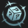

# Augment: silver, Count: 68
| key                      | name                    | icon                                                                    | desc                                                                                                                                                                             |
| -                        | -                       | -                                                                       | -                                                                                                                                                                                |
| AFK                      | AFK                     |                                            | You cannot perform actions for the next 3 rounds. Afterwards, gain 20 gold.                                                                                                      |
| ArmyBuilding             | Team Building           |                          | Gain a Lesser Champion Duplicator. Gain another after 5 player combats.  This item allows you to copy a 3-cost or less champion.                                           |
| Backup                   | Backup                  |                                      | Your team gains 12% Attack Speed if at least 4 allies start combat in the back two rows.                                                                                         |
| BandofThievesI           | Band of Thieves I       |                      | Gain 1 Thief's Gloves.                                                                                                                                                           |
| BardPlaybook1            | Caretaker's Ally        |                        | Gain a random 2-cost champion now. Gain the same one again every time you level up.                                                                                              |
| BigFriend                | Big Friend I            |                                | Your units that start combat next to an ally with over 1750 Health take 7% less damage for the rest of combat.                                                                   |
| BloodBank                | Lunch Money             |                                | Every 8 damage you deal to enemy tacticians gives you 2 gold. Total Payouts:  Gold                                                                                            |
| BranchingOut             | Branching Out           |                          | Gain a random Emblem.                                                                                                                                                            |
| BulkyBuddiesI            | Bulky Buddies I         |                        | Allies that start combat next to exactly 1 other ally gain 100 Health. When that champion dies, the other gains a 10% max Health Shield for 10 seconds.                          |
| CalledShot               | Called Shot             |                              | Set your win streak to 4. Gain 4 gold.                                                                                                                                           |
| ClimbTheLadderI          | Climb The Ladder I      |                    | Each time an ally dies, allies that share at least one trait with them gain 3 Ability Power, 3% Attack Damage, 3 Armor, and 3 Magic Resist.                                      |
| Commander_RollingForDays | Rolling For Days I      |  | Gain 11 free Shop rerolls.                                                                                                                                                       |
| Corrosion                | Corrosion               |                                | Enemy champions in the first two rows lose 3 Armor and Magic Resist every 2 seconds.                                                                                             |
| CraftedCrafting          | Crafted Crafting        |                    | Whenever you craft a completed item, gain 2 rerolls.                                                                                                                             |
| CustomerIsAlwaysRight    | Component Buffet        |        | Whenever you would get a component, gain a component anvil instead. Gain a random component.  The anvil offers 4 choices.                                                  |
| CyberneticImplants1      | Cybernetic Implants I   |            | Your champions holding an item gain 80 Health and 10% Attack Damage.                                                                                                             |
| DiversifiedPortfolio     | Diversified Portfolio   |          | Gain 1 gold. Each round, gain 1 gold for every 3 non-unique traits active.                                                                                                       |
| DiversifiedPortfolioplus | Diversified Portfolio+  |  | Gain 4 gold. Each round, gain 1 gold for every 3 non-unique traits active.                                                                                                       |
| Diversify1               | Stand United I          |                              | Your units gain 1.5% Attack Damage and 1.5 Ability Power for each non-unique Trait active across your team.                                                                      |
| DravenSpoilsOfWar        | Spoils of War I         |                | Enemies have a 25% chance to drop loot when killed.                                                                                                                              |
| Dummify                  | Dummify                 |                                    | Lose all champions on your board and bench. Gain a Training Dummy with 80% of their combined health. The dummy gains 1000 Health per stage.                                      |
| EyeForAnEye              | Eye For An Eye          |                            | For every 15 ally champions that die, gain a random component (max 3).                                                                                                           |
| EyeForAnEyeplus          | Eye For An Eye+         |                    | Gain a random component. For every 16 ally champions that die, gain another component (max 2).                                                                                   |
| FindYourCenter           | Find Your Center        |                      | Your champion that starts combat in the center of the front row gains 15% Damage Amp and 15% max Health.                                                                         |
| FineVintage              | Fine Vintage            |                            | Completed items left on your bench for 4 rounds transform into Support Anvils.                                                                                                   |
| Firesale                 | Firesale                |                                  | Each round, steal a random 3-cost or lower champion from the shop. Gain 1 gold.                                                                                                  |
| GlassCannonI             | Glass Cannon I          |                          | Units that start combat in the back row begin combat at 90% health but gain 13% Damage Amp.                                                                                      |
| GoodForSomethingSilver   | Good For Something I    |      | Champions that aren't holding items have a 50% chance to drop 1 gold on death.                                                                                                   |
| HealingOrbsI             | Healing Orbs I          |                          | When an enemy dies, the nearest ally is healed for 200.                                                                                                                          |
| HealthisWealthI          | Health is Wealth I      |                    | Your team gains 10% Omnivamp. Get a bonus of 8 gold when your team first accumulates 10000 total champion healing.                                                               |
| IronAssets               | Iron Assets             |                              | Gain a component anvil and 4 gold.                                                                                                                                               |
| ItemCollectorI           | Item Collector I        |                      | For each unique item they are holding, your team gains 1 Attack Damage and 1 Ability Power.                                                                                      |
| ItemGrabBag1             | Item Grab Bag I         |                          | Gain 1 random completed item.                                                                                                                                                    |
| Kingslayer               | Kingslayer              |                              | After winning player combat, gain 1 gold. If they had more health than you, gain 6 Gold instead. Gain 1 gold.                                                                    |
| LategameSpecialist       | Lategame Specialist     |              | When you reach Level 9, gain 33 gold.                                                                                                                                            |
| Lineup                   | Lineup                  |                                      | Your team gains 2 Armor and Magic Resist for each unit that starts combat in the front two rows.                                                                                 |
| LongTimeCrafting         | Latent Forge            |                  | After 8 player combats, gain an Artifact anvil.  The anvil offers 4 choices. Artifacts are more powerful items with a unique effect.                                       |
| ManaflowI                | Manaflow I              |                                | Your units that start combat in the back row gain 2 additional Mana per attack.                                                                                                  |
| MentorshipI              | Mentorship I            |                            | If an ally starts combat next to a higher-cost ally, it gains 10% Attack Speed and 100 Health.                                                                                   |
| MissedConnections        | Missed Connections      |                | Gain a copy of each 1-cost champion.                                                                                                                                             |
| OneForAllI               | One For All I           |                              | Your team gains 2% max Health and 1% Damage Amp for each unique one-cost champion on your board. Gain 2 one-costs.                                                               |
| OneTwoFive               | One, Two, Five!         |                              | Gain 1 random component, 2 gold, and 1 random 5-cost champion.                                                                                                                   |
| OneTwosThree             | Ones Twos Three         |                          | Gain 2 1-cost champion, 2 2-cost champions, and 1 3-cost champion.                                                                                                               |
| OverEncumbered           | Over Encumbered         |                      | For the next stage, you only get 2 bench slots. After, get 2 item components.                                                                                                    |
| PandorasBench            | Pandora's Bench         |                        | At the start of every round, champions on the 3 rightmost bench slots transform into random champions of the same cost. Gain 2 gold.                                             |
| PandorasItems            | Pandora's Items         |                        | Round start: items on your bench are randomized.  Gain 1 random component.                                                                                                 |
| PatienceIsaVirtue        | Patience is a Virtue    |                | Each round, gain 2 free rerolls if you did not buy a champion last round.                                                                                                        |
| Placebo                  | Placebo                 |                                    | Your team gains 1% Attack Speed. Gain 8 gold.                                                                                                                                    |
| PlaceboPlus              | Placebo+                |                            | Your team gains 1% Attack Speed. Gain 15 gold.                                                                                                                                   |
| Preparation              | Preparation I           |                            | Champions on your bench permanently gain 30 Health, 2% Attack Damage, and 2 Ability Power every round. Champions start with 1 stack of this effect, and can stack up to 4 times. |
| PumpingUp                | Pumping Up I            |                                | Your team gains 6% Attack Speed now. Each round after, they gain 0.5% more.                                                                                                      |
| Recombobulator           | Recombobulator          |                      | Champions on your board permanently transform into random champions 1 cost tier higher (max 5). Gain 2 Magnetic Removers.                                                        |
| RedBuff                  | Blistering Strikes      |                                    | Your team's attacks Burn their targets for 5% of their max Health over 5 seconds. Attacks also reduce their targets' healing received by 33%.                                    |
| RiggedShopplus           | Rigged Shop+            |                      | Your next shop and every 4 shops will contain all 3-cost champions. Gain 5 rerolls.                                                                                              |
| RiskyMoves               | Risky Moves             |                              | Your Tactician loses 20 Health, but after 7 player combats, gain 30 gold.                                                                                                        |
| SilverSpoon              | Silver Spoon            |                            | Gain 10 XP.                                                                                                                                                                      |
| SupportMining            | Support Mining          |                        | Gain a Training Dummy. When it dies 8 times, gain a random Support Item and remove the Training Dummy.                                                                           |
| SupportMiningplus        | Support Mining+         |                | Gain a Training Dummy. When it dies 7 times, gain a random Support Item and remove the Training Dummy.                                                                           |
| Survivor                 | Survivor                |                                  | After 3 players are eliminated, gain 92 gold.                                                                                                                                    |
| TableScraps              | Table Scraps            |                            | After the next 2 carousels, gain one unit that was not taken and its item. Gain 1 gold.                                                                                          |
| TeamingUpI               | Teaming Up I            |                              | Gain 1 random component and 2 random Tier 3 champions.                                                                                                                           |
| TitanicTitan             | Titanic Titan           |                          | Increase your current and max player health by 25. On carousel rounds you are released earlier, but are much slower.                                                             |
| YoungAndWildAndFree      | Young and Wild and Free |            | You can always move freely on Carousel rounds. Gain 5 gold.                                                                                                                      |
| ButtonMash               | Button Mash             |                              | Gain a Poppy. Your strongest Poppy's ability is replaced with a 3-hit Wallop.                                                                                                    |
| CeaseandDesist           | Cease and Desist        |                      | Gain a Vi. Your strongest Vi gains Attack Speed and her ability dashes to the farthest target within 3-hexes, Stuns, and deals bonus physical damage.                            |
| BranchingOutPlus         | Branching Out+          |                  | Gain a random Emblem and a Reforger.  Reforgers allow you to remake any item.                                                                                              |
| WolfUnchained            | Wolf Unchained          |                        | Gain a Sylas. Your strongest Sylas's ability deals more damage and recasts on kill, but his Health gain no longer scales with Ability Power.                                     |
| AdaptiveStrikes          | Adaptive Strikes        |                    | Gain a Jax. Your strongest Jax's attacks deal bonus magic damage every 3rd attack which gets stronger each time. His ability grants Attack Speed.                                |
# Augment: gold, Count: 145
| key                       | name                    | icon                                                                      | desc                                                                                                                                                                                               |
| -                         | -                       | -                                                                         | -                                                                                                                                                                                                  |
| AllThatShimmers           | All That Shimmers       |                      | Choose a gold-generating Artifact items and gain a Magnetic Remover.                                                                                                                               |
| AllThatShimmersPlus       | All That Shimmers+      |              | Choose a gold-generating Artifact. Gain a Magnetic Remover and 4 gold.                                                                                                                             |
| AMagicRoll                | A Magic Roll            |                                | Roll 3 dice. Gain rewards based on their total.                                                                                                                                                    |
| BadLuckProtection         | Bad Luck Protection     |                  | Your team can no longer critically strike. Convert each 5% Critical Strike Chance into 5% Attack Damage. Gain a Sparring Gloves.                                                                   |
| BardPlaybook2             | Caretaker's Favor       |                          | Gain a component anvil when you reach level 5, 6, 7, and 8.  The anvil offers 4 choices.                                                                                                     |
| BigFriend2                | Big Friend II           |                                | Your units that start combat next to an ally with over 1750 Health take 10% less damage for the rest of combat.                                                                                    |
| BigGrabBag                | Big Grab Bag            |                                | Gain 3 random components, 2 gold, and 1 Reforger.  Reforgers allow you to remake any item.                                                                                                   |
| BlazingSoulI              | Blazing Soul I          |                            | Combat start: Your highest Attack Speed champion gains 20 Ability Power and 20% Attack Speed. Repeat on another ally every 3 seconds.                                                              |
| BRB                       | BRB                     |                                              | You cannot perform actions for the next 3 rounds. Afterwards, gain 2 completed item anvils.                                                                                                        |
| BronzeForLifeI            | Bronze For Life I       |                        | Your team gains 3.5% Damage Amp for each Bronze-tier trait.                                                                                                                                        |
| BulkyBuddiesII            | Bulky Buddies II        |                        | Allies that start combat next to exactly 1 other ally gain 175 Health. When that champion dies, the other gains a 15% max Health Shield for 10 seconds.                                            |
| CalculatedLoss            | Calculated Loss         |                        | After losing your combat, gain 2 gold and a free Shop reroll.                                                                                                                                      |
| ClearMind                 | Clear Mind              |                                  | If there are no champions on your bench at the end of player combat, gain 3 XP.                                                                                                                    |
| ClimbTheLadderII          | Climb The Ladder II     |                    | Each time an ally dies, allies that share at least one trait with them gain 5 Ability Power, 5% Attack Damage, 5 Armor, and 5 Magic Resist.                                                        |
| ClockworkAccelerator      | Clockwork Accelerator   |            | Your team gains 10% Attack Speed every 3 seconds in combat.                                                                                                                                        |
| CloningFacility           | Cloning Facility        |                      | Empower the hex in the center of the third row. Summon a clone of the champion in it with 80% base Health and 10% increased Mana cost.                                                             |
| ClutteredMind             | Cluttered Mind          |                          | Gain 4 random 1-cost champions now. If your bench is full at the end of player combat, gain 3 XP.                                                                                                  |
| Commander_Ascension       | Ascension               |              | After 15 seconds of combat, your units gain 60% Damage Amp.                                                                                                                                        |
| CookingPot                | Cooking Pot             |                                | At the start of each turn, all units holding a Frying Pan or Spatula item grant the nearest champion 40 permanent Health. Gain a Frying Pan.                                                       |
| CrownGuarded              | Crown Guarded           |                            | Gain a Crownguard. Your Crownguards' start of combat effect is 85% stronger and the shield lasts 5 seconds longer.                                                                                 |
| CrownsWill                | Crown's Will            |                                | Gain a Needlessly Large Rod. Your units gain 10 Ability Power and 8 Armor.                                                                                                                         |
| CyberneticBulk2           | Cybernetic Bulk II      |                      | Your champions holding an item gain 300 health.                                                                                                                                                    |
| CyberneticImplants2       | Cybernetic Implants II  |              | Your champions holding an item gain 120 Health and 20% Attack Damage.                                                                                                                              |
| CyberneticUplink2         | Cybernetic Uplink II    |                  | Your champions holding an item gain 120 Health and restore 2 Mana per second.                                                                                                                      |
| DravenSpoilsOfWar2        | Spoils of War II        |                | Enemies have a 30% chance to drop loot when killed.                                                                                                                                                |
| DuoQueue                  | Duo Queue               |                                    | Gain 2 random 5-cost champions and 2 copies of a random component.                                                                                                                                 |
| Epoch                     | Epoch                   |                                          | Now, and at the start of every stage, gain 4 XP and 2 free rerolls.                                                                                                                                |
| Epochplus                 | Epoch+                  |                                  | Now, and at the start of every stage, gain 8 XP and 3 free rerolls.                                                                                                                                |
| ForwardThinking           | Forward Thinking        |                      | Lose all your gold. After 5 player combats, gain back the original amount and another 70 gold.                                                                                                     |
| GlassCannonII             | Glass Cannon II         |                          | Units that start combat in the back row begin combat at 90% health but gain 20% Damage Amp.                                                                                                        |
| GoldForDummies            | Gold For Dummies        |                        | Gain a Training Dummy. Every 10 seconds, all Training Dummies grant 1 gold.                                                                                                                        |
| Golemify                  | Golemify                |                                    | Lose all champions on your board and bench. Gain a Golem with 60% of their combined Health and 50% of their combined Attack Damage. The Golem gains 1000 Health per stage.                         |
| HealingOrbsII             | Healing Orbs II         |                          | When an enemy dies, the nearest ally is healed for 400.                                                                                                                                            |
| HealthisWealthII          | Health is Wealth II     |                    | Your team gains 15% Omnivamp. Get a bonus of 15 gold when your team first accumulates 10000 total champion healing.                                                                                |
| Heroicgrabbag             | Heroic Grab Bag         |                          | Gain 2 Lesser Champion Duplicators. Gain 7 gold.  This item allows you to copy a 3-cost or less champion.                                                                                    |
| HighVoltage               | High Voltage            |                              | Gain an Ionic Spark. Your Ionic Sparks have +3 hex radius and do 15% more damage.                                                                                                                  |
| HyperRoll                 | Hustler                 |                                  | You earn no interest, but gain 3 gold at the start of every player combat round. Gain 3 gold now.  Interest is extra gold you gain per 10g saved.                                            |
| InspiringEpitaph          | Inspiring Epitaph       |                    | When a unit dies, the nearest ally gains a 20% max Health Shield and 8% stacking Attack Speed.                                                                                                     |
| InvestmentStrategyI       | Investment Strategy I   |              | Your champions gain 7 permanent max health per interest you earn.                                                                                                                                  |
| ItemCollectorII           | Item Collector II       |                      | Your team gains 20 Health. For each unique item they are holding, your team gains bonus 5 Health, 1 Attack Damage, and 1 Ability Power.                                                            |
| LastStand                 | Last Stand              |                                  | The first time you would be eliminated, you escape death and your team permanently gains 150 Health, 10 Armor and Magic Resist, and 10% Omnivamp.                                                  |
| LearningFromExperience2   | Patient Study           |      | After player combat, gain 2 XP if you won or 3 XP if you lost.                                                                                                                                     |
| LittleBuddies             | Little Buddies          |                          | Your 4-cost and 5-cost champions gain 55 Health and 6% Attack Speed for every 1-cost and 2-cost champion on your board.                                                                            |
| LongDistanceRelationship2 | Long Distance Pals      |  | Combat start: Your 2 units furthest from each other form a bond, sharing 22% of their Armor, Magic Resist, Attack Damage, and Ability Power with each other.                                       |
| MacesWill                 | Mace's Will             |                                  | Gain a Sparring Gloves. Your team gains 6% Attack Speed and 20% Critical Strike Chance.                                                                                                            |
| MaliciousMonetization     | Malicious Monetization  |          | Gain 2 gold. For the next 3 rounds, enemy champions drop 2 gold when killed.                                                                                                                       |
| ManaflowII                | Manaflow II             |                                | Your units that start combat in the back row gain 3 additional Mana per attack.                                                                                                                    |
| MentorshipII              | Mentorship II           |                            | If an ally starts combat next to a higher-cost ally, it gains 16% Attack Speed and 220 Health.                                                                                                     |
| Moonlight                 | Moonlight               |                                  | Combat start: 1 random 1-cost champion is upgraded to 3-star for that round and gains 45% Attack Damage and 45 Ability Power.                                                                      |
| NobleSacrifice            | Noble Sacrifice         |                        | When your first ally dies each combat, grant your team 25 + 10% of that ally's Armor and Magic Resistance.                                                                                         |
| NOSCOUTNOPIVOT            | NO SCOUT NO PIVOT       |                        | Units can no longer be benched or sold after fighting in a player combat. After each player combat, units that fought gain 14 Health, 2% Attack Damage, and 2% Ability Power.                      |
| NotToday                  | Not Today               |                                    | Gain an Edge of Night. Champions holding this item gain 35% Attack Speed.                                                                                                                          |
| OneForAllII               | One For All II          |                              | Your team gains 3% max Health and 1.5% Damage Amp for each unique one-cost champion on your board. Gain 3 one-costs.                                                                               |
| Overheal                  | Overheal                |                                    | Every third attack deals an additional 110% damage and heals 50% of the damage. Excess healing is converted to a shield up to 300 Health.                                                          |
| PairofFours               | Pair of Fours           |                              | If your team has exactly 2 four-cost champions, they each gain 374 Health and 24.4% Attack Speed. Gain a random 4-cost.                                                                            |
| PandorasItems2            | Pandora's Items II      |                        | Round start: items on your bench are randomized.  Gain 2 random components.                                                                                                                  |
| PiercingLotusI            | Piercing Lotus I        |                        | Your team gains 5% Critical Strike chance, and their Abilities can critically strike. Critical strikes 20% Shred and Sunder the target for 3 seconds.                                              |
| Pilfer                    | Pilfer                  |                                        | Each round, gain a 1-star copy of the first champion you killed last combat.                                                                                                                       |
| PortableForge             | Portable Forge          |                          | Choose 1 of 4 Artifacts.  Artifacts are more powerful items with a unique effect.                                                                                                            |
| PreparationII             | Preparation II          |                          | Champions on your bench permanently gain 45 Health, 3% Attack Damage, and 3 Ability Power every round. Champions start with 1 stack of this effect, and can stack up to 4 times.                   |
| Prizefighter              | Prizefighter            |                            | Gain 2 item components. Every 5 wins gives you an item component.                                                                                                                                  |
| PumpingUp2                | Pumping Up II           |                                | Your team gains 8% Attack Speed now. Each round after, they gain 1% more.                                                                                                                          |
| Pyromaniac                | Pyromaniac              |                                | Gain a Red Buff. Your Burns deal 50% increased damage.                                                                                                                                             |
| RainingGold               | Raining Gold            |                              | Gain 8 gold now and 1 gold every round.                                                                                                                                                            |
| RainingGoldplus           | Raining Gold+           |                      | Gain 18 gold now and 1 gold every round.                                                                                                                                                           |
| ReinFOURcement            | ReinFOURcement          |                        | The next 4-cost champion you buy is instantly upgraded to 2-star. Gain 12 gold.                                                                                                                    |
| Replication               | Replication             |                              | Choose 1 of 3 components. For the next 2 rounds, gain a copy of that component.                                                                                                                    |
| SalvageBin                | Salvage Bin             |                                | Gain 1 random completed item now, and 1 component after 7 player combats. Selling champions breaks completed items into components (excluding Tactician's items and Emblems).                      |
| SalvageBinPlus            | Salvage Bin+            |                        | Gain 1 random completed item now, and 1 component after 4 player combats. Selling champions breaks completed items into components (excluding Tactician's items and Emblems).                      |
| SatedSpellweaver          | Sated Spellweaver       |                    | After casting an Ability, champions gain 15% Omnivamp for 3 seconds. Excess healing is converted to a shield up to 500 Health.                                                                     |
| Scapegoat                 | Scapegoat               |                                  | Gain a Training Dummy and 4 gold. If it is the first to die each player combat, gain 1 gold.                                                                                                       |
| Scavenger                 | Scavenger               |                                  | The first 5 enemy champions that are killed each combat grant a champion on your team a temporary completed item.                                                                                  |
| ScoreboardScrapper        | Scoreboard Scrapper     |                | Every round, if you're in the bottom 4, your team permanently gains 1.5% Attack Damage and Ability Power. If you're in the top 4, they have 10% more Health.                                       |
| ShopGlitch                | Shop Glitch             |                                | During non-player combat rounds, your shop refreshes for free every 2.5 seconds for 28 seconds.                                                                                                    |
| Slammin                   | Slammin'                |                                      | Gain 1 random Component(s). After each player combat, if there are no items on your bench (other than Consumables), gain 2 XP.                                                                     |
| Slamminplus               | Slammin'+               |                              | Gain 1 random component(s) and 10 XP now. After each player combat, if there are no items on your bench (other than Consumables), gain 2 XP.                                                       |
| SpearsWill                | Spear's Will            |                                | Your team gains 10% Attack Damage and 5 Mana. Gain a B.F. Sword.                                                                                                                                   |
| SpiritLink                | Spirit Link             |                                | Champions restore 5% of their max Health every 4 seconds. Increase the healing by 0.5% for every 10 missing player Health.                                                                         |
| StarryNight               | Starry Night            |                              | 1-cost and 2-cost units in your shop have a chance to be 2-star. Gain 6 gold. Chances increase with player level.                                                                               |
| StarryNightplus           | Starry Night+           |                      | 1-cost and 2-cost units in your shop have a chance to be 2-star. Gain 8 gold. Chances increase with player level.                                                                               |
| SupportCache              | Support Cache           |                            | Choose 1 of 4 Support items.                                                                                                                                                                       |
| TeamingUpII               | Teaming Up II           |                              | Gain 1 random Support item and 2 random 4-cost champions.                                                                                                                                          |
| ThornPlatedArmor          | Thorn-Plated Armor      |                    | Gain a Bramble Vest. Your Bramble Vests deal 1-180% more damage (based on Stage) and heal the holder for 30% of the damage dealt.                                                                  |
| TombRaiderI               | Tomb Raider I           |                              | For the next 3 players eliminated, choose one of their completed items to keep.                                                                                                                    |
| TowerDefense              | Tower Defense           |                            | Gain a Training Dummy equipped with a random emblem that fires ranged attacks at enemies. It upgrades as the game goes on.                                                                         |
| TradeSector               | Trade Sector            |                              | Gain a free Shop reroll every round. Gain 4 gold.                                                                                                                                                  |
| TraitTracker              | Trait Tracker           |                            | The first time you activate 8 non-unique traits for 1 combat, gain 5 random emblems.                                                                                                               |
| TrifectaI                 | Trifecta I              |                                  | Gain 2 3-cost champions. Combat Start: 3 random 3-cost champions gain 220 Health and 20% Attack Speed.                                                                                             |
| TwoMuchValue              | Two Much Value          |                            | Gain 1 reroll for every 2 unique two-cost champions fielded last combat. Gain 2 two-cost unit.                                                                                                     |
| TwoTrick                  | Two Trick               |                                    | Gain a random 2-star two-cost and 2 random 2-star one-cost champions.                                                                                                                              |
| VampiricVitality          | Vampiric Vitality       |                    | You heal for 12% of the damage you deal to enemy Tacticians. Your units gain 12% Omnivamp.                                                                                                         |
| WanderingTrainerGold      | Wandering Trainer I     |            | Gain a Training Dummy with 2 permanently attached Emblems. Gain 1 gold.                                                                                                                            |
| Warpath                   | Warpath                 |                                      | Gain a 2-star 2-cost champion. After dealing 80 player damage, gain a chest of high cost champions and items.                                                                                      |
| WorththeWait              | Worth the Wait          |                            | Gain a random two-star 1-cost champion. After 2 rounds, gain another copy of them at the start of each round for the rest of the game.                                                             |
| 10000IQ                   | 10,000 IQ               |                                      | Every 5 rounds with Strategist active, bet whether you'll win more or lose more. After those rounds, gain 4 gold. If you're correct, gain a completed item Anvil. Gain a Yuumi and an Ekko.        |
| AlterEgo                  | Alter Ego               |                                    | Gain a Rhaast. Your strongest Rhaast enters Shadow Assassin form and his ability is replaced with a dash and 1 hex spin. If it kills, he immediately casts again.                                  |
| AnimaSquadCrest           | Anima Squad Crest       |                      | Gain an Anima Squad Emblem.                                                                                                                                                                        |
| BastionCrest              | Bastion Crest           |                            | Gain an Bastion emblem.                                                                                                                                                                            |
| BoardofDirectors          | Board of Directors      |                    | If you have 3 or fewer Divinicorp champions, their bonuses are increased by 50% + 0% for each Stage. Gain a Rhaast and a Morgana.                                                                  |
| BoomBotsCrest             | BoomBot Crest           |                          | Gain a BoomBot emblem.                                                                                                                                                                             |
| BruiserCrest              | Bruiser Crest           |                            | Gain a Bruiser emblem.                                                                                                                                                                             |
| Capacitor                 | Capacitor               |                                  | When Techies cast, grant the lowest Health Techie a Shield equal to 200% of the Mana spent. Gain a Veigar and a Zyra.                                                                              |
| CognitiveImplant          | Cognitive Implant       |                    | Your Techies gain 5 Ability Power, increased by 1 for every 2 takedowns. Gain a Veigar and a Zyra.                                                                                                 |
| CowerWeaklings            | Cower, Weaklings!       |                        | Cyberboss abilities reduce the target's max Health by 20%. Cyberbosses take 20% less damage from enemies with less max Health. Gain a Poppy and a Veigar.                                          |
| Cutpurse                  | Cutpurse                |                                    | Executioners have a 4% chance to drop a gold when their attacks critically strike. Gain a Graves and Rengar.                                                                                       |
| Cyberdeck                 | Cyberdeck               |                                  | On combat start, 1 of your Exotech units with 2 items gains their ideal Exotech item. Gain a Jax and Naafiri.                                                                                      |
| DivineAscension           | Divine Ascension        |                      | After 12 seconds your Divinicorp champions ascend, gaining 20% Health and 30% Attack Speed. Gain a Rhaast and a Morgana.                                                                           |
| DivinicorpCrest           | Divinicorp Crest        |                      | Gain a Divinicorp emblem.                                                                                                                                                                          |
| DummyWithAGun             | Dummy With A Gun        |                          | With Syndicate active, your Training Dummies shoot enemies. Every 2 times they attack, grant the Kingpins 2% Attack Damage and Ability Power. Gain 1 Training Dummy, a Darius, and a Twisted Fate. |
| DynamoCrest               | Dynamo Crest            |                              | Gain a Dynamo emblem.                                                                                                                                                                              |
| ExecutionerCrest          | Executioner Crest       |                    | Gain an Executioner emblem.                                                                                                                                                                        |
| ExotechCrest              | Exotech Crest           |                            | Gain an Exotech emblem.                                                                                                                                                                            |
| Flatline                  | Flatline                |                                    | Marksmen execute enemies under 10% Health. Every time a Marksman executes, all Marksman gain 4% Attack Speed. Gain a Jhin and a Kindred.                                                           |
| Freestyling               | Freestyling             |                              | Clear all painted hexes. When Street Demons start combat on a non-tagged hex, tag it. After all hexes are tagged, gain 25 gold. Gain 3 Street Demons.                                              |
| GoldenFleece              | Golden Fleece           |                            | Each Golden Ox drops 1 gold after fighting 2 rounds. Your max interest is 7. Gain a Graves, an Alistar, and 1 gold.                                                                                |
| GoldenFleecePlus          | Golden Fleece+          |                    | Each Golden Ox drops 1 gold after fighting 2 rounds. Your max interest is 7. Gain a Graves, an Alistar, and 4 gold.                                                                                |
| GoldenOxCrest             | Golden Ox Crest         |                          | Gain a Golden Ox emblem.                                                                                                                                                                           |
| HostileTakeover           | Hostile Takeover        |                      | Cypher gains 75% of its combat bonus now. Gain 200% Intel from kills, but only 30% from losses. Gain a Draven.                                                                                     |
| KeepYourFriendsClose      | Keep Your Friends Close |            | Syndicate Kingpins gain 10% Attack Speed and 120 Health for each adjacent ally in their row. The allies gain 175 Health. Gain a Twisted Fate and a Darius.                                         |
| LethalRerouting           | Lethal Rerouting        |                      | Slayers above 50% Health gain 20% Attack Damage. While under 50%, they gain 15% Omnivamp. Gain a Vayne and a Shaco.                                                                                |
| MarksmanCrest             | Marksman Crest          |                          | Gain a Marksman emblem.                                                                                                                                                                            |
| MemoryBank                | Memory Bank             |                                | Gain a Jhin and Morgana. Dynamos gain 4% Damage Amp. After they spend 7000 Mana, gain a Zhonya's Paradox and an Aurora.                                                                            |
| NewHighScore              | New High Score          |                            | Cyberbosses increase their score when they deal damage. When they reach the next high score gain bonus loot. Gain a Veigar and a Poppy.                                                            |
| PolishedChrome            | Polished Chrome         |                        | When you 3-star Nitro champions, they gain 15% Attack Damage, 20 Ability Power, and grant 10 Gold. Gain a Kindred and a Nidalee.                                                                   |
| PowerLeveling             | Power Leveling          |                          | Anima Squad takedowns have a 30% chance to drop an XP orb that sells for 1 XP. Anima Squad units gain 1% Attack Speed for each of your player levels. Gain a Seraphine and Illaoi.                 |
| RapidfireCrest            | Rapidfire Crest         |                        | Gain a Rapidfire emblem.                                                                                                                                                                           |
| ReactiveShell             | Reactive Shell          |                          | Vanguards gain 8% Health. When the Vanguard Shield ends, deal 50% of the initial Shield as magic damage to their current target. Gain a Skarner and a Vi.                                          |
| ReinforcingSkeleture      | Reinforcing Skeleture   |            | Whenever a Bruiser dies, it permanently gains 55 Health. Gain a Darius and Alistar.                                                                                                             |
| SlayerCrest               | Slayer Crest            |                              | Gain a Slayer emblem.                                                                                                                                                                              |
| SpeedKills                | Speed Kills             |                                | Rapidfire champions start at 1 stacks and can go to 15. If you win combat within 18 seconds, gain 2 gold. Gain a Twisted Fate and a Kog'Maw.                                                       |
| StrategistCrest           | Strategist Crest        |                      | Gain a Strategist Emblem.                                                                                                                                                                          |
| SupportSpire              | Support Spire           |                            | After 10 seconds in combat, a support spire grants Anima Squad a Shield, Attack Speed, or Stuns all enemies. Gain 3 Anima Squad champions.                                                         |
| SyndicateCrest            | Syndicate Crest         |                        | Gain a Syndicate emblem.                                                                                                                                                                           |
| TaggingSpree              | Tagging Spree           |                            | Signature Street Demon hexes grant 5% Attack Speed. Gain 3 Street Demons and 2 Spray Can items that create signature Street Demon hexes.                                                           |
| TechieCrest               | Techie Crest            |                              | Gain a Techie emblem.                                                                                                                                                                              |
| TheChugBug                | The Chug Bug            |                                | Gain 1 Gragas. Your strongest Gragas's attacks have a chance to knockback and deal bonus magic damage. His ability heals and empowers his next attack.                                             |
| TheChugBugPlus            | The Chug Bug+           |                        | Gain 2 Gragas. Your strongest Gragas's attacks have a chance to knockback and deal bonus magic damage. His ability heals and empowers his next attack.                                             |
| Transference              | Transference            |                            | When A.M.P. champions die, the nearest A.M.P. champion gains 1 Amp until the end of combat. Gain a Naafiri and a Nidalee.                                                                          |
| Transistor                | Transistor              |                                | When Bastions' start of combat bonus ends, 50% of it converts into Attack Damage and Ability Power and they gain 50% Attack Speed. Gain an Illaoi and Jax.                                         |
| TrialRun                  | Trial Run               |                                    | Gain an Exotech Golem with a copy of each of your Exotech items. Gain a Jhin and a Naafiri.                                                                                                        |
| VanguardCrest             | Vanguard Crest          |                          | Gain a Vanguard Emblem.                                                                                                                                                                            |
| HunterKillerMissile       | Hunter Killer Missile   |              | Every 6 Boombot rockets, fire an HK Missile at the current target that deals 350% of the original rocket's damage. Gain a Kog'Maw and a Skarner.                                                   |
| HeroicgrabbagPlus         | Heroic Grab Bag+        |                  | Gain 2 Lesser Champion Duplicators. Gain 9 gold.  This item allows you to copy a 3-cost or less champion.                                                                                    |
| HeroicgrabbagPlusPlus     | Heroic Grab Bag++       |          | Gain 2 Lesser Champion Duplicators. Gain 13 gold.  This item allows you to copy a 3-cost or less champion.                                                                                   |
| CyperCrest                | Cyper Crest             |                                | Gain a Cyper emblem.                                                                                                                                                                               |
# Augment: prismatic, Count: 123
| key                           | name                    | icon                                                                              | desc                                                                                                                                                                             |
| -                             | -                       | -                                                                                 | -                                                                                                                                                                                |
| AnExaltedAdventure            | An Exalted Adventure    |                        | Gain three 2-cost champions. If you 3-star two of them, gain an orb filled with loot. Gain a Lesser Champion Duplicator at the start of next 2 stages.                           |
| BardPlaybook3                 | Caretaker's Chosen      |                                  | As you level, gain more powerful items. Level 4: component anvil Level 6: completed item anvil Level 7: choose 1 of 5 Radiant items                                     |
| BeltOverflow                  | Belt Overflow           |                                    | Gain 5 Giant's Belts. Your Giant's Belts grant +60 bonus Health.                                                                                                                 |
| BinaryAirdrop                 | Binary Airdrop          |                                  | Combat start: Up to 4 champions holding 2 items gain a recommended 3rd completed item.                                                                                           |
| BirthdayPresents              | Birthday Present        |                            | Gain a 2-star champion and 1 gold every time you level up. The champion's cost tier is your level minus 4 (max: 5-cost).                                                         |
| BlazingSoulII                 | Blazing Soul II         |                                  | Combat start: Your highest Attack Speed champion gains 35 Ability Power and 35% Attack Speed. Repeat on another ally every 3 seconds.                                            |
| BlindingSpeed                 | Blinding Speed          |                                  | Gain a Giant Slayer, Guinsoo's Rageblade, a Recurve Bow and a Magnetic Remover.  Useful for Attack Carries!                                                                |
| BronzeForLifeII               | Bronze For Life II      |                              | Your team gains 4% Damage Amp and 1% Durability for each Bronze-tier trait.                                                                                                      |
| BuildaBud                     | Build a Bud!            |                                          | Gain a random 3-star 1-cost champion. Gain 8 gold.                                                                                                                               |
| BuildingACollectionPlusPlus   | Buried Treasures III    |      | Gain a random item component at the start of the next 6 rounds (including this round).                                                                                           |
| BulkyBuddiesIII               | Bulky Buddies III       |                              | Allies that start combat next to exactly 1 other ally gain 300 Health. When that champion dies, the other gains a 18% max Health Shield for 10 seconds.                          |
| CalculatedEnhancement         | Calculated Enhancement  |                  | Each combat, 4 random champions in your last two rows gain 40% Attack Damage and 50 Ability Power.                                                                               |
| CalltoChaos                   | Call to Chaos           |                                      | Gain a powerful and random reward.                                                                                                                                               |
| Commander_FinalAscension      | Final Ascension         |            | Your team gains 15% Damage Amp. After 15 seconds, this increases to 45% Damage Amp.                                                                                              |
| Coronation                    | Coronation              |                                        | Gain a Tactician's Crown. Tactician's Crown, Shield, and Cape grant the holder an additional 20% Attack Speed, 25% Attack Damage, and 30 Ability Power.                          |
| CursedCrown                   | Cursed Crown            |                                      | Gain +2 max team size, but take 100% more player damage when you lose a player combat.                                                                                           |
| CyberneticBulk3               | Cybernetic Bulk III     |                              | Your champions holding an item gain 500 Health.                                                                                                                                  |
| CyberneticImplants3           | Cybernetic Implants III |                      | Your champions holding an item gain 200 Health and 30% Attack Damage.                                                                                                            |
| CyberneticUplink3             | Cybernetic Uplink III   |                          | Your champions holding an item gain 180 Health and restore 3 Mana per second.                                                                                                    |
| DravenSpoilsOfWar3            | Spoils of War III       |                        | Enemies have a 45% chance to drop loot when killed.                                                                                                                              |
| DualPurpose                   | Dual Purpose            |                                      | The first time you buy XP each round, gain 2 gold. Whenever you buy XP, reroll your Shop.                                                                                        |
| ExpectedUnexpectedness        | Expected Unexpectedness |                | Now and at the start of the next 2 stages, roll 3 dice. Gain various rewards based on their total.                                                                               |
| FinalPolish                   | Final Polish            |                                      | Gain a Support Anvil and a completed item anvil.                                                                                                                                 |
| FinalReserves                 | Final Reserves          |                                  | The first time you would be eliminated, you instead remain alive. After this happens, gain 30 XP and set your gold to 90. Excess gold is converted to XP.                        |
| Flexible                      | Flexible                |                                            | Gain 1 random emblem. At the start of every Stage, gain a random emblem. Your team gains 20 Health for each emblem they are holding.                                             |
| FlurryofBlows                 | Flurry of Blows         |                                  | Gain a Zeke's Herald. Champions buffed by Zeke's also gain 45% Critical Strike Chance.                                                                                           |
| GachaAddict                   | Prismatic Ticket        |                                      | Each time your Shop is rerolled, you have a 45% chance to gain a free reroll.                                                                                                    |
| GargantuanResolve             | Gargantuan Resolve      |                          | Gain a Titan's Resolve and another after 2 player combats. Your Titan's Resolves can continue stacking to 50 instead of 25. The total resist bonus is increased by 80%.          |
| GoingLong                     | Going Long              |                                          | You no longer gain interest. Gain 15 gold now. Round start: gain 4 XP.  Interest is extra gold you gain per 10g saved.                                                     |
| GreaterMoonlight              | Greater Moonlight       |                            | Combat Start: 1 random 1-cost champion is upgraded to 4-star for that round and gains 5% Attack Damage and 5 Ability Power.                                                      |
| HardCommit                    | Hard Commit             |                                        | Gain a random emblem. Now and at the start of each stage, gain a 1-star champion of that trait with a cost equal to the Stage (max 5) and 2 gold.                                |
| HedgeFund                     | Hedge Fund              |                                          | Gain 25 gold. Your max interest is increased to 10.  Interest is extra gold you gain per 10g saved.                                                                        |
| HighEndSector                 | Shopping Spree          |                                  | When you level up, gain a number of free shop refreshes equal to your level+1. Gain 2 gold.                                                                                      |
| HighEndShopping               | High End Shopping II    |                              | Champions appear in your Shop as if you were 1 level higher. Gain 12 gold.                                                                                                       |
| ImmovableObject               | Immovable Object        |                              | Gain a Randuin's Omen. Its range is increased by 1 hex and its effect is increased by 33%.                                                                                       |
| ImtheCarrynow                 | I'm the Carry Now       |                                  | Get a Golem with tailored offensive items. It gets stronger at the start of each Stage.                                                                                          |
| InvestedPlus                  | Invested+               |                                    | Gain 26 gold. At the start of each round, gain 1 Shop reroll for every 10 gold above 50 (max 80 gold).                                                                           |
| InvestedPlusPlus              | Invested++              |                            | Gain 45 gold. At the start of each round, gain 1 Shop reroll for every 10 gold above 50 (max 80 gold).                                                                           |
| InvestmentStrategyII          | Investment Strategy II  |                    | Your champions gain 8 permanent max health per interest you earn. Your max interest is increased to 7. Gain 3 gold.                                                              |
| LivingForge                   | Living Forge            |                                      | Gain an Artifact anvil now and after every 10 player combats.  Artifacts are more powerful items with a unique effect.                                                     |
| LuckyGloves                   | Lucky Gloves            |                                      | Thief's Gloves will always give your champions ideal items. Gain 2 Sparring Gloves.                                                                                              |
| LuckyGlovesPlus               | Lucky Gloves+           |                              | Thief's Gloves will always give your champions ideal items. Gain 2 Sparring Gloves.                                                                                              |
| LudensEcho3                   | Luden's Echo III        |                                      | Every 60 Mana spent, your units next instance of Ability damage deals an additional 110-300 (based on current Stage) magic damage to the target and a nearby enemy.              |
| MaxCap                        | Max Cap                 |                                                | Your max level is 7. Gain 1 Tactician's Shield which increases your team size by +1, and 40 gold.                                                                                |
| MaxLevel10                    | Level Up!               |                                        | When you buy XP, gain an additional 2. Gain 12 immediately.                                                                                                                      |
| OneBuffTwoBuff                | One Buff, Two Buff      |                                | Gain a Red Buff, a Blue Buff, and a Champion Duplicator.                                                                                                                         |
| OneHundredDuckSizedHorses     | Endless Hordes          |          | Gain +3 maximum team size, but your units can only hold 1 item and their total health is reduced by 12%. Gain 8 gold.                                                            |
| OneHundredDuckSizedHorsesplus | Endless Hordes +        |  | Gain +3 maximum team size, but your units can only hold 1 item and their total health is reduced by 12%. Gain 18 gold.                                                           |
| PandorasRadiantBox            | Pandora's Items III     |                        | Round start: items on your bench are randomized.  Gain 1 random Radiant item.                                                                                              |
| PhreakyFriday                 | Phreaky Friday          |                                  | Gain an Infinity Force. After 5 player combats, gain another.  Infinity Force: Artifact that offers tons of offensive and defensive stats                                  |
| PhreakyFridayPlus             | Phreaky Friday +        |                          | Gain an Infinity Force. After 3 player combats, gain another.  Infinity Force: Artifact that offers tons of offensive and defensive stats                                  |
| PiercingLotusII               | Piercing Lotus II       |                              | Your team gains 20% Critical Strike chance, and their Abilities can critically strike. Critical strikes 20% Shred and Sunder the target for 3 seconds.                           |
| PrismaticPipeline             | Prismatic Pipeline      |                          | The next non-player combat round will drop an additional Prismatic Orb full of amazing loot.                                                                                     |
| PumpingUp3                    | Pumping Up III          |                                        | Your team gains 12% Attack Speed now. Each round after, they gain 2% more.                                                                                                       |
| QualityOverQuantity           | Quality Over Quantity   |                      | Units holding exactly 1 item upgrade that item to Radiant. Units holding Radiant items gain 4% Health. Gain 2 Magnetic Removers.  Thief's Gloves counts as multiple items. |
| RadiantRefactor               | Radiant Refactor        |                              | Gain a Masterwork Upgrade and 1 component anvil.  Masterwork Upgrade upgrades an item to Radiant!                                                                          |
| RadiantRelics                 | Radiant Relics          |                                  | Choose 1 of 5 Radiant items. Gain a Magnetic Remover.  Radiant items are very powerful versions of completed items.                                                        |
| RollTheDice                   | Roll The Dice           |                                      | Gain a Radiant Thief's Gloves item. This equips 2 random Radiant items every round.  Radiant items are very powerful versions of completed items.                          |
| SacrificialPact               | Cruel Pact              |                              | Buying XP costs 6 player health instead of 4 gold. Heal 4 player health before each player combat.                                                                               |
| ScopedWeaponsII               | Scoped Weapons II       |                              | Your units that start combat in the back 2 rows gain infinite Attack Range and 25% Attack Speed.                                                                                 |
| ShimmerscaleEssence           | Shimmerscale Essence    |                      | Gain a Mogul's Mail. In 5 rounds, gain a Gamblers Blade.  These items give gold as well as combat power.                                                                   |
| Sponging                      | Sponging                |                                            | Combat start: Up to 6 champions with 1 or fewer items gain a copy of a random completed item from the nearest itemized ally.                                                     |
| SubscriptionService           | Subscription Service    |                      | Now, and at the start of each Stage, open a Shop of 4 unique 4-cost champions and gain 8 gold.                                                                                   |
| SwordOverflow                 | Sword Overflow          |                                  | Gain 5 BF Swords. Your BF Swords grant +2% Attack Speed.                                                                                                                         |
| TacticiansKitchen             | Tactician's Kitchen     |                          | Gain a random Emblem. After 6 player combats, gain a Tactician's Cape.                                                                                                           |
| ThinkFast                     | Think Fast              |                                          | Shop rerolls are free until the end of this round. Traits and other augments do not benefit from these free Shops. Gain 3 gold.                                                  |
| ThriftShop                    | Wise Spending           |                                        | Every 2 times you purchase a shop reroll, gain 4 XP. Gain 1 gold now.                                                                                                            |
| TiniestTitan                  | Tiniest Titan           |                                    | Gain 2 player health and 1 gold after every player combat. Your Tactician also moves faster.                                                                                     |
| TiniestTitanPlus              | Tiniest Titan+          |                            | Gain 2 player health and 1 gold after every player combat. Your Tactician also moves faster. Gain 15 gold now.                                                                   |
| TombRaiderII                  | Tomb Raider II          |                                    | Gain 1 completed item Anvil. Every time a player is eliminated, choose one of their completed items to keep.                                                                     |
| TrifectaII                    | Trifecta II             |                                        | Gain 3 3-cost champions. Allies gain 5% Attack Speed. Combat Start: 3 random 3-cost champions gain 300 Health and 25% Attack Speed.                                              |
| Twins3                        | Double Trouble III      |                                                | When you field exactly 2 copies of a champion, they both gain 40% Attack Damage and 40 Ability Power, Armor, and Magic Resist. When you 3-star, gain a 2-star copy.              |
| UpwardMobility                | Upward Mobility         |                                | Buying XP costs 1 less. Gain 2 Health and 2 free rerolls whenever you level up.                                                                                                  |
| VoidSwarm                     | Void Swarm              |                                          | Gain a Zz'Rot Portal and another after every 10 player combats. Zz'Rot Portal Voidlings gain 30% Attack Speed and 30% Omnivamp.                                                  |
| WanderingTrainer              | Wandering Trainer II    |                            | Gain a Training Dummy with 3 permanently attached Emblems. Gain 6 gold.                                                                                                          |
| WandOverflow                  | Wand Overflow           |                                    | Gain 5 Needlessly Large Rods. Your Needlessly Large Rods grant +5% Attack Speed.                                                                                                 |
| WoodlandCharm                 | Woodland Charm          |                                  | Your highest Health champion is cloned. The clone has 25% bonus Health and 30% bonus Attack Speed but cannot equip items.                                                        |
| WorththeWaitII                | Worth the Wait II       |                                | Gain a random 2-cost champion. Gain another copy of them at the start of each round for the rest of the game.                                                                    |
| AnimaSquadCirclet             | Anima Squad Circlet     |                          | Gain an Anima Squad Emblem and a Yuumi.                                                                                                                                          |
| AnimaSquadCrown               | Anima Squad Crown       |                              | Gain an Anima Squad Emblem, an Adaptive Helm, and an Illaoi.                                                                                                                     |
| AxiomArcIII                   | Axiom Arc III           |                                      | Your units gain 15 Mana on kill. Gain a completed item Anvil.                                                                                                                    |
| BastionCirclet                | Bastion Circlet         |                                | Gain a Bastion Emblem, a Sejuani, and a Giant's Belt.                                                                                                                            |
| BastionCrown                  | Bastion Crown           |                                    | Gain a Bastion Emblem, a Steadfast Heart, and an Illaoi.                                                                                                                         |
| BlueBatteryIII                | Blue Battery III        |                                | Gain a Blue Buff. Your units gain 5 Ability Power. After casting their Ability, gain 5 Mana.                                                                                     |
| BoomBotsCirclet               | BoomBot Circlet         |                              | Gain a BoomBot Emblem and a Fiddlesticks.                                                                                                                                        |
| BoomBotsCrown                 | BoomBot Crown           |                                  | Gain a BoomBot Emblem, an Ionic Spark, and a Skarner.                                                                                                                            |
| BruiserCirclet                | Bruiser Circlet         |                                | Gain a Bruiser Emblem, a Gragas, and a Giant's Belt.                                                                                                                             |
| BruiserCrown                  | Bruiser Crown           |                                    | Gain a Bruiser Emblem, a Crownguard, and a Darius.                                                                                                                               |
| ChemtechOverdrive             | Chemtech Overdrive      |                          | Open 3 portals to Zaun on random hexes in the second row. Any unit that starts combat in a portal gains 450 Health and 35% Attack Speed, and drops 1 gold on death.              |
| DivinicorpCirclet             | Divinicorp Circlet      |                          | Gain a Divinicorp Emblem and a Senna.                                                                                                                                            |
| DivinicorpCrown               | Divinicorp Crown        |                              | Gain a Divinicorp Emblem, a Spirit Visage, and a Rhaast.                                                                                                                         |
| Dominance                     | Dominance               |                                          | For every 2 surviving champions after winning a player combat, gain 1 gold. Gain 16 XP.                                                                                          |
| DynamoCirclet                 | Dynamo Circlet          |                                  | Gain a Dynamo Emblem, a Miss Fortune, and a BF Sword.                                                                                                                            |
| DynamoCrown                   | Dynamo Crown            |                                      | Gain a Dynamo Emblem, a Spear of Shojin, and an Elise.                                                                                                                           |
| ExecutionerCirclet            | Executioner Circlet     |                        | Gain an Executioner Emblem, a Vex, and a Sparring Gloves.                                                                                                                        |
| ExecutionerCrown              | Executioner Crown       |                            | Gain an Executioner Emblem, a Striker's Flail, and a Graves.                                                                                                                     |
| ExotechCirclet                | Exotech Circlet         |                                | Gain an Exotech Emblem and a Mordekaiser.                                                                                                                                        |
| ExotechCrown                  | Exotech Crown           |                                    | Gain an Exotech Emblem, a Guinsoo's Rageblade, and a Naafiri.                                                                                                                    |
| GoldenOxCirclet               | Golden Ox Circlet       |                              | Gain a Golden Ox Emblem and a Jarvan.                                                                                                                                            |
| GoldenOxCrown                 | Golden Ox Crown         |                                  | Gain a Golden Ox Emblem, a Nashor's Tooth, and a Graves.                                                                                                                         |
| LifelongLearning              | Lifelong Learning       |                            | Your units gain 2% health every round. If they survive combat, they gain an additional 3 Ability Power and 3% Attack Damage.                                                     |
| MarksmanCirclet               | Marksman Circlet        |                              | Gain a Marskman Emblem, an Aphelios, and a Recurve Bow.                                                                                                                          |
| MarksmanCrown                 | Marksman Crown          |                                  | Gain a Marksman Emblem, an Infinity Edge, and a Jhin.                                                                                                                            |
| Pirates                       | Pirates                 |                                              | Your units have a rare chance to drop treasure chests when they kill enemy champions.                                                                                            |
| RapidfireCirclet              | Rapidfire Circlet       |                            | Gain a Rapidfire Emblem, a Zeri, and a BF Sword.                                                                                                                                 |
| RapidfireCrown                | Rapidfire Crown         |                                | Gain a Rapidfire Emblem, a Giant Slayer, and a Twisted Fate.                                                                                                                     |
| SharetheSpotlight             | Share the Spotlight     |                          | Gain a spotlight in the back corner of your board. All units in the spotlight gain 14% Damage Amp, 12% Omnivamp, and 2 Mana per second.                                          |
| SlayerCirclet                 | Slayer Circlet          |                                  | Gain a Slayer Emblem, a Zed, and a Sparring Gloves.                                                                                                                              |
| SlayerCrown                   | Slayer Crown            |                                      | Gain a Slayer Emblem, a Hand of Justice, and a Vayne.                                                                                                                            |
| StrategistCirclet             | Strategist Circlet      |                          | Gain a Strategist Emblem, a Yuumi, and a Giant's Belt.                                                                                                                           |
| StrategistCrown               | Strategist Crown        |                              | Gain a Strategist Emblem, an Adaptive Helm, and an Ekko.                                                                                                                         |
| StreetDemonCirclet            | Street Demon Circlet    |                        | Gain a Street Demon Emblem and a Jinx.                                                                                                                                           |
| StreetDemonCrown              | Street Demon Crown      |                            | Gain a Street Demon Emblem, a Striker's Flail, and an Ekko.                                                                                                                      |
| SyndicateCirclet              | Syndicate Circlet       |                            | Gain a Syndicate Emblem and a Braum.                                                                                                                                             |
| SyndicateCrown                | Syndicate Crown         |                                | Gain a Syndicate Emblem, an Infinity Edge, and a Darius.                                                                                                                         |
| TechieCirclet                 | Techie Circlet          |                                  | Gain a Techie Emblem, a Brand, and a Tear of the Goddess.                                                                                                                        |
| TechieCrown                   | Techie Crown            |                                      | Gain a Techie Emblem, a Jeweled Gauntlet, and a Shyvana.                                                                                                                         |
| TitanicStrength               | Titanic Strength        |                              | Your team gains 1.25% of their max Health as Attack Damage and 1.25% of their max Health as Ability Power.                                                                       |
| UnstableEvolution             | Unstable Evolution      |                          | Your champions randomly gain one of the following when they are starred up: 360 Health, 36% Attack Speed, 36% Attack Damage, or 36 Ability Power.                                |
| VanguardCirclet               | Vanguard Circlet        |                              | Gain a Vanguard Emblem, a Leona, and a Giant's Belt.                                                                                                                             |
| VanguardCrown                 | Vanguard Crown          |                                  | Gain a Vanguard Emblem, a Protector's Vow, and a Skarner.                                                                                                                        |
| GargantuanResolvePlus         | Gargantuan Resolve      |                  | Gain a Titan's Resolve and another after 1 player combats. Your Titan's Resolves can continue stacking to 50 instead of 25. The total resist bonus is increased by 80%.          |
| CyperCrown                    | Cyper Crown             |                                        | Gain a Cypher Emblem, a Giant Slayer, and a Leblanc.                                                                                                                             |
