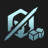

# Augment: silver, Count: 71
| key                      | name                    | icon                                                                    | desc                                                                                                                                                                              |
| -                        | -                       | -                                                                       | -                                                                                                                                                                                 |
| AFK                      | AFK                     |                                            | You cannot perform actions for the next 3 rounds. Afterwards, gain 20 gold.                                                                                                       |
| ArmyBuilding             | Team Building           |                          | Gain a Lesser Champion Duplicator. Gain another after 5 player combats.  This item allows you to copy a 3-cost or less champion.                                            |
| BandofThievesI           | Band of Thieves I       |                      | Gain 1 Thief's Gloves.                                                                                                                                                            |
| BardPlaybook1            | Caretaker's Ally        |                        | Gain a random 2-cost champion now. Gain the same one again every time you level up.  Champion: ???                                                                          |
| BestFriends1             | Best Friends I          |                          | Units isolated in pairs gain 12% Attack Speed and 12 Armor at the start of combat.                                                                                                |
| BigFriend                | Big Friend I            |                                | Your units that start combat next to an ally with over 1750 Health gain 9% Durability.                                                                                            |
| BloodBank                | Lunch Money             |                                | Every 8 damage you deal to enemy tacticians gives you 2 gold. Total Payouts: 0 Gold                                                                                            |
| BranchingOut             | Branching Out           |                          | Gain a random Emblem.                                                                                                                                                             |
| BranchingOutPlus         | Branching Out+          |                  | Gain a random Emblem and a Reforger.  Reforgers allow you to remake any item.                                                                                               |
| CalledShot               | Called Shot             |                              | Set your win streak to 4. Gain 4 gold.                                                                                                                                            |
| ClimbTheLadderI          | Climb The Ladder I      |                    | Each time an ally dies, allies that share at least one trait with them gain 3% Ability Power, 3% Attack Damage, 3 Armor, and 3 Magic Resist.                                      |
| Commander_RollingForDays | Rolling For Days I      |  | Gain 11 free Shop rerolls.                                                                                                                                                        |
| Corrosion                | Corrosion               |                                | Enemy champions in the first two rows lose 3 Armor and Magic Resist every 2 seconds.                                                                                              |
| CraftedCrafting          | Crafted Crafting        |                    | Whenever you craft a completed item, gain 2 rerolls.                                                                                                                              |
| CustomerIsAlwaysRight    | Component Buffet        |        | Whenever you would get a component, gain a component anvil instead. Gain a random component.  The anvil offers 4 choices.                                                   |
| Diversify1               | Stand United I          |                              | Your units gain 1.5% Attack Damage and 1.5% Ability Power for each non-unique Trait active across your team.                                                                      |
| DravenSpoilsOfWar        | Spoils of War I         |                | Enemies have a 25% chance to drop loot when killed.                                                                                                                               |
| Dummify                  | Dummify                 |                                    | Lose all champions on your board and bench. Gain a Training Dummy with 80% of their combined health. The dummy gains 1000 Health per stage.                                       |
| EyeForAnEye              | Eye For An Eye          |                            | For every 15 ally champions that die, gain a random component (max 3).  Deaths Remaining: 0                                                                                 |
| EyeForAnEyeplus          | Eye For An Eye+         |                    | Gain a random component. For every 16 ally champions that die, gain another component (max 2).  Deaths Remaining: 0                                                         |
| FindYourCenter           | Find Your Center        |                      | Your champion that starts combat in the center of the front row gains 15% Damage Amp and 15% max Health.                                                                          |
| Firesale                 | Firesale                |                                  | Each round, steal a random 3-cost or lower champion from the shop. Gain 1 gold.                                                                                                   |
| GlassCannonI             | Glass Cannon I          |                          | Units that start combat in the back row begin combat at 90% health but gain 13% Damage Amp.                                                                                       |
| GoodForSomethingSilver   | Good For Something I    |      | Champions that aren't holding items have a 50% chance to drop 1 gold on death.                                                                                                    |
| HeadStart                | Delayed Start           |                                | Sell your board and bench. Gain 4 random 2-star 1-cost champions. Disable your Shop for the next 3 rounds.                                                                        |
| HealingOrbsI             | Healing Orbs I          |                          | When an enemy dies, the nearest ally is healed for 200.                                                                                                                           |
| IronAssets               | Iron Assets             |                              | Gain a component anvil and 4 gold.                                                                                                                                                |
| ItemCollectorI           | Item Collector I        |                      | For each unique item they are holding, your team gains 1% Attack Damage and 1% Ability Power.                                                                                     |
| ItemGrabBag1             | Item Grab Bag I         |                          | Gain 1 random completed item.                                                                                                                                                     |
| Keepers1                 | Keepers I               |                                  | Combat start: Grant units with adjacent allies a 130 Health Shield for 8 seconds. This Shield stacks.                                                                             |
| Kingslayer               | Kingslayer              |                              | After winning player combat, gain 1 gold. If they had more health than you, gain 6 Gold instead. Gain 1 gold.                                                                     |
| LategameSpecialist       | Lategame Specialist     |              | When you reach Level 9, gain 33 gold.                                                                                                                                             |
| Lineup                   | Lineup                  |                                      | Your team gains 2 Armor and Magic Resist for each unit that starts combat in the front two rows.                                                                                  |
| LongTimeCrafting         | Latent Forge            |                  | After 8 player combats, gain an Artifact anvil.   The anvil offers 4 choices. Artifacts are more powerful items with a unique effect.                                       |
| MissedConnections        | Missed Connections      |                | Gain a copy of each 1-cost champion.                                                                                                                                              |
| OneTwoFive               | One, Two, Five!         |                              | Gain 1 random component, 2 gold, and 1 random 5-cost champion.                                                                                                                    |
| OneTwosThree             | Ones Twos Three         |                          | Gain 2 1-cost champion, 2 2-cost champions, and 1 3-cost champion.                                                                                                                |
| OverEncumbered           | Over Encumbered         |                      | For the next stage, you only get 2 bench slots. After, get 2 item components.                                                                                                     |
| PandorasBench            | Pandora's Bench         |                        | At the start of every round, champions on the 3 rightmost bench slots transform into random champions of the same cost. Gain 2 gold.                                              |
| PandorasItems            | Pandora's Items         |                        | Round start: items on your bench are randomized.   Gain 1 random component.                                                                                                 |
| PatienceIsaVirtue        | Patience is a Virtue    |                | Each round, gain 2 free rerolls if you did not buy a champion last round.                                                                                                         |
| Placebo                  | Placebo                 |                                    | Your team gains 1% Attack Speed. Gain 8 gold.                                                                                                                                     |
| PlaceboPlus              | Placebo+                |                            | Your team gains 1% Attack Speed. Gain 15 gold.                                                                                                                                    |
| Preparation              | Preparation I           |                            | Champions on your bench permanently gain 30 Health, 2% Attack Damage, and 2% Ability Power every round. Champions start with 1 stack of this effect, and can stack up to 4 times. |
| PumpingUp                | Pumping Up I            |                                | Your team gains 6% Attack Speed now. Each round after, they gain 0.5% more. (current Attack Speed: 6%)                                                                            |
| Recombobulator           | Recombobulator          |                      | Champions on your board permanently transform into random champions 1 cost tier higher (max 5). Gain 2 Magnetic Removers.                                                         |
| RerollTransfer           | Reroll Transfer         |                      | For every 1 unused Augment Reroll, gain 3 free shop rerolls. Gain 3 gold.  Does not include the round this augment is selected.                                             |
| RestartMission           | Restart Mission         |                      | Remove all champions on your board and bench. Gain 2 random 2-star 3-costs, 3 2-star 2-costs, and 1 2-star 1-cost champion.                                                       |
| RiggedShopplus           | Rigged Shop+            |                      | Your next shop and every 4 shops will contain all 3-cost champions. Gain 5 rerolls.                                                                                               |
| RiskyMoves               | Risky Moves             |                              | Your Tactician loses 20 Health, but after 7 player combats, gain 30 gold.                                                                                                         |
| SecondWind1              | Second Wind I           |                            | After 10 seconds of combat, your units heal 40% of their missing Health.                                                                                                          |
| SilverSpoon              | Silver Spoon            |                            | Gain 10 XP.                                                                                                                                                                       |
| Survivor                 | Survivor                |                                  | After 3 players are eliminated, gain 92 gold.                                                                                                                                     |
| TableScraps              | Table Scraps            |                            | After the next 2 carousels, gain one champion that was not taken and its item. Gain 1 gold.                                                                                       |
| TeamingUpI               | Teaming Up I            |                              | Gain 1 random component and 2 random Tier 3 champions.                                                                                                                            |
| TitanicTitan             | Titanic Titan           |                          | Increase your current and max player health by 25. On carousel rounds you are released earlier, but are much slower.                                                              |
| Underdogs                | Underdogs               |                                | Whenever your team has fewer units alive than your opponent, your units regenerate 4% missing Health each second (Max: 150).                                                      |
| YoungAndWildAndFree      | Young and Wild and Free |            | You can always move freely on Carousel rounds. Gain 5 gold.                                                                                                                       |
| AugmentedPower           | Augmented Power         |                      | Your next augment is one tier higher.                                                                                                                                             |
| ChaoticEvolution         | Chaotic Evolution       |                  | Starring up a champion grants them one of the following: 100 Health, 4% Durability, 10% Ability Power, 10% Attack Damage, 10% Attack Speed. Bonuses stack.                        |
| EfficientShopper         | Efficient Shopper       |                  | For the next 4 carousels, gain a second copy of the champion taken.                                                                                                               |
| LitFuse                  | Lit Fuse                |                                    | Units that start in the back two rows split 60 total Mana after 6 seconds of combat.                                                                                              |
| TectonicTitan            | Tectonic Titan          |                        | Gain a Malphite. Your strongest Malphite becomes a Fighter, gaining increased Attack Speed. He now charges at nearby enemies, knocking them up and dealing heavy damage.          |
| NineThousandVolts        | Nine Thousand Volts     |                | Gain a Kennen. Your strongest Kennen becomes a ranged Marksman. He throws piercing Shurikens that can stun and deal magic damage.                                                 |
| PerfectForm              | Perfect Form            |                            | Gain a Zac. Your strongest Zac becomes a Specialist. He now bounces around the battlefield dealing damage in a one hex radius.                                                    |
| PocketRecombobulator     | Pocket Recombobulator   |          | Get 2 Pocket Recombobulators, a consumable that transform a 1 or 2-cost champion into one of a higher cost. They keep their Star level. Also receive 2 Reforgers.                 |
| SliceofLife              | Slice of Life           |                            | Twice per stage, gain a random champion. Its cost increases per stage. This effect ends after receiving 1 5-cost champion.                                                        |
| SilverDestiny            | Silver Destiny          |                        | Gain a random Silver Augment and 3 gold.                                                                                                                                          |
| SilverDestinyPlus        | Silver Destiny+         |                | Gain a random Silver Augment and 4 gold.                                                                                                                                          |
| SilverDestinyPlusPlus    | Silver Destiny++        |        | Gain a random Silver Augment and 7 gold.                                                                                                                                          |
| SchoolyardJustice        | Schoolyard Justice      |                | Gain a Garen. Your strongest Garen becomes a Fighter. He no longer Heals, but deals more damage and executes weak enemies.                                                        |
# Augment: gold, Count: 157
| key                     | name                    | icon                                                                  | desc                                                                                                                                                                                                              |
| -                       | -                       | -                                                                     | -                                                                                                                                                                                                                 |
| AGoldenQuest            | A Golden Quest          |                        | The first time you have 165 or more gold, gain a 2-star 5-cost champion and 2 items tailored to them.                                                                                                             |
| AllThatShimmers         | All That Shimmers       |                  | Choose a gold-generating Artifact item and gain a Magnetic Remover.                                                                                                                                               |
| AllThatShimmersPlus     | All That Shimmers+      |          | Choose a gold-generating Artifact. Gain a Magnetic Remover and 4 gold.                                                                                                                                            |
| AMagicRoll              | A Magic Roll            |                            | Roll 3 dice. Gain rewards based on their total.  Reward: ???                                                                                                                                                |
| BardPlaybook2           | Caretaker's Favor       |                      | Gain a component anvil when you reach level 5, 6, 7, and 8.  The anvil offers 4 choices.                                                                                                                    |
| BestFriends2            | Best Friends II         |                        | Units isolated in pairs gain 15% Attack Speed and 20 Armor at the start of combat.                                                                                                                                |
| BigFriend2              | Big Friend II           |                            | Your units that start combat next to an ally with over 1750 Health gain 12% Durability.                                                                                                                           |
| BigGrabBag              | Big Grab Bag            |                            | Gain 3 random components, 2 gold, and 1 Reforger.   Reforgers allow you to remake any item.                                                                                                                 |
| BlazingSoulI            | Blazing Soul I          |                        | Combat start: Your highest Attack Speed champion gains 20% Ability Power and 20% Attack Speed. Repeat on another ally every 3 seconds.                                                                            |
| BronzeForLifeI          | Bronze For Life I       |                    | Your team gains 3% Damage Amp for each Bronze-tier trait.  Damage Amp Bonus: 0%                                                                                                                             |
| CalculatedLoss          | Calculated Loss         |                    | After losing your combat, gain 2 gold and a free Shop reroll.                                                                                                                                                     |
| ClearMind               | Clear Mind              |                              | If there are no champions on your bench at the end of player combat, gain 3 XP.                                                                                                                                   |
| ClimbTheLadderII        | Climb The Ladder II     |                | Each time an ally dies, allies that share at least one trait with them gain 5% Ability Power, 5% Attack Damage, 5 Armor, and 5 Magic Resist.                                                                      |
| CloningFacility         | Cloning Facility        |                  | Empower the hex in the center of the third row. Summon a clone of the champion in it with 80% base Health and 10% increased Mana cost.                                                                            |
| ClutteredMind           | Cluttered Mind          |                      | Gain 4 random 1-cost champions now. If your bench is full at the end of player combat, gain 3 XP.                                                                                                                 |
| Commander_Ascension     | Ascension               |          | After 15 seconds of combat, your units gain 60% Damage Amp.                                                                                                                                                       |
| CookingPot              | Cooking Pot             |                            | At the start of each turn, all units holding a Frying Pan or Spatula item grant the nearest champion 40 permanent Health. Gain a Frying Pan.                                                                      |
| CrownsWill              | Crown's Will            |                            | Gain a Needlessly Large Rod. Your units gain 10% Ability Power and 8 Armor.                                                                                                                                       |
| CyberneticUplink2       | Cybernetic Uplink II    |              | Your champions holding an item gain 120 Health and restore 2 Mana per second.                                                                                                                                     |
| DravenSpoilsOfWar2      | Spoils of War II        |            | Enemies have a 30% chance to drop loot when killed.                                                                                                                                                               |
| DuoQueue                | Duo Queue               |                                | Gain 2 random 5-cost champions and 2 copies of a random component.                                                                                                                                                |
| Epoch                   | Epoch                   |                                      | Now, and at the start of every stage, gain 4 XP and 2 free rerolls.                                                                                                                                               |
| Epochplus               | Epoch+                  |                              | Now, and at the start of every stage, gain 8 XP and 3 free rerolls.                                                                                                                                               |
| ExplosiveGrowth         | Explosive Growth        |                  | At the start of the next 4 rounds, gain 8 XP.                                                                                                                                                                     |
| ExplosiveGrowthPlus     | Explosive Growth+       |          | At the start of the next 4 rounds, gain 11 XP.                                                                                                                                                                    |
| ForwardThinking         | Forward Thinking        |                  | Lose all your gold. After 5 player combats, gain back the original amount and another 70 gold.  Incoming Gold: 0                                                                                            |
| FullyAdapted            | Fully Adapted           |                        | Gain an Adaptive Helm. Champions holding this item gain both effects.                                                                                                                                             |
| GlassCannonII           | Glass Cannon II         |                      | Units that start combat in the back row begin combat at 90% health but gain 20% Damage Amp.                                                                                                                       |
| GoldForDummies          | Gold For Dummies        |                    | Gain a Training Dummy. Every 10 seconds, all Training Dummies grant 1 gold.                                                                                                                                       |
| Golemify                | Golemify                |                                | Lose all champions on your board and bench. Gain a Golem with 60% of their combined Health and 50% of their combined Attack Damage. The Golem gains 1000 Health per stage.                                        |
| HealingOrbsII           | Healing Orbs II         |                      | When an enemy dies, the nearest ally is healed for 400.                                                                                                                                                           |
| Heroicgrabbag           | Heroic Grab Bag         |                      | Gain 2 Lesser Champion Duplicators. Gain 7 gold.  This item allows you to copy a 3-cost or less champion.                                                                                                   |
| HeroicgrabbagPlus       | Heroic Grab Bag+        |              | Gain 2 Lesser Champion Duplicators. Gain 9 gold.  This item allows you to copy a 3-cost or less champion.                                                                                                   |
| HeroicgrabbagPlusPlus   | Heroic Grab Bag++       |      | Gain 2 Lesser Champion Duplicators. Gain 13 gold.  This item allows you to copy a 3-cost or less champion.                                                                                                  |
| HighVoltage             | High Voltage            |                          | Gain an Ionic Spark. Your Ionic Sparks have +3 hex radius and do 15% more damage.                                                                                                                                 |
| HyperRoll               | Hustler                 |                              | You earn no interest, but gain 3 gold at the start of every player combat round. Gain 3 gold now.  Interest is extra gold you gain per 10g saved.                                                           |
| InvestmentStrategyI     | Investment Strategy I   |          | Your champions gain 8 permanent max Health per interest you earn.                                                                                                                                                 |
| ItemCollectorII         | Item Collector II       |                  | Your team gains 20 Health. For each unique item they are holding, your team gains bonus 5 Health, 1% Attack Damage, and 1% Ability Power.                                                                         |
| Keepers2                | Keepers II              |                                | Combat start: Grant units with adjacent allies a 210 Health Shield for 8 seconds. This Shield stacks.                                                                                                             |
| KnowYourEnemy           | Know Your Enemy         |                      | Your team deals 10% more damage.  Deal 18% more damage instead if you and your opponent have any of the same traits active.                                                                                 |
| LearningFromExperience2 | Patient Study           |  | After player combat, gain 2 XP if you won or 3 XP if you lost.                                                                                                                                                    |
| LittleBuddies           | Little Buddies          |                      | Your 4-cost and 5-cost champions gain 55 Health and 6% Attack Speed for every 1-cost and 2-cost champion on your board.                                                                                           |
| MacesWill               | Mace's Will             |                              | Gain a Sparring Gloves. Your team gains 6% Attack Speed and 20% Critical Strike Chance.                                                                                                                           |
| MaliciousMonetization   | Malicious Monetization  |      | Gain 2 gold. For the next 3 rounds, enemy champions drop 2 gold when killed.                                                                                                                                      |
| Moonlight               | Moonlight               |                              | Combat start: 1 random 1-cost champion is upgraded to 3-star for that round and gains 45% Attack Damage and 45% Ability Power.                                                                                    |
| NobleSacrifice          | Noble Sacrifice         |                    | When your first ally dies each combat, grant your team 25 + 10% of that ally's Armor and Magic Resistance.                                                                                                        |
| Overheal                | Overheal                |                                | Every third attack deals an additional 110% damage and heals 50% of the damage. Excess healing is converted to a shield up to 300 Health.                                                                         |
| PairofFours             | Pair of Fours           |                          | If your team has exactly 2 4-cost champions, they each gain 374 Health and 24.4% Attack Speed. Gain a random 4-cost.                                                                                              |
| PandorasItems2          | Pandora's Items II      |                    | Round start: items on your bench are randomized.  Gain 2 random components.                                                                                                                                 |
| Pilfer                  | Pilfer                  |                                    | Each round, gain a 1-star copy of the first champion you killed last combat.                                                                                                                                      |
| PortableForge           | Portable Forge          |                      | Choose 1 of 4 Artifacts.  Artifacts are more powerful items with a unique effect.                                                                                                                           |
| PreparationII           | Preparation II          |                      | Champions on your bench permanently gain 45 Health, 3% Attack Damage, and 3% Ability Power every round. Champions start with 1 stack of this effect, and can stack up to 4 times.                                 |
| Prizefighter            | Prizefighter            |                        | Gain 2 item components. Every 5 wins gives you an item component.                                                                                                                                                 |
| PumpingUp2              | Pumping Up II           |                            | Your team gains 10% Attack Speed now. Each round after, they gain 1% more. (current Attack Speed: 8%)                                                                                                             |
| Pyromaniac              | Pyromaniac              |                            | Gain a Red Buff. Your Burns deal 50% increased damage.                                                                                                                                                            |
| RainingGold             | Raining Gold            |                          | Gain 8 gold now and 1 gold every round.                                                                                                                                                                           |
| RainingGoldplus         | Raining Gold+           |                  | Gain 18 gold now and 1 gold every round.                                                                                                                                                                          |
| ReinFOURcement          | ReinFOURcement          |                    | The next 4-cost champion you buy is instantly upgraded to 2-star. Gain 12 gold.                                                                                                                                   |
| Replication             | Replication             |                          | Choose 1 of 3 components. For the next 2 rounds, gain a copy of that component.                                                                                                                                   |
| SalvageBin              | Salvage Bin             |                            | Gain 1 random completed item now, and 1 component after 7 player combats. Selling champions breaks completed items into components (excluding Tactician's items and Emblems).                                     |
| SalvageBinPlus          | Salvage Bin+            |                    | Gain 1 random completed item now, and 1 component after 4 player combats. Selling champions breaks completed items into components (excluding Tactician's items and Emblems).                                     |
| SatedSpellweaver        | Sated Spellweaver       |                | After casting an Ability, champions gain 15% Omnivamp for 3 seconds. Excess healing is converted to a shield up to 500 Health.                                                                                    |
| Scapegoat               | Scapegoat               |                              | Gain a Training Dummy and 4 gold. If it is the first to die each player combat, gain 1 gold.                                                                                                                      |
| Scavenger               | Scavenger               |                              | The first 5 enemy champions that are killed each combat grant a champion on your team a temporary completed item.                                                                                                 |
| ScoreboardScrapper      | Scoreboard Scrapper     |            | Every round, if you're in the bottom 4, your team permanently gains 1.5% Attack Damage and Ability Power. If you're in the Top 4, they have 10% more Health.                                                      |
| Slammin                 | Slammin'                |                                  | Gain 1 random component(s). After each player combat, if there are no items on your bench (other than consumables), gain 2 XP.                                                                                    |
| Slamminplus             | Slammin'+               |                          | Gain 1 random component(s) and 10 XP now. After each player combat, if there are no items on your bench (other than consumables), gain 2 XP.                                                                      |
| SpearsWill              | Spear's Will            |                            | Your team gains 10% Attack Damage and 5 Mana. Gain a B.F. Sword.                                                                                                                                                  |
| SpiritLink              | Spirit Link             |                            | Champions restore 5% of their max Health every 4 seconds. Increase the healing by 0.5% for every 10 missing player Health.                                                                                        |
| StarsAreBorn            | Stars are Born          |                        | The first 1-cost and 2-cost champions you buy are instantly upgraded to 2-star. Gain 7 gold.                                                                                                                      |
| SunfireBoard            | Sunfire Board           |                        | Combat Start: Burn all enemies for 15% of their max Health over 15 seconds and reduce healing received by 33%.                                                                                                    |
| ThornPlatedArmor        | Thorn-Plated Armor      |                | Gain a Bramble Vest. Your Bramble Vests deal 20-210% more damage (based on Stage).                                                                                                                                |
| TombRaiderI             | Tomb Raider I           |                          | For the next 3 players eliminated, choose one of their completed items to keep.                                                                                                                                   |
| TonsOfStats             | Tons of Stats!          |                          | Your team gains 44 Health, 4% Attack Damage, 4% Ability Power, 4 Armor, 4 Magic Resist, 4% Attack Speed, and 4 Mana.                                                                                              |
| TowerDefense            | Tower Defense           |                        | Gain a Training Dummy equipped with a random emblem that fires ranged attacks at enemies. It upgrades as the game goes on.                                                                                        |
| TradeSector             | Trade Sector            |                          | Gain a free Shop reroll every round. Gain 4 gold.                                                                                                                                                                 |
| TrifectaI               | Trifecta I              |                              | Gain 2 3-cost champions. Combat Start: 3 random 3-cost champions gain 220 Health and 20% Attack Speed.                                                                                                         |
| Twins2                  | Double Trouble          |                                    | When you field exactly 2 copies of a champion, they both gain 33% Attack Damage and 33% Ability Power, Armor, and Magic Resist. When you 3-star, gain a 2-star copy.                                              |
| TwoMuchValue            | Two Much Value          |                        | Gain 1 reroll for every 2 unique two-cost champions fielded last combat. Gain 2 two-cost unit.                                                                                                                    |
| TwoTrick                | Two Trick               |                                | Gain a random 2-star 2-cost and 2 random 2-star 1-cost champions.                                                                                                                                                 |
| VampiricVitality        | Vampiric Vitality       |                | You heal for 12% of the damage you deal to enemy Tacticians. Your units gain 12% Omnivamp.                                                                                                                        |
| WanderingTrainerGold    | Wandering Trainer I     |        | Gain a Training Dummy with 2 permanently attached Emblems. Gain 1 gold.                                                                                                                                           |
| Warpath                 | Warpath                 |                                  | Gain a 2-star 2-cost champion. After dealing 80 player damage, gain a chest of high cost champions and items. (Current: 0)                                                                                     |
| WorththeWait            | Worth the Wait          |                        | Gain a random 2-star 1-cost champion. After 2 rounds, gain another copy of them at the start of each round for the rest of the game.  Champion: ???                                                         |
| StarGuardianCrest       | Star Guardian Crest     |              | Gain a Star Guardian Emblem.                                                                                                                                                                                      |
| SupremeCellsCrest       | Supreme Cells Crest     |              | Gain a Supreme Cells Emblem.                                                                                                                                                                                      |
| SoulFighterCrest        | Soul Fighter Crest      |                | Gain a Soul Fighter Emblem.                                                                                                                                                                                       |
| LuchadorCrest           | Luchador Crest          |                      | Gain a Luchador Emblem.                                                                                                                                                                                           |
| BattleAcademiaCrest     | Battle Academia Crest   |          | Gain a Battle Academia Emblem.                                                                                                                                                                                    |
| CrystalGambitCrest      | Crystal Gambit Crest    |            | Gain a Crystal Gambit Emblem.                                                                                                                                                                                     |
| WraithCrest             | Wraith Crest            |                          | Gain a Wraith Emblem.                                                                                                                                                                                             |
| SorcererCrest           | Sorcerer Crest          |                      | Gain an Sorcerer Emblem.                                                                                                                                                                                          |
| DuelistCrest            | Duelist Crest           |                        | Gain a Duelist Emblem.                                                                                                                                                                                            |
| EdgelordCrest           | Edgelord Crest          |                      | Gain an Edgelord Emblem.                                                                                                                                                                                          |
| ProdigyCrest            | Prodigy Crest           |                        | Gain a Prodigy Emblem.                                                                                                                                                                                            |
| AStoryofSeven           | A Story of Seven        |                      | Collect Golden Balls by defeating players in combat. Collect all 7 for a reward, then restart the quest with more powerful rewards.   Gain a 2-star 1-cost champion to start your journey.                  |
| AdaptiveStyle           | Adaptive Style          |                      | On attack, Duelists gain 2% Attack Damage and Ability Power, stacking up to 15 times. Duelist Tanks instead gain 2 Armor and Magic Resist. Gain a Kai'Sa and Kayle.                                               |
| AimForTheTop            | Aim For The Top!        |                        | You are more likely to fight stronger players, and you know who you will fight. When you lose, gain 2 XP. After your first win and every 3 wins after, gain a component.  Foes vanquished: 0                |
| AnotherOne              | Another One!            |                            | The next completed item you make grants an additional copy of it. Gain 5 gold now.                                                                                                                                |
| AnotherOnePlus          | Another One!+           |                    | The next completed item you make grants another copy of it. Gain 1 component.                                                                                                                                     |
| BackupDancers           | Backup Dancers          |                      | Combat start: Every 3 seconds, champions in your 3 rightmost bench slots grant your team 3% Attack Speed per slot.                                                                                                |
| BloodRage               | Blood Rage              |                              | Your units gain 12-30% Damage Amp based on their missing Health. Maximum Damage Amp gained at 30% Health.                                                                                                         |
| BurningBright           | Burning Bright          |                      | Gain an Udyr. Your strongest Udyr becomes an Attack Fighter and sends bouncing gusts of flame out with every attack. His spell no longer rapidly attacks, but instead grants him stacking Attack Speed.           |
| CarePackage             | Care Package            |                          | Now and at the start of the next 2 stages, receive a care package with loot and 3 gold.                                                                                                                           |
| ClassPresident          | Class President         |                    | Combat start: Powered Up Battle Academia champions and allies adjacent to one gain 70 Health, 8% AD, and 8% AP. Battle Academia units gain double. Gain a Katarina                                                |
| CrossfireII             | Piercing Sight          |                          | Enemies take 1% damage as bonus true damage, increased by 1% up to 20% every time they take damage.                                                                                                               |
| CryMeARiver             | Cry Me A River          |                          | Gain a Tear of the Goddess. Your team gains 1 Mana Regen. After 15 seconds in combat, increase this to 2.                                                                                                         |
| DazzlingDisplay         | Dazzling Display        |                  | Enemies who take damage from Sorcerer Abilities deal 20% less damage for 6 seconds. Gain a Lux and a Lucian.                                                                                                      |
| DeadlierBlades          | Deadlier Blades         |                    | Gain a Deathblade. Deathblades gain 1% Attack Damage per 4 takedowns the wearer gets.                                                                                                                             |
| DeadlierCaps            | Deadlier Caps           |                        | Gain a Rabadon's Deathcap. Deathcaps gain 1% Ability Power per 3 takedowns the wearer gets.                                                                                                                       |
| DeepeningShadows        | Deepening Shadows       |                | At combat start and whenever the Shadow Realm strikes, Wraith champions gain 6% Attack Damage and 6% Ability Power. Gain a Jhin and Zac.                                                                          |
| DestroyerCrest          | Executioner Crest       |                    | Gain an Executioner Emblem.                                                                                                                                                                                       |
| DropBlossom             | Starfall                |                          | Gain a Neeko. Your strongest Neeko becomes a Magic Fighter and gains increased Attack Speed. Her Ability deals more damage, and increases its radius with every cast.                                             |
| EscapeVelocity          | Escape Velocity         |                    | Gain 1 Velocity per reroll, and 10 when you level up. Crew units gain 1% Attack Speed for every 3 Velocity.  (Velocity: 0)                                                                                  |
| EtherealBlades          | Twilight Assault        |                    | Gain a Shen. Your strongest Shen becomes a ranged Marksman gaining +3 Range. His ability no longer shields but instead deals additional damage.                                                                   |
| EvilBeyondMeasure       | Evil Beyond Measure     |              | Your champions deal 4.5% of their damage as True Damage for each Star level.                                                                                                                                      |
| ExclusiveCustomization  | Exclusive Customization |    | Gain a Lucky Item Chest and a Magnetic Remover and 5 gold.  Use a Lucky Item Chest on a champion to choose from an armory of recommended items!                                                             |
| GamePlan                | Game Plan               |                                | Mark 1 hex per Strategist fielded. Allies standing in marked hexes gain 150 Health and 12% Damage Amp, Strategists gain 100% more. Gain a Janna and Ziggs.                                                        |
| GiveemtheChair          | Give 'em the Chair!     |                    | Gain a Dr. Mundo. Your strongest Dr. Mundo becomes a Ranged Marksman. He now throws chairs that deal heavy damage, but cost Health.                                                                               |
| GoldDestiny             | Gold Destiny            |                          | Gain a random Gold Augment and 4 gold.                                                                                                                                                                            |
| GoldDestinyPlus         | Gold Destiny+           |                  | Gain a random Gold Augment and 6 gold.                                                                                                                                                                            |
| GoldenGuillotine        | Golden Guillotine       |                | Executioner kills have a chance to drop loot, scaling with Critical Strike Chance. The value of the loot given can also critically strike, granting even more loot. Gain a Katarina and Kalista.                  |
| GrandSlam               | Grand Slam              |                              | Luchadors gain 10% Attack Speed. When Luchador is active, Luchadors leap into battle at combat start. Luchador leaps deal 300% of their Basic Attack Damage. Gain a Dr. Mundo.                                    |
| HardBargain             | Hard Bargain            |                          | You cannot choose your Carousel rewards. Gain an additional 4 player health and 9 gold each carousel round. When you do not pick a Carousel Reward, you are given an unpicked champion and the item it carries |
| HeavyIsTheCrown         | Heavy Is The Crown      |                  | Gain a Crown of Demacia, which provides significant bonuses to the wearer. If the wearer dies, lose the round.                                                                                                    |
| HeftyRolls              | Hefty Rolls             |                            | Your team gains 7 Health and size for each time you've rolled this game.  Rolls: 0 Health:0                                                                                                                 |
| Hero101                 | Hero 101                |                                  | The first time you win 4 player combats (Wins: 0), all Battle Academia champions gain 100 Health and 15% reduced max Mana. Gain a Garen and Ezreal.                                                               |
| HowlingGale             | Howling Gale            |                          | For every 550 Mana your team spends, summon a whirlwind that knocks up enemies.                                                                                                                                   |
| WaterLotusI             | Water Lotus I           |                          | Your team gains 5% Critical Strike chance, and their Abilities can critically strike. If an Ability critically strikes, restore 9% of your Mana over 3 seconds.                                                   |
| Unceasing               | Unceasing               |                              | Whenever an ally Juggernaut dies, all other Juggernauts gain a 10% max Health shield for 5 seconds and gain 2% more Durability. Gain an Aatrox and Dr. Mundo.                                                     |
| TreasureHunt            | Treasure Hunt           |                        | Earn a locked chest each Stage between now and Stage 6. You can unlock each chest when you spend 20 Gold on shop rerolls. These chests persist until opened.                                                      |
| TransferStudents        | Transfer Students       |                | At the start of every stage and after every carousel round, gain 2 random 1-3 cost Battle Academia champions. Gain an Ezreal.                                                                                     |
| TournamentTitans        | Tournament Titans       |                | Luchadors gain 5% Attack Speed. Whenever you win player combats, Luchadors grow in size and permanently gain 2% Attack Damage and 30 Health. Gain a Dr Mundo and Gnar.  (Total: 0% AD; 0 Health)            |
| Knuckledusters          | Knuckledusters          |                    | Gain a Vi. Your strongest Vi becomes an Attack Fighter and has a chance to drop loot on kill. She now deals heavy single target damage and gains Attack Damage for item components equipped on your team.         |
| LastSecondSave          | Last Second Save        |                    | The first time each ally falls below 35% Health, they restore 22% maximum Health.                                                                                                                                 |
| TournamentFavorites     | Tournament Favorites    |          | Soul Fighters gain Fame when they deal damage. Each Fame breakpoint grants loot. Gain a Naafiri and Kalista.  Fame: 0/1000                                                                                  |
| LearnFromTheBest        | Learn From The Best     |                | Whenever you star-up a champion they permanently gain 50% of every unique Mentor bonus of Mentors on your board or bench. Gain a Yasuo.                                                                           |
| TinyTeam                | Tiny Team               |                                | When you field 3 or less Star Guardians, increase Star Guardian bonuses by 100%. Gain a Syndra and Rell.                                                                                                          |
| TimeSkip                | Time Skip               |                                | Disable your Shop for the next 3 rounds. Then gain 28 XP.                                                                                                                                                         |
| TheStrongestSurvive     | The Strongest Survive   |          | Whenever an ally dies, they grant the Supreme Cell with the most damage this round 8% of their maximum health. Gain a Kai'Sa and Kennen.                                                                          |
| TheGodsEyeOpens         | The God's Eye Opens     |                  | Every 4 seconds the God's Eye grants a random Soul Fighter 200 shield and 12% stacking Attack Speed for the rest of combat. Gain a Kalista and Naafiri.                                                           |
| TeslaCoil               | Tesla Coil              |                              | Each of your allies with 3 items equipped emits 2 arcs of lightning every 5 seconds, dealing 260-320 magic damage based on stage.                                                                                 |
| TeachersCouncil         | Teacher's Council       |                  | Mentor bonuses are granted to your team regardless of how many Mentors you play. Gain a Kobuko.                                                                                                                   |
| PlotArmor               | Plot Armor              |                              | Your team gains 10 Armor and Magic Resist. After falling below 50% health, increase this to 40 for the rest of combat.                                                                                            |
| PowerofFriendship       | Power of Friendship     |              | Star Guardians who start combat adjacent to at least one other Star Guardian gain 1 Mana Regeneration, 20 Armor, and 20 Magic Resist. Gain a Rell.                                                                |
| SpaceCamp               | Space Camp              |                              | Whenever you upgrade a 1-cost Crew champion, gain a random 1-3 cost Crew champion. Gain a Malphite.                                                                                                               |
| PowerUpload             | Power Upload            |                          | You can give the Mighty Mech a Power Up. When it has Power Up the Mighty Mech gains 150 Health and 10% Damage Amp.  Gain an Aatrox, a Senna, and a Power Remover.                                           |
| PreciseShot             | Precise Shot            |                          | Every 4 seconds, all Sniper champions fire a shot that deals 85% of their Basic Attack Damage to the lowest health enemy in range. Gain a Jhin.                                                                   |
| PreemptiveProtection    | Preemptive Protection   |        | Combat start: Protectors shield themselves and their closest ally for 18% of their maximum health. Shields stack. Gain a Rakan.                                                                                   |
| SoloLeveling            | Solo Leveling           |                        | For the next 5 combats, your team size is 1 but the champion you field has massively increased stats. Gain 1 XP for every kill they get. Afterwards, gain 2 item components.                                      |
| ProtectorCrest          | Protector Crest         |                    | Gain a Protector Emblem.                                                                                                                                                                                          |
| PsychicForge            | Psychic Forge           |                        | Round start Completed Items on benched units turn into one of their recommended items. Gain a random completed item.                                                                                              |
| QuietQuitting           | Quiet Quitting          |                      | For the next 3 player combats, you cannot use your shop. After, gain 16 gold and a Completed Item Anvil.                                                                                                          |
| ShadowHomunculus        | The Darkness Within     |                | The first 3 Wraith champions to die each combat summon a monstrosity from the Shadow Realm. Gain a Jhin and Zac.                                                                                                  |
| RaidBoss                | Raid Boss               |                                | Your strongest Bastion champion gains 25% max Health. When other Bastions die, they transfer 20% of their Armor and Magic Resist to it. Gain a Shen and Rell.                                                     |
| RingTheBell             | Ring The Bell           |                          | After 15 seconds, your Heavyweight champions gain 30% max Health and 20% Damage Amp. Gain a Kobuko and a Zac.                                                                                                     |
| AuraFarming             | Aura Farming            |                          | Gain a 2-star 5-cost champion. You cannot field it until 4-3.                                                                                                                                                     |
# Augment: prismatic, Count: 91
| key                         | name                    | icon                                                                          | desc                                                                                                                                                                                     |
| -                           | -                       | -                                                                             | -                                                                                                                                                                                        |
| AnExaltedAdventure          | An Exalted Adventure    |                    | Gain three 2-cost champions. If you 3-star two of them, gain an orb filled with loot. Gain a Lesser Champion Duplicator at the start of next 2 stages.  Champions: ?, ?, ?         |
| AtWhatCost                  | At What Cost            |                                    | Immediately go to level 6 and gain 4 XP. You don't get to choose your future augments.                                                                                                   |
| BardPlaybook3               | Caretaker's Chosen      |                              | As you level, gain more powerful items. Level 4: Component anvil Level 6: Completed item anvil Level 8: Choose 1 of 5 Radiant items                                             |
| BastionCirclet              | Bastion Circlet         |                            | Gain a Bastion Emblem, a Giant's Belt, and a Leona.                                                                                                                                      |
| BeltOverflow                | Belt Overflow           |                                | Gain 5 Giant's Belts. Your Giant's Belts grant +60 bonus Health.                                                                                                                         |
| BirthdayPresents            | Birthday Present        |                        | Gain a 2-star champion and 1 gold every time you level up. The champion's cost tier is your level minus 4 (max: 5-cost).                                                                 |
| BlazingSoulII               | Blazing Soul II         |                              | Combat start: Your highest Attack Speed champion gains 35% Ability Power and 35% Attack Speed. Repeat on another ally every 3 seconds.                                                   |
| BronzeForLifeII             | Bronze For Life II      |                          | Your team gains 3% Damage Amp and 1.5% Durability for each Bronze-tier trait.  Damage Amp Bonus: 0% Durability Bonus: 0%                                                        |
| BuildaBud                   | Build a Bud!            |                                      | Gain a random 3-star 1-cost champion. Gain 8 gold.                                                                                                                                       |
| BuildingACollectionPlusPlus | Buried Treasures III    |  | Gain a random item component at the start of the next 6 rounds (including this round).                                                                                                   |
| CalltoChaos                 | Call to Chaos           |                                  | Gain a powerful and random reward.  Reward: ???                                                                                                                                    |
| Commander_FinalAscension    | Final Ascension         |        | Your team gains 15% Damage Amp. After 15 seconds, this increases to 45% Damage Amp.                                                                                                      |
| Coronation                  | Coronation              |                                    | Gain a Tactician's Crown. Tactician's Crown, Shield, and Cape grant the holder an additional 20% Attack Speed, 25% Attack Damage, and 30% Ability Power.                                 |
| CyberneticUplink3           | Cybernetic Uplink III   |                      | Your champions holding an item gain 180 Health and restore 3 Mana per second.                                                                                                            |
| DravenSpoilsOfWar3          | Spoils of War III       |                    | Enemies have a 45% chance to drop loot when killed.                                                                                                                                      |
| ExecutionerCirclet          | Executioner Circlet     |                    | Gain an Executioner Emblem, an Akali, and a Sparring Gloves.                                                                                                                             |
| ExecutionerCrown            | Executioner Crown       |                        | Gain a Executioner Emblem, a Striker's Flail, and a Katarina.                                                                                                                            |
| ExpectedUnexpectedness      | Expected Unexpectedness |            | Now and at the start of the next 2 stages, roll 3 dice. Gain various rewards based on their total.                                                                                       |
| Flexible                    | Flexible                |                                        | Gain 1 random emblem. At the start of every Stage, gain a random emblem. Your team gains 20 Health for each emblem they are holding.                                                     |
| GachaAddict                 | Prismatic Ticket        |                                  | Each time your Shop is rerolled, you have a 45% chance to gain a free reroll.                                                                                                            |
| GiantandMighty              | Giant and Mighty        |                            | Your team gets larger, gaining 300 Health and +4% max Health.                                                                                                                            |
| GoingLong                   | Going Long              |                                      | You no longer gain interest. Gain 15 gold now. Round start: gain 4 XP.  Interest is extra gold you gain per 10g saved.                                                             |
| HardCommit                  | Hard Commit             |                                    | Gain a random emblem. Now and at the start of each stage, gain a 1-star champion of that trait with a cost equal to the Stage (max 5) and 2 gold.                                        |
| HedgeFund                   | Hedge Fund              |                                      | Gain 25 gold. Your max interest is increased to 10.  Interest is extra gold you gain per 10g saved.                                                                                |
| HighEndSector               | Shopping Spree          |                              | When you level up, gain a number of free shop refreshes equal to your level+1. Gain 2 gold.                                                                                              |
| InvestedPlus                | Invested+               |                                | Gain 26 gold. At the start of each round, gain 1 Shop reroll for every 10 gold above 50 (max 80 gold).                                                                                   |
| InvestedPlusPlus            | Invested++              |                        | Gain 45 gold. At the start of each round, gain 1 Shop reroll for every 10 gold above 50 (max 80 gold).                                                                                   |
| InvestmentStrategyII        | Investment Strategy II  |                | Your champions gain 8 permanent max Health per interest you earn. Your max interest is increased to 7. Gain 3 gold.                                                                      |
| LivingForge                 | Living Forge            |                                  | Gain an Artifact anvil now and after every 10 player combats.  Artifacts are more powerful items with a unique effect.                                                             |
| LuckyGloves                 | Lucky Gloves            |                                  | Thief's Gloves will always give your champions ideal items. Gain 2 Sparring Gloves.                                                                                                      |
| LuckyGlovesPlus             | Lucky Gloves+           |                          | Thief's Gloves will always give your champions ideal items. Gain 2 Sparring Gloves.                                                                                                      |
| MaxLevel10                  | Level Up!               |                                    | When you buy XP, gain an additional 2. Gain 12 immediately.                                                                                                                              |
| OneBuffTwoBuff              | One Buff, Two Buff      |                            | Gain a Red Buff, a Blue Buff, and a Champion Duplicator.                                                                                                                                 |
| PandorasRadiantBox          | Pandora's Items III     |                    | Round start: items on your bench are randomized.   Gain 1 random Radiant item.                                                                                                     |
| PumpingUp3                  | Pumping Up III          |                                    | Your team gains 16% Attack Speed now. Each round after, they gain 2% more. (current Attack Speed: 12%)                                                                                   |
| QualityOverQuantity         | Quality Over Quantity   |                  | Champions holding exactly 1 item upgrade that item to Radiant. Champions holding Radiant items gain 4% Health. Gain 2 Magnetic Removers.  Thief's Gloves counts as multiple items. |
| RadiantRefactor             | Radiant Refactor        |                          | Gain a Masterwork Upgrade and 1 component anvil.  Masterwork Upgrade upgrades an item to Radiant!                                                                                  |
| RadiantRelics               | Radiant Relics          |                              | Choose 1 of 5 Radiant items. Gain a Magnetic Remover.  Radiant items are very powerful versions of completed items.                                                                |
| RollTheDice                 | Roll The Dice           |                                  | Gain a Rascal's Gloves item. This equips 2 random Radiant items every round.  Radiant items are very powerful versions of completed items.                                         |
| ShimmerscaleEssence         | Shimmerscale Essence    |                  | Gain a Mogul's Mail. In 5 rounds, gain a Gamblers Blade.  These items give gold as well as combat power.                                                                           |
| Sponging                    | Sponging                |                                        | Combat start: Up to 6 champions with 1 or fewer items gain a copy of a random completed item from the nearest itemized ally.                                                             |
| StarterKit                  | Starter Kit             |                                    | Gain a 4-cost champion, a 2-star 1-cost champion that shares a trait with them, and 8 gold.  At the start of the next 2 stages, gain that 4-cost champion again.                   |
| StrategistCirclet           | Strategist Circlet      |                      | Gain a Strategist Emblem, a Ziggs, and a Tear of the Goddess.                                                                                                                            |
| SwordOverflow               | Sword Overflow          |                              | Gain 5 BF Swords. Your BF Swords grant +2% Attack Speed.                                                                                                                                 |
| TacticiansKitchen           | Tactician's Kitchen     |                      | Gain a random Emblem. After 6 player combats, gain a Tactician's Cape.                                                                                                                   |
| TheGoldenEgg                | The Golden Egg          |                                | Gain a golden egg that hatches in 11 turns for a huge amount of loot. Winning player combat speeds up the hatch timer by an extra turn.                                                  |
| TinybutDeadly               | Tiny, but Deadly        |                              | Your team is 50% smaller, but moves and attacks 30% faster.                                                                                                                              |
| TombRaiderII                | Tomb Raider II          |                                | Gain 1 completed item anvil. Every time a player is eliminated, choose one of their completed items to keep.                                                                             |
| TrifectaII                  | Trifecta II             |                                    | Gain 3 3-cost champions. Allies gain 5% Attack Speed.  Combat Start: 3 random 3-cost champions gain 300 Health and 25% Attack Speed.                                                  |
| UpwardMobility              | Upward Mobility         |                            | Buying XP costs 1 less. Gain 2 Health and 2 free rerolls whenever you level up.                                                                                                          |
| WanderingTrainer            | Wandering Trainer II    |                        | Gain a Training Dummy with 3 permanently attached Emblems. Gain 8 gold.                                                                                                                  |
| WandOverflow                | Wand Overflow           |                                | Gain 5 Needlessly Large Rods. Your Needlessly Large Rods grant +5% Attack Speed.                                                                                                         |
| WorththeWaitII              | Worth the Wait II       |                            | Gain a random 2-cost champion. Gain another copy of them at the start of each round for the rest of the game.  Champion: ???                                                       |
| StarGuardianCirclet         | Star Guardian Circlet   |                  | Gain a Star Guardian Emblem and a Rell.                                                                                                                                                  |
| SupremeCellsCirclet         | Supreme Cells Circlet   |                  | Gain a Supreme Cells Emblem and an Akali.                                                                                                                                                |
| SoulFighterCirclet          | Soul Fighter Circlet    |                    | Gain a Soul Fighter Emblem and a Kalista.                                                                                                                                                |
| LuchadorCirclet             | Luchador Circlet        |                          | Gain a Luchador Emblem and a Dr Mundo.                                                                                                                                                   |
| BattleAcademiaCirclet       | Battle Academia Circlet |              | Gain a Battle Academia Emblem and a Rakan.                                                                                                                                               |
| CrystalGambitCirclet        | Crystal Gambit Circlet  |                | Gain a Crystal Gambit Emblem and a Janna.                                                                                                                                                |
| WraithCirclet               | Wraith Circlet          |                              | Gain a Wraith Emblem and a K'Sante.                                                                                                                                                      |
| SorcererCirclet             | Sorcerer Circlet        |                          | Gain an Sorcerer Emblem, a Karma, and a Tear of the Goddess.                                                                                                                             |
| DuelistCirclet              | Duelist Circlet         |                            | Gain a Duelist Emblem, an Ashe, and a BF Sword.                                                                                                                                          |
| EdgelordCirclet             | Edgelord Circlet        |                          | Gain an Edgelord Emblem, a Samira, and a Recurve Bow.                                                                                                                                    |
| ProdigyCirclet              | Prodigy Circlet         |                            | Gain a Prodigy Emblem, a Malzahar, and a Needlessly Large Rod.                                                                                                                           |
| HeavyweightCirclet          | Heavyweight Circlet     |                    | Gain a Heavyweight Emblem, a Poppy, and a Giant's Belt.                                                                                                                                  |
| JuggernautCirclet           | Juggernaut Circlet      |                      | Gain a Juggernaut Emblem, an Udyr, and a Giant's Belt.                                                                                                                                   |
| StarGuardianCrown           | Star Guardian Crown     |                      | Gain a Star Guardian Emblem, a Steadfast Heart, and a Rell.                                                                                                                              |
| SupremeCellsCrown           | Supreme Cells Crown     |                      | Gain a Supreme Cells Emblem, a Last Whisper, and a Kai'sa.                                                                                                                               |
| SoulFighterCrown            | Soul Fighter Crown      |                        | Gain a Soul Fighter Emblem, a Spear of Shojin, and a Kalista.                                                                                                                            |
| LuchadorCrown               | Luchador Crown          |                              | Gain a Luchador Emblem, a Sterak's Gage, and a Dr Mundo.                                                                                                                                 |
| BattleAcademiaCrown         | Battle Academia Crown   |                  | Gain a Battle Academia Emblem, a Spirit Visage, and a Garen.                                                                                                                             |
| CrystalGambitCrown          | Crystal Gambit Crown    |                    | Gain a Crystal Gambit Emblem, an Adaptive Helm, and a Janna.                                                                                                                             |
| WraithCrown                 | Wraith Crown            |                                  | Gain a Wraith Emblem, a Hextech Gunblade, and a Malzahar.                                                                                                                                |
| SorcererCrown               | Sorcerer Crown          |                              | Gain a Sorcerer Emblem, a Jeweled Gauntlet, and an Ahri.                                                                                                                                 |
| EdgelordCrown               | Edgelord Crown          |                              | Gain an Edgelord Emblem, a Hand of Justice, and a Yasuo.                                                                                                                                 |
| DuelistCrown                | Duelist Crown           |                                | Gain a Duelist Emblem, a Kraken's Fury, and a Gangplank.                                                                                                                                 |
| ProdigyCrown                | Prodigy Crown           |                                | Gain a Prodigy Emblem, a Spear of Shojin, and an Ezreal.                                                                                                                                 |
| HoldTheLine                 | Hold The Line           |                                  | Combat Start: Champions in your back row gain 10% Ability Power and 9% Attack Damage for each champion in your front row.                                                                |
| WaterLotusII                | Water Lotus II          |                                | Your team gains 20% Critical Strike chance, and their Abilities can critically strike. If an Ability critically strikes, restore 15% of your Mana over 3 seconds.                        |
| UnlimitedPower              | Unlimited Power         |                            | Gain a Nashor's Tooth, a Jeweled Gauntlet, a Needlessly Large Rod and a Magnetic Remover.  Useful for Magic Carries!                                                               |
| Isekai                      | Isekai                  |                                            | Summon a magical hero from another universe to fight for you. This hero is a Prodigy this game.                                                                                          |
| MessHall                    | Mess Hall               |                                        | After 10 seconds of combat, your champions gain 20% Attack Speed and attacks also hurl delicious projectiles that deal 140% Attack Damage as magic damage.                               |
| NineLives                   | Nine Lives              |                                      | Set your player health to 9. On combat loss, you only lose 1 health and gain loot. You can't gain health.                                                                                |
| PrismaticDestiny            | Prismatic Destiny       |                        | Gain a random Prismatic Augment and 5 gold.                                                                                                                                              |
| Protagonist                 | Protagonist             |                                  | Gain a random 1-cost Champion Augment. After 3 turns, gain a copy of the champion at the start of every turn.                                                                            |
| SniperCrown                 | Sniper Crown            |                                  | Gain a Sniper Emblem, an Infinity Edge, and a Caitlyn.                                                                                                                                   |
| SniperCirclet               | Sniper Circlet          |                              | Gain a Sniper Emblem, a Jinx, and a Recurve Bow.                                                                                                                                         |
| ProtectorCirclet            | Protector Circlet       |                        | Gain a Protector Emblem, a Neeko, and a Giant's Belt.                                                                                                                                    |
| ProtectorCrown              | Protector Crown         |                            | Gain a Protector Emblem, a Protector's Vow, and a Neeko.                                                                                                                                 |
| IsekaiSorcerer              | Isekai                  |                            | Summon a magical hero from another universe to fight for you. This hero is a Sorcerer this game.                                                                                         |
| IsekaiStrategist            | Isekai                  |                        | Summon a magical hero from another universe to fight for you. This hero is a Strategist this game.                                                                                       |
