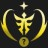
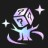
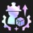

# Augment: silver, Count: 73
| key                      | name                   | icon                                                                    | desc                                                                                                                                                                              |
| -                        | -                      | -                                                                       | -                                                                                                                                                                                 |
| ArmyBuilding             | Team Building          |                          | Gain a Lesser Champion Duplicator. Gain another after 5 player combats.  This item allows you to copy a 3-cost or less champion.                                            |
| AugmentedPower           | Augmented Power        |                      | Your next augment is one tier higher.                                                                                                                                             |
| BandofThievesI           | Band of Thieves        |                      | Gain 1 Thief's Gloves.                                                                                                                                                            |
| BardPlaybook1            | Caretaker's Ally       |                        | Gain a random 2-cost champion now. Gain the same one again every time you level up.  Champion: ???                                                                          |
| BestFriends1             | Best Friends I         |                          | Allies isolated in pairs gain 10% Attack Speed and 10 Armor at the start of combat.                                                                                               |
| BigFriend                | Big Friend I           |                                | Allies that start combat next to an ally with over 1750 Health gain 10% Durability.                                                                                               |
| BloodBank                | Lunch Money            |                                | Every 7 damage you deal to enemy tacticians gives you 2 gold. Total Payouts: ? Gold                                                                                            |
| BranchingOut             | Branching Out          |                          | Gain a random Emblem.                                                                                                                                                             |
| BranchingOutPlus         | Branching Out+         |                  | Gain a random Emblem and a Reforger.  Reforgers allow you to remake any item.                                                                                               |
| CalledShot               | Called Shot            |                              | Set your win streak to 4. Gain 4 gold.                                                                                                                                            |
| CelestialBlessing1       | Celestial Blessing I   |              | Your team gains 12% Omnivamp. Excess healing is converted to a shield up to 200 Health.                                                                                           |
| ChaoticEvolution         | Chaotic Evolution      |                  | Starring up a champion grants them one of the following: 100 Health, 6% Durability, 10% Ability Power, 10% Attack Damage, 10% Attack Speed. Bonuses stack.                        |
| Commander_RollingForDays | Rolling For Days I     |  | Gain 10 free Shop rerolls.                                                                                                                                                        |
| Corrosion                | Corrosion              |                                | Enemy champions in the first two rows lose 4 Armor and Magic Resist every 2 seconds.                                                                                              |
| CraftedCrafting          | Crafted Crafting       |                    | Whenever you craft a completed item, gain 2 rerolls.                                                                                                                              |
| CustomerIsAlwaysRight    | Component Buffet       |        | Whenever you would get a component, gain a component anvil instead. Gain a random component now.  The anvil offers 4 choices.                                               |
| Distancing               | Exiles I               |                              | Your champions that start combat with no adjacent champions gain a 20% max Health shield for 10 seconds.                                                                          |
| Diversify1               | Stand United           |                              | Gain 1.5% Attack Damage and 1.5% Ability Power for each non-unique Trait active across your team.  Current Bonus: ?% %i:scaleAD% ?% %i:scaleAP%                             |
| DravenSpoilsOfWar        | Spoils of War I        |                | Enemies have a 25% chance to drop loot when killed.                                                                                                                               |
| Dummify                  | Dummify                |                                    | Lose all champions on your board and bench. Gain a Training Dummy with 80% of their combined health. The dummy gains 1200 Health per stage.                                       |
| EfficientShopper         | Efficient Shopper      |                  | For the next 4 carousels, gain a second copy of the champion taken.                                                                                                               |
| EyeForAnEye              | Eye For An Eye         |                            | For every 15 ally champions that die, gain a random component (max 3).  Deaths Remaining: ?                                                                                 |
| EyeForAnEyeplus          | Eye For An Eye+        |                    | Gain a random component. For every 18 ally champions that die, gain another component (max 2).  Deaths Remaining: ?                                                         |
| FindYourCenter           | Find Your Center       |                      | Your champion that starts combat in the center of the front row gains 15% Damage Amp and 15% max Health.                                                                          |
| Firesale                 | Firesale               |                                  | Each round, steal a random 3-cost or lower champion from the shop. Gain 1 gold.                                                                                                   |
| GlassCannonI             | Glass Cannon I         |                          | Allies that start combat in the back row begin combat at 80% Health but gain 17% Damage Amp.                                                                                      |
| GoodForSomethingSilver   | Good For Something I   |      | Champions that aren't holding items have a 50% chance to drop 1 gold on death.                                                                                                    |
| HeadStart                | Delayed Start          |                                | Sell your board and bench. Gain 4 random 2-star 1-cost champions. Disable your Shop for the next 3 rounds.                                                                        |
| HealingOrbsI             | Healing Orbs I         |                          | When an enemy dies, the nearest ally is healed for 220.                                                                                                                           |
| IronAssets               | Iron Assets            |                              | Gain a component anvil and 3 gold.                                                                                                                                                |
| ItemGrabBag1             | Item Grab Bag          |                          | Gain 1 random completed item.                                                                                                                                                     |
| LategameSpecialist       | Late Game Specialist   |              | When you reach Level 9, gain 36 gold.                                                                                                                                             |
| Lineup                   | Lineup                 |                                      | Your team gains 2 Armor and Magic Resist for each ally that starts combat in the front two rows.                                                                                  |
| LongTimeCrafting         | Latent Forge           |                  | After 8 player combats, gain an Artifact anvil.  The anvil offers 4 choices. Artifacts are more powerful items with a unique effect.                                        |
| MakeshiftArmor1          | Makeshift Armor I      |                    | Allies without items equipped gain 30 Armor and Magic Resist.                                                                                                                     |
| MissedConnections        | Missed Connections     |                | Gain a copy of each 1-cost champion.                                                                                                                                              |
| OnARoll                  | On a Roll              |                                    | Whenever you star up a champion that you fielded last combat, gain 2 free Shop rerolls. Gain 2 gold.                                                                              |
| OneTwoFive               | One, Two, Five!        |                              | Gain 1 random component, 2 gold, and 1 random 5-cost champion.                                                                                                                    |
| OneTwosThree             | One Twos Three         |                          | Gain 1 1-cost champion, 2 2-cost champions, and 1 3-cost champion.                                                                                                                |
| PandorasItems            | Pandora's Items        |                        | Round start: items on your bench are randomized.  Gain 1 random component.                                                                                                  |
| PatienceIsaVirtue        | Patience is a Virtue   |                | Each round, gain 2 free rerolls if you did not buy a champion last round.                                                                                                         |
| Placebo                  | Placebo                |                                    | Your team gains 1% Attack Speed. Gain 8 gold.                                                                                                                                     |
| PlaceboPlus              | Placebo+               |                            | Your team gains 1% Attack Speed. Gain 14 gold.                                                                                                                                    |
| Preparation              | Preparation I          |                            | Champions on your bench permanently gain 30 Health, 3% Attack Damage, and 3% Ability Power every round. Champions start with 1 stack of this effect, and can stack up to 4 times. |
| Recombobulator           | Recombobulator         |                      | Champions on your board permanently transform into random champions 1 cost tier higher (max 5). Gain 2 Magnetic Removers.                                                         |
| RestartMission           | Restart Mission        |                      | Remove all champions on your board and bench. Gain 2 random 2-star 3-costs, 3 2-star 2-costs, and 1 2-star 1-cost champion.                                                       |
| RiskyMoves               | Risky Moves            |                              | Your Tactician loses 20 Health, but after 7 player combats, gain 30 gold.                                                                                                         |
| SecondWind1              | Second Wind            |                            | After 10 seconds of combat, your team heals 40% of their missing Health.                                                                                                          |
| SilverDestiny            | Silver Destiny         |                        | Gain a random Silver Augment and 2 gold.                                                                                                                                          |
| SilverDestinyPlus        | Silver Destiny+        |                | Gain a random Silver Augment and 4 gold.                                                                                                                                          |
| SilverSpoon              | Silver Spoon           |                            | Gain 10 XP.                                                                                                                                                                       |
| SliceofLife              | Slice of Life          |                            | Twice per stage, gain a random champion. Its cost increases by Stage. This effect ends after receiving 1 5-cost champion.                                                         |
| Survivor                 | Survivor               |                                  | Gain 4 gold. After 3 players are eliminated, gain 100 more gold.                                                                                                                  |
| TableScraps              | Table Scraps           |                            | After the next 2 carousels, gain one champion that was not taken and its item. Gain 1 gold.                                                                                       |
| TeamingUpI               | Teaming Up             |                              | Gain 1 random component and 2 random 3-cost champions.                                                                                                                            |
| TitanicTitan             | Titanic Titan          |                          | Increase your current and max player Health by 25. On carousel rounds you are released earlier, but are much slower.                                                              |
| AirAxiom                 | Air Axiom              |                                  | Gain an Air Hex. Champions within gain 25% Attack Speed and their damage 30% Sunders enemies for 5 seconds.                                                                       |
| ArtilleryBarrage         | Artillery Barrage      |                  | Gain a Rumble. Your strongest Rumble gains +7 Range and constantly fires missiles at enemies, increased with Attack Speed.                                                        |
| BoxingLessons            | Boxing Lessons         |                        | Your team gains 30 Health for each ally that starts combat in the front row.                                                                                                      |
| CarveAPath               | Carve a Path           |                              | Gain a B.F. Sword. After your team deals 65000 physical damage, gain 2 more.  Damage dealt: ?                                                                               |
| ContinuousConjuration    | Continuous Conjuration |        | Gain a Needlessly Large Rod. After your team deals 38000 magic damage, gain 2 more.  Damage dealt: ?                                                                        |
| CriticalSuccess          | Critical Success       |                    | Gain a Sparring Glove. After your team's attacks critically strike 320 times, gain 2 more.  Critical strikes: ?                                                             |
| EarthAxiom               | Earth Axiom            |                              | Gain an Earth Hex. Champions within gain 30 Armor and Magic Resist. At 50% Health, they Stun enemies within 2 hexes for 1.5 seconds.                                              |
| ExtraBuckles             | Extra Buckles          |                          | Gain a Giant's Belt. After your team takes 75000 damage, gain 2 more.  Damage taken: ?                                                                                      |
| FireAxiom                | Fire Axiom             |                                | Gain a Fire Hex. Champions within gain 15% Attack Damage and Ability Power. Their damage 1% Burns and 33% Wounds for 6 seconds.                                                   |
| FlowingTears             | Flowing Tears          |                          | Gain a Tear of the Goddess. After your team spends 6500 Mana, gain 2 more.  Mana spent: ?                                                                                   |
| FocusedFire              | Focused Fire           |                            | Your team gains 5% Attack Damage. Every 5 seconds, they gain 5% more.                                                                                                             |
| LeapofFaith              | Leap of Faith          |                            | Gain an Illaoi. Your strongest Illaoi becomes a Fighter. Her Ability is replaced with an airborne slam that's recast when she kills her target.                                   |
| BackupBows               | Backup Bows            |                              | Gain a Recurve Bow. After your team attacks 1000 times, gain 2 more.  Attacks: ?                                                                                            |
| SlightlyMagicRoll        | Slightly Magic Roll    |                | Roll a die. Gain rewards based on the number rolled.  Reward: ???                                                                                                           |
| SmallGrabBag             | Small Grab Bag         |                          | Gain 2 random item components.                                                                                                                                                    |
| TwinGuardians            | Twin Guardians         |                        | If you have exactly 2 allies in your first row, grant them 50 Armor and 50 Magic Resist.                                                                                          |
| WaterAxiom               | Water Axiom            |                              | Gain a Water Hex. Champions within gain 3 Mana Regen. Their damage 30% Shreds enemies for 5 seconds.                                                                              |
# Augment: gold, Count: 132
| key                     | name                     | icon                                                                  | desc                                                                                                                                                                                                               |
| -                       | -                        | -                                                                     | -                                                                                                                                                                                                                  |
| AMagicRoll              | A Magic Roll             |                            | Roll 3 dice. Gain rewards based on their total.  Reward: ???                                                                                                                                                 |
| AuraFarming             | Aura Farming             |                          | Gain a 2-star 5-cost champion holding a recommended item. You cannot field it until Stage 4-5.                                                                                                                     |
| BestFriends2            | Best Friends II          |                        | Allies isolated in pairs gain 15% Attack Speed and 18 Armor at the start of combat.                                                                                                                                |
| BigGrabBag              | Big Grab Bag             |                            | Gain 3 random components, 2 gold, and 1 Reforger.  Reforgers allow you to remake any item.                                                                                                                   |
| BronzeForLifeI          | Bronze For Life I        |                    | Your team gains 2.5% Damage Amp for each Bronze-tier trait.  Damage Amp Bonus: ?%                                                                                                                            |
| CalculatedLoss          | Calculated Loss          |                    | After losing your combat, gain 2 gold and a free Shop reroll.                                                                                                                                                      |
| CarePackage             | Care Package             |                          | Now and at the start of the next 2 Stages, receive a care package with loot and 3 gold.                                                                                                                            |
| CelestialBlessing2      | Celestial Blessing II    |            | Your team gains 18% Omnivamp. Excess healing is converted to a shield up to 400 Health.                                                                                                                            |
| ClearMind               | Clear Mind               |                              | If there are no champions on your bench at the end of player combat, gain 3 XP.                                                                                                                                    |
| ClutteredMind           | Cluttered Mind           |                      | Gain 4 random 1-cost champions now. If your bench is full at the end of player combat, gain 3 XP.                                                                                                                  |
| Commander_Ascension     | Ascension                |          | After 12 seconds of combat, gain 45% Damage Amp.                                                                                                                                                                   |
| CookingPot              | Cooking Pot              |                            | At the start of each turn, all allies holding a Frying Pan or Spatula item grant the nearest champion 50 permanent Health. Gain a Frying Pan.                                                                      |
| CrashTestDummies        | Crash Test Dummies       |                | Gain 2 Training Dummies. Combat start: Your Training Dummies launch themselves towards a group of enemies and Stun them for 1.75 seconds.                                                                          |
| CrownsWill              | Crown's Will             |                            | Gain a Needlessly Large Rod. Your team gains 12 Ability Power and 10 Armor.                                                                                                                                        |
| CryMeARiver             | Cry Me A River           |                          | Gain a Tear of the Goddess. Your team gains 1 Mana Regen. After 12 seconds in combat, increase this to 3.                                                                                                          |
| Distancing2             | Exiles II                |                          | Your champions that start combat with no adjacent champions gain a 30% max Health shield for 10 seconds.                                                                                                           |
| DravenSpoilsOfWar2      | Spoils of War II         |            | Enemies have a 30% chance to drop loot when killed.                                                                                                                                                                |
| DuoQueue                | Duo Queue                |                                | Gain 2 random 5-cost champions and 2 copies of a random component.                                                                                                                                                 |
| Epoch                   | Epoch                    |                                      | Now, and at the start of every stage, gain 4 XP and 3 free rerolls.                                                                                                                                                |
| Epochplus               | Epoch+                   |                              | Now, and at the start of every stage, gain 8 XP and 3 free rerolls.                                                                                                                                                |
| ExclusiveCustomization  | Exclusive Customization  |    | Gain a Lucky Item Chest and a Magnetic Remover and 10 gold.  Use a Lucky Item Chest on a champion to choose from an armory of recommended items!                                                             |
| ExplosiveGrowth         | Explosive Growth         |                  | Now and at the start of the next 3 rounds, gain 7 XP.                                                                                                                                                              |
| ExplosiveGrowthPlus     | Explosive Growth+        |          | Now and at the start of the next 3 rounds, gain 10 XP.                                                                                                                                                             |
| ForwardThinking         | Forward Thinking         |                  | Lose all your gold. After 5 player combats, gain back the original amount and another 70 gold.  Incoming Gold: ?                                                                                             |
| GlassCannonII           | Glass Cannon II          |                      | Allies that start combat in the back row begin combat at 80% Health but gain 30% Damage Amp.                                                                                                                       |
| GoldDestiny             | Gold Destiny             |                          | Gain a random Gold Augment and 3 gold.                                                                                                                                                                             |
| GoldDestinyPlus         | Gold Destiny+            |                  | Gain a random Gold Augment and 6 gold.                                                                                                                                                                             |
| Golemify                | Golemify                 |                                | Lose all champions on your board and bench. Gain a Golem with 60% of their combined Health and 50% of their combined Attack Damage. The Golem gains 1000 Health per stage.                                         |
| HardBargain             | Hard Bargain             |                          | You cannot choose your Carousel rewards. Gain an additional 6 player Health and 10 Gold each carousel round. When you do not pick a Carousel Reward, you are given an unpicked champion and the item it carries |
| HealingOrbsII           | Healing Orbs II          |                      | When an enemy dies, the nearest ally is healed for 440.                                                                                                                                                            |
| HeavyIsTheCrown         | Heavy Is the Crown       |                  | Gain a Crown of Demacia, which provides significant bonuses to the wearer. If the holder dies, lose the round.                                                                                                     |
| HeftyRolls              | Hefty Rolls              |                            | Your team gains 9 Health and size for each time you've rolled this game.  Rolls: ? Health: ?                                                                                                                 |
| Heroicgrabbag           | Heroic Grab Bag          |                      | Gain 2 Lesser Champion Duplicators and 5 gold.  This item allows you to copy a 3-cost or less champion.                                                                                                      |
| HeroicgrabbagPlus       | Heroic Grab Bag+         |              | Gain 2 Lesser Champion Duplicators and 8 gold.  This item allows you to copy a 3-cost or less champion.                                                                                                      |
| HeroicgrabbagPlusPlus   | Heroic Grab Bag++        |      | Gain 2 Lesser Champion Duplicators and 14 gold.  This item allows you to copy a 3-cost or less champion.                                                                                                     |
| HighVoltage             | High Voltage             |                          | Gain an Ionic Spark. Your Ionic Sparks have +3 hex radius and do 20% more damage.                                                                                                                                  |
| HyperRoll               | Hustler                  |                              | You no longer gain interest but gain 3 gold at the start of every player combat round. Gain 6 gold now.  Interest is extra gold you gain per 10g saved.                                                      |
| JeweledLotus            | Jeweled Lotus I          |                        | Your team gains 20% Critical Strike Chance, and their Abilities can critically strike.                                                                                                                             |
| KnowYourEnemy           | Know Your Enemy          |                      | You can see who you will fight next. Your team gains 8% Damage Amp, increased to 15% if you and your opponent have any of the same traits active.                                                                  |
| LastSecondSave          | Last Second Save         |                    | The first time each ally falls below 35% Health, they restore 20% maximum Health.                                                                                                                                  |
| LearningFromExperience2 | Patient Study            |  | After player combat, gain 2 XP if you won or 3 XP if you lost.                                                                                                                                                     |
| LittleBuddies           | Little Buddies           |                      | Your 4-cost and 5-cost champions gain 55 Health and 6% Attack Speed for every 1-cost and 2-cost champion on your board.                                                                                            |
| MacesWill               | Mace's Will              |                              | Gain a Sparring Gloves. Your team gains 8% Attack Speed and 20% Critical Strike Chance.                                                                                                                            |
| MakeshiftArmor2         | Makeshift Armor II       |                  | Allies without items equipped gain 45 Armor and Magic Resist.                                                                                                                                                      |
| MaliciousMonetization   | Malicious Monetization   |      | Gain 2 gold. For the next 3 rounds, enemy champions drop 2 gold when killed.                                                                                                                                       |
| MessHall                | Mess Hall                |                                | After 10 seconds of combat, your champions gain 8% Attack Speed and attacks also hurl 2 delicious projectiles that deal 25(%i:scaleAD%%i:scaleAP%) magic damage.                                                   |
| NOSCOUTNOPIVOT          | NO SCOUT NO PIVOT        |                    | Champions that fight in player combat cannot be benched or sold. Your team gains 1% Health, and 1.5% Attack Damage and Ability Power after player combat.                                                          |
| PairofFours             | Pair of Fours            |                          | If your team has exactly 2 4-cost champions, they each gain 504 Health and 28.4% Attack Speed. Gain a random 4-cost.                                                                                               |
| PandorasBench           | Pandora's Bench          |                      | At the start of every round, champions on the 3 rightmost bench slots transform into random champions of the same cost. Gain 6 gold.                                                                               |
| PandorasItems2          | Pandora's Items II       |                    | Round start: items on your bench are randomized.  Gain 2 random components.                                                                                                                                  |
| Pilfer                  | Pilfer                   |                                    | Each round, gain a 1-star copy of the first champion you killed last combat. The first time you gain 35 gold worth of champions in this way, gain a Thief's Gloves.                                                |
| PlotArmor               | Plot Armor               |                              | Your team gains 8 Armor and Magic Resist. After falling below 50% Health, increase this to 40 for the rest of combat.                                                                                              |
| PortableForge           | Portable Forge           |                      | Choose 1 of 4 Artifacts.  Artifacts are more powerful items with a unique effect.                                                                                                                            |
| PreparationII           | Preparation II           |                      | Champions on your bench permanently gain 50 Health, 4% Attack Damage, and 4% Ability Power every round. Champions start with 1 stack of this effect, and can stack up to 4 times.                                  |
| Prizefighter            | Prizefighter             |                        | Gain 2 item components. Every 5 wins gives you an item component.                                                                                                                                                  |
| Pyromaniac              | Pyromaniac               |                            | Gain a Red Buff. Your Burns deal 50% increased damage.                                                                                                                                                             |
| RainingGold             | Raining Gold             |                          | Gain 7 gold now and 1 gold every round.                                                                                                                                                                            |
| ReinFOURcement          | ReinFOURcement           |                    | The next 4-cost champion you buy with gold is instantly upgraded to 2-star. Gain 5 gold.                                                                                                                           |
| Replication             | Replication              |                          | Choose 1 of 3 components. For the next 2 rounds, gain a copy of that component.                                                                                                                                    |
| SalvageBin              | Salvage Bin              |                            | Gain 1 random completed item now, and 1 component after 8 player combats. Selling champions breaks completed items into components (excluding Tactician's items and Emblems).                                      |
| SalvageBinPlus          | Salvage Bin+             |                    | Gain 1 random completed item now, and 1 component after 4 player combats. Selling champions breaks completed items into components (excluding Tactician's items and Emblems).                                      |
| Slammin                 | Slammin'                 |                                  | Gain 1 random component(s). After each player combat, if there are no items on your bench (other than consumables), gain 2 XP.                                                                                     |
| Slamminplus             | Slammin'+                |                          | Gain 1 random component(s) and 10 XP now. After each player combat, if there are no items on your bench (other than consumables), gain 2 XP.                                                                       |
| SoloLeveling            | Solo Leveling            |                        | For the next 5 combats, your team size is 1 but the champion you field has massively increased stats. Gain 1 XP for every kill they get. Afterwards, gain 2 item components.                                       |
| SpearsWill              | Spear's Will             |                            | Your team gains 12% Attack Damage and 5 Mana. Gain a B.F. Sword.                                                                                                                                                   |
| SpiritLink              | Spirit Link              |                            | Champions restore 5% of their max Health every 4 seconds. Increase the healing by 0.5% for every 10 missing player Health.                                                                                         |
| StarsAreBorn            | Stars Are Born           |                        | The first 1-cost and 2-cost champions you buy are instantly upgraded to 2-star. Gain 7 gold.                                                                                                                       |
| ThornPlatedArmor        | Thorn-Plated Armor       |                | Gain a Bramble Vest. Your Bramble Vests deal 20-170% more damage (based on Stage).                                                                                                                                 |
| TonsOfStats             | Tons of Stats!           |                          | Your team gains 44 Health, 4% Attack Damage, 4% Ability Power, 4 Armor, 4 Magic Resist, 4% Attack Speed, and 4 Mana.                                                                                               |
| TradeSector             | Trade Sector             |                          | Gain a free Shop reroll every round. Gain 4 gold.                                                                                                                                                                  |
| TreasureHunt            | Treasure Hunt            |                        | Gain a locked chest each Stage between now and Stage 6. Unlock each chest when you spend 20 gold on Shop rerolls. These chests persist until opened.                                                               |
| TrifectaI               | Trifecta I               |                              | Gain 2 3-cost champions. Combat Start: 3 random 3-cost champions gain 220 Health and 20% Attack Speed.                                                                                                          |
| Twins2                  | Double Trouble           |                                    | When you field exactly 2 copies of a champion, they both gain 30% Attack Damage and 30% Ability Power, Armor, and Magic Resist. When you 3-star, gain a 2-star copy.                                               |
| TwoMuchValue            | Two Much Value           |                        | Gain 1 reroll for every 2 unique 2-cost champions fielded last player combat. Gain 2 2-cost champions.                                                                                                             |
| TwoTrick                | Two Trick                |                                | Gain a random 2-star 2-cost and 2 random 2-star 1-cost champions.                                                                                                                                                  |
| Warpath                 | Warpath                  |                                  | Gain a 2-star 2-cost champion. After dealing 80 player damage, gain a chest of high cost champions and items. (Current: ?)                                                                                      |
| WorththeWait            | Worth the Wait           |                        | Gain a random 1-cost champion. Gain another copy of them at the start of each round for the rest of the game.  Champion: ???                                                                                 |
| 3Threes                 | 3 Threes                 |                                  | Gain 3 random 2-star 3-cost champions and 3 gold.                                                                                                                                                                  |
| AdvancedLoan            | Advanced Loan            |                        | Gain 20 Gold. Your next augment is one tier lower.                                                                                                                                                                 |
| AdvancedLoanPlus        | Advanced Loan+           |                | Gain 33 Gold. Your next augment is one tier lower.                                                                                                                                                                 |
| ArcaneViktory           | Arcane Viktor-y          |                      | After 8 seconds of combat, stun the enemy team for 1.5 seconds. Repeat this after 20 seconds of combat.  TFT Macao Open, 2024                                                                                |
| BandleBounty            | Bandle Bounty I          |                        | For every Yordle you've unlocked or unlock, gain 2 gold. The Bandle Paths reveal a secret Yordle 10. Gain a Rumble and Lulu.                                                                                       |
| BirthdayReunion         | Birthday Reunion         |                  | Gain a random 2-star 2-cost champion. When you reach Level 7, gain a Thief's Gloves. When you reach Level 9, gain a random 2-star 5-cost champion.  Inkborn Fables Tactician's Crown, 2024                   |
| BloodOffering           | Blood Offering           |                      | Gain a Bloodthirster. Combat start: Allies holding Bloodthirsters lose 20% Health but gain a 30% Health shield and 10% Attack Damage.                                                                              |
| BodyguardTraining       | Bodyguard Training       |              | Allies gain 10 Armor and Magic Resist, increased by 3 per player level.  Gizmos & Gadgets Championship, 2022                                                                                                 |
| BringerofRuin           | Bringer of Ruin          |                      | Every takedown Atakhan scores permanently grants him 1% Ability Power and 40 max Health. Gain a Briar and a Sion. (Current Takedowns: ?)                                                                        |
| ChaosMagic              | Chaos Magic              |                            | Arcanists gain 1 Mana Regen. After every 150 Mana they spend, a magical effect hits the board. Gain a Lulu and a Kog'Maw.                                                                                          |
| DarkwillsInvasion       | Darkwill's Invasion      |              | Your team gains 10% Damage Amp, increased to 15% if the Noxus trait is active.                                                                                                                                     |
| DefenseofthePlacidium   | Defense of the Placidium |      | Your team gains 8% Durability, increased to 12% if the Ionia trait is active.                                                                                                                                      |
| EarlyLearnings          | Early Learnings          |                    | Your team gains 8% Attack Damage & Ability Power. This increases by 1% after each player combat. 1-cost champions gain double.  TFT Vegas Open, 2023                                                         |
| EpicRolldown            | Epic Rolldown            |                        | When you reach Level 8, gain 20 Shop rerolls.  Runeterra Reforged Championship, 2023                                                                                                                         |
| EvolveandOvercome       | Evolve and Overcome      |              | For every 5 enemies that Mutated Void allies takedown, gain 2 XP. Gain a Cho'Gath and a 2-star Kog'Maw.  Void provides unique Mutations.                                                                     |
| FeedtheFlames           | Feed the Flames          |                      | Gain a Sunfire Cape. Your team gains 12% Omnivamp when attacking Burning enemies.                                                                                                                                  |
| Gain21Gold              | Gain ? Gold              |                            | Gain 21 gold.                                                                                                                                                                                                      |
| HeartofSteel            | Heart of Steel           |                        | Gain a Steadfast Heart. Every 10 seconds of combat its holder survives, Steadfast Heart gains additional 12 permanent max Health.                                                                                  |
| HexgateTravel           | Hexgate Travel           |                      | When the Piltover invention triggers for the first time each combat, gain a random number of Piltover champions that cost between 1 and 3 gold. Gain a Caitlyn and a Vi.                                           |
| IndecisionI             | Indecision I             |                          | In 3 rounds, choose a new augment of the same tier. Gain 5 gold now.                                                                                                                                               |
| IndiscriminateKiller    | Indiscriminate Killer    |        | Gain a Giant Slayer. Giant Slayers gain their Damage Amp against all enemies instead of just Tanks.                                                                                                                |
| InfinityProtection      | Infinity Protection      |            | Gain 4 gold now. On Stage 3-7, gain an Infinity Force. Infinity Force gives allies in the same row a 15% Health shield.  Monsters Attack Championship, 2023                                                  |
| Kahunahuna              | Kahunahuna               |                            | Every 5th attack deals bonus true damage equal to 200% Basic Attack Damage.                                                                                                                                        |
| LateGameScaling         | Late Game Scaling        |                  | Gain 2 XP at the start of player combat rounds. Your 5-cost champions gain 12% Health and 12% Attack Speed.  CyberCity Tactician's Crown, 2025                                                               |
| LegionofThrees          | Legion of Threes         |                    | Gain a random Emblem. Your 3-cost champions and all allies equipped with an Emblem gain 200 Health and 12% Attack Speed.  Reckoning Championship, 2021                                                       |
| LiftingCompetition      | Lifting Competition      |            | At the start of each round, if the combined Health of all your unique Bruisers is high enough, gain a reward and increase the threshold (up to four times). Gain a Shen and a Sion.  Easy Lift:? / 3500      |
| MaxBuild                | Max Build                |                                | Gain 10 free Shop rerolls. On Stage 4-5 and 6-1, gain a Champion Duplicator.  Galaxies Championship, 2020                                                                                                    |
| PoisonPals              | Poison Pals              |                            | Gain a 2-star Teemo. Singed's damage refreshes Teemo's poisons, and every 100 magic damage Teemo deals grants your strongest Singed 2% Ability Power. Gain a Teemo after each player combat.                       |
| PrecisionandGrace       | Precision and Grace      |              | At the start of combat, allies gain 25% Attack Speed for 3 seconds. On takedown, allies dash to their next target and gain this bonus again.                                                                       |
| PromisedProtection      | Promised Protection      |            | Gain a Protector's Vow. Protector's Vow grants its holder 18% additional Mana from all sources.                                                                                                                    |
| RuinedKing              | The Ruined King          |                            | Gain a 2-star Viego. Your strongest Viego shares 30% of his Passive with other Shadow Isles allies. After collecting 100 souls, his Ability upgrades.                                                              |
| SavingsAccount          | Savings Account          |                    | After you earn 50 gold in interest, gain 30 gold. Your max interest is increased to 7. Gain 4 gold now.  Gold earned: ?                                                                                      |
| SeraphimsStaff          | Seraphim's Staff         |                    | Gain an Archangel's Staff. Archangel's Staff grants 2 additional Mana Regen if its holder has 90% or more Ability Power.                                                                                           |
| SoloPlate               | Solo Plate               |                              | Gain a Gargoyle Stoneplate. Combat start: Allies holding Gargoyle Stoneplate gain 15% max Health if they're the only one in their row.                                                                             |
| SilcosRevenge           | Silco's Revenge          |                      | Zaunites explode into Shimmer on death, dealing 30% of their max Health to 2 nearby enemies as magic damage. Gain a Blitzcrank, an Ekko, and a Vi.                                                                 |
| SpeedyDoubleKill        | Speedy Double Kill       |                | Gain a Guinsoo's Rageblade. When 2 players are eliminated, gain 40 gold.  Fates Championship, 2021                                                                                                           |
| SpiritofRedemption      | Spirit of Redemption     |            | Gain a Spirit Visage. Every 5 seconds, Spirit Visage heals allies within 1 hex for 7.5% of their missing Health.                                                                                                   |
| SpreadingRoots          | Spreading Roots          |                    | Gain 2 random Emblems and 1 gold.                                                                                                                                                                                  |
| SpreadingRootsPlus      | Spreading Roots+         |            | Gain 2 random Emblems, a Reforger, and 2 gold.                                                                                                                                                                     |
| Staffsmith              | Staffsmith               |                            | Gain 2 random completed items that build from Needlessly Large Rod.                                                                                                                                                |
| Swordsmith              | Swordsmith               |                            | Gain 2 random completed items that build from B.F. Sword.                                                                                                                                                          |
| TheGoldenDragon         | The Golden Dragon        |                  | Gain a Mogul's Mail. Champions holding Mogul's Mail take up 2 team slots but gain 700 Health and 20% Durability.  Mogul's Mail gives gold as well as combat power. Dragonlands Championship, 2022         |
| URF                     | U.R.F                    |                                          | Gain a Spatula. Champions holding Spatula or Frying Pan items gain 15% Attack Speed and 2 Mana Regen.                                                                                                              |
| TrialsofTwilight        | Trials of Twilight       |                | Gain 2 Xin Zhao. Your strongest Xin Zhao constantly strikes nearby enemies and executes enemies. After 5 player combats as a 3-star, unlock Zaahen. He replaces Xin Zhao and takes his items.                      |
| UnsealedFromSteel       | Unsealed From Steel      |              | Choose 1 of 4 Darkin Weapons. Darkin Weapons are Artifacts that grant the Darkin trait.                                                                                                                            |
| UrfsGambit              | Urf's Gambit             |                            | If you win your next player combat, gain a Spatula. If you lose, gain a Frying Pan. Gain a component anvil and 6 gold now.                                                                                         |
| WarlordsHonor           | Warlord's Honor          |                      | Every round, your team gain 5% Attack Damage and Ability Power, stacking up to 4 times.                                                                                                                            |
| WalkTheTruePath         | Walk The True Path I     |                  | Gain a Lesser Champion Duplicator, a Shen, a Jhin, and 6 gold. Ionia 10 gains a Prismatic upgrade.                                                                                                                 |
| WildGrowth              | Wild Growth              |                            | 3-star Yordles become massive, moving slower but gaining 15% Health and 35% Attack Damage and Ability Power. Gain a Rumble and Lulu.                                                                               |
| WovenMagic              | Woven Magic              |                            | Gain a random item component. Every 2200 Mana your team spends grants an additional component (max ?/3).  Mana spent: ?/2200                                                                                 |
| ConstructaCompanion     | Construct a Companion    |          | The next 1-cost champion you buy is 3 star. Gain 2 gold.                                                                                                                                                           |
| DemaciaForever          | Demacia Forever          |                    | Demacians gain 3 permanent Health every time they rally. They also gain 1.5% permanent Attack Damage and Ability Power every 3 rallies. Gain a Jarvan IV, a Sona, and a Xin Zhao.                                  |
| IxtalExpeditionist      | Ixtal Expeditionist      |            | Gain a Qiyana, a Neeko, and a Milio. Increase your current and max player Health by 10.                                                                                                                            |
| CosmicCalling           | Cosmic Calling           |                      | Gain a Spear of Shojin and a Leona. On Stage 3-7, gain a Taric.                                                                                                                                                    |
| GildedSteel             | Gilded Steel             |                          | Gain 3 non-Tank 5-cost champions. If you field a 5-cost champion, your 1 to 4-cost champions gain 8% Durability.  K.O. Coliseum Championship, 2025                                                           |
# Augment: prismatic, Count: 74
| key                         | name                    | icon                                                                          | desc                                                                                                                                                                                                                      |
| -                           | -                       | -                                                                             | -                                                                                                                                                                                                                         |
| BandOfThieves2              | Band of Thieves II      |                            | Gain 2 Thief's Gloves. After 8 player combats, gain another.                                                                                                                                                              |
| BeltOverflow                | Belt Overflow           |                                | Gain 4 Giant's Belts. Your Giant's Belts grant +85 bonus Health.                                                                                                                                                          |
| BinaryAirdrop               | Binary Airdrop          |                              | Combat start: Champions holding 2 items gain a random 3rd completed item. Gain 2 random component now.                                                                                                                    |
| BirthdayPresents            | Birthday Present        |                        | Gain a 2-star champion and 1 gold every time you level up. The champion's cost tier is your level minus 4 (max: 5-cost).                                                                                                  |
| BronzeForLifeII             | Bronze For Life II      |                          | Your team gains 2.5% Damage Amp and 4 Armor and Magic Resist for each Bronze-tier trait.  Damage Amp: ?% Armor and Magic Resist: ?                                                                               |
| BuildingACollectionPlusPlus | Buried Treasures        |  | Gain a random item component now and at the start of the next 5 rounds.                                                                                                                                                   |
| CalltoChaos                 | Call to Chaos           |                                  | Gain a powerful and random reward.  Reward: ???                                                                                                                                                                     |
| CelestialBlessing3          | Celestial Blessing III  |                    | Your team gains 25% Omnivamp. Excess healing is converted to a shield up to 1000 Health.                                                                                                                                  |
| Coronation                  | Coronation              |                                    | Gain a Tactician's Crown. Tactician's Crown, Shield, and Cape grant the holder an additional 20% Attack Speed, 25% Attack Damage, and 30% Ability Power.                                                                  |
| CursedCrown                 | Cursed Crown            |                                  | Gain +2 max team size and your team gains 4% Durability, but you take double player damage when you lose a player combat.                                                                                                 |
| DeadlierBlades              | Deadlier Blades         |                            | Gain a Deathblade. Deathblades permanently gain 1% Attack Damage whenever their holders score a takedown.                                                                                                                 |
| DeadlierCaps                | Deadlier Caps           |                                | Gain a Rabadon's Deathcap. Rabadon's Deathcaps permanently gain 1% Ability Power whenever their holders score a takedown.                                                                                                 |
| DravenSpoilsOfWar3          | Spoils of War III       |                    | Enemies have a 45% chance to drop loot when killed.                                                                                                                                                                       |
| ExpectedUnexpectedness      | Expected Unexpectedness |            | Now and at the start of the next 2 stages, roll 3 dice. Gain various rewards based on their total.                                                                                                                        |
| Flexible                    | Flexible                |                                        | Gain 1 random Emblem. At the start of every Stage, gain a random Emblem. Your team gains 40 Health for each Emblem they are holding.                                                                                      |
| GachaAddict                 | Prismatic Ticket        |                                  | Each time your Shop is rerolled, you have a 50% chance to gain a free reroll.                                                                                                                                             |
| GiantandMighty              | Giant and Mighty        |                            | Your team becomes large, gaining 200 Health and 10% max Health.                                                                                                                                                           |
| GoingLong                   | Going Long              |                                      | You no longer gain interest. Gain 15 gold now. Round start: gain 4 XP.  Interest is extra gold you gain per 10g saved.                                                                                              |
| GreaterJeweledLotus         | Jeweled Lotus II        |                  | Your team gains 25% Critical Strike Chance and 10% Critical Strike Damage, and their Abilities can critically strike.                                                                                                     |
| HardCommit                  | Hard Commit             |                                    | Gain a random Emblem. Now and at the start of each Stage, gain a 1-star champion of that trait with a cost equal to the Stage (max 5) and 7 gold.                                                                         |
| HedgeFund                   | Hedge Fund              |                                      | Gain 25 gold. Your max interest is increased to 10.  Interest is extra gold you gain per 10g saved.                                                                                                                 |
| HighEndSector               | Shopping Spree          |                              | When you level up, gain a number of free shop refreshes equal to your level+1. Gain 2 gold.                                                                                                                               |
| HoldTheLine                 | Hold the Line           |                                  | Allies in your back 2 rows gain 10% Ability Power and 9% Attack Damage for each ally that starts combat in your front row.                                                                                                |
| InvestedPlus                | Invested+               |                                | Gain 26 gold. After every combat, gain 1 Shop reroll for every 10 gold above 50 (max 80 gold).                                                                                                                            |
| InvestedPlusPlus            | Invested++              |                        | Gain 40 gold. After every combat, gain 1 Shop reroll for every 10 gold above 50 (max 80 gold).                                                                                                                            |
| LivingForge                 | Living Forge            |                                  | Gain an Artifact anvil now and after every 9 player combats.  Artifacts are more powerful items with a unique effect.                                                                                               |
| LuckyGloves                 | Lucky Gloves            |                                  | Thief's Gloves will always give your champions ideal items. Gain 2 Sparring Gloves.                                                                                                                                       |
| LuckyGlovesPlus             | Lucky Gloves+           |                          | Thief's Gloves will always give your champions ideal items. Gain 2 Sparring Gloves now, then another after 4 player combats.                                                                                              |
| MaxLevel10                  | Level Up!               |                                    | When you buy XP, gain an additional 2. Gain 12 immediately.                                                                                                                                                               |
| NineLives                   | Nine Lives              |                                      | Set your current and max player Health to 9. On combat loss, you only lose 1 health and gain loot. You can't gain health.                                                                                                 |
| OneBuffTwoBuff              | One Buff, Two Buff      |                            | Gain a Red Buff, a Blue Buff, and a Champion Duplicator.                                                                                                                                                                  |
| PandorasRadiantBox          | Pandora's Items III     |                    | Round start: items on your bench are randomized.  Gain 1 random Radiant item.                                                                                                                                       |
| PrismaticDestiny            | Prismatic Destiny       |                        | Gain a random Prismatic Augment and 4 gold.                                                                                                                                                                               |
| RadiantRelics               | Radiant Relics          |                              | Choose 1 of 5 Radiant items. Gain a Magnetic Remover.  Radiant items are very powerful versions of completed items.                                                                                                 |
| RollTheDice                 | Radiant Rascal          |                                  | Gain a Rascal's Gloves item. This equips 2 random Radiant items every round.  Radiant items are very powerful versions of completed items.                                                                          |
| ShimmerscaleEssence         | Shimmerscale Essence    |                  | Gain a Mogul's Mail. In 5 rounds, gain a Gamblers Blade.  These items give gold as well as combat power.                                                                                                            |
| StarterKit                  | Starter Kit             |                                    | Gain a 4-cost champion, a 2-star 1-cost champion that shares a trait with them, and 8 gold.  At the start of the next 2 stages, gain that 4-cost champion again.                                                    |
| SwordOverflow               | Sword Overflow          |                              | Gain 4 B.F. Swords. Your B.F. Swords grant +5% Attack Speed.                                                                                                                                                              |
| TacticiansKitchen           | Tactician's Kitchen     |                      | Gain a random Emblem. After 6 rounds, gain a Tactician's Cape.                                                                                                                                                            |
| TheGoldenEgg                | The Golden Egg          |                                | Gain a golden egg that hatches in 11 turns for a huge amount of loot. Winning player combat speeds up the hatch timer by an extra turn.                                                                                   |
| TiniestTitanPlus            | Tiniest Titan           |                        | Gain 2 player Health and 2 gold after every player combat. Your Tactician also moves faster. Gain 15 gold now.                                                                                                            |
| TinybutDeadly               | Tiny, but Deadly        |                              | Your team becomes small, gaining 30% Attack Speed and Movement Speed.                                                                                                                                                     |
| TrifectaII                  | Trifecta II             |                                    | Gain 3 3-cost champions. Allies gain 5% Attack Speed. Combat Start: 3 random 3-cost champions gain 300 Health and 25% Attack Speed.                                                                                    |
| UpwardMobility              | Upward Mobility         |                            | Buying XP costs 1 less. Gain 2 Health and 2 free rerolls whenever you level up.                                                                                                                                           |
| WandOverflow                | Wand Overflow           |                                | Gain 4 Needlessly Large Rods. Your Needlessly Large Rods grant +5% Attack Speed.                                                                                                                                          |
| WorththeWaitII              | Worth the Wait II       |                            | Gain 2 copies of a random 2-cost champion. Gain another copy of them at the start of each round for the rest of the game.  Champion: ???                                                                            |
| SecretsoftheSands           | Secrets of the Sands    |                      | Gain 6 gold. Gain an Azir on Stage 3-5. Each time you unlock a Shuriman, gain an ideal item for them.                                                                                                                     |
| WalkTheTruePathPlus         | Walk The True Path II   |                  | Gain 2 Lesser Champion Duplicators, a Jhin, a Shen, and an Infinity Edge. Ionia 10 gains a Prismatic upgrade.                                                                                                             |
| SoulAwakening               | Soul Awakening          |                              | Combat start: Your team gains 2% Attack Damage and Ability Power per second for 10 seconds. At max stacks, deal 12% bonus true damage.                                                                                    |
| BandofThievesIIPlus         | Band of Thieves II+     |                  | Gain 2 Thief's Gloves. After 6 player combats, gain another.                                                                                                                                                              |
| BandofThievesIIPlusPlus     | Band of Thieves II++    |          | Gain 2 Thief's Gloves. After 3 player combats, gain another.                                                                                                                                                              |
| ChosenWolves                | Chosen Wolves           |                                | Gain an Ambessa and a Kindred. When Kindred casts, Ambessa always gains their protection against death and gains Attack Damage while protected. When Ambessa casts, Wolf strikes all enemies hit, dealing reduced damage. |
| ComebackStory               | Comeback Story          |                              | Your team gains 5 Health and 0.4% Attack Speed per missing player Health.                                                                                                                                                 |
| CommerceCore                | Commerce Core           |                                | Gain 16 free Shop rerolls now and 2 every round for the rest of the game.                                                                                                                                                 |
| ComponentHeist              | Component Heist         |                            | After 4 player combats, gain 1 of every item component.                                                                                                                                                                   |
| Dragonguards                | Dragonguards            |                                | Gain a Shyvana and a 2-star Jarvan IV. When Jarvan casts, Shyvana gains Shield. When Shyvana casts, Jarvan jumps in and deals damage based on his Armor and Magic Resist. After every player combat, gain a Jarvan IV.    |
| ForgedinStrength            | Forged in Strength      |                        | Gain 1 random Artifact. When you drop below 35 Health, gain 3 more random Artifacts.  Remix Rumble Championship, 2023                                                                                               |
| GrowthMindset               | Growth Mindset          |                              | Gain 50 XP.                                                                                                                                                                                                               |
| IndecisionII                | Indecision II           |                                | In 3 rounds, choose a new augment of the same tier. Gain 8 gold now.                                                                                                                                                      |
| JustHit                     | Just Hit                |                                          | Gain a Champion Duplicator, 18 Shop rerolls, and 10 gold.                                                                                                                                                                 |
| LuxurySubscription          | Luxury Subscription     |                    | Gain a package containing a 5-cost champion, a 2-star 1-cost champion, and 5 gold.  At the start of the next 2 stages, gain the package again.                                                                      |
| MinMax                      | Min-Max                 |                                            | Gain a Golden Item Remover and 4 random components.  Golden Item Remover is a Magnetic Remover with infinite uses.                                                                                                  |
| MoneyMonsoon                | Money Monsoon           |                                | Gain 7 gold now and every round for the rest of the game.                                                                                                                                                                 |
| PrismaticDestinyPlus        | Prismatic Destiny+      |                | Gain a random Prismatic Augment and 10 gold.                                                                                                                                                                              |
| Retribution                 | Retribution             |                                  | Gain 2 Hands of Justice. Allies equipped with Hand of Justice can critically strike with their Abilities.                                                                                                                 |
| SweetTreats                 | Sweet Treats            |                                  | Gain an Artifact anvil. Your team gains 20 Health for each item equipped on champions.  Health Gained: ?  Magic N' Mayhem Tactician's Crown, 2024                                                             |
| TheAxiomata                 | The Axiomata            |                                  | Gain 3 random elemental hex augments. Future augment rounds instead grant you items and gold based on the augment's tier.                                                                                                 |
| TheTraitTree                | The Trait Tree          |                                | Gain 3 random Emblems and 2 gold.                                                                                                                                                                                         |
| TheWorldRunes               | The World Runes         |                              | Gain 2 Emblems from random Region traits. Gain 2 XP every player combat, increased to 4 XP if 4 or more Region traits are active.                                                                                         |
| WeStickTogether             | We Stick Together       |                          | Gain a random Emblem and a completed item anvil. Allies that share a trait with that Emblem gain 20% Attack Speed. (Emblem Trait: )  Into The Arcane Tactician's Crown, 2025                                        |
| WinOut                      | Win Out                 |                                            | When you reach level 9, immediately level to 10 and gain 2 free Shop rerolls. Gain 6 XP now.                                                                                                                              |
| BandleBountyPlus            | Bandle Bounty II        |                        | For every Yordle you've unlocked or unlock, gain 4 gold. The Bandle Paths reveal a secret Yordle 10! Gain a Tristana and Teemo.                                                                                           |
| TraitTreePlus               | The Trait Tree+         |                              | Gain 3 random Emblems, a Reforger, and 4 gold.                                                                                                                                                                            |
| XinZhaoCarryII              | Trials of Twilight II   |                            | Gain 2 Xin Zhaos and a Bloodthirster. Xin Zhao becomes an Attack Fighter. After 5 player combats as a 3-star, unlock Zaahen.  At the start of the next 3 stages, gain a Lesser Champion Duplicator.                 |
