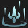
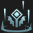
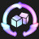

# Augment: normal, Count: 218
| key                      | name                    | icon                                                                     | desc                                                                                                                                                                                              |
| -                        | -                       | -                                                                        | -                                                                                                                                                                                                 |
| TreasureTrove1           | Treasure Trove I        |                      | Gain 1 blue and 1 gray loot orb(s).                                                                                                                                                               |
| Recombobulator           | Recombobulator          |                      | Champions on your board permanently transform into random champions that cost 1 more. Gain 2 Magnetic Removers.                                                                                   |
| Keepers1                 | Keepers I               |                                  | At the start of combat, your units grant adjacent allies a 160 health shield for 8 seconds.                                                                                                       |
| StudyTheBlade            | Challenger Unity        |                        | The Challenger trait grants its bonuses to all of your Champions. This does not increase your number of Challengers. Gain a Quinn.                                                                |
| HextechArmory            | Hextech Armory          |                        | The Hextech trait grants its bonuses to all of your Champions. This does not increase your number of Hextech units. Gain a Sejuani.                                                               |
| Electrocharge1           | Electrocharge I         |                      | When your units receive critical strikes, they deal 60-105 (based on current Stage) magic damage to nearby enemies. (1 second cooldown).                                                          |
| Disintegrator1           | Disintegrator I         |                      | Your units' attacks deal bonus magic damage equal to 2% of the target's maximum Health.                                                                                                           |
| LudensEcho1              | Luden's Echo I          |                            | When your units cast and deal Ability damage, the first target hit and a nearby enemy take 70-130 (based on current Stage) magic damage.                                                          |
| Backfoot1                | Backfoot I              |                                | Your units that start combat in the back 2 rows gain 20% Attack Speed.                                                                                                                            |
| Phalanx1                 | Phalanx I               |                                  | Your units that start combat in the back 2 rows gain 25 Armor and Magic Resist.                                                                                                                   |
| Battlemage1              | Battlemage I            |                            | Your units that start combat in the front 2 rows gain 30 Ability Power.                                                                                                                           |
| Meditation1              | Meditation I            |                            | Your units without items equipped restore 5 Mana per second.                                                                                                                                      |
| CyberneticUplink1        | Cybernetic Uplink I     |                | Your champions holding an item gain 125 Health and restore 2 Mana per second.                                                                                                                     |
| CyberneticShell1         | Cybernetic Shell I      |                  | Your champions holding an item gain 125 Health and 30 Armor.                                                                                                                                      |
| SecondWind1              | Second Wind I           |                            | After 10 seconds of combat, your units heal 50% of their missing Health.                                                                                                                          |
| Twins1                   | Double Trouble I        |                                      | If you have exactly 2 copies of a champion on your board, they both gain 25 Attack Damage, Ability Power, Armor, and Magic Resist. When you 3-star, gain a 2-star copy.                           |
| TriForce1                | Tri Force I             |                                | Your 3-cost units gain 233 Health, 13 starting Mana, and 13% Attack Speed.                                                                                                                        |
| BlueBattery1             | Blue Battery I          |                          | After casting their Ability, your units restore 10 Mana.                                                                                                                                          |
| EnforcerSwiftJustice     | True Justice            |          | Your Enforcers deal true damage to enemies below 80% Health. Gain a Sejuani.                                                                                                                      |
| DebonairIrresistible     | Irresistible Charm      |          | Debonair champions take 15% less damage. Gain a Leona.                                                                                                                                            |
| DebonairTrait            | Debonair Heart          |                        | Your team counts as having 1 additional Debonair. Gain a Talon.                                                                                                                                   |
| HextechStoredPower       | Stored Power            |              | Your Hextech champions permanently gain 1 Ability Power each time they are hit by your Hexcore's pulses. Gain a Swain.                                                                            |
| HextechHexnova           | Hexnova                 |                      | The first time a Hextech champion drops below 60% Health, they increase nearby enemies' maximum Mana by 50% until they cast. Gain a Nocturne.                                                     |
| HextechTrait             | Hextech Heart           |                          | Your team counts as having 1 additional Hextech. Gain a Swain.                                                                                                                                    |
| StrikerConcussiveBlows   | Concussive Blows        |      | Striker's critical strikes stun their target for 1.5 second(s). Each target can only be stunned once every 7 seconds. Gain a Rek'sai.                                                             |
| StrikerOverpower         | Overpower               |                  | After every 2 attacks, Strikers gain 75% Critical Strike Chance on their next attack. Gain a Rek'sai.                                                                                             |
| StrikerTrait             | Striker Heart           |                          | Your team counts as having 1 additional Striker. Gain a Rek'sai.                                                                                                                                  |
| TreasureTrove2           | Treasure Trove II       |                      | Gain 1 blue and 2 gray loot orb(s).                                                                                                                                                               |
| GoldenGifts1             | Golden Gifts I          |                          | Gain 1 golden and 3 gray loot orb(s).                                                                                                                                                             |
| TrueTwos                 | True Twos               |                                  | Gain 2 random 2-star 2-cost units.                                                                                                                                                                |
| ThreesCompany            | Three's Company         |                        | Gain 4 random 3-cost champions.                                                                                                                                                                   |
| FourScore                | Four Score              |                                | Gain 3 random 4-cost champions.                                                                                                                                                                   |
| ComponentGrabBag         | Component Grab Bag      |                  | Gain 3 random item components.                                                                                                                                                                    |
| TinyTitans               | Tiny Titans             |                              | Your Tactician heals 35 Health, grows larger, and has 135 maximum Health.                                                                                                                         |
| JeweledLotus             | Jeweled Lotus           |                          | Magic and true damage from your units' Abilities can critically strike. Your units gain 25% Critical Strike Chance.                                                                               |
| WoodlandTrinket          | Woodland Trinket        |                    | At the start of combat, your highest Attack Speed champion creates two 250 Health copies of themself (excluding items).                                                                           |
| Weakspot2                | Weakspot II             |                                | Your units' attacks ignore 40% of the target's Armor and reduce healing received by 50% for 5 seconds.                                                                                            |
| FuturePeepers            | Future Sight I          |                        | Know who you will fight next. Gain a Zephyr.                                                                                                                                                      |
| Keepers2                 | Keepers II              |                                  | At the start of combat, your units grant adjacent allies a 240 health shield for 8 seconds.                                                                                                       |
| Electrocharge2           | Electrocharge II        |                      | When your units receive critical strikes, they deal 85-145 (based on current Stage) magic damage to nearby enemies. (1 second cooldown).                                                          |
| Disintegrator2           | Disintegrator II        |                      | Your units' attacks deal bonus magic damage equal to 3% of the target's maximum Health.                                                                                                           |
| LudensEcho2              | Luden's Echo II         |                            | When your units cast and deal Ability damage, the first target hit and a nearby enemy take 100-175 (based on current Stage) magic damage.                                                         |
| Backfoot2                | Backfoot II             |                                | Your units that start combat in the back 2 rows gain 30% Attack Speed.                                                                                                                            |
| Phalanx2                 | Phalanx II              |                                  | Your units that start combat in the back 2 rows gain 35 Armor and Magic Resist.                                                                                                                   |
| Battlemage2              | Battlemage II           |                            | Your units that start combat in the front 2 rows gain 45 Ability Power.                                                                                                                           |
| Meditation2              | Meditation II           |                            | Your units without items equipped restore 7 Mana per second.                                                                                                                                      |
| CyberneticUplink2        | Cybernetic Uplink II    |                | Your champions holding an item gain 200 Health and restore 3 Mana per second.                                                                                                                     |
| CyberneticShell2         | Cybernetic Shell II     |                  | Your champions holding an item gain 200 Health and 45 Armor.                                                                                                                                      |
| SecondWind2              | Second Wind II          |                            | After 10 seconds of combat, your units heal 75% of their missing Health.                                                                                                                          |
| Archangel1               | Archangel's Embrace     |                              | Upon casting their Ability, your units gain Ability Power equal to 25% of their maximum Mana.                                                                                                     |
| Twins2                   | Double Trouble II       |                                      | If you have exactly 2 copies of a champion on your board, they both gain 35 Attack Damage, Ability Power, Armor, and Magic Resist. When you 3-star, gain a 2-star copy.                           |
| TriForce2                | Tri Force II            |                                | Your 3-cost units gain 333 Health, 23 starting Mana, and 23% Attack Speed.                                                                                                                        |
| ThievingRascals          | Thieving Rascals        |                    | Free Yordles from the portal have 33% chance to arrive holding an item component. Gain a Lulu.                                                                                                    |
| DebonairEmblem           | Debonair Crest          |                      | Gain a Debonair Emblem and a Syndra.                                                                                                                                                              |
| DebonairVVIP             | Very VIP                |                          | When an ally dies, they grant the Debonair VIP 30% of their maximum Health for the rest of combat. Gain a Syndra.                                                                                 |
| HextechEmblem            | Hextech Crest           |                        | Gain a Hextech Emblem and a Nocturne.                                                                                                                                                             |
| StrikerEmblem            | Striker Crest           |                        | Gain a Striker Emblem and a Rek'sai.                                                                                                                                                              |
| GoldenGifts2             | Golden Gifts II         |                          | Gain 2 golden and 4 gray loot orb(s).                                                                                                                                                             |
| TreasureTrove3           | Treasure Trove III      |                      | Gain 3 blue and 2 gray loot orb(s).                                                                                                                                                               |
| HighFive                 | High Five               |                                  | Gain 4 random 5-cost champions.                                                                                                                                                                   |
| RadiantRelics            | Radiant Relics          |                        | Open an Armory and choose 1 of 4 unique Radiant items.                                                                                                                                            |
| TheGoldenEgg             | The Golden Egg          |                          | Gain a massive golden egg that hatches in 7 turns.                                                                                                                                                |
| VerdantVeil              | Verdant Veil            |                            | Your units are immune to crowd control effects for the first 15 seconds of combat.                                                                                                                |
| Weakspot3                | Weakspot III            |                                | Your units' attacks ignore 60% of the target's Armor and reduce healing received by 50% for 5 seconds.                                                                                            |
| FuturePeepers2           | Future Sight II         |                      | Know who you fight next. Gain a Radiant Zephyr.                                                                                                                                                   |
| BlueBattery2             | Blue Battery II         |                          | After casting their Ability, your units restore 20 Mana.                                                                                                                                          |
| Electrocharge3           | Electrocharge III       |                      | When your units receive critical strikes, they deal 115-220 (based on current Stage) magic damage to nearby enemies. (1 second cooldown).                                                         |
| Disintegrator3           | Disintegrator III       |                      | Your units' attacks deal bonus magic damage equal to 4% of the target's maximum Health.                                                                                                           |
| LudensEcho3              | Luden's Echo III        |                            | When your units cast and deal Ability damage, the first target hit and a nearby enemy take 140-260 (based on current Stage) magic damage.                                                         |
| Backfoot3                | Backfoot III            |                                | Your units that start combat in the back 2 rows gain 45% Attack Speed.                                                                                                                            |
| Phalanx3                 | Phalanx III             |                                  | Your units that start combat in the back 2 rows gain 50 Armor and Magic Resist.                                                                                                                   |
| Battlemage3              | Battlemage III          |                            | Your units that start combat in the front 2 rows gain 60 Ability Power.                                                                                                                           |
| Meditation3              | Meditation III          |                            | Your units without items equipped restore 10 Mana per second.                                                                                                                                     |
| CyberneticUplink3        | Cybernetic Uplink III   |                | Your champions holding an item gain 300 Health and restore 4 Mana per second.                                                                                                                     |
| CyberneticShell3         | Cybernetic Shell III    |                  | Your champions holding an item gain 300 Health and 60 Armor.                                                                                                                                      |
| SecondWind3              | Second Wind III         |                            | After 10 seconds of combat, your units heal 100% of their missing Health.                                                                                                                         |
| Twins3                   | Double Trouble III      |                                      | If you have exactly 2 copies of a champion on your board, they both gain 45 Attack Damage, Ability Power, Armor, and Magic Resist. When you 3-star, gain a 2-star copy.                           |
| TriForce3                | Tri Force III           |                                | Your 3-cost units gain 433 Health, 33 starting Mana, and 33% Attack Speed.                                                                                                                        |
| DebonairEmblem2          | Debonair Crown          |                    | Gain 2 Debonair Emblems.                                                                                                                                                                          |
| HextechEmblem2           | Hextech Crown           |                      | Gain 2 Hextech Emblems.                                                                                                                                                                           |
| StrikerEmblem2           | Striker Crown           |                      | Gain 2 Striker Emblems.                                                                                                                                                                           |
| CalculatedLoss           | Calculated Loss         |                      | After losing your combat, gain 2 gold and a free Shop refresh.                                                                                                                                    |
| TomeOfTraits1            | Ancient Archives        |                        | Gain 1 Tome of Traits.                                                                                                                                                                            |
| Dominance                | Dominance               |                                | After winning your player combat, gain 1 bonus gold for every 2 surviving units.                                                                                                                  |
| ItemGrabBag1             | Item Grab Bag I         |                          | Gain 1 random completed item.                                                                                                                                                                     |
| TargetDummies            | Phony Frontline         |                        | Gain 2 Target Dummies.                                                                                                                                                                            |
| HyperRoll                | Hyper Roll              |                                | If you have less than 10 gold at the end of a round, gain 2 gold.                                                                                                                                 |
| PandorasItems            | Pandora's Items         |                        | Gain a random component. At the start of each round, items on your bench are randomized (excluding Tactician's Crown, Spatula, and consumables).                                                  |
| Ascension                | Ascension               |                                | After 15 seconds of combat, your units deal 50% more damage.                                                                                                                                      |
| Traitless1               | Built Different I       |                              | Your units with no Traits active gain 300 Health and 60% Attack Speed.                                                                                                                            |
| CelestialBlessing1       | Celestial Blessing I    |              | Your units heal for 12% of the damage dealt by attacks and Abilities. Excess healing is converted to a shield up to 300 Health.                                                                   |
| MeleeStarBlade1          | Knife's Edge I          |                    | Your units that start combat in the front 2 rows gain 30 Attack Damage.                                                                                                                           |
| CyberneticImplants1      | Cybernetic Implants I   |            | Your champions holding an item gain 125 Health and 10 Attack Damage.                                                                                                                              |
| Distancing               | Exiles I                |                              | Your units that start combat with no adajacent allies gain a 30% maximum Health shield for 8 seconds.                                                                                             |
| Featherweights1          | Featherweights I        |                    | Your 1 and 2 cost champions gain 25% Attack Speed and Move Speed.                                                                                                                                 |
| FirstAidKit              | First Aid Kit           |                            | All healing and shielding on your units is increased by 35%.                                                                                                                                      |
| MakeshiftArmor1          | Makeshift Armor I       |                    | Your units with no items gain 35 Armor and Magic Resist.                                                                                                                                          |
| Diversify1               | Stand United I          |                              | Your units gain 2 Attack Damage and Ability Power per Trait active across your army.                                                                                                              |
| ThrillOfTheHunt1         | Thrill of the Hunt I    |                  | Your units heal 400 Health on kill.                                                                                                                                                               |
| Underdogs                | Underdogs               |                                | Whenever your team has fewer units alive than your opponent, your units regenerate 9% Health each second (maximum: 150).                                                                          |
| Weakspot                 | Weakspot I              |                                  | Your units' attacks ignore 20% of the target's Armor and reduce healing received by 50% for 5 seconds.                                                                                            |
| ArcanistTrait            | Arcanist Heart          |                        | Your team counts as having 1 additional Arcanist. Gain a Swain.                                                                                                                                   |
| ArcanistRunicShield1     | Runic Shield I          |          | Arcanists start combat with a shield equal to 300% of their Ability Power for 8 seconds. Gain a Swain.                                                                                            |
| AssassinTrait            | Assassin Heart          |                        | Your team counts as having 1 additional Assassin. Gain a Talon.                                                                                                                                   |
| AssassinCutthroat        | Cutthroat               |                | Assassins Mana Reave the first unit they attack, increasing their maximum Mana by 50% until they cast. Gain a Talon.                                                                              |
| HeroTrait                | Bodyguard Heart         |                                | Your team counts as having 1 additional Bodyguard. Gain a Blitzcrank.                                                                                                                             |
| HeroStandBehindMe        | Stand Behind Me         |                | Bodyguards' Armor bonus is increased by 25%. At the start of combat, Bodyguards grant 100% of their Armor bonus to non-Bodyguard allies directly behind them (does not stack). Gain a Blitzcrank. |
| BruteTrait               | Bruiser Heart           |                              | Your team counts as having 1 additional Bruiser. Gain a Sejuani.                                                                                                                                  |
| BrawlerHPRegen1          | Shrug It Off            |                    | Bruisers regenerate 2.5% of their maximum Health each second. Gain a Sejuani.                                                                                                                     |
| ChallengerTrait          | Challenger Heart        |                    | Your team counts as having 1 additional Challenger. Gain a Quinn.                                                                                                                                 |
| ChallengerEnGarde        | En Garde                |                | The first time an enemy is attacked by a Challenger, they are Disarmed for 2.5 seconds. Gain a Warwick.                                                                                           |
| ChemtechOverload1        | Chemical Overload I     |                | Chemtechs explode on death, dealing 20% of their max Health as magic damage to enemies within 2 hexes. Gain a Warwick.                                                                            |
| ChemtechTrait            | Chemtech Heart          |                        | Your team counts as having 1 additional Chemtech. Gain a Warwick.                                                                                                                                 |
| ClockworkTrait           | Clockwork Heart         |                      | Your team counts as having 1 additional Clockwork. Gain a Zilean.                                                                                                                                 |
| EnchanterTrait           | Enchanter Heart         |                      | Your team counts as having 1 additional Enchanter. Gain a Lulu.                                                                                                                                   |
| EnchanterArdentCenser    | Ardent Censer           |        | Allies healed or shielded by Enchanters gain 45% stacking Attack Speed for the rest of combat (maximum once every 3 seconds). Gain a Lulu.                                                        |
| EnforcerTrait            | Enforcer Heart          |                        | Your team counts as having 1 additional Enforcer. Gain a Sejuani.                                                                                                                                 |
| InnovatorTrait           | Innovator Heart         |                      | Your team counts as having 1 additional Innovator.                                                                                                                                                |
| InnovatorSelfRepair      | Self Repair             |            | When the Innovation dies, it will become untargetable and repair itself if an Innovator is still alive. Gain a Zilean.                                                                            |
| MercenaryTrait           | Mercenary Heart         |                      | Your team counts as having 1 additional Mercenary.                                                                                                                                                |
| MercenaryPirates         | Pirates                 |                  | Mercenary units have a 66% chance to drop 1 gold when they kill an enemy. Gain a Quinn.                                                                                                           |
| ExperimentalTrait        | Mutant Heart            |                | Your team counts as having 1 additional Mutant. Gain a Rek'Sai.                                                                                                                                   |
| MutantUnstableEvolution  | Unstable Evolution      |    | Mutants randomly gain one of the following when they reach 2 star: 500 Health, 30% Attack Speed, 30 Attack Damage, or 30 Ability Power. These bonuses stack. Gain a Rek'sai.                      |
| ScholarTrait             | Scholar Heart           |                          | Your team counts as having 1 additional Scholar. Gain a Zyra.                                                                                                                                     |
| ScholarLearning          | Lifelong Learning       |                    | Scholars permanently gain 2 Ability Power after each combat, and an additional 2 if they survived. Gain a Syndra.                                                                                 |
| ScrapTrait               | Scrap Heart             |                              | Your team counts as having 1 additional Scrap. Gain a Blitzcrank.                                                                                                                                 |
| SniperNest               | Sniper's Nest           |                              | Snipers gain +8% damage for each round fought from the same starting hex. (Maximum +32%). Gain an Ashe.                                                                                           |
| SniperTrait              | Sniper Heart            |                            | Your team counts as having 1 additional Sniper. Gain a Ashe.                                                                                                                                      |
| SocialiteDuet            | Duet                    |                        | Summon 1 additional Socialite spotlight. Spotlighted units gain 200 Health. Gain a Senna.                                                                                                         |
| SocialiteTrait           | Socialite Heart         |                      | Your team counts as having 1 additional Socialite.                                                                                                                                                |
| SyndicateTrait           | Syndicate Heart         |                      | Your team counts as having 1 additional Syndicate. Gain a Zyra.                                                                                                                                   |
| SyndicateOneForAll       | One For All             |              | When your Syndicates die, they grant your other Syndicates 15 Attack Damage and Ability Power. Gain an Ashe.                                                                                      |
| SyndicatePayday          | Payday                  |                    | After winning your combat, gain 1 bonus gold for each surviving Syndicate. Gain an Ashe.                                                                                                          |
| TwinshotTrait            | Twinshot Heart          |                        | Your team counts as having 1 additional Twinshot. Gain a Corki.                                                                                                                                   |
| YordleSoSmall            | So Small                |                        | Yordles gain 25% Dodge Chance. Gain a Corki.                                                                                                                                                      |
| RichGetRicher            | Rich Get Richer         |                        | Gain 12 gold. Your maximum interest is increased to 7.                                                                                                                                            |
| BinaryAirdrop            | Binary Airdrop          |                        | Your champions equipped with 2 items temporarily gain a random completed item at the start of combat.                                                                                             |
| ClearMind                | Clear Mind              |                                | If you have no champions on your bench at the end of a round, gain 3 experience points.                                                                                                           |
| TradeSector              | Trade Sector            |                            | Gain a free Shop refresh each round.                                                                                                                                                              |
| SunfireBoard             | Sunfire Board           |                          | At the start of combat, burn all enemies for 20% of their maximum Health over 10 seconds and reduce healing received by 50%.                                                                      |
| MetabolicAccelerator     | Metabolic Accelerator   |          | Your Tactician moves faster and heals 2 Health after a PVP round.                                                                                                                                 |
| SalvageBin               | Salvage Bin             |                              | Gain a random completed item. Selling champions breaks apart their full items into components (excluding Tactician's Crown).                                                                      |
| PortableForge            | Portable Forge          |                        | Open an Armory and choose 1 of 3 unique Artifacts crafted by Ornn.                                                                                                                                |
| MeleeStarBlade2          | Knife's Edge II         |                    | Your units that start combat in the front 2 rows gain 40 Attack Damage.                                                                                                                           |
| CyberneticImplants2      | Cybernetic Implants II  |            | Your champions holding an item gain 200 Health and 20 Attack Damage.                                                                                                                              |
| Distancing2              | Exiles II               |                            | Your units that start combat with no adajacent allies gain a 45% maximum Health shield for 8 seconds.                                                                                             |
| Featherweights2          | Featherweights II       |                    | Your 1 and 2 cost champions gain 35% Attack Speed and Move Speed.                                                                                                                                 |
| Traitless2               | Built Different II      |                              | Your units with no Traits active gain 400 Health and 70% Attack Speed.                                                                                                                            |
| Diversify2               | Stand United II         |                              | Your units gain 3 Attack Damage and Ability Power per Trait active across your army.                                                                                                              |
| TitanicForce             | Titanic Force           |                          | Your units with more than 1400 maximum Health gain Attack Damage equal to 3% of their maximum Health.                                                                                             |
| MakeshiftArmor2          | Makeshift Armor II      |                    | Your units with no items gain 55 Armor and Magic Resist.                                                                                                                                          |
| CelestialBlessing2       | Celestial Blessing II   |              | Your units heal for 20% of the damage dealt by attacks and Abilities. Excess healing is converted to a shield up to 450 Health.                                                                   |
| ThrillOfTheHunt2         | Thrill of the Hunt II   |                  | Your units heal 700 Health on kill.                                                                                                                                                               |
| ArcanistEmblem           | Arcane Crest            |                      | Gain an Arcanist Emblem and a Swain.                                                                                                                                                              |
| ArcanistRunicShield2     | Runic Shield II         |          | Arcanists start combat with a shield equal to 450% of their Ability Power for 8 seconds. Gain a Vex.                                                                                              |
| ArcanistSpellBlade       | Spell Blade             |              | After casting their Ability, Arcanists' next attack deals bonus magic damage equal to 180% of their Ability Power. Gain a Swain.                                                                  |
| AssassinEmblem           | Assassin Crest          |                      | Gain an Assassin Emblem and a Talon.                                                                                                                                                              |
| AssassinSmokeBomb        | Smoke Bomb              |                | The first time Assassins drops to 70% health, they briefly enter stealth, becoming untargetable and shedding all negative effects. Any excess damage is reduced by 60%. Gain a Talon.             |
| HeroEmblem               | Bodyguard Crest         |                              | Gain a Bodyguard Emblem and a Darius.                                                                                                                                                             |
| BruteEmblem              | Bruiser Crest           |                            | Gain a Bruiser Emblem and a Sejuani.                                                                                                                                                              |
| ChallengerEmblem         | Challenger Crest        |                  | Gain a Challenger Emblem and a Quinn.                                                                                                                                                             |
| ChemtechEmblem           | Chemtech Crest          |                      | Gain a Chemtech Emblem and a Warwick.                                                                                                                                                             |
| ChemtechOverload2        | Chemical Overload II    |                | Chemtechs explode on death, dealing 30% of their max Health as magic damage to enemies within 2 hexes. Gain a Zac.                                                                                |
| ChemtechInjection        | Instant Injection       |                | Chemtechs now additionally trigger their bonuses at the start of combat. Gain a Warwick.                                                                                                          |
| ClockworkEmblem2         | Clockwork Crest         |                  | Gain a Clockwork Emblem and a Zilean.                                                                                                                                                             |
| ClockworkBrokenStopwatch | Broken Stopwatch        |  | 5 seconds into combat, all enemies and non-Clockwork units are frozen in time for 4 seconds. Gain a Zilean.                                                                                       |
| ColossusArmorPlating     | Armor Plating           |          | Colossus become invulnerable for 3 seconds when their Health drops to 50%. Gain a Cho'Gath.                                                                                                       |
| MercenaryEmblem2         | Mercenary Crest         |                  | Gain a Mercenary Emblem and 3 gold.                                                                                                                                                               |
| MercenaryGoldReserves    | Gold Reserves           |        | Mercenaries deal 2% more damage per 1 gold you have. (Maximum +50%). Gain a Quinn.                                                                                                                |
| ExperimentalEmblem       | Mutant Crest            |              | Gain a Mutant Emblem and a Kassadin.                                                                                                                                                              |
| ScholarEmblem2           | Scholar Crest           |                      | Gain a Scholar Emblem and a Zyra.                                                                                                                                                                 |
| ScrapEmblem2             | Scrap Crest             |                          | Gain a Scrap Emblem and a Blitzcrank.                                                                                                                                                             |
| ScrapDumpsterDiving      | Junkyard                |            | Gain a random component every 4 combat rounds with the Scrap Trait active. Gain an Ezreal.                                                                                                        |
| SniperEmblem2            | Sniper Crest            |                        | Gain a Sniper Emblem and an Ashe.                                                                                                                                                                 |
| SyndicateEmblem2         | Syndicate Crest         |                  | Gain a Syndicate Emblem and a Zyra.                                                                                                                                                               |
| SniperSharpshooter       | Sharpshooter            |              | Twinshot's ranged attacks and Abilities can bounce once, dealing 60% less damage. Gain a Corki.                                                                                                   |
| SocialiteShare           | Share the Spotlight     |                      | Allies adjacent to a spotlight at the start of combat gain 125% of its bonuses. Gain a Senna.                                                                                                     |
| Windfall                 | Windfall                |                                  | Gain gold based on the number of augments you have now. 0 = 20g, 1 = 35g, 2 = 55g                                                                                                                 |
| ThriftShop               | Wise Spending           |                              | Gain 4 gold.Gain 2 experience points when you refresh your Shop.                                                                                                                                  |
| GrandGambler             | High Roller             |                          | Gain 3 Loaded Dice and 8 gold.                                                                                                                                                                    |
| ItemGrabBag2             | Item Grab Bag II        |                          | Gain 2 random completed items and a Reforger.                                                                                                                                                     |
| BandOfThieves1           | Band of Thieves         |                      | Gain 2 Thief's Gloves.                                                                                                                                                                            |
| NewRecruit3              | New Recruit             |                            | Gain +1 maximum team size.                                                                                                                                                                        |
| GachaAddict              | Golden Ticket           |                            | Each time your Shop is refreshed, you have a 50% chance to gain a free refresh.                                                                                                                   |
| MaxLevel10               | Level Up!               |                              | When you buy experience points, gain an additional 3. You can now reach level 10.                                                                                                                 |
| HighEndShopping          | High End Shopping       |                    | Champions appear in your Shop as if you were 1 level higher. Gain 5 gold.                                                                                                                         |
| WoodlandCharm            | Woodland Charm          |                        | At the start of combat, your highest Health Champion creates a 1800 Health copy of themself (excluding items).                                                                                    |
| SlowAndSteady            | March of Progress       |                        | Gain 5 bonus experience points per round. You can no longer use gold to level up.                                                                                                                 |
| Distancing3              | Exiles III              |                            | Your units that start combat with no adajacent allies gain a 70% maximum Health shield for 8 seconds.                                                                                             |
| Featherweights3          | Featherweights III      |                    | Your 1 and 2 cost units gain 55% Attack Speed and Move Speed.                                                                                                                                     |
| MeleeStarBlade3          | Knife's Edge III        |                    | Your units that start combat in the first 2 rows gain 55 Attack Damage.                                                                                                                           |
| CyberneticImplants3      | Cybernetic Implants III |            | Your champions holding an item gain 300 Health and 30 Attack Damage.                                                                                                                              |
| Traitless3               | Built Different III     |                              | Your units with no Traits active gain 500 Health and 80% Attack Speed.                                                                                                                            |
| Diversify3               | Stand United III        |                              | Your units gain 5 Attack Damage and Ability Power per Trait active across your army.                                                                                                              |
| MakeshiftArmor3          | Makeshift Armor III     |                    | Your units with no items gain 75 Armor and Magic Resist.                                                                                                                                          |
| CelestialBlessing3       | Celestial Blessing III  |              | Your units heal for 35% of the damage dealt by attacks and Abilities. Excess healing is converted to a shield up to 600 Health.                                                                   |
| ArcanistRunicShield3     | Runic Shield III        |          | Arcanists start combat with a shield equal to 600% of their Ability Power for 8 seconds.                                                                                                          |
| ArcanistEmblem2          | Arcanist Crown          |                    | Gain 2 Arcanist Emblems.                                                                                                                                                                          |
| AssassinEmblem2          | Assassin Crown          |                    | Gain 2 Assassin Emblems.                                                                                                                                                                          |
| HeroEmblem2              | Bodyguard Crown         |                            | Gain 2 Bodyguard Emblems.                                                                                                                                                                         |
| BruteEmblem2             | Bruiser Crown           |                          | Gain 2 Bruiser Emblems.                                                                                                                                                                           |
| ChallengerEmblem2        | Challenger Crown        |                | Gain 2 Challenger Emblems.                                                                                                                                                                        |
| ChemtechEmblem2          | Chemtech Crown          |                    | Gain 2 Chemtech Emblems.                                                                                                                                                                          |
| ClockworkTrait2          | Clockwork Soul          |                    | Your team counts as having 2 additional Clockworks. Gain 8 gold.                                                                                                                                  |
| EnchanterTrait2          | Enchanter Soul          |                    | Your team counts as having 2 additional Enchanters. Gain 12 gold.                                                                                                                                 |
| EnforcerTrait2           | Enforcer Soul           |                      | Your team counts as having 2 additional Enforcers. Gain 8 gold.                                                                                                                                   |
| InnovatorTrait2          | Innovator Soul          |                    | Your team counts as having 2 additional Innovators.                                                                                                                                               |
| MercenaryTrait2          | Mercenary Soul          |                    | Your team counts as having 2 additional Mercenaries.                                                                                                                                              |
| ExperimentalEmblem2      | Mutant Crown            |            | Gain 2 Mutant Emblems.                                                                                                                                                                            |
| ScholarTrait2            | Scholar Soul            |                        | Your team counts as having 2 additional Scholars. Gain 8 gold.                                                                                                                                    |
| ScrapTrait2              | Scrap Soul              |                            | Your team counts as having 2 additional Scraps. Gain 8 gold.                                                                                                                                      |
| SniperEmblem3            | Sniper Crown            |                        | Gain 2 Sniper Emblems.                                                                                                                                                                            |
| SocialiteTrait2          | Socialite Soul          |                    | Your team counts as having 2 additional Socialites.                                                                                                                                               |
| SyndicateEmblem3         | Syndicate Crown         |                  | Gain 2 Syndicate Emblems.                                                                                                                                                                         |
| TwinshotTrait2           | Twinshot Soul           |                      | Your team counts as having 2 additional Twinshots. Gain 4 gold.                                                                                                                                   |
| Archangel2               | Archangel's Embrace II  |                              | Upon casting their Ability, your units gain Ability Power equal to 25% of their maximum Mana..                                                                                                    |
| Archangel3               | Archangel's Embrace III |                              | .                                                                                                                                                                                                 |
| ChemtechForAllUnits      | Chemtech Unity          |            | The Chemtech trait grants its bonuses to all of your Champions. This does not increase your number of Chemtech units. Gain a Warwick.                                                             |
