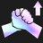

# Augment: silver, Count: 54
| key                | name                  | icon                                                       | desc                                                                                                                                                                          |
| -                  | -                     | -                                                          | -                                                                                                                                                                             |
| RunicShield1       | Runic Shield I        |              | Arcanists start combat with a shield equal to 300% of their Ability Power for 8 seconds.                                                                                      |
| ArcanistHeart1     | Arcanist Heart        |          | Your team counts as having 1 additional Arcanist. Gain a Swain.                                                                                                               |
| Ascension1         | Ascension             |                  | After 15 seconds of combat, your units deal 50% more damage.                                                                                                                  |
| Cutthroat1         | Cutthroat             |                  | Assassins Mana Reave the first unit they attack, increasing their maximum Mana by 65% until they cast.                                                                        |
| AssassinHeart1     | Assassin Heart        |          | Your team counts as having 1 additional Assassin. Gain a Talon.                                                                                                               |
| ShrugOff1          | Shrug It Off          |                    | Bruisers regenerate 2.5% of their maximum Health each second.                                                                                                                 |
| BruiserHeart1      | Bruiser Heart         |            | Your team counts as having 1 additional Bruiser. Gain a Trundle.                                                                                                              |
| CalculatedLoss1    | Calculated Loss       |        | After losing your combat, gain 2 gold and a free Shop refresh.                                                                                                                |
| CelestialBlessing1 | Celestial Blessing I  |  | Your units heal for 12% of the damage dealt by attacks and Abilities. Excess healing is converted to a shield up to 300 Health.                                               |
| EnGuarde1          | En Garde              |                    | The first time an enemy is attacked by a Challenger, they are Disarmed for 3 seconds.                                                                                         |
| ChallengerHeart1   | Challenger Heart      |      | Your team counts as having 1 additional Challenger. Gain a Quinn.                                                                                                             |
| ChemicalOverlord1  | Chemical Overload I   |    | Chemtechs explode on death, dealing 20% of their max Health as magic damage to enemies within 2 hexes.                                                                        |
| ChemtechHeart1     | Chemtech Heart        |          | Your team counts as having 1 additional Chemtech. Gain a Zac.                                                                                                                 |
| ClockworkHeart1    | Clockwork Heart       |        | Your team counts as having 1 additional Clockwork. Gain a Zilean.                                                                                                             |
| Cybernetic1        | Cybernetic Implants I |                | Your champions holding an item gain 150 Health and 10 Attack Damage.                                                                                                          |
| Exiles1            | Exiles I              |                        | Your units that start combat with no adajacent allies gain a 30% maximum Health shield for 8 seconds.                                                                         |
| StandUnited1       | Stand United I        |              | Your units gain 2 Attack Damage and Ability Power per Trait active across your army.                                                                                          |
| Dominance1         | Dominance             |                  | After winning your player combat, gain 1 bonus gold for every 2 surviving units.                                                                                              |
| ArdentCenser1      | Ardent Censer         |            | Allies healed or shielded by Enchanters gain 50% stacking Attack Speed for the rest of combat (maximum once every 4 seconds).                                                 |
| EnchanterHeart1    | Enchanter Heart       |        | Your team counts as having 1 additional Enchanter. Gain a Taric.                                                                                                              |
| EnforcerHeart1     | Enforcer Heart        |          | Your team counts as having 1 additional Enforcer. Gain a Vi.                                                                                                                  |
| MutantHeart1       | Mutant Heart          |              | Your team counts as having 1 additional Mutant. Gain a Kog'Maw.                                                                                                               |
| Featherweights1    | Featherweights I      |        | Your 1 and 2 cost champions gain 25% Attack Speed and movement speed.                                                                                                         |
| FirstAidKit1       | First Aid Kit         |              | All healing and shielding on your units is increased by 35%.                                                                                                                  |
| StandBehind1       | Stand Behind Me       |              | Increases the Bodyguard Armor bonus by 25%. At the start of combat, Bodyguards grant 100% of their Armor bonus to non-Bodyguard allies directly behind them (does not stack). |
| BodyguardHeart1    | Bodyguard Heart       |        | Your team counts as having 1 additional Bodyguard. Gain a Blitzcrank.                                                                                                         |
| Hyperroll1         | Hyper Roll            |                  | If you have less than 10 gold at the end of a round, gain 2 gold.                                                                                                             |
| SelfRepair1        | Self Repair           |                | When the Innovation dies, it will become untargetable and repair itself if an Innovator is still alive.                                                                       |
| InnovatorHeart1    | Innovator Heart       |        | Your team counts as having 1 additional Innovator.                                                                                                                            |
| ItemGrabBag1       | Item Grab Bag I       |              | Gain 1 random completed item(s).                                                                                                                                              |
| Makeshift1         | Makeshift Armor I     |                  | Your units with no items gain 35 Armor and Magic Resist.                                                                                                                      |
| CQCTraining1       | Knife's Edge I        |              | Your units that start combat in the front 2 rows gain 25 Attack Damage.                                                                                                       |
| Pirates1           | Pirates               |                      | Mercenary units have a 50% chance to drop 1 gold when they kill an enemy.                                                                                                     |
| MercenaryHeart1    | Mercenary Heart       |        | Your team counts as having 1 additional Mercenary.                                                                                                                            |
| UnstableEvolution1 | Unstable Evolution    |  | Mutants randomly gain one of the following when they reach 2 star: 500 Health, 30% Attack Speed, 30 Attack Damage, or 30 Ability Power. These bonuses stack.                  |
| Pandora1           | Pandora's Items       |                      | Gain a random component. At the start of each round, items on your bench are randomized (excluding Tactician's Crown, Spatula, and consumables).                              |
| LifelongLearner1   | Lifelong Learning     |      | Scholars permanently gain 2 Ability Power after each combat, and an additional 2 if they survived.                                                                            |
| ScholarHeart1      | Scholar Heart         |            | Your team counts as having 1 additional Scholar. Gain a Zyra.                                                                                                                 |
| ScrapHeart1        | Scrap Heart           |                | Your team counts as having 1 additional Scrap. Gain a Blitzcrank.                                                                                                             |
| SnipersNest1       | Sniper's Nest         |              | Snipers gain +10% damage for each round fought from the same starting hex. (Maximum +40%)                                                                                     |
| SniperHeart1       | Sniper Heart          |              | Your team counts as having 1 additional Sniper. Gain a Tristana.                                                                                                              |
| Duet1              | Duet                  |                            | Summon 1 additional Socialite spotlight. Spotlighted units gain 400 Health.                                                                                                   |
| SocialiteHeart1    | Socialite Heart       |        | Your team counts as having 1 additional Socialite.                                                                                                                            |
| OneForAll1         | One For All           |                  | When your Syndicates die, they grant your other Syndicates 20 Attack Damage and Ability Power.                                                                                |
| Payday1            | Payday                |                        | After winning your combat, gain 1 bonus gold for each surviving Syndicate.                                                                                                    |
| SyndicateHeart1    | Syndicate Heart       |        | Your team counts as having 1 additional Syndicate. Gain a Zyra.                                                                                                               |
| PhonyFrontline1    | Phony Frontline       |        | Gain 2 Target Dummies.                                                                                                                                                        |
| ThrillHunt1        | Thrill of the Hunt I  |                | Your units heal 400 Health on kill.                                                                                                                                           |
| AncientArchives1   | Ancient Archives      |      | Gain 1 Tome of Traits.                                                                                                                                                        |
| BuiltDifferent1    | Built Different I     |        | Your units with no Traits active gain 300 Health and 50% Attack Speed.                                                                                                        |
| TwinshotHeart1     | Twinshot Heart        |          | Your team counts as having 1 additional Twinshot. Gain a Kog'Maw.                                                                                                             |
| Underdogs1         | Underdogs             |                  | Whenever your team has fewer units alive than your opponent, your units regenerate 9% of their missing Health each second (maximum: 150).                                     |
| Weakspot1          | Weakspot              |                    | Your units' attacks ignore 20% of the target's Armor and reduce healing received by 50% for 5 seconds.                                                                        |
| SoSmall1           | So Small              |                      | Yordles gain 35% Dodge Chance.                                                                                                                                                |
# Augment: gold, Count: 42
| key                | name                   | icon                                                       | desc                                                                                                                                                                    |
| -                  | -                      | -                                                          | -                                                                                                                                                                       |
| ArcanistEmblem2    | Arcane Crest           |        | Gain an Arcanist Emblem and a Swain.                                                                                                                                    |
| RunicShield2       | Runic Shield II        |              | Arcanists start combat with a shield equal to 450% of their Ability Power for 8 seconds.                                                                                |
| SpellBlade2        | Spell Blade            |                | After casting their Ability, Arcanists' next attack deals bonus magic damage equal to 225% of their Ability Power. Spell Blade's damage is considered Ability damage.   |
| AssassinEmblem2    | Assassin Crest         |        | Gain an Assassin Emblem and a Talon.                                                                                                                                    |
| Smokebomb2         | Smoke Bomb             |                  | The first time Assassins drops to 60% health, they briefly enter stealth, becoming untargetable and shedding all negative effects. Any excess damage is reduced by 80%. |
| BinaryAirdrop2     | Binary Airdrop         |          | Your champions equipped with 2 items temporarily gain a random completed item at the start of combat.                                                                   |
| BruiserEmblem2     | Bruiser Crest          |          | Gain a Bruiser Emblem and a Trundle.                                                                                                                                    |
| CelestialBlessing2 | Celestial Blessing II  |  | Your units heal for 20% of the damage dealt by attacks and Abilities. Excess healing is converted to a shield up to 450 Health.                                         |
| ChallengerEmblem2  | Challenger Crest       |    | Gain a Challenger Emblem and a Quinn.                                                                                                                                   |
| ChemtechEmblem2    | Chemtech Crest         |        | Gain a Chemtech Emblem and a Warwick.                                                                                                                                   |
| InstantInjection2  | Instant Injection      |    | Chemtechs now additionally trigger their bonuses at the start of combat.                                                                                                |
| ChemicalOverlord2  | Chemical Overload II   |    | Chemtechs explode on death, dealing 30% of their max Health as magic damage to enemies within 2 hexes.                                                                  |
| ClearMind2         | Clear Mind             |                  | If you have no champions on your bench at the end of a round, gain 3 experience points.                                                                                 |
| BrokenStopwatch2   | Broken Stopwatch       |      | 5 seconds into combat, all enemies and non-Clockwork units are frozen in time for 4 seconds.                                                                            |
| ClockworkEmblem2   | Clockwork Crest        |      | Gain a Clockwork Emblem and a Zilean.                                                                                                                                   |
| ArmorPlating2      | Armor Plating          |            | Colossus become invulnerable for 2 seconds when their Health drops to 60% and 30%.                                                                                      |
| Cybernetic2        | Cybernetic Implants II |                | Your champions holding an item gain 250 Health and 20 Attack Damage.                                                                                                    |
| Exiles2            | Exiles II              |                        | Your units that start combat with no adajacent allies gain a 45% maximum Health shield for 8 seconds.                                                                   |
| StandUnited2       | Stand United II        |              | Your units gain 3 Attack Damage and Ability Power per Trait active across your army.                                                                                    |
| MutantEmblem2      | Mutant Crest           |            | Gain a Mutant Emblem and a Kassadin.                                                                                                                                    |
| Featherweights2    | Featherweights II      |        | Your 1 and 2 cost champions gain 35% Attack Speed and movement speed.                                                                                                   |
| BodyguardEmblem2   | Bodyguard Crest        |      | Gain a Bodyguard Emblem and a Darius.                                                                                                                                   |
| Makeshift2         | Makeshift Armor II     |                  | Your units with no items gain 55 Armor and Magic Resist.                                                                                                                |
| CQCTraining2       | Knife's Edge II        |              | Your units that start combat in the front 2 rows gain 35 Attack Damage.                                                                                                 |
| MercenaryEmblem2   | Mercenary Crest        |      | Gain a Mercenary Emblem and 3 gold.                                                                                                                                     |
| GoldReserves2      | Gold Reserves          |            | Mercenaries deal 1% more damage per 1 gold you have. (Maximum +60%)                                                                                                     |
| MetabolicAccel2    | Metabolic Accelerator  |        | Your Tactician moves faster and heals 2 Health at the end of each PVP round.                                                                                            |
| PortableForge2     | Portable Forge         |          | Open an Armory and choose 1 of 3 unique Artifacts crafted by Ornn.                                                                                                      |
| RichGetRicher2     | Rich Get Richer        |          | Gain 10 gold. Your maximum interest is increased to 7.                                                                                                                  |
| Salvage2           | Salvage Bin            |                      | Gain a random completed item. Selling champions breaks apart their full items into components (excluding Tactician's Crown).                                            |
| ScholarEmblem2     | Scholar Crest          |          | Gain a Scholar Emblem and a Heimerdinger.                                                                                                                               |
| Junkyard2          | Junkyard               |                    | Gain a random component every 3 combat rounds with the Scrap Trait active.                                                                                              |
| ScrapEmblem2       | Scrap Crest            |              | Gain a Scrap Emblem and a Blitzcrank.                                                                                                                                   |
| SniperEmblem2      | Sniper Crest           |            | Gain a Sniper Emblem and a Tristana.                                                                                                                                    |
| Sharpshooter2      | Sharpshooter           |            | Twinshot's ranged attacks and Abilities can bounce once, dealing 45% less damage.                                                                                       |
| ShareSpotlight2    | Share the Spotlight    |        | Allies adjacent to a spotlight at the start of combat gain 100% of its bonuses.                                                                                         |
| SunfireBoard2      | Sunfire Board          |            | At the start of combat, burn all enemies for 20% of their maximum Health over 10 seconds and reduce healing received by 50%.                                            |
| SyndicateEmblem2   | Syndicate Crest        |      | Gain a Syndicate Emblem and a Zyra.                                                                                                                                     |
| ThrillHunt2        | Thrill of the Hunt II  |                | Your units heal 700 Health on kill.                                                                                                                                     |
| TitanicForce2      | Titanic Force          |            | Your units with more than 1400 maximum Health gain Attack Damage equal to 3% of their maximum Health.                                                                   |
| Trade2             | Trade Sector           |                          | Gain a free Shop refresh each round.                                                                                                                                    |
| BuiltDifferent2    | Built Different II     |        | Your units with no Traits active gain 400 Health and 60% Attack Speed.                                                                                                  |
# Augment: prismatic, Count: 39
| key                | name                    | icon                                                       | desc                                                                                                                            |
| -                  | -                       | -                                                          | -                                                                                                                               |
| ArcanistEmblem3    | Arcanist Crown          |        | Gain 2 Arcanist Emblems.                                                                                                        |
| RunicShield3       | Runic Shield III        |              | Arcanists start combat with a shield equal to 600% of their Ability Power for 8 seconds.                                        |
| AssassinEmblem3    | Assassin Crown          |        | Gain 2 Assassin Emblems.                                                                                                        |
| BandThieves3       | Band of Thieves         |              | Gain 2 Thief's Gloves.                                                                                                          |
| BruiserEmblem3     | Bruiser Crown           |          | Gain 2 Bruiser Emblems.                                                                                                         |
| CelestialBlessing3 | Celestial Blessing III  |  | Your units heal for 25% of the damage dealt by attacks and Abilities. Excess healing is converted to a shield up to 600 Health. |
| ChallengerEmblem3  | Challenger Crown        |    | Gain 2 Challenger Emblems.                                                                                                      |
| ChemtechEmblem3    | Chemtech Crown          |        | Gain 2 Chemtech Emblems.                                                                                                        |
| ChemicalOverlord3  | Chemical Overload III   |    | Chemtechs explode on death, dealing 40% of their max Health as magic damage to enemies within 2 hexes.                          |
| ClockworkSoul3     | Clockwork Soul          |          | Your team counts as having 2 additional Clockworks. Gain 8 gold.                                                                |
| Cybernetic3        | Cybernetic Implants III |                | Your champions holding an item gain 350 Health and 30 Attack Damage.                                                            |
| Exiles3            | Exiles III              |                        | Your units that start combat with no adajacent allies gain a 70% maximum Health shield for 8 seconds.                           |
| StandUnited3       | Stand United III        |              | Your units gain 5 Attack Damage and Ability Power per Trait active across your army.                                            |
| EnchanterSoul3     | Enchanter Soul          |          | Your team counts as having 2 additional Enchanters. Gain 8 gold.                                                                |
| EnforcerSoul3      | Enforcer Soul           |            | Your team counts as having 2 additional Enforcers. Gain 8 gold.                                                                 |
| MutantEmblem3      | Mutant Crown            |            | Gain 2 Mutant Emblems.                                                                                                          |
| Featherweights3    | Featherweights III      |        | Your 1 and 2 cost units gain 55% Attack Speed and movement speed.                                                               |
| NewRecruit3        | New Recruit             |                | Gain +1 maximum team size.                                                                                                      |
| GoldenTicket3      | Golden Ticket           |            | Each time your Shop is refreshed, you have a 40% chance to gain a free refresh.                                                 |
| GrandGambler3      | High Roller             |            | Gain 3 Loaded Dice and 8 gold.                                                                                                  |
| BodyguardEmblem3   | Bodyguard Crown         |      | Gain 2 Bodyguard Emblems.                                                                                                       |
| HighEnd3           | High End Shopping       |                      | Champions appear in your Shop as if you were 1 level higher.                                                                    |
| InnovatorSoul3     | Innovator Soul          |          | Your team counts as having 2 additional Innovators.                                                                             |
| ItemGrabBag3       | Item Grab Bag II        |              | Gain 2 random completed item(s) and a Reforger.                                                                                 |
| Makeshift3         | Makeshift Armor III     |                  | Your units with no items gain 75 Armor and Magic Resist.                                                                        |
| LevelUp3           | Level Up!               |                      | When you buy experience points, gain an additional 3. You can now reach level 10.                                               |
| CQCTraining3       | Knife's Edge III        |              | Your units that start combat in the first 2 rows gain 50 Attack Damage.                                                         |
| MercenarySoul3     | Mercenary Soul          |          | Your team counts as having 2 additional Mercenaries.                                                                            |
| ScholarSoul3       | Scholar Soul            |              | Your team counts as having 2 additional Scholars. Gain 8 gold.                                                                  |
| ScrapSoul3         | Scrap Soul              |                  | Your team counts as having 2 additional Scraps. Gain 8 gold.                                                                    |
| SlowAndSteady3     | March of Progress       |          | Gain 5 bonus experience points per round. You can no longer use gold to level up.                                               |
| SniperEmblem3      | Sniper Crown            |            | Gain 2 Sniper Emblems.                                                                                                          |
| SocialiteSoul3     | Socialite Soul          |          | Your team counts as having 2 additional Socialites.                                                                             |
| SyndicateEmblem3   | Syndicate Crown         |      | Gain 2 Syndicate Emblems.                                                                                                       |
| WiseSpending3      | Wise Spending           |            | Gain 4 gold.Gain 2 experience points when you refresh your Shop.                                                                |
| BuiltDifferent3    | Built Different III     |        | Your units with no Traits active gain 500 Health and 70% Attack Speed.                                                          |
| TwinshotSoul3      | Twinshot Soul           |            | Your team counts as having 2 additional Twinshots. Gain 8 gold.                                                                 |
| Windfall3          | Windfall                |                    | Gain gold based on the number of augments you have now. 0 = 18g, 1 = 30g, 2 = 45g                                               |
| WoodlandCharm3     | Woodland Charm          |          | At the start of combat, your highest Health Champion creates a 1600 Health copy of themself (excluding items).                  |
