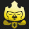
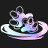

# Augment: silver, Count: 58
| key                    | name                    | icon                                                                 | desc                                                                                                                                                                    |
| -                      | -                       | -                                                                    | -                                                                                                                                                                       |
| AFK                    | AFK                     |                                        | You cannot perform actions for the next 3 rounds. Afterwards, gain 20 gold.                                                                                             |
| AssassinTrait          | Assassin Heart          |                    | Your team counts as having 1 additional Assassin. Gain a Qiyana.                                                                                                        |
| AstralHeart            | Astral Heart            |                        | Your team counts as having 1 additional Astral. Gain a Lux.                                                                                                             |
| AxiomArcI              | Axiom Arc I             |                            | Your units gain 25 Mana on kill.                                                                                                                                        |
| BandofThievesI         | Band of Thieves I       |                  | Gain 1 Thief's Gloves.                                                                                                                                                  |
| BestFriendsI           | Best Friends I          |                      | Your units that start combat only adjacent to each other gain 10% Attack Speed and 15 Armor.                                                                            |
| BigFriend              | Big Friend              |                            | Your units that start combat next to a unit with over 2000 Health take 10% less damage for the rest of combat.                                                          |
| BrawlerHPRegen1        | Shrug It Off            |                | Bruisers regenerate 2.5% of their maximum Health each second. Gain a Sejuani.                                                                                           |
| BruteTrait             | Bruiser Heart           |                          | Your team counts as having 1 additional Bruiser. Gain a Jax.                                                                                                            |
| CannoneerHeart         | Cannoneer Heart         |                  | Your team counts as having 1 additional Cannoneer. Gain a Aphelios.                                                                                                     |
| CavalierHeart          | Cavalier Heart          |                    | Your team counts as having 1 additional Cavalier. Gain a Lillia.                                                                                                        |
| CelestialBlessing1     | Celestial Blessing I    |          | Your units heal for 12% of the damage dealt by attacks and Abilities. Excess healing is converted to a shield up to 250 Health.                                         |
| CyberneticImplants1    | Cybernetic Implants I   |        | Your champions holding an item gain 100 Health and 8 Attack Damage.                                                                                                     |
| CyberneticShell1       | Cybernetic Shell I      |              | Your champions holding an item gain 100 Health and 20 Armor.                                                                                                            |
| CyberneticUplink1      | Cybernetic Uplink I     |            | Your champions holding an item gain 100 Health and restore 2 Mana per second.                                                                                           |
| Distancing             | Exiles I                |                          | Your units that start combat with no adajacent allies gain a 25% maximum Health shield for 10 seconds.                                                                  |
| Diversify1             | Stand United I          |                          | Your units gain 1 Attack Damage and Ability Power per Trait active across your army.                                                                                    |
| Electrocharge1         | Electrocharge I         |                  | When your units receive critical strikes, they deal 50-110 (based on current Stage) magic damage to nearby enemies. (1 second cooldown).                                |
| EvokerHeart            | Evoker Heart            |                        | Your team counts as having 1 additional Evoker. Gain a Zyra.                                                                                                            |
| Featherweights1        | Featherweights I        |                | Your 1 and 2 cost champions gain 25% Attack Speed and Move Speed.                                                                                                       |
| FirstAidKit            | First Aid Kit           |                        | All healing and shielding on your units is increased by 25%.                                                                                                            |
| FuturePeepers          | Future Sight I          |                    | Know who you will fight next. Gain a Zephyr.                                                                                                                            |
| GuardianHeart          | Guardian Heart          |                    | Your team counts as having 1 additional Guardian. Gain a Zac.                                                                                                           |
| GuildHeart             | Guild Heart             |                          | Your team counts as having 1 additional Guild. Gain a Twitch.                                                                                                           |
| ItemGrabBag1           | Item Grab Bag I         |                      | Gain 1 random completed item.                                                                                                                                           |
| LategameSpecialist     | Lategame Specialist     |          | Gain 40 gold when you reach Level 9.                                                                                                                                    |
| LudensEcho1            | Luden's Echo I          |                        | When your units cast and deal Ability damage, the first target hit and a nearby enemy take 40-130 (based on current Stage) magic damage.                                |
| MageHeart              | Mage Heart              |                            | Your team counts as having 1 additional Mage. Gain a Lillia.                                                                                                            |
| MakeshiftArmor1        | Makeshift Armor I       |                | Your units with no items gain 30 Armor and Magic Resist.                                                                                                                |
| Meditation1            | Meditation I            |                        | Your units without items equipped restore 4 Mana per second.                                                                                                            |
| MirageHeart            | Mirage Heart            |                        | Your team counts as having 1 additional Mirage. Gain a Yone.                                                                                                            |
| MysticHeart            | Mystic Heart            |                        | Your team counts as having 1 additional Mystic. Gain a Rakan.                                                                                                           |
| PandorasBench          | Pandora's Bench         |                    | Gain 2 gold. At the start of every turn, Champions on the 3 rightmost bench slots transform into random champions of the same cost.                                     |
| PandorasItems          | Pandora's Items         |                    | Gain a random component. At the start of each round, items on your bench are randomized (excluding Tactician's Crown, Spatula, and consumables).                        |
| Preparation            | Preparation I           |                        | Champions on your bench permanently gain 25, 3 Attack Damage and Ability Power every round, up to 4 times.                                                              |
| RagewingHeart          | Ragewing Heart          |                    | Your team counts as having 1 additional Ragewing. Gain a Rakan.                                                                                                         |
| Recombobulator         | Recombobulator          |                  | Champions on your board permanently transform into random champions that cost 1 more. Gain 2 Magnetic Removers.                                                         |
| ScalescornHeart        | Scalescorn Heart        |                | Your team counts as having 1 additional Scalescorn. Gain a Braum.                                                                                                       |
| SecondWind1            | Second Wind I           |                        | After 10 seconds of combat, your units heal 40% of their missing Health.                                                                                                |
| ShapeshifterHeart      | Shapeshifter Heart      |            | Your team counts as having 1 additional Shapeshifter. Gain a Gnar.                                                                                                      |
| ShimmerscaleCrest      | Shimmerscale Crest      |            | Gain a Shimmerscale Emblem and a Jax.                                                                                                                                   |
| SwiftshotHeart         | Swiftshot Heart         |                  | Your team counts as having 1 additional Swiftshot. Gain a Twitch.                                                                                                       |
| TempestHeart           | Tempest Heart           |                      | Your team counts as having 1 additional Tempest. Gain a Qiyana.                                                                                                         |
| ThrillOfTheHunt1       | Thrill of the Hunt I    |              | Your units heal 400 Health on kill.                                                                                                                                     |
| TinyTitans             | Tiny Titans             |                          | Your Tactician heals 30 Health, grows larger, and has 130 maximum Health.                                                                                               |
| Traitless1             | Built Different I       |                          | Your units with no Traits active gain 250-400 Health and 30-75% Attack Speed. (based on current Stage)                                                                  |
| TriForce               | TriForce I              |                              | Your Tier 3 champions gain 133 Health, 13 starting Mana, and 13% Attack Speed.                                                                                          |
| Twins1                 | Double Trouble I        |                                  | If you have exactly 2 copies of a champion on your board, they both gain 20 Attack Damage, Ability Power, Armor, and Magic Resist. When you 3-star, gain a 2-star copy. |
| WarriorHeart           | Warrior Heart           |                      | Your team counts as having 1 additional Warrior. Gain a Yone.                                                                                                           |
| WhispersHeart          | Whispers Heart          |                    | Your team counts as having 1 additional Whispers. Gain a Zyra.                                                                                                          |
| LagoonHeart            | Lagoon Heart            |                        | Your team counts as having 1 additional Lagoon. Gain a Kai'Sa.                                                                                                          |
| DarkflightHeart        | Darkflight Heart        |                | Your team counts as having 1 additional Darkflight. Gain an Aphelios.                                                                                                   |
| SoulSiphon             | Soul Siphon             |                          | Darkflights benefit from the top-most trait of the sacrificed unit. This does not increase the trait count for that trait.                                              |
| Consistency            | Consistency             |                        | Gain double streak gold.                                                                                                                                                |
| DragonmancerConference | Dragonmancer Conference |  | Every 2 rounds, a random Dragonmancer appears on your bench. Gain a Kai'Sa.                                                                                             |
| BlueBattery1           | Blue Battery I          |                      | After casting their Ability, your units restore 10 Mana.                                                                                                                |
| BattlemageI            | Battlemage I            |                        | Your units that start combat in the front 2 rows gain 15 Armor and 15 Ability Power.                                                                                    |
| KnifesEdgeI            | Knife's Edge I          |                        | Your units that start combat in the front 2 rows gain 15 Attack Damage.                                                                                                 |
# Augment: gold, Count: 96
| key                   | name                     | icon                                                               | desc                                                                                                                                                                                             |
| -                     | -                        | -                                                                  | -                                                                                                                                                                                                |
| Ascension             | Ascension                |                          | After 15 seconds of combat, your units deal 50% more damage.                                                                                                                                     |
| AssassinEmblem        | Assassin Crest           |                | Gain an Assassin Emblem and a Qiyana.                                                                                                                                                            |
| AssassinSmokeBomb     | Smoke Bomb               |          | The first time Assassins drops to 70% health, they briefly enter stealth, becoming untargetable and shedding all negative effects. Any excess damage is reduced by 60%. Gain a Talon.            |
| AxiomArcII            | Axiom Arc II             |                        | Your units gain 40 Mana on kill.                                                                                                                                                                 |
| BeastsDen             | Beast's Den              |                          | Units that start combat next to at least 2 Shapeshifters gain 25% Attack Speed and Move Speed. Shapeshifters always gain this bonus. Gain a Gnar.                                                |
| BestFriendsII         | Best Friends II          |                  | Your units that start combat only adjacent to each other gain 20% Attack Speed and 25 Armor.                                                                                                     |
| BetterTogether        | Better Together          |                | Aura items that buff your team have their effects increased by 33%. Gain a Locket of the Iron Solari                                                                                             |
| BigFriend2            | Big Friend II            |                        | Your units that start combat next to a unit with over 1650 Health take 18% less damage for the rest of combat.                                                                                   |
| BruteEmblem           | Bruiser Crest            |                      | Gain a Bruiser Emblem and a Jax.                                                                                                                                                                 |
| CalculatedLoss        | Calculated Loss          |                | After losing your combat, gain 2 gold and a free Shop refresh.                                                                                                                                   |
| CannoneerCrest        | Cannoneer Crest          |                | Gain a Cannoneer Emblem and a Aphelios.                                                                                                                                                          |
| CavalierCrest         | Cavalier Crest           |                  | Gain a Cavalier Emblem and a Sejuani.                                                                                                                                                            |
| CelestialBlessing2    | Celestial Blessing II    |        | Your units heal for 20% of the damage dealt by attacks and Abilities. Excess healing is converted to a shield up to 350 Health.                                                                  |
| ClearMind             | Clear Mind               |                          | If you have no champions on your bench at the end of a round, gain 3 experience points.                                                                                                          |
| ClutteredMind         | Cluttered Mind           |                  | If your bench is full at the end of a round, gain 3 experience points.                                                                                                                           |
| CombatTrainingII      | Combat Training          |            | Your Champions permanently gain 1 Attack Damage every time they kill an enemy unit. Champions start with 8 Attack Damage.                                                                        |
| ComponentGrabBag      | Component Grab Bag       |            | Gain 3 random item components.                                                                                                                                                                   |
| CyberneticImplants2   | Cybernetic Implants II   |      | Your champions holding an item gain 150 Health and 15 Attack Damage.                                                                                                                             |
| CyberneticShell2      | Cybernetic Shell II      |            | Your champions holding an item gain 150 Health and 30 Armor.                                                                                                                                     |
| CyberneticUplink2     | Cybernetic Uplink II     |          | Your champions holding an item gain 150 Health and restore 3 Mana per second.                                                                                                                    |
| DevastatingCharge     | Devastating Charge       |          | Cavalier's first attack after charging deals 80 magic damage, increased by 1% for each Armor and Magic Resist they have. Gain a Rell.                                                            |
| Distancing2           | Exiles II                |                      | Your units that start combat with no adajacent allies gain a 35% maximum Health shield for 10 seconds.                                                                                           |
| Diversify2            | Stand United II          |                        | Your units gain 2 Attack Damage and 3 Ability Power per Trait active across your army.                                                                                                           |
| DragonmancerCrest     | Dragonmancer Crest       |          | Gain a Dragonmancer Emblem and an   Kai'sa.                                                                                                                                                      |
| Electrocharge2        | Electrocharge II         |                | When your units receive critical strikes, they deal 85-145 (based on current Stage) magic damage to nearby enemies. (1 second cooldown).                                                         |
| EternalProtection     | Eternal Protection       |          | When one of your Jade champions would die, the nearest Jade Statue protects them, losing 70% of its max Health and transferring 200% of that amount to the champion.. Gain an Jax.               |
| EvokerCrest           | Evoker Crest             |                      | Gain an Evoker Emblem and a Zyra.                                                                                                                                                                |
| EyeoftheStorm         | Eye of the Storm         |                  | At the start of combat, the unit in the center of the board gains 45 Ability Power, increased to 135 after Tempest lightning strikes. Gain a Qiyana.                                             |
| Featherweights2       | Featherweights II        |              | Your 1 and 2 cost champions gain 35% Attack Speed and Move Speed.                                                                                                                                |
| FirstAidKitIII        | First Aid Kit II         |                | All healing and shielding on your units is increased by 35%.                                                                                                                                     |
| GadgetExpert          | Gadget Expert            |                    | Direct Damage items deal 25% more damage as true damage. Gain a Statikk Shiv.                                                                                                                    |
| GearUpgrades          | Gear Upgrades            |                    | Guild champions holding an item gain 25 Armor and another 250% of their Guild bonus. Gain a Twitch.                                                                                              |
| GuardianCrest         | Guardian Crest           |                  | Gain a Guardian Emblem and a Zac.                                                                                                                                                                |
| GuildCrest            | Guild Crest              |                        | Gain a Guild Emblem and a Twitch.                                                                                                                                                                |
| Hallucinate           | Hallucinate              |                      | Mirage champions take 90% less damage for the first 6 seconds of combat. Gain a Yone.                                                                                                            |
| HeroicPresence        | Heroic Presence          |                | Guardians taunt all enemies every 2 seconds. Enemies that attack a Guardian's shield take magic damage equal to 7% of the shielded unit's max Health (up to once per second). Gain a Braum.      |
| HotShot               | Hot Shot                 |                              | Cannoneer's cannon shots burn their targets, dealing 8% of the target's maximum Health as true damage over 2 seconds, and reducing healing by 50% for the duration of the burn. Gain a Tristana. |
| HyperRoll             | Hustler                  |                          | If you have less than 20 gold at the end of a round, gain 2 gold.                                                                                                                                |
| Inspire               | Inspire                  |                              | When the Dragonmancer Hero gets a takedown, champions that share a trait with the Dragonmancer Hero gain 70% Attack Speed for 3 seconds. Gain a Ashe.                                            |
| IntercosmicGifts      | Intercosmic Gifts        |            | Astral Orbs have a 100% chance to spawn a smaller orb that contains bonus loot. Gain a Lux.                                                                                                      |
| JadeHeart             | Jade Heart               |                          | Your team counts as having 1 additional Jade. Gain a Gnar.                                                                                                                                       |
| JeweledLotus          | Jeweled Lotus            |                    | Magic and true damage from your units' Abilities can critically strike. Your units gain 25% Critical Strike Chance.                                                                              |
| LastStand             | Last Stand               |                          | The first time you would die, instead drop to 1 Health. After this effect triggers, your units gain 200 Health, 20 Armor and Magic Resist, and 20% Omnivamp.                                     |
| LootMaster            | Loot Master              |                        | Gain a random component every 4 player combat rounds when you have at least Guild (2) active. Gain a Twitch.                                                                                     |
| LudensEcho2           | Luden's Echo II          |                      | When your units cast and deal Ability damage, the first target hit and a nearby enemy take 55-160 (based on current Stage) magic damage.                                                         |
| MageConference        | Mage Conference          |                | While the Mage trait is active, a random Mage portals onto your bench after combat with a player. Gain a Lillia.                                                                                 |
| MageCrest             | Mage Crest               |                          | Gain a Mage Emblem and a Vladimir.                                                                                                                                                               |
| MakeshiftArmor2       | Makeshift Armor II       |              | Your units with no items gain 45 Armor and Magic Resist.                                                                                                                                         |
| Meditation2           | Meditation II            |                      | Your units without items equipped restore 6 Mana per second.                                                                                                                                     |
| MetabolicAccelerator  | Metabolic Accelerator    |    | Your Tactician moves faster and heals 2 Health after a PVP round.                                                                                                                                |
| MirageCrest           | Mirage Crest             |                      | Gain a Mirage Emblem and a Nunu.                                                                                                                                                                 |
| Penitence             | Penitence                |                          | Enemies are disarmed for 2.5 seconds the first time they attack a Jade Statue or are damaged by a Jade Statue's explosion. Gain a Gnar.                                                          |
| PersonalTraining      | Personal Training        |            | At the end of combat, Champions that started combat adjacent to Bruiser permanently gain 30 Health, increased by 20 if they survived. Gain a Jax.                                                |
| PortableForge         | Portable Forge           |                  | Open an Armory and choose 1 of 3 unique Artifacts crafted by Ornn.                                                                                                                               |
| PreparationII         | Preparation II           |                  | Champions on your bench permanently gain 35, 4 Attack Damage and Ability Power every round, up to 4 times.                                                                                       |
| PresstheAttack        | Press the Attack         |                | Your Swiftshots' attacks apply a stack on their target for 5 seconds. Every third stack consumes all stacks to deal true damage equal to 5% of the target's maximum Health. Gain a Twitch.       |
| RagewingCrest         | Ragewing Crest           |                  | Gain a Ragewing Emblem and a Sena.                                                                                                                                                               |
| RecklessSpending      | Reckless Spending        |            | If you purchase both XP and a Shop Refresh during the Planning Phase, Shimmerscale champions and Champions having a Shimmerscale item gain 40% damage for the next combat phase. Gain a Jax.     |
| RichGetRicher         | Rich Get Richer          |                  | Gain 10 gold. Your maximum interest is increased to 7.                                                                                                                                           |
| RichGetRicherPlus     | Rich Get Richer+         |          | Gain 15 gold. Your maximum interest is increased to 7.                                                                                                                                           |
| Ricochet              | Ricochet                 |                            | Cannoneer's cannon shots bounce once, dealing 40% less damage. Gain a Aphelios.                                                                                                                  |
| SalvageBin            | Salvage Bin              |                        | Gain a random completed item. Selling champions breaks apart their full items into components (excluding Tactician's Crown).                                                                     |
| ScalescornCrest       | Scalescorn Crest         |              | Gain a Scalescorn Emblem and a Braum.                                                                                                                                                            |
| Scorch                | Scorch                   |                                | Every 5th instance of Ragewing champion's damage deals 33% more damage and is converted to true damage. Gain a Kayn.                                                                             |
| SecondWind2           | Second Wind II           |                      | After 10 seconds of combat, your units heal 60% of their missing Health.                                                                                                                         |
| ShimmerscaleHeart     | Shimmerscale Heart       |          | Your team counts as having 1 additional Shimmerscale. Gain a Jax.                                                                                                                                |
| SunfireBoard          | Sunfire Board            |                    | At the start of combat, burn all enemies for 10% of their maximum Health over 20 seconds and reduce healing received by 50%.                                                                     |
| SwiftshotCrest        | Swiftshot Crest          |                | Gain a Swiftshot Emblem and a Twitch.                                                                                                                                                            |
| Tantrum               | Tantrum                  |                              | After casting their first Ability, Ragewings restore 100% of their maximum Rage.                                                                                                                 |
| TargetDummies         | Phony Frontline          |                  | Gain 2 Target Dummies.                                                                                                                                                                           |
| TempestCrest          | Tempest Crest            |                    | Gain a Tempest Emblem and a Qiyana.                                                                                                                                                              |
| ThreesCompany         | Three's Company          |                  | Gain 3 random 3-cost champions.                                                                                                                                                                  |
| ThrillOfTheHunt2      | Thrill of the Hunt II    |            | Your units heal 700 Health on kill.                                                                                                                                                              |
| Tiamat                | Tiamat                   |                                | Warrior's additional attacks deal 50% of their damage to enemies in a 1-hex area around their target. Gain a Yone.                                                                               |
| TitanicStrength       | Titanic Strength         |              | Bruisers gain 1.5% of their Health as Attack Damage. Gain a Tahm Kench.                                                                                                                          |
| TomeOfTraits1         | Ancient Archives I       |                  | Gain 1 Tome of Traits.                                                                                                                                                                           |
| TradeSector           | Trade Sector             |                      | Gain a free Shop refresh each round.                                                                                                                                                             |
| TradeSectorPlus       | Trade Sector+            |              | Gain a free Shop refresh each round. Gain 8 golds.                                                                                                                                               |
| Traitless2            | Built Different II       |                        | Your units with no Traits active gain 300-525 Health and 50-80% Attack Speed. (based on current Stage)                                                                                           |
| TriForce2             | TriForce II              |                          | Your Tier 3 champions gain 233 Health, 23 starting Mana, and 23% Attack Speed.                                                                                                                   |
| TrueTwos              | True Twos                |                            | Gain 1 random 2-star Tier 1 champions and 1 random 2-star Tier 2 champion.                                                                                                                       |
| Twins2                | Double Trouble II        |                                | If you have exactly 2 copies of a champion on your board, they both gain 30 Attack Damage, Ability Power, Armor, and Magic Resist. When you 3-star, gain a 2-star copy.                          |
| WarriorCrest          | Warrior Crest            |                    | Gain a Warrior Emblem and a Yone.                                                                                                                                                                |
| ScopedWeaponsI        | Scoped Weapons I         |                | Your units that start combat in the back 2 rows gain +1 Attack Range and 15% Attack Speed.                                                                                                       |
| ProtectorsoftheCosmos | Protectors of the Cosmos |  | Combat start: Your team gains a 35 Health shield for every item component equipped on an Astral Champion, including those that are part of a full item. Gain a Lux.                              |
| DarkflightCrest       | Darkflight Crest         |              | Gain a Darkflight Emblem and a Rell.                                                                                                                                                             |
| DragonImperialist     | Dragon Imperialist       |          | If you only have 1 Dragon, Dragons execute enemies they damage who are below 18% Health. Gain a Nomsy.                                                                                           |
| HeroInTraining        | Hero-In-Training         |                | The Dragonmancer nearest to the Dragonmancer Hero gains 66% of the Dragonmancer trait's bonuses. Gain a Sett.                                                                                    |
| LagoonCrest           | Lagoon Crest             |                      | Gain a Lagoon Emblem and a Zac.                                                                                                                                                                  |
| HighTide              | High Tide                |                            | Until they cast 2 times, Lagoon champions have 30% reduced Attack Speed but gain 12 Mana per second. Gain a Kai'sa.                                                                              |
| Oasis                 | Oasis                    |                                  | When Lagoon champions gain a shield, they remove all negative effects on themselves and heal for 18% of their missing Health. Gain a Zac.                                                        |
| EssenceTheft2         | Essence Theft            |                  | Mages' attacks drain 8 Mana from their target and gain 4 of the drained Mana. Gain a Lux.                                                                                                        |
| BaseCamp              | Base Camp                |                            | Scalescorns gain 7% damage each time they start combat in the same hex, stacking up to 4 times. Gain a Lillia.                                                                                   |
| Terrify               | Terrify                  |                              | Your units take 15% less damage from enemies shrunken by Whispers champions. Gain a Sylas.                                                                                                       |
| BattlemageII          | Battlemage II            |                    | Your units that start combat in the front 2 rows gain 25 Armor and 25 Ability Power.                                                                                                             |
| KnifesEdgeII          | Knife's Edge II          |                    | Your units that start combat in the front 2 rows gain 25 Attack Damage.                                                                                                                          |
# Augment: prismatic, Count: 71
| key                 | name                    | icon                                                           | desc                                                                                                                                                                                                  |
| -                   | -                       | -                                                              | -                                                                                                                                                                                                     |
| AncientArchivesII   | Ancient Archives II     |      | Gain 2 Tome of Traits.                                                                                                                                                                                |
| AssassinEmblem2     | Assassin Crown          |          | Gain an Assassin Emblem, a Hand of Justice, and a Diana.                                                                                                                                              |
| BandOfThieves2      | Band of Thieves II      |            | Gain 2 Thief's Gloves.                                                                                                                                                                                |
| BestFriendsIII      | Best Friends III        |            | Your units that start combat only adjacent to each other gain 20% Attack Speed and 35 Armor.                                                                                                          |
| BinaryAirdrop       | Binary Airdrop          |              | Your champions equipped with 2 items temporarily gain a random completed item at the start of combat.                                                                                                 |
| BruteEmblem2        | Bruiser Crown           |                | Gain a Bruiser Emblem, a Redemption, and an Sylas.                                                                                                                                                    |
| CannoneerCrown      | Cannoneer Crown         |            | Gain a Cannoneer Emblem, a Runaan's Hurricane, and a Aphelios.                                                                                                                                        |
| CavalierCrown       | Cavalier Crown          |              | Gain a Cavalier Emblem, a Redemption, and a Nunu.                                                                                                                                                     |
| CavalierUnity       | Cavalier Unity          |              | The Cavalier trait grants its bonuses to all of your Champions. This does not increase your number of Cavaliers. Gain a Sejuani.                                                                      |
| CelestialBlessing3  | Celestial Blessing III  |    | Your units heal for 35% of the damage dealt by attacks and Abilities. Excess healing is converted to a shield up to 450 Health.                                                                       |
| CruelPact           | Cruel Pact              |                      | Buying XP costs 6 Health instead of gold. But Heal 3 Health after a round.                                                                                                                            |
| CursedCrown         | Cursed Crown            |                  | Gain +2 maximum team size, but take 100% increased player damage.                                                                                                                                     |
| CyberneticImplants3 | Cybernetic Implants III |  | Your champions holding an item gain 250 Health and 25 Attack Damage.                                                                                                                                  |
| CyberneticShell3    | Cybernetic Shell III    |        | Your champions holding an item gain 250 Health and 40 Armor.                                                                                                                                          |
| CyberneticUplink3   | Cybernetic Uplink III   |      | Your champions holding an item gain 250 Health and restore 4 Mana per second.                                                                                                                         |
| Distancing3         | Exiles III              |                  | Your units that start combat with no adajacent allies gain a 50% maximum Health shield for 10 seconds.                                                                                                |
| Diversify3          | Stand United III        |                    | Your units gain 3 Attack Damage and Ability Power per Trait active across your army.                                                                                                                  |
| DragonmancerSoul    | Dragonmancer Crown      |        | Gain a Dragonmancer Emblem, a Hand of Justice, and a Lee Sin.                                                                                                                                         |
| Electrocharge3      | Electrocharge III       |            | When your units receive critical strikes, they deal 115-235 (based on current Stage) magic damage to nearby enemies. (1 second cooldown).                                                             |
| EvokerCrown         | Evoker Crown            |                  | Gain an Evoker Emblem, a Spear of Shojin, and an Seraphine.                                                                                                                                           |
| Featherweights3     | Featherweights III      |          | Your 1 and 2 cost units gain 60% Attack Speed and Move Speed.                                                                                                                                         |
| FuturePeepers2      | Future Sight II         |            | Know who you fight next. Gain a Radiant Zephyr.                                                                                                                                                       |
| GrandGambler        | High Roller             |                | Gain 3 Loaded Dice and 8 gold.                                                                                                                                                                        |
| GuardianCrown       | Guardian Crown          |              | Gain a Guardian Emblem, a Sunfire Cape, and a Braum.                                                                                                                                                  |
| GuildCrown          | Guild Crown             |                    | Gain a Guild Emblem, a Giant Slayer and a Twitch.                                                                                                                                                     |
| HighEndShopping     | High End Shopping       |          | Champions appear in your Shop as if you were 1 level higher. Gain 10 gold.                                                                                                                            |
| ItemGrabBag2        | Item Grab Bag II        |                | Gain 2 random completed items and 2 Reforgers.                                                                                                                                                        |
| JadeCrown           | Jade Soul               |                      | Your team counts as having 1 additional Jade. Gain an Titan's Resolve and a Gnar.                                                                                                                     |
| LivingForge         | Living Forge            |                  | Gain a random Ornn item now and after every 10 player combats.                                                                                                                                        |
| LudensEcho3         | Luden's Echo III        |                  | When your units cast and deal Ability damage, the first target hit and a nearby enemy take 90-240 (based on current Stage) magic damage.                                                              |
| MageCrown           | Mage Crown              |                      | Gain a Mage Emblem, a Spear of Shojin, and a Lux.                                                                                                                                                     |
| MakeshiftArmor3     | Makeshift Armor III     |          | Your units with no items gain 65 Armor and Magic Resist.                                                                                                                                              |
| MaxLevel10          | Level Up!               |                    | When you buy experience points, gain an additional 3. You can now reach level 10.                                                                                                                     |
| Meditation3         | Meditation III          |                  | Your units without items equipped restore 8 Mana per second.                                                                                                                                          |
| MirageCrown         | Mirage Crown            |                  | Gain a Mirage Emblem, a Hand of Justice, and a Nunu.                                                                                                                                                  |
| MysticSoul          | Mystic Soul             |                    | Your team counts as having 1 additional Mystic. Gain a Spear of Shojin and a Rakan.                                                                                                                   |
| NewRecruit3         | New Recruit             |                  | Gain +1 maximum team size.                                                                                                                                                                            |
| PreparationIII      | Preparation III         |            | Champions on your bench permanently gain 50, 7 Attack Damage and Ability Power every round, up to 4 times.                                                                                            |
| RadiantRelics       | Radiant Relics          |              | Open an Armory and choose 1 of 5 unique Radiant items.                                                                                                                                                |
| ScalescornCrown     | Scalescorn Crown        |          | Gain a Scalescorn Emblem, a Hand of Justice, and a Diana.                                                                                                                                             |
| ShapeshifterSoul    | Shapeshifter Soul       |        | Your team counts as having 1 additional Shapeshifter. Gain a Sunfire Cape and an Gnar.                                                                                                                |
| ShimmerscaleSoul    | Shimmerscale Soul       |        | Your team counts as having 1 additional Shimmerscale. Gain a Titan's Resolve and a Volibear.                                                                                                          |
| SlowAndSteady       | March of Progress       |              | Gain 5 bonus experience points per round. You can no longer use gold to level up.                                                                                                                     |
| SwiftshotCrown      | Swiftshot Crown         |            | Gain a Swiftshot Emblem, a Guinsoo's Rageblade, and a Varus.                                                                                                                                          |
| TempestCrown        | Tempest Crown           |                | Gain a Tempest Emblem, a Statikk Shiv, and a Lee Sin.                                                                                                                                                 |
| TheGoldenEgg        | The Golden Egg          |                | Gain a massive golden egg that hatches in 11 turns. If you won vs player, receive bonus turn.                                                                                                         |
| ThinkFast           | Think Fast              |                      | Shop refreshes are free until the end of this round. Traits and other augments do not benefit from these free shops. Gain 8 gold.                                                                     |
| ThriftShop          | Wise Spending           |                    | Gain 2 experience points when you refresh your Shop.                                                                                                                                                  |
| Traitless3          | Built Different III     |                    | Your units with no Traits active gain 350-650 Health and 50-95% Attack Speed. (based on current Stage)                                                                                                |
| TriForce3           | Tri Force III           |                      | Your Tier 3 champions gain 333 Health, 33 starting Mana, and 33% Attack Speed.                                                                                                                        |
| Twins3              | Double Trouble III      |                            | If you have exactly 2 copies of a champion on your board, they both gain 40 Attack Damage, Ability Power, Armor, and Magic Resist. When you 3-star, gain a 2-star copy.                               |
| UrfsGrabBagII       | Urf's Grab Bag II       |              | Gain 1 Spatula and 3 random item components.                                                                                                                                                          |
| VerdantVeil         | Verdant Veil            |                  | Your units are immune to crowd control effects for the first 20 seconds of combat.                                                                                                                    |
| WarriorCrown        | Warrior Crown           |                | Gain a Warrior Emblem, a Giant Slayer, and an Yone.                                                                                                                                                   |
| Windfall            | Windfall                |                        | Gain 20 gold.                                                                                                                                                                                         |
| WindfallPlus        | Windfall+               |                | Gain 35 gold.                                                                                                                                                                                         |
| WindfallPlusPlus    | Windfall++              |        | Gain 40 gold.                                                                                                                                                                                         |
| BirthdayPresent     | Birthday Present        |          | Gain a 2-star champion every time you level up. The champion's tier is your level minus 4 (min: Tier 1). Gain additional 1 gold every time you level up.                                              |
| LuckyGloves         | Lucky Gloves            |                  | Thief's Gloves will always give your champions items that they can use well. Gain a Thief's Gloves.                                                                                                   |
| WoodlandCharm       | Woodland Charm          |              | Your highest Health champion is cloned. Clones cannot hold items.                                                                                                                                     |
| ScopedWeaponsII     | Scoped Weapons II       |          | Your units that start combat in the back 2 rows gain infinite Attack Range.                                                                                                                           |
| PartTimeAssassins   | Part Time Assassins     |      | The Assassin trait grants its bonuses to your champions that start combat in the back 2 rows. This does not increase your number of Assassins. Gain a Qiyana.                                         |
| DarkflightCrown     | Darkflight Crown        |          | Gain a Darkflight Emblem, a Titan's Resolve, and an Rengar.                                                                                                                                           |
| AgeofDragons        | Age of Dragons          |                | If you only have Dragons, every 5th attack from a Dragon fires a Dragonsoul blast that deals magic damage equal to 15% of their target's max Health. Gain a Nomsy, Zippy, and a random Tier 4 Dragon. |
| LagoonCrown         | Lagoon Crown            |                  | Gain a Lagoon Emblem, a Spear of Shojin and a Zeri.                                                                                                                                                   |
| RagewingSoul        | Ragewing Soul           |                | Your team counts as having 1 additional Ragewing. Gain a Guinsoo's Rageblade and a Rakan.                                                                                                             |
| BlueBattery3        | Blue Battery II         |                | After casting their Ability, your units restore 20 Mana.                                                                                                                                              |
| GoldenTicket        | Golden Ticket           |                | Each time your Shop is refreshed, you have a 50% chance to gain a free refresh.                                                                                                                       |
| BattlemageIII       | BattlemageIII           |              | Your units that start combat in the front 2 rows gain 35 Armor and 35 Ability Power.                                                                                                                  |
| KnifesEdgeIII       | Knife's Edge III        |              | Your units that start combat in the first 2 rows gain 40 Attack Damage.                                                                                                                               |
| Dragoncrown         | Dragon Soul             |                  | Your team counts as having 1 additional Dragon. Gain a Zippy and a Gargoyle Stoneplate.                                                                                                               |
