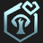
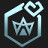
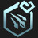
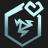
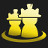
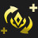
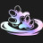
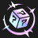
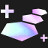
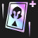

# Augment: silver, Count: 51
| key                 | name                  | icon                                                         | desc                                                                                                                                                                    |
| -                   | -                     | -                                                            | -                                                                                                                                                                       |
| AssassinTrait       | Assassin Heart        |              | Your team counts as having 1 additional Assassin. Gain a Kayn.                                                                                                          |
| BrawlerHPRegen1     | Shrug It Off          |          | Bruisers regenerate 2.5% of their maximum Health each second. Gain a Sejuani.                                                                                           |
| BruteTrait          | Bruiser Heart         |                    | Your team counts as having 1 additional Bruiser. Gain a Shen.                                                                                                           |
| CelestialBlessing1  | Celestial Blessing I  |    | Your units heal for 12% of the damage dealt by attacks and Abilities. Excess healing is converted to a shield up to 300 Health.                                         |
| CyberneticImplants1 | Cybernetic Implants I |  | Your champions holding an item gain 100 Health and 8 Attack Damage.                                                                                                     |
| CyberneticShell1    | Cybernetic Shell I    |        | Your champions holding an item gain 100 Health and 20 Armor.                                                                                                            |
| CyberneticUplink1   | Cybernetic Uplink I   |      | Your champions holding an item gain 100 Health and restore 2 Mana per second.                                                                                           |
| Distancing          | Exiles I              |                    | Your units that start combat with no adajacent allies gain a 25% maximum Health shield for 10 seconds.                                                                  |
| Diversify1          | Stand United I        |                    | Your units gain 1 Attack Damage and Ability Power per Trait active across your army.                                                                                    |
| Electrocharge1      | Electrocharge I       |            | When your units receive critical strikes, they deal 50-110 (based on current Stage) magic damage to nearby enemies. (1 second cooldown).                                |
| Featherweights1     | Featherweights I      |          | Your 1 and 2 cost champions gain 25% Attack Speed and Move Speed.                                                                                                       |
| FirstAidKit         | First Aid Kit         |                  | All healing and shielding on your units is increased by 25%.                                                                                                            |
| ItemGrabBag1        | Item Grab Bag I       |                | Gain 1 random completed item.                                                                                                                                           |
| LudensEcho1         | Luden's Echo I        |                  | When your units cast and deal Ability damage, the first target hit and a nearby enemy take 40-130 (based on current Stage) magic damage.                                |
| MakeshiftArmor1     | Makeshift Armor I     |          | Your units with no items gain 30 Armor and Magic Resist.                                                                                                                |
| Meditation1         | Meditation I          |                  | Your units without items equipped restore 4 Mana per second.                                                                                                            |
| PandorasItems       | Pandora's Items       |              | Gain a random component. At the start of each round, items on your bench are randomized (excluding Tactician's Crown, Spatula, and consumables).                        |
| Recombobulator      | Recombobulator        |            | Champions on your board permanently transform into random champions that cost 1 more. Gain 2 Magnetic Removers.                                                         |
| SecondWind1         | Second Wind I         |                  | After 10 seconds of combat, your units heal 40% of their missing Health.                                                                                                |
| ThrillOfTheHunt1    | Thrill of the Hunt I  |        | Your units heal 400 Health on kill.                                                                                                                                     |
| TinyTitans          | Tiny Titans           |                    | Your Tactician heals 30 Health, grows larger, and has 130 maximum Health.                                                                                               |
| Traitless1          | Built Different I     |                    | Your units with no Traits active gain 250-400 Health and 40-70% Attack Speed. (based on current Stage)                                                                  |
| Twins1              | Double Trouble I      |                            | If you have exactly 2 copies of a champion on your board, they both gain 22 Attack Damage, Ability Power, Armor, and Magic Resist. When you 3-star, gain a 2-star copy. |
| Weakspot            | Weakspot I            |                        | Your units' attacks ignore 20% of the target's Armor and reduce healing received by 50% for 3 seconds.                                                                  |
| BandofThievesI      | Band of Thieves I     |            | Gain 1 Thief's Gloves.                                                                                                                                                  |
| LategameSpecialist  | Lategame Specialist   |    | Gain 45 gold when you reach Level 9.                                                                                                                                    |
| AFK                 | AFK                   |                                  | You cannot perform actions for the next 3 rounds. Afterwards, gain 20 gold.                                                                                             |
| BestFriendsI        | Best Friends I        |                | Your units that start combat only adjacent to each other gain 10% Attack Speed and 15 Armor.                                                                            |
| AxiomArcI           | Axiom Arc I           |                      | Your units gain 25 Mana on kill.                                                                                                                                        |
| Preparation         | Preparation I         |                  | Units on your bench gain 6 Attack Damage and Ability Damage every round, up to 24.                                                                                      |
| BigFriend           | Big Friend            |                      | Your units that start combat next to a unit with over 2000 Health take 10% less damage for the rest of combat.                                                          |
| AstralHeart         | Astral Heart          |                  | Your team counts as having 1 additional Astral. Gain a Nami.                                                                                                            |
| CannoneerHeart      | Cannoneer Heart       |            | Your team counts as having 1 additional Cannoneer. Gain a Tristana.                                                                                                     |
| CavalierHeart       | Cavalier Heart        |              | Your team counts as having 1 additional Cavalier. Gain a Lillia.                                                                                                        |
| EvokerHeart         | Evoker Heart          |                  | Your team counts as having 1 additional Evoker. Gain a Lulu.                                                                                                            |
| GuardianHeart       | Guardian Heart        |              | Your team counts as having 1 additional Guardian. Gain a Thresh.                                                                                                        |
| GuildHeart          | Guild Heart           |                    | Your team counts as having 1 additional Guild. Gain a Twitch.                                                                                                           |
| MageHeart           | Mage Heart            |                      | Your team counts as having 1 additional Mage. Gain a Nami.                                                                                                              |
| MirageHeart         | Mirage Heart          |                  | Your team counts as having 1 additional Mirage. Gain a Yone.                                                                                                            |
| MysticHeart         | Mystic Heart          |                  | Your team counts as having 1 additional Mystic. Gain a Nami.                                                                                                            |
| RagewingHeart       | Ragewing Heart        |              | Your team counts as having 1 additional Ragewing. Gain a Shen.                                                                                                          |
| RevelHeart          | Revel Heart           |                    | Your team counts as having 1 additional Revel. Gain a Jinx.                                                                                                             |
| ScalescornHeart     | Scalescorn Heart      |          | Your team counts as having 1 additional Scalescorn. Gain a Braum.                                                                                                       |
| ShapeshifterHeart   | Shapeshifter Heart    |      | Your team counts as having 1 additional Shapeshifter. Gain a Gnar.                                                                                                      |
| SwiftshotHeart      | Swiftshot Heart       |            | Your team counts as having 1 additional Swiftshot. Gain a Twitch.                                                                                                       |
| TempestHeart        | Tempest Heart         |                | Your team counts as having 1 additional Tempest. Gain a Qiyana.                                                                                                         |
| WarriorHeart        | Warrior Heart         |                | Your team counts as having 1 additional Warrior. Gain a Yone.                                                                                                           |
| WhispersHeart       | Whispers Heart        |              | Your team counts as having 1 additional Whispers. Gain a Thresh.                                                                                                        |
| JadeCrest           | Jade Crest            |                      | Gain a Jade Emblem and a Ashe.                                                                                                                                          |
| ShimmerscaleCrest   | Shimmerscale Crest    |      | Gain a Shimmerscale Emblem and a Kayn.                                                                                                                                  |
| TriForce            | TriForce I            |                        | Your Tier 3 champions gain 133 Health, 13 starting Mana, and 13% Attack Speed.                                                                                          |
# Augment: gold, Count: 95
| key                  | name                   | icon                                                           | desc                                                                                                                                                                                             |
| -                    | -                      | -                                                              | -                                                                                                                                                                                                |
| Ascension            | Ascension              |                        | After 15 seconds of combat, your units deal 50% more damage.                                                                                                                                     |
| AssassinCutthroat    | Cutthroat              |        | Assassins Mana-Reave the first unit they attack, increasing their maximum Mana by 50% until they cast. Assassins deal 10% more damage against Mana-Reaved targets. Gain a Qiyana.                |
| AssassinEmblem       | Assassin Crest         |              | Gain an Assassin Emblem and a Kayn.                                                                                                                                                              |
| AssassinSmokeBomb    | Smoke Bomb             |        | The first time Assassins drops to 70% health, they briefly enter stealth, becoming untargetable and shedding all negative effects. Any excess damage is reduced by 60%. Gain a Talon.            |
| BruteEmblem          | Bruiser Crest          |                    | Gain a Bruiser Emblem and a Taric.                                                                                                                                                               |
| CalculatedLoss       | Calculated Loss        |              | After losing your combat, gain 2 gold and a free Shop refresh.                                                                                                                                   |
| CelestialBlessing2   | Celestial Blessing II  |      | Your units heal for 20% of the damage dealt by attacks and Abilities. Excess healing is converted to a shield up to 450 Health.                                                                  |
| ClearMind            | Clear Mind             |                        | If you have no champions on your bench at the end of a round, gain 3 experience points.                                                                                                          |
| ComponentGrabBag     | Component Grab Bag     |          | Gain 3 random item components.                                                                                                                                                                   |
| CyberneticImplants2  | Cybernetic Implants II |    | Your champions holding an item gain 150 Health and 15 Attack Damage.                                                                                                                             |
| CyberneticShell2     | Cybernetic Shell II    |          | Your champions holding an item gain 150 Health and 30 Armor.                                                                                                                                     |
| CyberneticUplink2    | Cybernetic Uplink II   |        | Your champions holding an item gain 150 Health and restore 3 Mana per second.                                                                                                                    |
| Distancing2          | Exiles II              |                    | Your units that start combat with no adajacent allies gain a 35% maximum Health shield for 10 seconds.                                                                                           |
| Diversify2           | Stand United II        |                      | Your units gain 2 Attack Damage and Ability Power per Trait active across your army.                                                                                                             |
| Electrocharge2       | Electrocharge II       |              | When your units receive critical strikes, they deal 85-145 (based on current Stage) magic damage to nearby enemies. (1 second cooldown).                                                         |
| Featherweights2      | Featherweights II      |            | Your 1 and 2 cost champions gain 35% Attack Speed and Move Speed.                                                                                                                                |
| FuturePeepers        | Future Sight I         |                | Know who you will fight next. Gain a Zephyr.                                                                                                                                                     |
| HyperRoll            | Hustler                |                        | If you have less than 20 gold at the end of a round, gain 2 gold.                                                                                                                                |
| JeweledLotus         | Jeweled Lotus          |                  | Magic and true damage from your units' Abilities can critically strike. Your units gain 25% Critical Strike Chance.                                                                              |
| LudensEcho2          | Luden's Echo II        |                    | When your units cast and deal Ability damage, the first target hit and a nearby enemy take 55-160 (based on current Stage) magic damage.                                                         |
| MakeshiftArmor2      | Makeshift Armor II     |            | Your units with no items gain 45 Armor and Magic Resist.                                                                                                                                         |
| Meditation2          | Meditation II          |                    | Your units without items equipped restore 6 Mana per second.                                                                                                                                     |
| MetabolicAccelerator | Metabolic Accelerator  |  | Your Tactician moves faster and heals 2 Health after a PVP round.                                                                                                                                |
| PortableForge        | Portable Forge         |                | Open an Armory and choose 1 of 3 unique Artifacts crafted by Ornn.                                                                                                                               |
| SalvageBin           | Salvage Bin            |                      | Gain a random completed item. Selling champions breaks apart their full items into components (excluding Tactician's Crown).                                                                     |
| SecondWind2          | Second Wind II         |                    | After 10 seconds of combat, your units heal 60% of their missing Health.                                                                                                                         |
| SunfireBoard         | Sunfire Board          |                  | At the start of combat, burn all enemies for 15% of their maximum Health over 15 seconds and reduce healing received by 50%.                                                                     |
| TargetDummies        | Phony Frontline        |                | Gain 2 Target Dummies.                                                                                                                                                                           |
| ThreesCompany        | Three's Company        |                | Gain 3 random 3-cost champions.                                                                                                                                                                  |
| ThrillOfTheHunt2     | Thrill of the Hunt II  |          | Your units heal 700 Health on kill.                                                                                                                                                              |
| TomeOfTraits1        | Ancient Archives I     |                | Gain 1 Tome of Traits.                                                                                                                                                                           |
| TradeSector          | Trade Sector           |                    | Gain a free Shop refresh each round.                                                                                                                                                             |
| Traitless2           | Built Different II     |                      | Your units with no Traits active gain 300-600 Health and 50-80% Attack Speed. (based on current Stage)                                                                                           |
| TrueTwos             | True Twos              |                          | Gain 1 random 2-star Tier 1 champions and 1 random 2-star Tier 2 champion.                                                                                                                       |
| Twins2               | Double Trouble II      |                              | If you have exactly 2 copies of a champion on your board, they both gain 33 Attack Damage, Ability Power, Armor, and Magic Resist. When you 3-star, gain a 2-star copy.                          |
| PandorasBench        | Pandora's Bench        |                | Gain 5 gold. At the start of every turn, Champions on the 3 rightmost bench slots transform into random champions of the same cost.                                                              |
| JadeHeart            | Jade Heart             |                        | Your team counts as having 1 additional Jade. Gain a Gnar.                                                                                                                                       |
| ShimmerscaleHeart    | Shimmerscale Heart     |        | Your team counts as having 1 additional Shimmerscale. Gain a Kayn.                                                                                                                               |
| RichGetRicherPlus    | Rich Get Richer+       |        | Gain 18 gold. Your maximum interest is increased to 7.                                                                                                                                           |
| UrfsGrabBagI         | Urf's Grab Bag I       |                  | Gain 1 Spatula and 1 random item component.                                                                                                                                                      |
| GadgetExpert         | Gadget Expert          |                  | Direct Damage items deal 33% more damage as true damage. Gain a Statikk Shiv.                                                                                                                    |
| ClutteredMind        | Cluttered Mind         |                | If your bench is full at the end of a round, gain 4 experience points.                                                                                                                           |
| LastStand            | Last Stand             |                        | The first time you would die, instead drop to 1 Health. After this effect triggers, your units gain 200 Health, 20 Armor and Magic Resist, and 20% Omnivamp.                                     |
| BetterTogether       | Better Together        |              | Aura items that buff your team have their effects increased by 33%. Gain a Locket of the Iron Solari.                                                                                            |
| CombatTrainingII     | Combat Training I      |          | Your Champions permanently gain 1 Attack Damage every time they kill an enemy unit. Champions start with 8 Attack Damage.                                                                        |
| BestFriendsII        | Best Friends II        |                | Your units that start combat only adjacent to each other gain 15 Attack Speed and 25 Armor.                                                                                                      |
| AxiomArcII           | Axiom Arc II           |                      | Your units gain 40 Mana on kill.                                                                                                                                                                 |
| IntercosmicGifts     | Intercosmic Gifts      |          | Astral Orbs have a 100% chance to spawn a smaller orb that contains bonus loot. Gain a Nami.                                                                                                     |
| PersonalTraining     | Personal Training      |          | At the end of combat, Champions that started combat adjacent to Bruiser permanently gain 40 Health, increased by 20 if they survived. Gain a Shen.                                               |
| TitanicStrength      | Titanic Strength       |            | Bruisers gain 1.5% of their Health as Attack Damage. Gain a Tahm Kench.                                                                                                                          |
| CannoneerCrest       | Cannoneer Crest        |              | Gain a Cannoneer Emblem and a Jinx.                                                                                                                                                              |
| Ricochet             | Ricochet               |                          | Cannoneer's cannon shots bounce once, dealing 33% less damage. Gain a Tristana.                                                                                                                  |
| HotShot              | Hot Shot               |                            | Cannoneer's cannon shots burn their targets, dealing 6% of the target's maximum Health as true damage over 2 seconds, and reducing healing by 50% for the duration of the burn. Gain a Tristana. |
| CavalierCrest        | Cavalier Crest         |                | Gain a Cavalier Emblem and a Sejuani.                                                                                                                                                            |
| DevastatingCharge    | Devastating Charge     |        | Cavalier's first attack after charging deals 85 magic damage, increased by 1% for each Armor and Magic Resist they have. Gain a Lillia.                                                          |
| DragonAlliance       | Dragon Alliance        |              | The Dragon trait remains active regardless of how many Dragons you have. Dragons gain 60 Armor and Magic Resist. Gain a random Tier 4 Dragon.                                                    |
| DragonHorde          | Dragon Horde           |                    | The Dragon trait remains active regardless of how many Dragons you have. Dragons gain 30 Attack Damage and Ability Power. Gain a random Tier 4 Dragon.                                           |
| Inspire              | Inspire                |                            | When the Dragonmancer Hero gets a takedown, champions that share a trait with the Dragonmancer Hero gain 70% Attack Speed for 3 seconds. Gain a Ashe.                                            |
| DragonmancerCrest    | Dragonmancer Crest     |        | Gain a Dragonmancer Emblem and an Ashe.                                                                                                                                                          |
| EvokerCrest          | Evoker Crest           |                    | Gain an Evoker Emblem and a Lulu.                                                                                                                                                                |
| EssenceTheft         | Essence Theft          |                  | Evoker's attacks steal 5 Mana from their target. Gain a Lulu.                                                                                                                                    |
| GuardianCrest        | Guardian Crest         |                | Gain a Guardian Emblem and a Braum.                                                                                                                                                              |
| HeroicPresence       | Heroic Presence        |              | Guardians taunt all enemies every 2 seconds. Enemies that attack a Guardian's shield take magic damage equal to 7% of the shielded unit's max Health (up to once per second). Gain a Thresh.     |
| GuildCrest           | Guild Crest            |                      | Gain a Guild Emblem and a Twitch.                                                                                                                                                                |
| LootMaster           | Loot Master            |                      | Gain a random component every 4 player combat rounds when you have at least Guild (2) active. Gain a Twitch.                                                                                     |
| GearUpgrades         | Gear Upgrades          |                  | Guild champions holding an item gain 25 Armor and another 250% of their Guild bonus. Gain a Twitch.                                                                                              |
| EternalProtection    | Eternal Protection     |        | When one of your Jade champions would die, the nearest Jade Statue protects them, losing 70% of its max Health and transferring 200% of that amount to the champion.. Gain an Ashe.              |
| Penitence            | Penitence              |                        | Enemies are disarmed for 2.5 seconds the first time they attack a Jade Statue or are damaged by a Jade Statue's explosion. Gain a Gnar.                                                          |
| MageCrest            | Mage Crest             |                        | Gain a Mage Emblem and a Vladimir.                                                                                                                                                               |
| MageConference       | Mage Conference        |              | While the Mage trait is active, a random Mage portals onto your bench after combat with a player. Gain a Lillia.                                                                                 |
| MirageCrest          | Mirage Crest           |                    | Gain a Mirage Emblem and a Nunu.                                                                                                                                                                 |
| Hallucinate          | Hallucinate            |                    | Mirage champions take 90% less damage for the first 6 seconds of combat. Gain a Yone.                                                                                                            |
| RagewingCrest        | Ragewing Crest         |                | Gain a Ragewing Emblem and a Kayn.                                                                                                                                                               |
| Scorch               | Scorch                 |                              | Every 5th instance of Ragewing champion's damage deals 20% more damage and is converted to true damage. Gain a Sena.                                                                             |
| Tantrum              | Tantrum                |                            | After casting their first Ability, Ragewings restore 100% of their maximum Rage.                                                                                                                 |
| RevelCrest           | Revel Crest            |                      | Gain a Revel Emblem and a Jinx.                                                                                                                                                                  |
| PartyFavors          | Party Favors           |                    | Gain 1 gold for every 6 firecrackers launched by Revel champions each combat. Additionally, gain a special prize the first time 100 total firecrackers are launched. Gain a Jinx.                |
| PartyTime            | Party Time!            |                        | After Revels score a takedown, they gain 80% Attack Speed for 4 seconds. Gain a Jinx.                                                                                                            |
| ScalescornCrest      | Scalescorn Crest       |            | Gain a Scalescorn Emblem and a Braum.                                                                                                                                                            |
| BeastsDen            | Beast's Den            |                        | Units that start combat next to at least 2 Shapeshifters gain 35% Attack Speed and Move Speed. Shapeshifters always gain this bonus. Gain a Gnar.                                                |
| RecklessSpending     | Reckless Spending      |          | If you purchase both XP and a Shop Refresh during the Planning Phase, Shimmerscale champions and Champions having a Shimmerscale item gain 40% damage for the next combat phase. Gain a Kayn.    |
| SwiftshotCrest       | Swiftshot Crest        |              | Gain a Swiftshot Emblem and a Ashe.                                                                                                                                                              |
| PresstheAttack       | Press the Attack       |              | Your Swiftshots' attacks apply a stack on their target for 5 seconds. Every third stack consumes all stacks to deal true damage equal to 4% of the target's maximum Health. Gain a Twitch.       |
| TempestCrest         | Tempest Crest          |                  | Gain a Tempest Emblem and a Qiyana.                                                                                                                                                              |
| EyeoftheStorm        | Eye of the Storm       |                | At the start of combat, the unit in the center of the board gains 45 Ability Power, increased to 135 after Tempest lightning strikes. Gain a Qiyana.                                             |
| WarriorCrest         | Warrior Crest          |                  | Gain a Warrior Emblem and a Shen.                                                                                                                                                                |
| Tiamat               | Tiamat                 |                              | Warrior's additional attacks deal 50% of their damage to enemies in a 1-hex area around their target. Gain a Yone.                                                                               |
| WhispersCrest        | Whispers Crest         |                | Gain a Whispers Emblem and a Thresh.                                                                                                                                                             |
| PreparationII        | Preparation II         |                | Units on your bench gain 7 Attack Damage and Ability Damage every round, up to 28.                                                                                                               |
| FirstAidKitIII       | First Aid Kit II       |              | All healing and shielding on your units is increased by 35%.                                                                                                                                     |
| BlueBattery          | Blue Battery           |                    | After casting their Ability, your units restore 20 Mana.                                                                                                                                         |
| RichGetRicher        | Rich Get Richer        |                | Gain 10 gold. Your maximum interest is increased to 7.                                                                                                                                           |
| BigFriend2           | Big Friend II          |                      | Your units that start combat next to a unit with over 2000 Health take 18% less damage for the rest of combat.                                                                                   |
| TriForce2            | TriForce II            |                        | Your Tier 3 champions gain 233 Health, 23 starting Mana, and 23% Attack Speed.                                                                                                                   |
| TradeSectorPlus      | Trade Sector+          |            | Gain a free Shop refresh each round. Gain 8 golds.                                                                                                                                               |
# Augment: prismatic, Count: 61
| key                 | name                    | icon                                                         | desc                                                                                                                                                                    |
| -                   | -                       | -                                                            | -                                                                                                                                                                       |
| AssassinEmblem2     | Assassin Crown          |          | Gain an Assassin Emblem, a Hand of Justice, and a Diana.                                                                                                                |
| BandOfThieves2      | Band of Thieves II      |            | Gain 2 Thief's Gloves.                                                                                                                                                  |
| BinaryAirdrop       | Binary Airdrop          |              | Your champions equipped with 2 items temporarily gain a random completed item at the start of combat.                                                                   |
| BruteEmblem2        | Bruiser Crown           |                | Gain a Bruiser Emblem, a Redemption, and an Sylas.                                                                                                                      |
| CelestialBlessing3  | Celestial Blessing III  |    | Your units heal for 35% of the damage dealt by attacks and Abilities. Excess healing is converted to a shield up to 600 Health.                                         |
| CyberneticImplants3 | Cybernetic Implants III |  | Your champions holding an item gain 250 Health and 25 Attack Damage.                                                                                                    |
| CyberneticShell3    | Cybernetic Shell III    |        | Your champions holding an item gain 250 Health and 40 Armor.                                                                                                            |
| CyberneticUplink3   | Cybernetic Uplink III   |      | Your champions holding an item gain 250 Health and restore 4 Mana per second.                                                                                           |
| Distancing3         | Exiles III              |                  | Your units that start combat with no adajacent allies gain a 50% maximum Health shield for 10 seconds.                                                                  |
| Diversify3          | Stand United III        |                    | Your units gain 3 Attack Damage and Ability Power per Trait active across your army.                                                                                    |
| Electrocharge3      | Electrocharge III       |            | When your units receive critical strikes, they deal 115-235 (based on current Stage) magic damage to nearby enemies. (1 second cooldown).                               |
| Featherweights3     | Featherweights III      |          | Your 1 and 2 cost units gain 60% Attack Speed and Move Speed.                                                                                                           |
| FuturePeepers2      | Future Sight II         |            | Know who you fight next. Gain a Radiant Zephyr.                                                                                                                         |
| GrandGambler        | High Roller             |                | Gain 3 Loaded Dice and 8 gold.                                                                                                                                          |
| HighEndShopping     | High End Shopping       |          | Champions appear in your Shop as if you were 1 level higher. Gain 10 gold.                                                                                              |
| ItemGrabBag2        | Item Grab Bag II        |                | Gain 2 random completed items and 2 Reforgers.                                                                                                                          |
| LudensEcho3         | Luden's Echo III        |                  | When your units cast and deal Ability damage, the first target hit and a nearby enemy take 90-240 (based on current Stage) magic damage.                                |
| MakeshiftArmor3     | Makeshift Armor III     |          | Your units with no items gain 65 Armor and Magic Resist.                                                                                                                |
| MaxLevel10          | Level Up!               |                    | When you buy experience points, gain an additional 3. You can now reach level 10.                                                                                       |
| Meditation3         | Meditation III          |                  | Your units without items equipped restore 8 Mana per second.                                                                                                            |
| NewRecruit3         | New Recruit             |                  | Gain +1 maximum team size.                                                                                                                                              |
| RadiantRelics       | Radiant Relics          |              | Open an Armory and choose 1 of 5 unique Radiant items.                                                                                                                  |
| SlowAndSteady       | March of Progress       |              | Gain 5 bonus experience points per round. You can no longer use gold to level up.                                                                                       |
| TheGoldenEgg        | The Golden Egg          |                | Gain a massive golden egg that hatches in 11 turns. If you won vs player, receive bonus turn.                                                                           |
| ThriftShop          | Wise Spending           |                    | Gain 2 experience points when you refresh your Shop.                                                                                                                    |
| Traitless3          | Built Different III     |                    | Your units with no Traits active gain 400-700 Health and 60-90% Attack Speed. (based on current Stage)                                                                  |
| Twins3              | Double Trouble III      |                            | If you have exactly 2 copies of a champion on your board, they both gain 44 Attack Damage, Ability Power, Armor, and Magic Resist. When you 3-star, gain a 2-star copy. |
| VerdantVeil         | Verdant Veil            |                  | Your units are immune to crowd control effects for the first 15 seconds of combat.                                                                                      |
| Windfall            | Windfall                |                        | Gain 25 gold.                                                                                                                                                           |
| UrfsGrabBagII       | Urf's Grab Bag II       |              | Gain 1 Spatula and 3 random item components.                                                                                                                            |
| LivingForge         | Living Forge            |                  | Gain a random Ornn item now and after every 10 player combats.                                                                                                          |
| AncientArchivesII   | Ancient Archives II     |      | Gain 2 Tome of Traits.                                                                                                                                                  |
| CruelPact           | Cruel Pact              |                      | Buying XP costs 6 Health instead of gold. But Heal 3 Health after a round.                                                                                              |
| ThinkFast           | Think Fast              |                      | Shop refreshes are free until the end of this round. Traits and other augments do not benefit from these free shops. Gain 8 gold.                                       |
| CursedCrown         | Cursed Crown            |                  | Gain +2 maximum team size, but take 100% increased player damage.                                                                                                       |
| CannoneerCrown      | Cannoneer Crown         |            | Gain a Cannoneer Emblem, a Runaan's Hurricane, and a Tristana.                                                                                                          |
| CavalierUnity       | Cavalier Unity          |              | The Cavalier trait grants its bonuses to all of your Champions. This does not increase your number of Cavaliers. Gain a Sejuani.                                        |
| CavalierCrown       | Cavalier Crown          |              | Gain a Cavalier Emblem, a Redemption, and a Nunu.                                                                                                                       |
| DragonmancerSoul    | Dragonmancer Soul       |        | Gain a Dragonmancer Emblem, a Hand of Justice, and a Lee Sin.                                                                                                           |
| EvokerCrown         | Evoker Crown            |                  | Gain an Evoker Emblem, a Spear of Shojin, and an Anivia.                                                                                                                |
| GuardianCrown       | Guardian Crown          |              | Gain a Guardian Emblem, a Sunfire Cape, and a Braum.                                                                                                                    |
| GuildCrown          | Guild Crown             |                    | Gain a Guild Emblem, a Giant Slayer and a Ryze.                                                                                                                         |
| JadeCrown           | Jade Soul               |                      | Your team counts as having 1 additional Jade. Gain an Titan's Resolve and a Gnar.                                                                                       |
| MageCrown           | Mage Crown              |                      | Gain a Mage Emblem, a Spear of Shojin, and a Ryze.                                                                                                                      |
| MirageCrown         | Mirage Crown            |                  | Gain a Mirage Emblem, a Hand of Justice, and a Nunu.                                                                                                                    |
| MysticSoul          | Mystic Soul             |                    | Your team counts as having 1 additional Mystic. Gain a Spear of Shojin and a Lulu.                                                                                      |
| RagewingCrown       | Ragewing Crown          |              | Gain a Ragewing Emblem, a Guinsoo's Rageblade, and a Swain.                                                                                                             |
| RevelCrown          | Revel Crown             |                    | Gain a Revel Emblem and a Jinx.                                                                                                                                         |
| ScalescornCrown     | Scalescorn Crown        |          | Gain a Scalescorn Emblem, a Hand of Justice, and a Diana.                                                                                                               |
| ShapeshifterSoul    | Shapeshifter Soul       |        | Your team counts as having 1 additional Shapeshifter. Gain a Sunfire Cape and an Elise.                                                                                 |
| ShimmerscaleSoul    | Shimmerscale Soul       |        | Your team counts as having 1 additional Shimmerscale. Gain a Titan's Resolve and a Volibear.                                                                            |
| SwiftshotCrown      | Swiftshot Crown         |            | Gain a Swiftshot Emblem, a Guinsoo's Rageblade, and a Varus.                                                                                                            |
| TempestCrown        | Tempest Crown           |                | Gain a Tempest Emblem, a Statikk Shiv, and a Lee Sin.                                                                                                                   |
| WarriorCrown        | Warrior Crown           |                | Gain a Warrior Emblem, a Giant Slayer, and an Yone.                                                                                                                     |
| WhispersCrown       | Whispers Crown          |              | Gain a Whispers Emblem, a Titan's Resolve, and an Sylas.                                                                                                                |
| CombatTrainingIII   | Combat Training II      |      | Your Champions permanently gain 3 Attack Damage every time they kill an enemy unit. Champions start with 15 Attack Damage.                                              |
| BestFriendsIII      | Best Friends III        |            | Your units that start combat only adjacent to each other gain 20% Attack Speed and 35 Armor.                                                                            |
| PreparationIII      | Preparation III         |            | Champions on your bench permanently gain 12 Attack Damage and Ability Power every round, up to 48.                                                                      |
| WindfallPlus        | Windfall+               |                | Gain 35 gold.                                                                                                                                                           |
| WindfallPlusPlus    | Windfall++              |        | Gain 45 gold.                                                                                                                                                           |
| TriForce3           | Tri Force III           |                      | Your Tier 3 champions gain 333 Health, 33 starting Mana, and 33% Attack Speed.                                                                                          |
