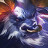

# Augment: silver, Count: 44
| key                 | name                  | icon                                                           | desc                                                                                                                                                                            |
| -                   | -                     | -                                                              | -                                                                                                                                                                               |
| ADMINHeart          | A.D.M.I.N. Heart      |                    | Your team counts as having 1 additional A.D.M.I.N. Gain a Camille.                                                                                                              |
| AegisHeart          | Aegis Heart           |                    | Your team counts as having 1 additional Aegis. Gain a Vi.                                                                                                                       |
| AFK                 | AFK                   |                                  | You cannot perform actions for the next 3 rounds. Afterwards, gain 20 gold.                                                                                                     |
| AnimaSquadHeart     | Anima Squad Heart     |          | Your team counts as having 1 additional Anima Squad. Gain a Jinx.                                                                                                               |
| BandofThievesI      | Band of Thieves I     |            | Gain 1 Thief's Gloves.                                                                                                                                                          |
| BattlemageI         | Battlemage I          |                  | Your units that start combat in the front 2 rows gain 15 Armor and 15 Ability Power.                                                                                            |
| BigFriend           | Big Friend I          |                      | Your units that start combat next to a unit with over 1600 Health take 9% less damage for the rest of combat.                                                                   |
| BrawlerHeart        | Brawler Heart         |                | Your team counts as having 1 additional Brawler. Gain a Vi.                                                                                                                     |
| CelestialBlessing1  | Celestial Blessing I  |    | Your units heal for 10% of the damage dealt by attacks and Abilities. Excess healing is converted to a shield up to 200 Health.                                                 |
| Consistency         | Consistency           |                  | Gain double win and loss streak gold.                                                                                                                                           |
| CyberneticImplants1 | Cybernetic Implants I |  | Your champions holding an item gain 80 Health and 10% Attack Damage.                                                                                                            |
| CyberneticShell1    | Cybernetic Shell I    |        | Your champions holding an item gain 80 Health and 30 Armor.                                                                                                                     |
| CyberneticUplink1   | Cybernetic Uplink I   |      | Your champions holding an item gain 80 Health and restore 2 Mana per second.                                                                                                    |
| DefenderHeart       | Defender Heart        |              | Your team counts as having 1 additional Defender. Gain a Rell.                                                                                                                  |
| Distancing          | Exiles I              |                    | Your units that start combat with no adajacent allies gain a 25% maximum Health shield for 10 seconds.                                                                          |
| Diversify1          | Stand United I        |                    | Your units gain 1.5% Attack Damage and 1.5 Ability Power per Trait active across your army.                                                                                     |
| DuelistHeart        | Duelist Heart         |                | Your team counts as having 1 additional Duelist. Gain a Fiora.                                                                                                                  |
| Electrocharge1      | Electrocharge I       |            | When your units receive critical strikes, they deal 30-90 (based on current Stage) magic damage to nearby enemies. (1 second cooldown).                                         |
| Featherweights1     | Featherweights I      |          | Your 1 and 2 cost champions gain 20% Attack Speed and Move Speed.                                                                                                               |
| FirstAidKit         | First Aid Kit         |                  | All healing and shielding on your units is increased by 25%.                                                                                                                    |
| FuturePeepers       | Future Sight I        |              | Know who you will fight next. Gain a Zephyr.                                                                                                                                    |
| GadgeteenHeart      | Gadgeteen Heart       |            | Your team counts as having 1 additional Gadgeteen. Gain an Poppy.                                                                                                               |
| HackerHeart         | Hacker Heart          |                  | Your team counts as having 1 additional Hacker. Gain a pyke.                                                                                                                    |
| HeartHeart          | Heart Heart           |                    | Your team counts as having 1 additional Heart. Gain a Lee Sin.                                                                                                                  |
| ItemGrabBag1        | Item Grab Bag I       |                | Gain 1 random completed item.                                                                                                                                                   |
| KnifesEdgeI         | Knife's Edge I        |                  | Your units that start combat in the front 2 rows gain 15 Attack Damage.                                                                                                         |
| LategameSpecialist  | Lategame Specialist   |    | Gain 44 gold when you reach Level 9.                                                                                                                                            |
| LudensEcho1         | Luden's Echo I        |                  | When your units cast and deal Ability damage, the first target hit and a nearby enemy take 35-80 (based on current Stage) magic damage.                                         |
| MakeshiftArmor1     | Makeshift Armor I     |          | Your units with no items gain 30 Armor and Magic Resist.                                                                                                                        |
| MascotHeart         | Mascot Heart          |                  | Your team counts as having 1 additional Mascot. Gain a Malphite.                                                                                                                |
| OxForceHeart        | Ox Force Heart        |                | Your team counts as having 1 additional Ox Force. Gain a Fiora.                                                                                                                 |
| PandorasBench       | Pandora's Bench       |              | Gain 2 gold. At the start of every turn, Champions on the 3 rightmost bench slots transform into random champions of the same cost.                                             |
| PandorasItems       | Pandora's Items       |              | Gain a random component. At the start of each round, items on your bench are randomized (excluding Tactician's Crown, Spatula, and consumables).                                |
| Preparation         | Preparation I         |                  | Champions on your bench permanently gain 25 Health, 3% Attack Damage and 3 Ability Power every round. Champions start with I stack of this effect, and can stack up to 4 times. |
| Recombobulator      | Recombobulator        |            | Champions on your board permanently transform into random champions 1 Tier higher. Gain 2 Magnetic Removers.                                                                    |
| RenegadeHeart       | Renegade Heart        |              | Your team counts as having 1 additional Renegade. Gain a Camille.                                                                                                               |
| SecondWind1         | Second Wind I         |                  | After 10 seconds of combat, your units heal 40% of their missing Health.                                                                                                        |
| SpellslingerHeart   | Spellslinger Heart    |      | Your team counts as having 1 additional Spellslinger. Gain an Annie.                                                                                                            |
| StarGuardianHeart   | Star Guardian Heart   |      | Your team counts as having 1 additional Star Guardian. Gain a Rell.                                                                                                             |
| SureshotHeart       | Sureshot Heart        |              | Your team counts as having 1 additional Sureshot. Gain a Sivir.                                                                                                                 |
| ThrillOfTheHunt1    | Thrill of the Hunt I  |        | Your units heal 350 Health on kill.                                                                                                                                             |
| TinyTitans          | Tiny Titans           |                    | Your Tactician heals 30 Health, grows larger, and has 130 maximum Health.                                                                                                       |
| TriForce            | Tri Force I           |                        | Your Tier 3 champions gain 75 Health, 10 starting Mana, and 10% Attack Speed.                                                                                                   |
| InfiniteamHeart     | Infiniteam Heart      |          | Your team counts as having 1 additional Infiniteam. Gain a Lucian.                                                                                                              |
# Augment: gold, Count: 70
| key                  | name                   | icon                                                             | desc                                                                                                                                                                            |
| -                    | -                      | -                                                                | -                                                                                                                                                                               |
| AceCrest             | Ace Crest              |                          | Gain an Ace Emblem and a Draven.                                                                                                                                                |
| ADMINCrest           | A.D.M.I.N Crest        |                      | Gain an A.D.M.I.N. Emblem and a Blitzcrank.                                                                                                                                     |
| AegisCrest           | Aegis Crest            |                      | Gain an Aegis Emblem and a Vi.                                                                                                                                                  |
| AnimaSquadCrest      | Anima Squad Crest      |            | Gain an Anima Squad Emblem and a Sylas.                                                                                                                                         |
| Ascension            | Ascension              |                        | After 15 seconds of combat, your units deal 50% more damage.                                                                                                                    |
| AxiomArcII           | Axiom Arc II           |                      | Your units gain 30 Mana on kill.                                                                                                                                                |
| BattlemageII         | Battlemage II          |                  | Your units that start combat in the front 2 rows gain 25 Armor and 25 Ability Power.                                                                                            |
| BigFriend2           | Big Friend II          |                      | Your units that start combat next to a unit with over 1600 Health take 10% less damage for the rest of combat.                                                                  |
| BrawlerCrest         | Brawler Crest          |                  | Gain a Brawler Emblem and a Lee Sin.                                                                                                                                            |
| CalculatedLoss       | Calculated Loss        |              | After losing your combat, gain 2 gold and a free Shop refresh.                                                                                                                  |
| CelestialBlessing2   | Celestial Blessing II  |      | Your units heal for 15% of the damage dealt by attacks and Abilities. Excess healing is converted to a shield up to 300 Health.                                                 |
| ClearMind            | Clear Mind             |                        | If you have no champions on your bench at the end of player combat round, gain 3 experience points.                                                                             |
| ClutteredMind        | Cluttered Mind         |                | If your bench is full at the end of player combat round, gain 3 experience points. Gain 4 random Tier 1 champions.                                                              |
| CombatTrainingII     | Combat Training        |          | Your Champions permanently gain 1 Attack Damage every time they kill an enemy unit. Champions start with 8% Attack Damage.                                                      |
| ComponentGrabBag     | Component Grab Bag     |          | Gain 3 random item components.                                                                                                                                                  |
| CyberneticImplants2  | Cybernetic Implants II |    | Your champions holding an item gain 120 Health and 20% Attack Damage.                                                                                                           |
| CyberneticShell2     | Cybernetic Shell II    |          | Your champions holding an item gain 120 Health and 40 Armor.                                                                                                                    |
| CyberneticUplink2    | Cybernetic Uplink II   |        | Your champions holding an item gain 120 Health and restore 2.5 Mana per second.                                                                                                 |
| DefenderCrest        | Defender Crest         |                | Gain a Defender Emblem and a Poppy.                                                                                                                                             |
| Distancing2          | Exiles II              |                    | Your units that start combat with no adajacent allies gain a 35% maximum Health shield for 10 seconds.                                                                          |
| Diversify2           | Stand United II        |                      | Your units gain 2 Attack Damage and 3 Ability Power per Trait active across your army.                                                                                          |
| DuelistCrest         | Duelist Crest          |                  | Gain a Duelist Emblem and a Yasuo.                                                                                                                                              |
| Electrocharge2       | Electrocharge II       |              | When your units receive critical strikes, they deal 50-110 (based on current Stage) magic damage to nearby enemies. (1 second cooldown).                                        |
| Featherweights2      | Featherweights II      |            | Your 1 and 2 cost champions gain 30% Attack Speed and Move Speed.                                                                                                               |
| FirstAidKitIII       | First Aid Kit II       |              | All healing and shielding on your units is increased by 35%.                                                                                                                    |
| GadgeteensCrest      | Gadgeteen crest        |            | Gain a Gadgeteen Emblem and an Annie.                                                                                                                                           |
| HackerCrest          | Hacker Crest           |                    | Gain a Hacker Emblem and 2 gold.                                                                                                                                                |
| HeartCrest           | Heart Crest            |                      | Gain a Heart Emblem and a Lee sin.                                                                                                                                              |
| HyperRoll            | Hustler                |                        | Instead of having no interest, you get 3 golds at the beginning of player combat rounds.                                                                                        |
| JeweledLotus         | Jeweled Lotus          |                  | Magic and true damage from your units' Abilities can critically strike. Your units gain 20% Critical Strike Chance.                                                             |
| KnifesEdgeII         | Knife's Edge II        |                  | Your units that start combat in the front 2 rows gain 25 Attack Damage.                                                                                                         |
| LaserCorpsHeart      | Lasercorps Heart       |            | Your team counts as having 1 additional LaserCorps. Gain a Yasuo.                                                                                                               |
| LastStand            | Last Stand             |                        | The first time you would die, instead drop to 1 Health. After this effect triggers, your units gain 180 Health, 18 Armor and Magic Resist, and 18% Omnivamp.                    |
| LudensEcho2          | Luden's Echo II        |                    | When your units cast and deal Ability damage, the first target hit and a nearby enemy take 50-110 (based on current Stage) magic damage.                                        |
| MakeshiftArmor2      | Makeshift Armor II     |            | Your units with no items gain 45 Armor and Magic Resist.                                                                                                                        |
| MascotCrest          | Mascot Crest           |                    | Gain a Mascot Emblem and a Lee sin.                                                                                                                                             |
| MechaPRIMECrest      | Mecha: PRIME Crest     |            | Gain a Mecha: PRIME Emblem and a Draven.                                                                                                                                        |
| MetabolicAccelerator | Metabolic Accelerator  |  | Your Tactician moves faster and heals 2 Health after a PVP round.                                                                                                               |
| OxForceCrest         | Ox Force Crest         |                  | Gain an Ox Force Emblem and an Annie.                                                                                                                                           |
| PortableForge        | Portable Forge         |                | Open an Armory and choose 1 of 3 unique Artifacts crafted by Ornn.                                                                                                              |
| PranksterCrest       | Prankster Crest        |              | Gain a Prankster Emblem and a Jinx.                                                                                                                                             |
| PreparationII        | Preparation II         |                | Champions on your bench permanently gain 35 Health, 4% Attack Damage and 4 Ability Power every round. Champions start with I stack of this effect, and can stack up to 4 times. |
| RenegadeCrest        | Renegade Crest         |                | Gain a Renegade Emblem and a Lucian.                                                                                                                                            |
| RichGetRicher        | Rich Get Richer        |                | Gain 12 gold. Your maximum interest is increased to 7.                                                                                                                          |
| RichGetRicherPlus    | Rich Get Richer+       |        | Gain 20 gold. Your maximum interest is increased to 7.                                                                                                                          |
| SalvageBin           | Salvage Bin            |                      | Gain a random completed item now, and a componenet after 7 player combats. Selling champions breaks apart their full items into components (excluding Tactician's Crown).       |
| ScopedWeaponsI       | Scoped Weapons I       |              | Your units that start combat in the back 2 rows gain +2 Attack Range and 12% Attack Speed.                                                                                      |
| SecondWind2          | Second Wind II         |                    | After 10 seconds of combat, your units heal 60% of their missing Health.                                                                                                        |
| SpellslingerCrest    | Spellslinger Crest     |        | Gain a Spellslinger Emblem and an Annie.                                                                                                                                        |
| StarGuardianCrest    | Star Guardian Crest    |        | Gain a Star Guardian Emblem and a Rell.                                                                                                                                         |
| SunfireBoard         | Sunfire Board          |                  | At the start of combat, burn all enemies for 10% of their maximum Health over 20 seconds and reduce healing received by 33%.                                                    |
| SupersHeart          | Supers Heart           |                    | Your team counts as having 1 additional Super. Gain a Malphite.                                                                                                                 |
| SureshotCrest        | Sureshot Crest         |                | Gain a Sureshot Emblem and a Sivir.                                                                                                                                             |
| TargetDummies        | Phony Frontline        |                | Gain 2 Target Dummies.                                                                                                                                                          |
| ThreatLevelMaxiumum  | Threat Level: Maximum  |    | At the start of combat, your Threats gain 66 Maximum Health for every Threat champion on your board.                                                                            |
| ThreesCompany        | Three's Company        |                | Gain 3 random 3-cost champions.                                                                                                                                                 |
| ThrillOfTheHunt2     | Thrill of the Hunt II  |          | Your units heal 550 Health on kill.                                                                                                                                             |
| TomeOfTraits1        | Ancient Archives I     |                | Gain 1 Tome of Traits and 4 gold.                                                                                                                                               |
| TradeSector          | Trade Sector           |                    | Gain a free Shop refresh each round.                                                                                                                                            |
| TradeSectorPlus      | Trade Sector+          |            | Gain a free Shop refresh each round. Gain 10 golds.                                                                                                                             |
| Traitless2           | Built Different II     |                      | Your units with no Traits active gain 175-325 Health and 40-70% Attack Speed. (based on current Stage)                                                                          |
| TriForce2            | Tri Force II           |                        | Your Tier 3 champions gain 125 Health, 15 starting Mana, and 15% Attack Speed.                                                                                                  |
| TrueTwos             | True Twos              |                          | Gain 1 random 2-star Tier 1 champions and 1 random 2-star Tier 2 champion.                                                                                                      |
| Twins2               | Double Trouble II      |                              | If you have exactly 2 copies of a champion on your board, they both gain 33 Attack Damage, Ability Power, Armor, and Magic Resist. When you 3-star, gain a 2-star copy.         |
| UndergroundHeart     | Underground Heart      |          | Your team counts as having 1 additional Underground. Gain a Vi.                                                                                                                 |
| UrfsGrabBagI         | Urf's Grab Bag I       |                  | Gain 1 Spatula and 1 random item component.                                                                                                                                     |
| QuickdrawHeart       | Quickdraw Heart        |              | Your team counts as having 1 additional Quickdraw. Gain an Ezreal.                                                                                                              |
| RiftwalkerCrest      | Riftwalker Crest       |            | Gain a Riftwalker Emblem and 2 gold.                                                                                                                                            |
| InfiniteamCrest      | Infiniteam Crest       |            | Gain Infiniteam Emblem and a Sivir.                                                                                                                                             |
| SalvageBinPlus       | Salvage Bin+           |              | Gain a random completed item now, and a componenet after 4 player combats. Selling champions breaks apart their full items into components (excluding Tactician's Crown).       |
# Augment: prismatic, Count: 62
| key                 | name                    | icon                                                           | desc                                                                                                                                                                            |
| -                   | -                       | -                                                              | -                                                                                                                                                                               |
| AceCrown            | Ace in the Hole         |                        | Gain an Ace Emblem, a Draven, a Miss Fortune, and a Samira.                                                                                                                     |
| ADMINCrown          | A.D.M.I.N Crown         |                    | Gain an A.D.M.I.N. Emblem, a Hand of Justice, and a Camille.                                                                                                                    |
| AegisCrown          | Aegis Crown             |                    | Gain an Aegis Emblem, a Redemption, and an Alistar.                                                                                                                             |
| AncientArchivesII   | Ancient Archives II     |      | Gain 2 Tome of Traits and 8 gold.                                                                                                                                               |
| AnimaSquadCrown     | Anima Squad Crown       |          | Gain an Anima Squad Emblem, a Protector's Vow, and a Riven.                                                                                                                     |
| BandOfThieves2      | Band of Thieves II      |            | Gain 2 Thief's Gloves.                                                                                                                                                          |
| BattlemageIII       | BattlemageIII           |              | Your units that start combat in the front 2 rows gain 35 Armor and 35 Ability Power.                                                                                            |
| BinaryAirdrop       | Binary Airdrop          |              | Your champions equipped with 2 items temporarily gain a random completed item at the start of combat. Gain 1 random item components.                                            |
| BirthdayPresent     | Birthday Present        |          | Gain a 2-star champion every time you level up. The champion's tier is your level minus 4 (min: Tier 1).                                                                        |
| BrawlerCrown        | Brawler Crown           |                | Gain a Brawler Emblem, Protector’s Vow, and a Riven.                                                                                                                            |
| CelestialBlessing3  | Celestial Blessing III  |    | Your units heal for 25% of the damage dealt by attacks and Abilities. Excess healing is converted to a shield up to 400 Health.                                                 |
| CruelPact           | Cruel Pact              |                      | Buying XP costs 6 Health instead of gold. But Heal 3 Health per player combat.                                                                                                  |
| CursedCrown         | Cursed Crown            |                  | Gain +2 maximum team size, but take 100% increased player damage.                                                                                                               |
| CyberneticImplants3 | Cybernetic Implants III |  | Your champions holding an item gain 200 Health and 30% Attack Damage.                                                                                                           |
| CyberneticShell3    | Cybernetic Shell III    |        | Your champions holding an item gain 200 Health and 60 Armor.                                                                                                                    |
| CyberneticUplink3   | Cybernetic Uplink III   |      | Your champions holding an item gain 200 Health and restore 3.5 Mana per second.                                                                                                 |
| DefenderCrown       | Defender Crown          |              | Gain a Defender Emblem, a Protector's Vow, and a Riven.                                                                                                                         |
| Diversify3          | Stand United III        |                    | Your units gain 3 Attack Damage and Ability Power per Trait active across your army.                                                                                            |
| DuelistCrown        | Duelist Crown           |                | Gain a Duelist Emblem, a Hand of Justice, and a Nilah.                                                                                                                          |
| Electrocharge3      | Electrocharge III       |            | When your units receive critical strikes, they deal 100-205 (based on current Stage) magic damage to nearby enemies. (1 second cooldown).                                       |
| Featherweights3     | Featherweights III      |          | Your 1 and 2 cost units gain 50% Attack Speed and Move Speed.                                                                                                                   |
| FuturePeepers2      | Future Sight II         |            | Know who you fight next. Gain a Radiant Zephyr.                                                                                                                                 |
| GadgeteenCrown      | Gadgeteen Crown         |            | Gain a Gadgeteen Emblem, Ionic Spark and an Annie.                                                                                                                              |
| GoldenTicket        | Golden Ticket           |                | Each time your Shop is refreshed, you have a 50% chance to gain a free refresh.                                                                                                 |
| HackerCrown         | Hacker Crown            |                  | Gain a Hacker Emblem, a Hand of Justice, and a Leblanc.                                                                                                                         |
| HeartCrown          | Heart Crown             |                    | Gain a Heart Emblem, Guardbreaker, and a Sona.                                                                                                                                  |
| HighEndShopping     | High End Shopping       |          | Champions appear in your Shop as if you were 1 level higher. Gain 3 gold.                                                                                                       |
| ItemGrabBag2        | Item Grab Bag II        |                | Gain 2 random completed items and 2 Reforgers.                                                                                                                                  |
| KnifesEdgeIII       | Knife's Edge III        |              | Your units that start combat in the first 2 rows gain 55% Attack Damage.                                                                                                        |
| LaserCorpsCrown     | LaserCorps Soul         |          | Your team counts as having 1 additional  LaserCorps. Gain a Hand of Justice, and a Yasuo.                                                                                       |
| LivingForge         | Living Forge            |                  | Gain a random Ornn item now and after every 10 player combats.                                                                                                                  |
| LuckyGloves         | Lucky Gloves            |                  | Thief's Gloves will always give your champions items. Gain 2 Sparring Gloves.                                                                                                   |
| LudensEcho3         | Luden's Echo III        |                  | When your units cast and deal Ability damage, the first target hit and a nearby enemy take 90-210 (based on current Stage) magic damage.                                        |
| MascotCrown         | Mascot Crown            |                  | Gain a Mascot Emblem, a Gargoyle Stoneplate, and an Malphite.                                                                                                                   |
| MechaPRIMECrown     | Mecha: PRIME Crown      |          | Gain a Mecha: PRIME Emblem,  Bloodthirster, and a Jax.                                                                                                                          |
| NewRecruit3         | New Recruit             |                  | Gain +1 maximum team size.                                                                                                                                                      |
| OxForceCrown        | Ox Force Crown          |                | Gain an Ox Force Emblem, a Titan's Resolve, and an Alistar.                                                                                                                     |
| PranksterCrown      | Prankster Crown         |            | Gain a Prankster Emblem, Titan’s Resolve, and a Gnar.                                                                                                                           |
| PreparationIII      | Preparation III         |            | Champions on your bench permanently gain 50 Health, 7% Attack Damage and 7 Ability Power every round. Champions start with I stack of this effect, and can stack up to 4 times. |
| RadiantRelics       | Radiant Relics          |              | Open an Armory and choose 1 of 5 unique Radiant items.                                                                                                                          |
| RenegadeCrown       | Renegade Crown          |              | Gain a Renegade Crown, a Bloodthirster, and a Camille.                                                                                                                          |
| SlowAndSteady       | March of Progress       |              | Grants 2 Experience immediately. Gain bonus experience equal to your current player level at the beginning of player combat rounds. You can no longer use gold to level up.     |
| SpellslingerCrown   | Spellslinger Crown      |      | Gain a Spellslinger Emblem, Hand of Justice, and a Sona.                                                                                                                        |
| StarGuardianCrown   | Star Guardian Crown     |      | Gain a Star Guardian Emblem, a Tear Of The Goddess and a Nilah.                                                                                                                 |
| SupersSoul          | Supers Soul             |                    | Your team counts as having 1 additional Super. Gain a Titan's Resolve and a Lee Sin.                                                                                            |
| SureshotCrown       | Sureshot Crown          |              | Gain a Sureshot Emblem, an Infinity Edge, and a Sivir.                                                                                                                          |
| TheGoldenEgg        | The Golden Egg          |                | Gain a massive golden egg that hatches in 10 turns. If you won vs player, receive bonus turn.                                                                                   |
| ThinkFast           | Think Fast              |                      | Shop refreshes are free until the end of this round. Traits and other augments do not benefit from these free shops. Gain 3 gold.                                               |
| ThriftShop          | Wise Spending           |                    | Gain 2 experience points when you refresh your Shop.                                                                                                                            |
| Traitless3          | Built Different III     |                    | Your units with no Traits active gain 250-600 Health and 45-80% Attack Speed. (based on current Stage)                                                                          |
| TriForce3           | Tri Force III           |                      | Your Tier 3 champions gain 200 Health, 25 starting Mana, and 25% Attack Speed.                                                                                                  |
| Twins3              | Double Trouble III      |                            | If you have exactly 2 copies of a champion on your board, they both gain 44% Attack Damage and 44 Ability Power, Armor, and Magic Resist. When you 3-star, gain a 2-star copy.  |
| UndergroundSoul     | Underground Soul        |          | Your team counts as having 1 additional Underground. Gain a Zz’Rot portal and an Ezreal.                                                                                        |
| UrfsGrabBagII       | Urf's Grab Bag II       |              | Gain 1 Spatula and 3 random item components.                                                                                                                                    |
| VerdantVeil         | Verdant Veil            |                  | Your units are immune to crowd control effects for the first 20 seconds of combat. Gains 15% Attack Speed.                                                                      |
| Windfall            | Windfall                |                        | Gain 20 gold.                                                                                                                                                                   |
| WindfallPlus        | Windfall+               |                | Gain 35 gold.                                                                                                                                                                   |
| WindfallPlusPlus    | Windfall++              |        | Gain 40 gold.                                                                                                                                                                   |
| WoodlandCharm       | Woodland Charm          |              | Your highest Health champion is cloned. Clones cannot hold items.                                                                                                               |
| InfiniteamSoul      | Infiniteam Crown        |            | Your team counts as having 1 additional Infiniteam. Gain a Guinsoo's Rageblade and a Sivir.                                                                                     |
| QuickdrawSoul       | Quickdraw Soul          |              | Your team counts as having 1 additional Quickdraw. Gain a Jeweled Gauntlet and an Ezreal.                                                                                       |
| RiftwalkerCrown     | Riftwalker Crown        |          | Gain a Riftwalker Emblem, Sparring Gloves, and a Pyke.                                                                                                                          |
# Augment: champion, Count: 119
| key                              | name                     | icon                                                                                     | desc                                                                                                                                                                                                         |
| -                                | -                        | -                                                                                        | -                                                                                                                                                                                                            |
| Alistar1HeroAugment              | Stubborn                 |                            | Gain an Alistar. Combat start: He 50% Shreds (MR reduction) all enemy units.                                                                                                                                 |
| Alistar2HeroAugment              | Behemoth                 |                            | Gain an Alistar. He gains 350 maximum health. His ability hits all adjacent enemies, and deals bonus damage to his primary target equal to 25% of his maximum health.                                        |
| Annie1HeroAugment                | Pyromania                |                                | Gain an Annie. Her spell is larger, and the every cast, stuns all target hits for 2 seconds.                                                                                                                 |
| Annie2HeroAugment                | Burning Spirit           |                                | Gain an Annie. When you field her, your team gains 15 Ability Power, tripled while they are below 50% Health.                                                                                                |
| Ashe1HeroAugment                 | Laser Focus              |                                  | Gain an Ashe. She gains 45% Attack Speed, doubled while her Ability is active.                                                                                                                               |
| Ashe2HeroAugment                 | Corps Focus              |                                  | Gain an Ashe. When you field her, your team gains 20% Attack Speed, doubled while her Ability is active.                                                                                                     |
| Aurelionsol1HeroAugment          | Extinction Event         |                    | Gain an Aurelion Sol. He has 15 Ability Power and his Ability's meteors are larger.                                                                                                                          |
| Aurelionsol2HeroAugment          | Velocity Impact          |                    | Gain an Aurelion Sol. His Ability stuns enemies hit for 1.75 seconds.                                                                                                                                        |
| Belveth1HeroAugment              | Back for Blood           |                            | Gain a Bel'Veth. She has 25% Omnivamp, tripled while under 50% Health.                                                                                                                                       |
| Belveth2HeroAugment              | Voidmother               |                            | Gain a Bel'Veth. Combat Start: Your strongest Bel'Veth creates 2 Voidspawns with 88% of their normal Health in front of her.                                                                                 |
| Blitzcrank1HeroAugment           | Dynamic Defenses         |                      | Gain a Blitzcrank and a Gargoyle Stoneplate. When he casts his Ability, its duration increases by 2 second per enemy targeting him.                                                                          |
| Blitzcrank2HeroAugment           | Rocket Grab              |                      | Gain a Blitzcrank. He has 1.5 bonus Health. Combat start: He pulls the farthest enemy and stuns them for 400 seconds.                                                                                        |
| Camille1HeroAugment              | Adaptive Defensives      |                            | Gain a Camille. She has 20% Attack Damage. The first time she drops below 50% Health, she gains a shield equal to 500% of her Attack Damage.                                                                 |
| Camille2HeroAugment              | Hextech Retribution      |                            | Gain a Camille. When you field her, your team deals 8% bonus damage, increasing by an additional 5% whenever an ally dies.                                                                                   |
| Draven1HeroAugment               | League of Draven         |                              | Gain a Draven. He gains 25% Attack Damage. When he kills an enemy, there is a 35% chance to gain 1 gold.                                                                                                     |
| Draven2HeroAugment               | Ruthless Blades          |                              | Gain a Draven. When you field him, your team gains 55% Critical Strike Chance.                                                                                                                               |
| Ekko1HeroAugment                 | Destructive Resonance    |                                  | Gain an Ekko. Ekko’s spell hits all enemies within 3 hexes, and deals 240% bonus damage, but no longer slows enemies’ Attack Speed.                                                                          |
| Ekko2HeroAugment                 | Chronobreak              |                                  | Gain an Ekko. When you field him, he stuns all enemies for 2.5 seconds after 8 seconds of combat.                                                                                                            |
| Ezreal1HeroAugment               | Rising Spell Force       |                              | Gain an Ezreal. When he casts his Ability, he gains 16%% Attack Speed and 16 Ability Power for the rest of combat (this can stack).                                                                          |
| Ezreal2HeroAugment               | Raider's Spoils          |                              | Gain an Ezreal. Combat Start: Your strongest Ezreal grants his nearest ally a temporary Artifact for the rest of combat.                                                                                     |
| Fiddlesticks1HeroAugment         | Scarier-crow             |                  | Gain a Fiddlesticks. Fiddlesticks continues absorbing Corrupted Souls even while no longer dormant. If he is still dormant after 8 seconds, he immediately casts. Fiddlesticks’ spell can critically strike. |
| Fiddlesticks2HeroAugment         | Absolute Corruption      |                  | Gain a Fiddlesticks. Combat Start: Fiddlesticks grants its nearest ally 30 Ability Power and allows them to share its Corrupted souls.                                                                       |
| Fiora1HeroAugment                | Grand Challenge          |                                | Gain a Fiora. Every 4 attacks on the all unit. she deals 20% of her maximum health as magic damage, and heals for 12% of her maximum health.                                                                 |
| Fiora2HeroAugment                | Vitality of the Ox       |                                | Gain a Fiora. When you field her, your team heals 25% of their maximum Health when they 10 attack.                                                                                                           |
| Gangplank1HeroAugment            | Flaming Ricochet         |                        | Gain a Gangplank. His Ability bounces to a second target dealing 80% damage.                                                                                                                                 |
| Gangplank2HeroAugment            | Get Paid                 |                        | Gain a Gangplank. When you field him, your team has a 50% chance to gain 1 gold on kill.                                                                                                                     |
| Janna1HeroAugment                | Category Five            |                                | Gain a Janna. She gains 10 Ability Power and her ability does True Damage.                                                                                                                                   |
| Janna2HeroAugment                | Exaggerated Reporting    |                                | Gain a Janna. Forecaster's effects are increased by 200%.                                                                                                                                                    |
| Jax1HeroAugment                  | Relentless Assault       |                                    | Gain a Jax. After every 3rd attack, he gains 18% Attack Speed for the rest of combat (this can stack).                                                                                                       |
| Jax2HeroAugment                  | Grandmaster’s Training   |                                    | Gain a Jax. When you field him, your team gains 20 Armor and 12% Attack Speed. These bonuses are doubled when your strongest Jax dies.                                                                       |
| Jinx1HeroAugment                 | Get Excited!             |                                  | Gain a Jinx. She gains 30% Attack Speed and Move speed. When she scores a takedown this amount is tripled for 6 seconds.                                                                                     |
| Jinx2HeroAugment                 | Everyone Goes BOOM!      |                                  | Gain a Jinx. When you field her, your team gains 9% Attack Speed, tripled after the first enemy dies each combat.                                                                                            |
| Kaisa1HeroAugment                | Reconnaissance team      |                                | Gain a Kai’Sa. At the start of combat, Kai’Sa and her two closest allied champions gain 40% Critical Strike Chance and their spells can crit.                                                                |
| Kaisa2HeroAugment                | Multi-Shot               |                                | Gain a Kai'Sa. Gain 10 AP, Every 2 projectiles, she fires a bonus attack at a nearby enemy.                                                                                                                  |
| Kayle1HeroAugment                | Divine Ascent            |                                | Gain a Kayle. She gains bonuses per star level.
1: 40% Attack Speed
2: +2 Attack Range
3: Attacks fire 2 additional bolts dealing 50% damage.                                                             |
| Kayle2HeroAugment                | Righteous Range          |                                | Gain a Kayle. Combat Start: She and her 2 nearest allies gain +2 Attack Range and 33% Attack Speed.                                                                                                          |
| Leblanc1HeroAugment              | Aim Assist               |                            | Gain a LeBlanc. For every 3 sigils fired by her Ability, she fires an extra sigil at the lowest Health enemy.                                                                                                |
| Leblanc2HeroAugment              | Mirror Image             |                            | Gain a LeBlanc. Combat start: Your strongest LeBlanc duplicates her nearest ally (without items at 99% Health).                                                                                              |
| Leesin1HeroAugment               | Cleansing Safeguard      |                              | Gain a Lee Sin. His Ability costs 15 less Mana to cast. When he casts, he sheds all negative effects and heals 15% of his missing Health.                                                                    |
| Leesin2HeroAugment               | Invigorate               |                              | Gain a Lee Sin. When your field him, your team gains 20% Attack Speed, doubled for 4 seconds after being shielded.                                                                                           |
| Leona1HeroAugment                | Perfected Solar Flare    |                                | Gain a Leona. She has 30 Ability Power and her Abilities cost 40 less Mana to cast.                                                                                                                          |
| Leona2HeroAugment                | Eclipse Prime            |                                | Gain a Leona. When you field her, your team takes 20 less damage.                                                                                                                                            |
| Lulu1HeroAugment                 | Growth Spurt             |                                  | Gain a Lulu. When she casts her Ability, she gains 100 bonus Health and 18 Ability Power (this can stack).                                                                                                   |
| Lulu2HeroAugment                 | Foster Growth            |                                  | Gain a Lulu. When you field her, she and allies holding an item gain 35 Ability Power.                                                                                                                       |
| Lux1HeroAugment                  | Illuminating Singularity |                                    | Gain a Lux. Every 2nd cast, her Ability deals 150% increased damage.                                                                                                                                         |
| Lux2HeroAugment                  | Lucent Barrier           |                                    | Gain a Lux. Combat Start: She grants her 2 nearest allies a 500 Health Shield and 35 Ability Power.                                                                                                          |
| Malphite1HeroAugment             | Rock Solid               |                          | Gain a Malphite. He has Ability Power equal to 130% of his Armor and his Ability's Armor duration is increased by 4 seconds.                                                                                 |
| Malphite2HeroAugment             | Guardian Spirit          |                          | Gain a Malphite. When you field him, your team restores 20% of their missing Health when they cast Abilities.                                                                                                |
| Missfortune1HeroAugment          | Bunny Mercenary          |                    | Gain a Miss Fortune. Her Ability covers a wider cone and she gains a 200 Health shield while channeling.                                                                                                     |
| Missfortune2HeroAugment          | Make It Rain             |                    | Gain a Miss Fortune. After every 3 player combats fielded, she drops 10-25 gold (based on current Stage).                                                                                                    |
| Mordekaiser1HeroAugment          | Not So Heavy Metal       |                    | Gain a Mordekaiser. He gains 20 Ability Power every 5 seconds.                                                                                                                                               |
| Mordekaiser2HeroAugment          | Obliterate               |                    | Gain a Mordekaiser. Combat start: He Shreds and Sunders enemies by 20%.                                                                                                                                      |
| Nasus1HeroAugment                | Stacks on Stacks         |                                | Gain a Nasus. He gains 20% Attack Damage, increased by 3% permanently each time he casts his Ability.                                                                                                        |
| Nasus2HeroAugment                | Soul Eater               |                                | Gain a Nasus. When you field him, he and his allies heal 275 Health on takedowns.                                                                                                                            |
| Nilah1HeroAugment                | Gifted                   |                                | Gain a Nilah. She gains 40 Ability Power. Combat Start: Your strongest Nilah grants her nearest ally a temporary copy of one of her normal items.                                                            |
| Nilah2HeroAugment                | Jubilant Veil            |                                | Gain a Nilah. Combat start: She and her 4 nearest allies gain immunity to crowd control for 20 seconds.                                                                                                      |
| Nunu1HeroAugment                 | They See Me Rolling      |                                  | Gain a Nunu. He has 25 Ability Power and 20% movement speed.                                                                                                                                                 |
| Nunu2HeroAugment                 | Contagious Laughter      |                                  | Gain a Nunu. When you field him, your team gains 10 Ability Power and an additional 10 every 5 seconds.                                                                                                      |
| Poppy1HeroAugment                | Bigger, Better Buckler   |                                | Gain a Poppy. She gains 180 Armor.                                                                                                                                                                           |
| Poppy2HeroAugment                | Steadfast Presence       |                                | Gain a Poppy. Combat start: Your strongest Poppy grants your team a 375 Health shield.                                                                                                                       |
| Rammus1HeroAugment               | Armored-dillo            |                              | Gain a Rammus. When you field him, your team gains 40 Armor, doubled for himself.                                                                                                                            |
| Rammus2HeroAugment               | Spiked Shell             |                              | Gain a Rammus. When struck by an attack, he deals magic damage equal to 150% of his Armor to all nearby enemies (once every 2 seconds).                                                                      |
| Rell1HeroAugment                 | Hold the Line            |                                  | Gain a Rell. She has 60 Ability Power and 35% damage reduction.                                                                                                                                              |
| Rell2HeroAugment                 | Channelled Ferromancy    |                                  | Gain a Rell. When you field her, your team gains 20 Armor and Magic Resist. and 5 when they cast Abilities (this can stack).                                                                                 |
| Renekton1HeroAugment             | Reign of Anger           |                          | Gain a Renekton. He gains 40% Attack Speed and an extra 4% per 100 missing Health.                                                                                                                           |
| Renekton2HeroAugment             | Cull the Meek            |                          | Gain a Renekton. When you field him, your team deals 8% bonus damage, tripled against enemies below 50% Health.                                                                                              |
| Riven1HeroAugment                | Reverberation            |                                | Gain a Riven. She has 15 Ability Power and her Ability is additionally cast on her lowest Health ally.                                                                                                       |
| Riven2HeroAugment                | Triumphant Return        |                                | Gain a Riven. Combat Start: She grants herself and adjacent allies a shield for 15 seconds equal to 45% of their maximum Health.                                                                             |
| Samira1HeroAugment               | Style & Flair            |                              | Gain a Samira. She gains 30% Attack Damage. When she scores a takedown, she restores 30% of her maximum Mana.                                                                                                |
| Samira2HeroAugment               | Daredevil                |                              | Gain a Samira. Your team gains 3.5% Attack Speed for each 10 Tactician Health missing.                                                                                                                       |
| Sivir1HeroAugment                | Time and a Half          |                                | Gain a Sivir. After each player combat round, gain 1 gold for every 42 Attack Damage your strongest Sivir has.                                                                                               |
| Sivir2HeroAugment                | Mana Tempering           |                                | Gain a Sivir. When you field her, your team gains 20% Attack Damage, and 5% when they cast Abilities (this can stack).                                                                                       |
| Sona1HeroAugment                 | Power Grid               |                                  | Gain a Sona. She has 10 Ability Power and her Ability fires 1 additional beam.                                                                                                                               |
| Sona2HeroAugment                 | Undercurrent             |                                  | Gain a Sona. Combat Start: Your strongest Sona grants her 2 nearest allies 50 Mana.                                                                                                                          |
| Sylas1HeroAugment                | Kingslayer               |                                | Gain a Sylas. Gain maximum 25% and increase damage 30%.                                                                                                                                                      |
| Sylas2HeroAugment                | Petricite Chains         |                                | Gain a Sylas. When you field him, your team gains 30 starting Mana and his Ability increases enemies' maximum Mana by 35%.                                                                                   |
| Syndra1HeroAugment               | Not In Vain              |                              | Gain a Syndra. Your strongest Syndra gains 40 starting Mana, and 75% Attack Speed every time an ally dies.                                                                                                   |
| Syndra2HeroAugment               | Empowered Reserves       |                              | Gain a Syndra. When you field her, your team gains 5 Ability Power per unit and item on your bench.                                                                                                          |
| Urgot1HeroAugment                | Shiny                    |                                | Gain an Urgot. His Ability has an extra 25% chance to dredge up treasure.                                                                                                                                    |
| Urgot2HeroAugment                | Rising Tide              |                                | Gain an Urgot. Combat Start: He grants adjacent allies 30% Attack Speed.                                                                                                                                     |
| Vayne1HeroAugment                | Spread Shot              |                                | Gain a Vayne. Her Ability also fires at 2 other nearby enemies, dealing 44% damage.                                                                                                                          |
| Vayne2HeroAugment                | Into the Night           |                                | Gain an Edge of Night and a Vayne. When you field her, allies equipped with Edge of Night gain 35% Attack Speed.                                                                                             |
| Vi1HeroAugment                   | Unrelenting Force        |                                      | Gain a Vi. When she takes or deals damage, she gains 3% Attack Damage and 3 Ability Power, Armor, and Magic Resist, stacking up to 25 times.                                                                 |
| Vi2HeroAugment                   | Boxing Lessons           |                                      | Gain a Vi. When you field her, your team gains 250 bonus Health.                                                                                                                                             |
| Viego1HeroAugment                | Heartstopper             |                                | Gain a Viego. He has 10 Ability Power and his Ability deals up to 50% increased damage based on the enemy's missing Health.                                                                                  |
| Viego2HeroAugment                | Partners in Crime        |                                | Gain a Viego. When you field him, your team gains 12% Omnivamp, tripled when 2 or less allies remain.                                                                                                        |
| Wukong1HeroAugment               | Cyclone                  |                              | Gain a Wukong. He has 18 Ability Power and +1 hex Ability range.                                                                                                                                             |
| Wukong2HeroAugment               | Re-Energize              |                              | Gain a Wukong. When you field him, your team restores 66% of their Mana after their first cast each combat.                                                                                                  |
| Yasuo1HeroAugment                | Winds of the Wanderer    |                                | Gain a Yasuo. His spell is bigger and does 8% increases damage.                                                                                                                                              |
| Yasuo2HeroAugment                | Spirit of the Exile      |                                | Gain a Yasuo. When you field him, allies who start combat with no adjacent allies gain 25% Attack Speed.                                                                                                     |
| Aatrox1HeroAugment               | Deathbringer             |                              | Gain an Aatrox. His Abilities deal additional damage equal to 15% of his Maximum Health.                                                                                                                     |
| Aatrox2HeroAugment               | Darkin Assimilation      |                              | Gain an Aatrox. When you field him, 40% of the damage your team receives is instead dealt over 3 seconds as non-lethal damage.                                                                               |
| Garen1HeroAugment                | Full Power to Sword      |                                | Gain a Garen. His ability costs 50 less Mana to cast and deals additional damage equal to 180% of his Attack Damage, but no longer stuns.                                                                    |
| Garen2HeroAugment                | My Sword is Your Shield  |                                | Gain a Garen. Combat Start and when your strongest Garen casts his ability: Garen shields allies for 12% of their maximum health for 4 seconds.                                                              |
| Gnar1HeroAugment                 | Synchronous Plating      |                                  | Gain a Gnar. He gains 45 Armor and Magic Resistance, plus another 5 until the end of combat every time he damages an enemy with his Ability.                                                                 |
| Gnar2HeroAugment                 | Temper Tantrum           |                                  | Gain a Gnar. When you field him, enemies take 10% more damage, increased to 20% the first time they are damaged by Gnar's attacks or Ability.                                                                |
| Jhin1HeroAugment                 | Rule of Four             |                                  | Gain a Jhin. Every 4 takedowns he gets each combat, he drops 2-4 gold(base on current Stage). He also drops 10% an item component.                                                                           |
| Jhin2HeroAugment                 | Wrath of the Rift        |                                  | Gain a Jhin. When you field him, your units that start combat in the back 2 rows deal 16% bonus damage.                                                                                                      |
| Lucian1HeroAugment               | Hyperbolic Time Chamber  |                              | Gain a Lucian. The first time your strongest Lucian casts his Ability each combat, and every 3 times afterwards, gain 2 experience point.                                                                    |
| Lucian2HeroAugment               | Enchanted Ammunition     |                              | Gain a Lucian. When you field him, your team gains 30 Ability Power, and 1 When they attack (this can stack).                                                                                                |
| Morgana1HeroAugment              | Fear is Freedom          |                            | Gain a Morgana. Morgana sends out 1 additional Dark Binding when she casts her Ability, and her Dark Bindings stun their targets for 0.5 additional second.                                                  |
| Morgana2HeroAugment              | Gas Giant Slayer         |                            | Gain a Morgana. When you field her, your team's abilities and attacks deal 30% more damage to enemies with more than 1600 maximum Health.                                                                    |
| Neeko1HeroAugment                | Easy Being Green         |                                | Gain a Neeko and a Spear of Shojin. When you field her, allies holding Spear of Shojin gain 35% Ability Power.                                                                                               |
| Neeko2HeroAugment                | Starlight Resonance      |                                | Gain a Neeko. On combat start and when your strongest Neeko casts her Ability, she grants herself and her closest ally 18 Ability Power until the end of combat.                                             |
| Pantheon1HeroAugment             | The Best Offense         |                          | Gain a Pantheon. He gains 40 Ability Power and 100 Magic Resistance.                                                                                                                                         |
| Pantheon2HeroAugment             | Chronic Hallucinations   |                          | Gain a Pantheon. Combat start: He and his 4 nearest allies take 60% reduced damage for 6 seconds.                                                                                                            |
| Pyke1HeroAugment                 | Your Cut                 |                                  | Gain a Pyke. After player combat rounds, gain 1 guaranteed shop refresh, 1 free Shop refresh(es) for every 2 time(s) your strongest Pyke cast his Ability last round.                                        |
| Pyke2HeroAugment                 | Small Game Hunter        |                                  | Gain a Pyke. When you field him, your team's abilities and attacks deal 10% more damage, increased to 25% against enemies with less than 1400 maximum Health.                                                |
| Shen1HeroAugment                 | Time Knife               |                                  | Gain a Shen. His spell costs 10 less Mana, and after casting his spell, his next 3 attack(s) deal bonus true damage equal to 250% of his Armor                                                               |
| Shen2HeroAugment                 | Recursion Matrix         |                                  | Gain a Shen. When you field him, your team takes 7% reduced damage, tripled for 4 seconds when they cast Abilities.                                                                                          |
| TwistedFate1HeroAugment          | Ante up                  |                    | Gain a Twisted Fate. Your strongest Twisted Fate drops 1 gold every 20-10 cards thrown each combat (based on current Stage).                                                                                 |
| TwistedFate2HeroAugment          | Gear Shift               |                    | Gain a Twisted Fate. When you field him, your team gains 12% Attack Speed, doubled after they cast their Ability the first time each combat.                                                                 |
| FutureEzreal1HeroAugment         | Temporal Disruption      |                  | Gain an Ultimate Ezreal. Enemies damaged by Ultimate Ezreal's Ability are 2% Burned and 33% Wounded.                                                                                                         |
| FutureEzreal2HeroAugment         | Accelerated Mentorship   |                  | Gain an Ultimate Ezreal. After player combat rounds where you fielded him, gain 8 experience points.                                                                                                         |
| Vex1HeroAugment                  | Joy Siphon               |                                    | Gain a Vex. Vex heals the 2 lowest health units on your team for 30% of the damage she deals with abilities and attacks.                                                                                     |
| Vex2HeroAugment                  | Endless Darkness         |                                    | Gain a Vex. When you field her, your team gains 20 Ability Power, and 5 when they cast Abilities (this can stack).                                                                                           |
| Warwick1HeroAugment              | Big Data                 |                            | Gain a Warwick. When you field him, your units deal 0.65% increased damage for every 100 Health they have.                                                                                                   |
| Warwick2HeroAugment              | Well Fed+                |                            | Gain a Warwick. When you field him your team gains 150 Maximum Health. This is increased by 1 every 3 times your strongest Warwick attacks.                                                                  |
| Warwick2HeroorginoriginalAugment | Well Fed                 |  | Gain a Warwick. When you field him your team gains 60 Maximum Health. This is increased by 1 every 3 times your strongest Warwick attacks.                                                                   |
