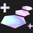

# Augment: silver, Count: 44
| key                 | name                  | icon                                                         | desc                                                                                                                                                                            |
| -                   | -                     | -                                                            | -                                                                                                                                                                               |
| BandofThievesI      | Band of Thieves I     |            | Gain 1 Thief's Gloves.                                                                                                                                                          |
| CelestialBlessing1  | Celestial Blessing I  |    | Your units heal for 10% of the damage dealt by attacks and Abilities. Excess healing is converted to a shield up to 200 Health.                                                 |
| Distancing          | Exiles I              |                    | Your units that start combat with no adajacent allies gain a 25% maximum Health shield for 10 seconds.                                                                          |
| SecondWind1         | Second Wind I         |                  | After 10 seconds of combat, your units heal 40% of their missing Health.                                                                                                        |
| ThrillOfTheHunt1    | Thrill of the Hunt I  |        | Your units heal 350 Health on kill.                                                                                                                                             |
| AFK                 | AFK                   |                                  | You cannot perform actions for the next 3 rounds. Afterwards, gain 18 gold.                                                                                                     |
| BigFriend           | Big Friend I          |                      | Your units that start combat next to a unit with over 1600 Health take 9% less damage for the rest of combat.                                                                   |
| CyberneticImplants1 | Cybernetic Implants I |  | Your champions holding an item gain 80 Health and 10% Attack Damage.                                                                                                            |
| CyberneticShell1    | Cybernetic Shell I    |        | Your champions holding an item gain 80 Health and 30 Armor.                                                                                                                     |
| CyberneticUplink1   | Cybernetic Uplink I   |      | Your champions holding an item gain 80 Health and restore 2 Mana per second.                                                                                                    |
| Diversify1          | Stand United I        |                    | Your units gain 1.5% Attack Damage and 1.5 Ability Power per Trait active across your army.                                                                                     |
| Electrocharge1      | Electrocharge I       |            | When your units receive critical strikes, they deal 30-90 (based on current Stage) magic damage to nearby enemies. (1 second cooldown).                                         |
| Featherweights1     | Featherweights I      |          | Your 1 and 2 cost champions gain 20% Attack Speed and Move Speed.                                                                                                               |
| FirstAidKit         | First Aid Kit         |                  | All healing and shielding on your units is increased by 25%.                                                                                                                    |
| FuturePeepers       | Future Sight I        |              | Know who you will fight next. Gain a Zephyr.                                                                                                                                    |
| ItemGrabBag1        | Item Grab Bag I       |                | Gain 1 random completed item.                                                                                                                                                   |
| LategameSpecialist  | Lategame Specialist   |    | Gain 40 gold when you reach Level 9.                                                                                                                                            |
| LudensEcho1         | Luden's Echo I        |                  | When your units cast and deal Ability damage, the first target hit and a nearby enemy take 35-80 (based on current Stage) magic damage.                                         |
| MakeshiftArmor1     | Makeshift Armor I     |          | Your units with no items gain 30 Armor and Magic Resist.                                                                                                                        |
| PandorasBench       | Pandora's Bench       |              | Gain 2 gold. At the start of every turn, Champions on the 3 rightmost bench slots transform into random champions of the same cost.                                             |
| PandorasItems       | Pandora's Items       |              | Gain a random component. At the start of each round, items on your bench are randomized (excluding Tactician's Crown, Spatula, and consumables).                                |
| Preparation         | Preparation I         |                  | Champions on your bench permanently gain 25 Health, 3% Attack Damage and 3 Ability Power every round. Champions start with I stack of this effect, and can stack up to 4 times. |
| Recombobulator      | Recombobulator        |            | Champions on your board permanently transform into random champions 1 Tier higher. Gain 2 Magnetic Removers.                                                                    |
| TinyTitans          | Tiny Titans           |                    | Your Tactician heals 30 Health, grows larger, and has 130 maximum Health.                                                                                                       |
| TriForce            | Tri Force I           |                        | Your Tier 3 champions gain 75 Health, 10 starting Mana, and 10% Attack Speed.                                                                                                   |
| Consistency         | Consistency           |                  | Gain double win and loss streak gold.                                                                                                                                           |
| BattlemageI         | Battlemage I          |                  | Your units that start combat in the front 2 rows gain 15 Armor and 15 Ability Power.                                                                                            |
| KnifesEdgeI         | Knife's Edge I        |                  | Your units that start combat in the front 2 rows gain 15 Attack Damage.                                                                                                         |
| ADMINHeart          | A.D.M.I.N. Heart      |                    | Your team counts as having 1 additional A.D.M.I.N. Gain a Camille.                                                                                                              |
| AnimaSquadHeart     | Anima Squad Heart     |          | Your team counts as having 1 additional Anima Squad. Gain a Jinx.                                                                                                               |
| BrawlerHeart        | Brawler Heart         |                | Your team counts as having 1 additional Brawler. Gain a Vi.                                                                                                                     |
| SpellslingerHeart   | Spellslinger Heart    |      | Your team counts as having 1 additional Spellslinger. Gain an Annie.                                                                                                            |
| SureshotHeart       | Sureshot Heart        |              | Your team counts as having 1 additional Sureshot. Gain a Sivir.                                                                                                                 |
| DefenderHeart       | Defender Heart        |              | Your team counts as having 1 additional Defender. Gain a Rell.                                                                                                                  |
| DuelistHeart        | Duelist Heart         |                | Your team counts as having 1 additional Duelist. Gain a Fiora.                                                                                                                  |
| GadgeteenHeart      | Gadgeteen Heart       |            | Your team counts as having 1 additional Gadgeteen. Gain an Poppy.                                                                                                               |
| HackerHeart         | Hacker Heart          |                  | Your team counts as having 1 additional Hacker. Gain 2 gold.                                                                                                                    |
| HeartHeart          | Heart Heart           |                    | Your team counts as having 1 additional Heart. Gain a Lee Sin.                                                                                                                  |
| MascotHeart         | Mascot Heart          |                  | Your team counts as having 1 additional Mascot. Gain a Yuumi.                                                                                                                   |
| OxForceHeart        | Ox Force Heart        |                | Your team counts as having 1 additional Ox Force. Gain a Fiora.                                                                                                                 |
| ReconHeart          | Recon Heart           |                    | Your team counts as having 1 additional Recon. Gain an Ezreal.                                                                                                                  |
| RenegadeHeart       | Renegade Heart        |              | Your team counts as having 1 additional Renegade. Gain a Camille.                                                                                                               |
| StarGuardianHeart   | Star Guardian Heart   |      | Your team counts as having 1 additional Star Guardian. Gain a Yuumi.                                                                                                            |
| AegisHeart          | Aegis Heart           |                    | Your team counts as having 1 additional Aegis. Gain a Vi.                                                                                                                       |
# Augment: gold, Count: 68
| key                  | name                   | icon                                                           | desc                                                                                                                                                                            |
| -                    | -                      | -                                                              | -                                                                                                                                                                               |
| Distancing2          | Exiles II              |                    | Your units that start combat with no adajacent allies gain a 35% maximum Health shield for 10 seconds.                                                                          |
| LudensEcho2          | Luden's Echo II        |                    | When your units cast and deal Ability damage, the first target hit and a nearby enemy take 50-110 (based on current Stage) magic damage.                                        |
| MetabolicAccelerator | Metabolic Accelerator  |  | Your Tactician moves faster and heals 2 Health after a PVP round.                                                                                                               |
| TargetDummies        | Phony Frontline        |                | Gain 2 Target Dummies.                                                                                                                                                          |
| TriForce2            | Tri Force II           |                        | Your Tier 3 champions gain 125 Health, 15 starting Mana, and 15% Attack Speed.                                                                                                  |
| Ascension            | Ascension              |                        | After 15 seconds of combat, your units deal 50% more damage.                                                                                                                    |
| AxiomArcII           | Axiom Arc II           |                      | Your units gain 30 Mana on kill.                                                                                                                                                |
| BigFriend2           | Big Friend II          |                      | Your units that start combat next to a unit with over 1600 Health take 10% less damage for the rest of combat.                                                                  |
| CalculatedLoss       | Calculated Loss        |              | After losing your combat, gain 2 gold and a free Shop refresh.                                                                                                                  |
| CelestialBlessing2   | Celestial Blessing II  |      | Your units heal for 15% of the damage dealt by attacks and Abilities. Excess healing is converted to a shield up to 300 Health.                                                 |
| ClearMind            | Clear Mind             |                        | If you have no champions on your bench at the end of player combat round, gain 3 experience points.                                                                             |
| ClutteredMind        | Cluttered Mind         |                | If your bench is full at the end of player combat round, gain 3 experience points. Gain 4 random Tier 1 champions.                                                              |
| CombatTrainingII     | Combat Training        |          | Your Champions permanently gain 1 Attack Damage every time they kill an enemy unit. Champions start with 8% Attack Damage.                                                      |
| ComponentGrabBag     | Component Grab Bag     |          | Gain 3 random item components.                                                                                                                                                  |
| CyberneticImplants2  | Cybernetic Implants II |    | Your champions holding an item gain 120 Health and 20% Attack Damage.                                                                                                           |
| CyberneticShell2     | Cybernetic Shell II    |          | Your champions holding an item gain 120 Health and 40 Armor.                                                                                                                    |
| CyberneticUplink2    | Cybernetic Uplink II   |        | Your champions holding an item gain 120 Health and restore 2.5 Mana per second.                                                                                                 |
| Diversify2           | Stand United II        |                      | Your units gain 2 Attack Damage and 3 Ability Power per Trait active across your army.                                                                                          |
| Electrocharge2       | Electrocharge II       |              | When your units receive critical strikes, they deal 50-110 (based on current Stage) magic damage to nearby enemies. (1 second cooldown).                                        |
| Featherweights2      | Featherweights II      |            | Your 1 and 2 cost champions gain 30% Attack Speed and Move Speed.                                                                                                               |
| FirstAidKitIII       | First Aid Kit II       |              | All healing and shielding on your units is increased by 35%.                                                                                                                    |
| HyperRoll            | Hustler                |                        | Instead of having no interest, you get 3 golds at the beginning of player combat rounds.                                                                                        |
| JeweledLotus         | Jeweled Lotus          |                  | Magic and true damage from your units' Abilities can critically strike. Your units gain 20% Critical Strike Chance.                                                             |
| LastStand            | Last Stand             |                        | The first time you would die, instead drop to 1 Health. After this effect triggers, your units gain 180 Health, 18 Armor and Magic Resist, and 18% Omnivamp.                    |
| MakeshiftArmor2      | Makeshift Armor II     |            | Your units with no items gain 45 Armor and Magic Resist.                                                                                                                        |
| PortableForge        | Portable Forge         |                | Open an Armory and choose 1 of 3 unique Artifacts crafted by Ornn.                                                                                                              |
| PreparationII        | Preparation II         |                | Champions on your bench permanently gain 35 Health, 4% Attack Damage and 4 Ability Power every round. Champions start with I stack of this effect, and can stack up to 4 times. |
| RichGetRicher        | Rich Get Richer        |                | Gain 12 gold. Your maximum interest is increased to 7.                                                                                                                          |
| RichGetRicherPlus    | Rich Get Richer+       |        | Gain 20 gold. Your maximum interest is increased to 7.                                                                                                                          |
| SalvageBin           | Salvage Bin            |                      | Gain a random completed item. Selling champions breaks apart their full items into components (excluding Tactician's Crown).                                                    |
| SecondWind2          | Second Wind II         |                    | After 10 seconds of combat, your units heal 60% of their missing Health.                                                                                                        |
| SunfireBoard         | Sunfire Board          |                  | At the start of combat, burn all enemies for 10% of their maximum Health over 20 seconds and reduce healing received by 33%.                                                    |
| ThreesCompany        | Three's Company        |                | Gain 3 random 3-cost champions.                                                                                                                                                 |
| ThrillOfTheHunt2     | Thrill of the Hunt II  |          | Your units heal 550 Health on kill.                                                                                                                                             |
| TomeOfTraits1        | Ancient Archives I     |                | Gain 1 Tome of Traits and 4 gold.                                                                                                                                               |
| TradeSector          | Trade Sector           |                    | Gain a free Shop refresh each round.                                                                                                                                            |
| TradeSectorPlus      | Trade Sector+          |            | Gain a free Shop refresh each round. Gain 10 golds.                                                                                                                             |
| Traitless2           | Built Different II     |                      | Your units with no Traits active gain 190-355 Health and 40-70% Attack Speed. (based on current Stage)                                                                          |
| TrueTwos             | True Twos              |                          | Gain 1 random 2-star Tier 1 champions and 1 random 2-star Tier 2 champion.                                                                                                      |
| Twins2               | Double Trouble II      |                              | If you have exactly 2 copies of a champion on your board, they both gain 30 Attack Damage, Ability Power, Armor, and Magic Resist. When you 3-star, gain a 2-star copy.         |
| UrfsGrabBagI         | Urf's Grab Bag I       |                  | Gain 1 Spatula and 1 random item component.                                                                                                                                     |
| ScopedWeaponsI       | Scoped Weapons I       |              | Your units that start combat in the back 2 rows gain +2 Attack Range and 10% Attack Speed.                                                                                      |
| BattlemageII         | Battlemage II          |                  | Your units that start combat in the front 2 rows gain 25 Armor and 25 Ability Power.                                                                                            |
| KnifesEdgeII         | Knife's Edge II        |                  | Your units that start combat in the front 2 rows gain 25 Attack Damage.                                                                                                         |
| LaserCorpsHeart      | Lasercorps Heart       |            | Your team counts as having 1 additional LaserCorps. Gain a Yasuo.                                                                                                               |
| SupersHeart          | Supers Heart           |                    | Your team counts as having 1 additional Super. Gain a Malphite.                                                                                                                 |
| UndergroundHeart     | Underground Heart      |          | Your team counts as having 1 additional Underground. Gain a Vi.                                                                                                                 |
| AceCrest             | Ace Crest              |                          | Gain an Ace Emblem and a 2 gold.                                                                                                                                                |
| ADMINCrest           | A.D.M.I.N Crest        |                      | Gain an A.D.M.I.N. Emblem and a Blitzcrank.                                                                                                                                     |
| AnimaSquadCrest      | Anima Squad Crest      |            | Gain an Anima Squad Emblem and a Sylas.                                                                                                                                         |
| BrawlerCrest         | Brawler Crest          |                  | Gain a Brawler Emblem and a Lee Sin.                                                                                                                                            |
| SpellslingerCrest    | Spellslinger Crest     |        | Gain a Spellslinger Emblem and an Annie.                                                                                                                                        |
| CivilianCrest        | Civilian Crest         |                | Gain a Civilian Emblem and a Galio.                                                                                                                                             |
| SureshotCrest        | Sureshot Crest         |                | Gain a Sureshot Emblem and a Sivir.                                                                                                                                             |
| DefenderCrest        | Defender Crest         |                | Gain a Defender Emblem and a Poppy.                                                                                                                                             |
| DuelistCrest         | Duelist Crest          |                  | Gain a Duelist Emblem and a Yasuo.                                                                                                                                              |
| MechaPRIMECrest      | Mecha: PRIME Crest     |            | Gain a Mecha: PRIME Emblem and a Draven.                                                                                                                                        |
| HackerCrest          | Hacker Crest           |                    | Gain a Hacker Emblem and 2 gold.                                                                                                                                                |
| HeartCrest           | Heart Crest            |                      | Gain a Heart Emblem and a Yuumi.                                                                                                                                                |
| MascotCrest          | Mascot Crest           |                    | Gain a Mascot Emblem and a Yuumi.                                                                                                                                               |
| OxForceCrest         | Ox Force Crest         |                  | Gain an Ox Force Emblem and an Annie.                                                                                                                                           |
| PranksterCrest       | Prankster Crest        |              | Gain a Prankster Emblem and a Jinx.                                                                                                                                             |
| ReconCrest           | Recon Crest            |                      | Gain a Recon Emblem.                                                                                                                                                            |
| RenegadeCrest        | Renegade Crest         |                | Gain a Renegade Emblem and a Talon.                                                                                                                                             |
| StarGuardianCrest    | Star Guardian Crest    |        | Gain a Star Guardian Emblem and a Rell.                                                                                                                                         |
| ThreatLevelMaxiumum  | Threat Level: Maximum  |    | At the start of combat, your Threats gain 60 Maximum Health for every Threat champion on your board.                                                                            |
| AegisCrest           | Aegis Crest            |                      | Gain an Aegis Emblem and a Vi.                                                                                                                                                  |
| GadgeteensCrest      | Gadgeteen crest        |            | Gain a Gadgeteen Emblem and an Annie.                                                                                                                                           |
# Augment: prismatic, Count: 63
| key                 | name                    | icon                                                         | desc                                                                                                                                                                            |
| -                   | -                       | -                                                            | -                                                                                                                                                                               |
| BandOfThieves2      | Band of Thieves II      |            | Gain 2 Thief's Gloves.                                                                                                                                                          |
| CyberneticImplants3 | Cybernetic Implants III |  | Your champions holding an item gain 200 Health and 30% Attack Damage.                                                                                                           |
| LivingForge         | Living Forge            |                  | Gain a random Ornn item now and after every 10 player combats.                                                                                                                  |
| Twins3              | Double Trouble III      |                            | If you have exactly 2 copies of a champion on your board, they both gain 40% Attack Damage and 40 Ability Power, Armor, and Magic Resist. When you 3-star, gain a 2-star copy.  |
| AncientArchivesII   | Ancient Archives II     |      | Gain 2 Tome of Traits and 8 gold.                                                                                                                                               |
| BinaryAirdrop       | Binary Airdrop          |              | Your champions equipped with 2 items temporarily gain a random completed item at the start of combat. Gain 1 random item components.                                            |
| CelestialBlessing3  | Celestial Blessing III  |    | Your units heal for 25% of the damage dealt by attacks and Abilities. Excess healing is converted to a shield up to 400 Health.                                                 |
| CruelPact           | Cruel Pact              |                      | Buying XP costs 6 Health instead of gold. But Heal 2 Health after a round.                                                                                                      |
| CursedCrown         | Cursed Crown            |                  | Gain +2 maximum team size, but take 100% increased player damage.                                                                                                               |
| CyberneticShell3    | Cybernetic Shell III    |        | Your champions holding an item gain 200 Health and 60 Armor.                                                                                                                    |
| CyberneticUplink3   | Cybernetic Uplink III   |      | Your champions holding an item gain 200 Health and restore 3.5 Mana per second.                                                                                                 |
| Diversify3          | Stand United III        |                    | Your units gain 3 Attack Damage and Ability Power per Trait active across your army.                                                                                            |
| Electrocharge3      | Electrocharge III       |            | When your units receive critical strikes, they deal 115-235 (based on current Stage) magic damage to nearby enemies. (1 second cooldown).                                       |
| Featherweights3     | Featherweights III      |          | Your 1 and 2 cost units gain 50% Attack Speed and Move Speed.                                                                                                                   |
| FuturePeepers2      | Future Sight II         |            | Know who you fight next. Gain a Radiant Zephyr.                                                                                                                                 |
| GrandGambler        | High Roller             |                | Gain 3 Loaded Dice and 5 gold.                                                                                                                                                  |
| HighEndShopping     | High End Shopping       |          | Champions appear in your Shop as if you were 1 level higher. Gain 3 gold.                                                                                                       |
| ItemGrabBag2        | Item Grab Bag II        |                | Gain 2 random completed items and 2 Reforgers.                                                                                                                                  |
| LudensEcho3         | Luden's Echo III        |                  | When your units cast and deal Ability damage, the first target hit and a nearby enemy take 90-210 (based on current Stage) magic damage.                                        |
| MaxLevel10          | Level Up!               |                    | When you buy experience points, gain an additional 3. You can now reach level 10.                                                                                               |
| NewRecruit3         | New Recruit             |                  | Gain +1 maximum team size.                                                                                                                                                      |
| PreparationIII      | Preparation III         |            | Champions on your bench permanently gain 50 Health, 7% Attack Damage and 7 Ability Power every round. Champions start with I stack of this effect, and can stack up to 4 times. |
| RadiantRelics       | Radiant Relics          |              | Open an Armory and choose 1 of 5 unique Radiant items.                                                                                                                          |
| SlowAndSteady       | March of Progress       |              | Gain 5 bonus experience at the beginning of player combat rounds. You can no longer use gold to level up.                                                                       |
| TheGoldenEgg        | The Golden Egg          |                | Gain a massive golden egg that hatches in 11 turns. If you won vs player, receive bonus turn.                                                                                   |
| ThinkFast           | Think Fast              |                      | Shop refreshes are free until the end of this round. Traits and other augments do not benefit from these free shops. Gain 3 gold.                                               |
| ThriftShop          | Wise Spending           |                    | Gain 2 experience points when you refresh your Shop.                                                                                                                            |
| Traitless3          | Built Different III     |                    | Your units with no Traits active gain 270-600 Health and 50-80% Attack Speed. (based on current Stage)                                                                          |
| TriForce3           | Tri Force III           |                      | Your Tier 3 champions gain 200 Health, 25 starting Mana, and 25% Attack Speed.                                                                                                  |
| UrfsGrabBagII       | Urf's Grab Bag II       |              | Gain 1 Spatula and 3 random item components.                                                                                                                                    |
| VerdantVeil         | Verdant Veil            |                  | Your units are immune to crowd control effects for the first 20 seconds of combat. Gains 15% Attack Speed.                                                                      |
| Windfall            | Windfall                |                        | Gain 20 gold.                                                                                                                                                                   |
| WindfallPlus        | Windfall+               |                | Gain 35 gold.                                                                                                                                                                   |
| WindfallPlusPlus    | Windfall++              |        | Gain 40 gold.                                                                                                                                                                   |
| BirthdayPresent     | Birthday Present        |          | Gain a 2-star champion every time you level up. The champion's tier is your level minus 4 (min: Tier 1).                                                                        |
| LuckyGloves         | Lucky Gloves            |                  | Thief's Gloves will always give your champions items. Gain 2 Sparring Gloves.                                                                                                   |
| WoodlandCharm       | Woodland Charm          |              | Your highest Health champion is cloned. Clones cannot hold items.                                                                                                               |
| GoldenTicket        | Golden Ticket           |                | Each time your Shop is refreshed, you have a 50% chance to gain a free refresh.                                                                                                 |
| BattlemageIII       | BattlemageIII           |              | Your units that start combat in the front 2 rows gain 35 Armor and 35 Ability Power.                                                                                            |
| KnifesEdgeIII       | Knife's Edge III        |              | Your units that start combat in the first 2 rows gain 55% Attack Damage.                                                                                                        |
| GadgeteenCrown      | Gadgeteen Crown         |            | Gain a Gadgeteen Emblem, Negatron Cloak and an Annie.                                                                                                                           |
| SupersSoul          | Supers Soul             |                    | Your team counts as having 1 additional Super. Gain a Titan's Resolve and a Lee Sin.                                                                                            |
| UndergroundSoul     | Underground Soul        |          | Your team counts as having 1 additional Underground. Gain a Zz’Rot portal and an Ezreal.                                                                                        |
| AceCrown            | Ace Crown               |                        | Gain an Ace Emblem, a Runaan's Hurricane, and 2 gold.                                                                                                                           |
| ADMINCrown          | A.D.M.I.N Crown         |                    | Gain an A.D.M.I.N. Emblem, a Hand of Justice, and a Camille.                                                                                                                    |
| AegisCrown          | Aegis Crown             |                    | Gain an Aegis Emblem, a Redemption, and an Alistar.                                                                                                                             |
| AnimaSquadCrown     | Anima Squad Crown       |          | Gain an Anima Squad Emblem, Tear of the Goddess, and a Riven.                                                                                                                   |
| BrawlerCrown        | Brawler Crown           |                | Gain a Brawler Emblem, Protector’s Vow, and a Riven.                                                                                                                            |
| SpellslingerCrown   | Spellslinger Crown      |      | Gain a Spellslinger Emblem, Tear of the Goddess, and a Sona.                                                                                                                    |
| CivilianCrown       | Civilian Crown          |              | Gain a Civilian Emblem, a Guinsoo's Rageblade, and a Sivir.                                                                                                                     |
| SureshotCrown       | Sureshot Crown          |              | Gain a Sureshot Emblem, an Infinity Edge, and a Senna.                                                                                                                          |
| DefenderCrown       | Defender Crown          |              | Gain a Defender Emblem, a Protector's Vow, and a Riven.                                                                                                                         |
| DuelistCrown        | Duelist Crown           |                | Gain a Duelist Emblem, an Edge of Night, and a Nilah.                                                                                                                           |
| MechaPRIMECrown     | Mecha: PRIME Crown      |          | Gain a Mecha: PRIME Emblem,  Bloodthirster, and a Jax.                                                                                                                          |
| HackerCrown         | Hacker Crown            |                  | Gain a Hacker Emblem, a Hand of Justice, and a Leblanc.                                                                                                                         |
| HeartCrown          | Heart Crown             |                    | Gain a Heart Emblem, Guardbreaker, and a Sona.                                                                                                                                  |
| LaserCorpsCrown     | LaserCorps Crown        |          | Gain a LaserCorps Emblem, a Hand of Justice, and a Senna.                                                                                                                       |
| MascotCrown         | Mascot Crown            |                  | Gain a Mascot Emblem, a Gargoyle Stoneplate, and an Malphite.                                                                                                                   |
| OxForceCrown        | Ox Force Crown          |                | Gain an Ox Force Emblem, a Titan's Resolve, and an Alistar.                                                                                                                     |
| PranksterCrown      | Prankster Crown         |            | Gain a Prankster Emblem, Giant’s Belt, and a Zoe.                                                                                                                               |
| ReconCrown          | Recon Crown             |                    | Gain a Recon Emblem, Recurve Bow, and a Ezreal.                                                                                                                                 |
| RenegadeCrown       | Renegade Crown          |              | Gain a Renegade Crown, a Bloodthirster, and a Camille.                                                                                                                          |
| StarGuardianCrown   | Star Guardian Crown     |      | Gain a Star Guardian Emblem, a Chalice of Power and a Nilah.                                                                                                                    |
# Augment: champion, Count: 118
| key                      | name                     | icon                                                                   | desc                                                                                                                                                                    |
| -                        | -                        | -                                                                      | -                                                                                                                                                                       |
| Galio1HeroAugment        | Justice Punch            |                | Gain a Galio. His Ability deals 150% more damage and knocks up its target for 2 seconds.                                                                                |
| Galio2HeroAugment        | Safety First             |                | Gain a Galio. When you field him, your team gains 20 Armor and Magic Resist, doubled for 4 seconds after being shielded.                                                |
| Lux1HeroAugment          | Illuminating Singularity |                    | Gain a Lux. Every 2nd cast, her Ability deals 135% increased damage.                                                                                                    |
| Lux2HeroAugment          | Lucent Barrier           |                    | Gain a Lux. Combat Start: She grants her 2 nearest allies a 500 Health Shield and 35 Ability Power.                                                                     |
| Blitzcrank1HeroAugment   | Dynamic Defenses         |      | Gain a Gargoyle Stoneplate and a Blitzcrank. When he casts his Ability, its duration increases by 2 second per enemy targeting him.                                     |
| Blitzcrank2HeroAugment   | Rocket Grab              |      | Gain a Blitzcrank. Gain a 400 Health. Combat Start: He pulls the farthest enemy and stuns them for 1.5 seconds.                                                         |
| Renekton1HeroAugment     | Reign of Anger           |          | Gain a Renekton. He gains 65% Attack Speed and an additional 2% per 100 missing Health.                                                                                 |
| Renekton2HeroAugment     | Cull the Meek            |          | Gain a Renekton. When you field him, your team deals 8% bonus damage, tripled against enemies below 50% Health.                                                         |
| Kayle1HeroAugment        | Divine Ascent            |                | Gain a Kayle. She gains bonuses per star level.
1: 30% Attack Speed
2: +2 Attack Range
3: Attacks fire 2 additional bolts dealing 50% damage.                        |
| Kayle2HeroAugment        | Righteous Range          |                | Gain a Kayle. Combat Start: She and her 2 nearest allies gain +2 Attack Range and 25% Attack Speed.                                                                     |
| Nasus1HeroAugment        | Stacks on Stacks         |                | Gain a Nasus. He gains 20% Attack Damage, increased by 3% permanently each time he casts his Ability.                                                                   |
| Nasus2HeroAugment        | Soul Eater               |                | Gain a Nasus. When you field him, he and his allies heal 300 Health on takedowns.                                                                                       |
| Sylas1HeroAugment        | Kingslayer               |                | Gain a Sylas. Gain maximum 25% and increase damage 35%.                                                                                                                 |
| Sylas2HeroAugment        | Petricite Chains         |                | Gain a Sylas. When you field him, your team gains 30 starting Mana and his Ability increases enemies' maximum Mana by 35%.                                              |
| Ashe1HeroAugment         | Laser Focus              |                  | Gain an Ashe. She gains 50% Attack Speed, doubled while her Ability is active.                                                                                          |
| Ashe2HeroAugment         | Corps Focus              |                  | Gain an Ashe. When you field her, your team gains 15% Attack Speed, doubled while her Ability is active.                                                                |
| Poppy1HeroAugment        | Bigger, Better Buckler   |                | Gain a Poppy. She gains 180 Armor.                                                                                                                                      |
| Poppy2HeroAugment        | Steadfast Presence       |                | Gain a Poppy. Combat Start: Your strongest Poppy grants all allies a 325 Health shield.                                                                                 |
| Gangplank1HeroAugment    | Flaming Ricochet         |        | Gain a Gangplank. His Ability bounces to a second target dealing 90% damage.                                                                                            |
| Gangplank2HeroAugment    | Get Paid                 |        | Gain a Gangplank. When you field him, your team has a 50% chance to gain 1 gold on kill.                                                                                |
| Talon1HeroAugment        | Edgelord                 |                | Gain a Talon. He gains 40 Ability Power. After killing an enemy, he restores 40 Mana.                                                                                   |
| Talon2HeroAugment        | OX-ian Rage              |                | Gain a Talon. When you field him, your team gains 10% Attack Damage and 10 Ability Power, tripled when they are below 50% Health.                                       |
| Wukong1HeroAugment       | Cyclone                  |              | Gain a Wukong. He gains 10 Ability Power and increases his Ability's range by 1 hex.                                                                                    |
| Wukong2HeroAugment       | Re-Energize              |              | Gain a Wukong. When you field him, your team restores 50% of their Mana after their first cast each combat.                                                             |
| Lulu1HeroAugment         | Growth Spurt             |                  | Gain a Lulu. When she casts her Ability, she gains 100 bonus Health and 20 Ability Power (this can stack).                                                              |
| Lulu2HeroAugment         | Foster Growth            |                  | Gain a Lulu. When you field her, she and her allies gain 40 Ability Power when equipped with an item.                                                                   |
| Camille1HeroAugment      | Adaptive Defensives      |            | Gain a Camille. She gains 20% Attack Damage. The first time she drops below 50% Health, she gains a shield equal to 500% of her Attack Damage .                         |
| Camille2HeroAugment      | Hextech Retribution      |            | Gain a Camille. When you field her, your team deals 8% bonus damage, increasing by an additional 5% whenever an ally dies.                                              |
| Leesin1HeroAugment       | Cleansing Safeguard      |              | Gain a Lee Sin. His Ability costs 30 less Mana to cast. When he casts, he sheds all negative effects and heals 18% of his missing Health.                               |
| Leesin2HeroAugment       | Invigorate               |              | Gain a Lee Sin. When your field him, your team gains 15% Attack Speed, doubled for 4 seconds after being shielded.                                                      |
| Sivir1HeroAugment        | Delivery Tips            |                | Gain a Sivir. Every 2nd Ability cast, your strongest Sivir drops 1 gold with a 5% chance to gain 1 additional gold.                                                     |
| Sivir2HeroAugment        | Endless Pizza            |                | Gain a Sivir. When you field her, your team heals 12% of their missing Health every 8 seconds. Eliminate all harmful effects.                                           |
| Ezreal1HeroAugment       | Rising Spell Force       |              | Gain an Ezreal. When he casts his Ability, he gains @AD@% Attack Speed and 20 Ability Power for the rest of combat (this can stack).                                    |
| Ezreal2HeroAugment       | Raider's Spoils          |              | Gain an Ezreal. Combat Start: Your strongest Ezreal grants his nearest ally a temporary Artifact for the rest of combat.                                                |
| Yuumi1HeroAugment        | Predatory Precision      |                | Gain a Yuumi. She gains 5 Ability Power, 75% Critical Strike Chance and her Ability can critically strike.                                                              |
| Yuumi2HeroAugment        | Zoomies!                 |                | Gain a Yuumi. When you field her, your team 22% Attack Speed, and zooms towards their targets.                                                                          |
| Vi1HeroAugment           | Unrelenting Force        |                      | Gain a Vi. When she takes damage, she gains 2% Attack Damage, 2 Armor, and 2 Magic Resist, stacking up to 25 times.                                                     |
| Vi2HeroAugment           | Boxing Lessons           |                      | Gain a Vi. When you field her, your team gains 180 bonus Health.                                                                                                        |
| Rell1HeroAugment         | Hold the Line            |                  | Gain a Rell. She gains 80 Ability Power and 35% damage reduction.                                                                                                       |
| Rell2HeroAugment         | Channelled Ferromancy    |                  | Gain a Rell. When you field her, your team gains 20 Armor and Magic Resist. Each ally gains an additional 5 when they cast (this can stack).                            |
| Fiora1HeroAugment        | Frontline Fencing        |                | Gain a Fiora. While her Ability is active, she gains 250 Armor and Magic Resist.                                                                                        |
| Fiora2HeroAugment        | Vitality of the Ox       |                | Gain a Fiora. When you field her, your team heals 2% of their maximum Health when they attack.                                                                          |
| Draven1HeroAugment       | League of Draven         |              | Gain a Draven. He gains 25% Attack Damage. When he kills an enemy, there is a 35% chance to gain 1 gold.                                                                |
| Draven2HeroAugment       | Ruthless Blades          |              | Gain a Draven. When you field him, your team gains 75% Critical Strike Chance.                                                                                          |
| Jinx1HeroAugment         | Get Excited!             |                  | Gain a Jinx. She gains 40% Attack Speed and Movement Speed. When she scores a takedown, triple this bonus for 7 seconds.                                                |
| Jinx2HeroAugment         | Everyone Goes BOOM!      |                  | Gain a Jinx. When you field her, your team gains 9% Attack Speed, tripled after the first enemy dies each combat.                                                       |
| Malphite1HeroAugment     | Rock Solid               |          | Gain a Malphite. He gains Ability Power equal to 180% of his Armor and his Ability's Armor duration is increased by 4 seconds.                                          |
| Malphite2HeroAugment     | Guardian Spirit          |          | Gain a Malphite. When you field him, your team restores 20% of their missing Health on cast.                                                                            |
| Annie1HeroAugment        | Reflector Shield         |                | Gain an Annie. While her Ability's shield is active, enemies that attack her take 200 magic damage (once every 0.1 seconds).                                            |
| Annie2HeroAugment        | Burning Spirit           |                | Gain an Annie. When you field her, your team gains 15 Ability Power, tripled while they are below 50% Health.                                                           |
| Yasuo1HeroAugment        | Siphoning Winds          |                | Gain a Yasuo. He gains 60% Omnivamp.                                                                                                                                    |
| Yasuo2HeroAugment        | Spirit of the Exile      |                | Gain a Yasuo. When you field him, allies who start combat with no adjacent allies gain 22% Attack Speed.                                                                |
| Zoe1HeroAugment          | Double Bubble            |                    | Gain a Zoe. Her Ability launches a second bubble at a different target, dealing 70% damage.                                                                             |
| Zoe2HeroAugment          | Sleepy Time              |                    | Gain a Zoe. Combat Start: She puts to sleep the 4 lowest Health enemies stunning them for 4 seconds.                                                                    |
| Leblanc1HeroAugment      | Aim Assist               |            | Gain a LeBlanc. For every 2 sigils fired by her Ability, she fires an additional sigil at the lowest Health enemy.                                                      |
| Leblanc2HeroAugment      | Mirror Image             |            | Gain a LeBlanc. Combat Start: Your strongest LeBlanc creates a 75% Health, itemless clone of her nearest ally.                                                          |
| Sona1HeroAugment         | Power Grid               |                  | Gain a Sona. She gains 10 Ability Power and her Ability fires 1 additional beam.                                                                                        |
| Sona2HeroAugment         | Undercurrent             |                  | Gain a Sona. Combat Start: Your strongest Sona grants her 3 nearest allies 50 Mana.                                                                                     |
| Kaisa1HeroAugment        | Star-Crossed             |                | Gain a Kai'Sa. She grants 100% of her Ability's Attack Speed bonus to her nearest ally.                                                                                 |
| Kaisa2HeroAugment        | Multi-Shot               |                | Gain a Kai'Sa. Every 3 attacks, she fires a bonus attack at a nearby enemy.                                                                                             |
| Nilah1HeroAugment        | Gifted                   |                | Gain a Nilah. She gains 45 Ability Power. Combat Start: Your strongest Nilah grants her nearest ally a temporary copy of one of her normal items.                       |
| Nilah2HeroAugment        | Jubilant Veil            |                | Gain a Nilah. Combat Start: She and her 5 nearest allies gain immunity to crowd control for 30 seconds.                                                                 |
| Alistar1HeroAugment      | Smash!                   |            | Gain an Alistar. He restores 15 Mana per second and his Ability hits all enemies within 1 hex.                                                                          |
| Alistar2HeroAugment      | Behemoth                 |            | Gain an Alistar. He gains 450 bonus Health and his Ability deals bonus damage equal to 30% of his maximum Health.                                                       |
| Riven1HeroAugment        | Reverberation            |                | Gain a Riven. She gains 15 Ability Power and her Ability is additionally cast on her lowest Health ally.                                                                |
| Riven2HeroAugment        | Triumphant Return        |                | Gain a Riven. Combat Start: She grants herself and adjacent allies a shield for 15 seconds equal to 40% of their maximum Health.                                        |
| Jax1HeroAugment          | Relentless Assault       |                    | Gain a Jax. After every 3rd attack, he gains 12% Attack Speed for the rest of combat (this can stack).                                                                  |
| Jax2HeroAugment          | Evasion                  |                    | Gain a Jax. When you field him, your team gains 100% Dodge Chance for 2 seconds the first time they fall below 50% Health each combat.                                  |
| Senna1HeroAugment        | Absolution               |                | Gain a Senna. She gains 30% Attack Speed and an additional 10% every 5 seconds.                                                                                         |
| Senna2HeroAugment        | Corps Formation          |                | Gain a Senna. Combat Start: She gains  30% Attack Damage.                                                                                                               |
| Vayne1HeroAugment        | Spread Shot              |                | Gain a Vayne. Her Ability additionally fires at 2 other nearby enemies dealing 65% damage.                                                                              |
| Vayne2HeroAugment        | Into the Night           |                | Gain an Edge of Night and a Vayne. When you field her, allies equipped with Edge of Night gain 35% Attack Speed.                                                        |
| Velkoz1HeroAugment       | Frostburn                |              | Gain a Vel'Koz. His Ability deals an additional 400% of its damage over the next 20 seconds (this can stack).                                                           |
| Velkoz2HeroAugment       | Frozen Tundra            |              | Gain a Vel'Koz. Combat Start: He slows the Attack Speed of all enemies by 30% for 10 seconds.                                                                           |
| Chogath1HeroAugment      | Cosmic Barrier           |            | Gain a Cho'Gath. When you field Cho'Gath, your team gains 35 Magic Resist, doubled for Cho'Gath.                                                                        |
| Chogath2HeroAugment      | Energy Void              |            | Gain a Cho'Gath. Each time his Ability hits an enemy, he steals 70% of their Magic Resist.                                                                              |
| Rammus1HeroAugment       | Armored-dillo            |              | Gain a Rammus. When you field him, your team gains 35 Armor, doubled for himself.                                                                                       |
| Rammus2HeroAugment       | Spiked Shell             |              | Gain a Rammus. When struck by an attack, he deals magic damage equal to 150% of his Armor to all nearby enemies (once every 2 seconds).                                 |
| Ekko1HeroAugment         | Resonance                |                  | Gain an Ekko. His ability hits all enemies within 2 hexes and deals additional damage equal to 400% of his Magic Resistance.                                            |
| Ekko2HeroAugment         | Chronobreak              |                  | Gain an Ekko. When you field him, he stuns all enemies for 2 seconds after 10 seconds of combat.                                                                        |
| Taliyah1HeroAugment      | Stoneweaver              |            | Gain a Taliyah. She gains 25 Ability Power and her Ability deals 20% more damage to enemies above 1600 maximum Health.                                                  |
| Taliyah2HeroAugment      | Be the Stone             |            | Gain a Taliyah. Combat Start: She shields the 3 highest Health allies for 50% of their maximum Health.                                                                  |
| Sejuani1HeroAugment      | Glacial Prison           |            | Gain a Sejuani. She gains 20 Armor and Magic Resist and her Ability hits the entire board.                                                                              |
| Sejuani2HeroAugment      | Shatter                  |            | Gain a Sejuani. Her Ability stuns for 1 more seconds, and enemies take 33% more damage while stunned.                                                                   |
| Zed1HeroAugment          | Shadow Jutsu             |                    | Gain a Zed. He gains 20% Attack Damage. When he kills an enemy, he gains 20% of their Attack Damage for the rest of combat.                                             |
| Zed2HeroAugment          | Contempt for the Weak    |                    | Gain a Zed. When you field him, your team gains 7% Attack Speed. Upon scoring a taking down their target, they dash to a new one and triple this bonus for 2.5 seconds. |
| Soraka1HeroAugment       | Infuse                   |              | Gain a Soraka. Every 5 seconds, Soraka grants your team 20 Mana.                                                                                                        |
| Soraka2HeroAugment       | Upgrade: Berserk         |              | Gain a Soraka. After 15 seconds of combat, all of her Ability casts are empowered.                                                                                      |
| Missfortune1HeroAugment  | Bunny Mercenary          |    | Gain a Miss Fortune. Her Ability covers a wider cone and she gains a 200 Health shield while channeling.                                                                |
| Missfortune2HeroAugment  | Make It Rain             |    | Gain a Miss Fortune. After every 3 player combats fielded, It grants 10 on Stage 3, and 20 on any stage 4 or after.                                                     |
| Samira1HeroAugment       | Style & Flair            |              | Gain a Samira. She gains 30% Attack Damage. When she scores a takedown, she restores 30% of her maximum Mana.                                                           |
| Samira2HeroAugment       | Daredevil                |              | Gain a Samira. For every 10 Tactician Health missing, she grants your team 3.5% Attack Speed.                                                                           |
| Viego1HeroAugment        | Heartstopper             |                | Gain a Viego. He gains 10 Ability Power and his Ability deals up to 50% increased damage based on the enemy's missing Health.                                           |
| Viego2HeroAugment        | Partners in Crime        |                | Gain a Viego. When you field him, your team gains 12% Omnivamp, tripled when 2 or less allies remain.                                                                   |
| Sett1HeroAugment         | Punch Protocol           |                  | Gain a Sett. He gains 40 Armor and Magic Resist. His Ability knocks back the first enemy struck, destroying them if knocked off the battlefield.                        |
| Sett2HeroAugment         | Regenerative Shields     |                  | Gain a Protector's Vow and a Sett. Briefly after the shields of his team break, he recharges them at 40% strength for 3 seconds.                                        |
| Belveth1HeroAugment      | Back for Blood           |            | Gain a Bel'Veth. She gains 25% Omnivamp, tripled while under 50% Health.                                                                                                |
| Belveth2HeroAugment      | Voidmother               |            | Gain a Bel'Veth. Combat Start: Your strongest Bel'Veth creates 2 Voidspawns with 60% of their normal Health in front of her.                                            |
| Aurelionsol1HeroAugment  | Extinction Event         |    | Gain an Aurelion Sol. He gains 15 Ability Power and his Ability's meteors are larger.                                                                                   |
| Aurelionsol2HeroAugment  | Velocity Impact          |    | Gain an Aurelion Sol. His Ability stuns enemies hit for 1.75 seconds.                                                                                                   |
| Zac1HeroAugment          | Supersize                |                    | Gain a Zac. He gains 1000 bonus Health and is immune to crowd control.                                                                                                  |
| Zac2HeroAugment          | Elastic Slingshot        |                    | Gain a Zac. Combat Start: He flings his 2 nearest allies to the enemy backline, knocking up enemies upon impact for 4 seconds.                                          |
| Aphelios1HeroAugment     | Armor Piercing Rounds    |          | Gain an Aphelios. His attacks reduce the target's Armor by 20% for the rest of combat (this can stack).                                                                 |
| Aphelios2HeroAugment     | Locked and Loaded        |          | Gain an Aphelios. When you field him, your team gains 5% Attack Damage and an additional 5% every 5 seconds.                                                            |
| Janna1HeroAugment        | Category Five            |                | Gain a Janna. Janna gains 50 Ability Power and her ability deals True Damage.                                                                                           |
| Janna2HeroAugment        | Exaggerated Reporting    |                | Gain a Janna. Forecaster's effects are increased by 100%.                                                                                                               |
| Mordekaiser1HeroAugment  | Not So Heavy Metal       |    | Gain a Mordekaiser. He gains 20 Ability Power every 4 seconds.                                                                                                          |
| Mordekaiser2HeroAugment  | Obliterate               |    | Gain a Mordekaiser. Combat Start: He reduces enemy Armor and Magic Resist by 20%.                                                                                       |
| Syndra1HeroAugment       | Power Overwhelming       |              | Gain a Syndra. Allies summoned by her Ability gain 100% Attack Damage and 100 Ability Power, Armor, and Magic Resist.                                                   |
| Syndra2HeroAugment       | Empowered Reserves       |              | Gain a Syndra. When you field her, your team gains 5 Ability Power per unit on your bench.                                                                              |
| Leona1HeroAugment        | Perfected Solar Flare    |                | Gain a Leona. She gains 30 Ability Power and her maximum Mana is reduced by 30.                                                                                         |
| Leona2HeroAugment        | Eclipse Prime            |                | Gain a Leona. When you field her, your team reduces all incoming damage by 20.                                                                                          |
| Nunu1HeroAugment         | They See Me Rolling      |                  | Gain a Nunu. He has 15 Ability Power and  20% movement speed.                                                                                                           |
| Nunu2HeroAugment         | Contagious Laughter      |                  | Gain a Nunu. He gains 20 Ability Power and restores @Mana@ Mana per second.                                                                                             |
| Fiddlesticks1HeroAugment | Traumatic Memories       |  | Gain a Fiddlesticks. When an ally dies, it gains 350 bonus Health for the rest of combat.                                                                               |
| Fiddlesticks2HeroAugment | Absolute Corruption      |  | Gain a Fiddlesticks. Combat Start: Fiddlesticks grants its nearest ally 30 Ability Power and allows them to share its Corrupted souls.                                  |
| Urgot1HeroAugment        | Shiny                    |                | Gain an Urgot. His Ability has an additional 25% chance to dredge up treasure.                                                                                          |
| Urgot2HeroAugment        | Rising Tide              |                | Gain an Urgot. Combat Start: He grants himself and adjacent allies 30% Attack Speed.                                                                                    |
