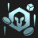
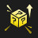
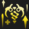
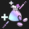
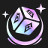
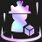

# Augment: silver, Count: 67
| key                          | name                    | icon                                                                             | desc                                                                                                                                    |
| -                            | -                       | -                                                                                | -                                                                                                                                       |
| AFK                          | AFK                     |                                                    | You cannot perform actions for the next 3 rounds. Afterwards, gain 20 gold.                                                             |
| AllNatural                   | All Natural I           |                                      | Your Champions with no items equipped gain 120 Health and heal for 1% of their max Health each second.                                  |
| ArmorcladTrait               | Juggernaut Heart        |                              | Your team counts as having 1 additional Juggernaut. Gain a Sett.                                                                        |
| ArmyBuilding                 | Army Building           |                                  | Gain a Lesser Champion Duplicator. This happens a second time after 7 player combats.                                                   |
| BalancedBudget               | Balanced Budget         |                              | At the start of the next 4 rounds, Gain 4 Gold.                                                                                         |
| BardPlaybook1                | Caretaker's Ally        |                                | Each time you level up, gain the same random Tier 2 champion.                                                                           |
| BastionTrait                 | Bastion Heart           |                                  | Your team counts as having 1 additional Bastion. Gain a Kassadin.                                                                       |
| BattleReady                  | Battle Ready            |                                    | Your team deals 3% more damage and takes 3% less damage.                                                                                |
| BloodMoney                   | Blood Money             |                                      | Gain 1 gold per 3 Health your Tactician loses.                                                                                          |
| BranchingOut                 | Branching Out           |                                  | Gain a random Emblem and a Reforger.                                                                                                    |
| BronzeTicket                 | Bronze Ticket           |                                  | Every 4 Shop refreshes, gain a free refresh.                                                                                            |
| BruiserTrait                 | Bruiser Heart           |                                  | Your team counts as having 1 additional Bruiser. Gain a Vi.                                                                             |
| BuildingACollection          | Buried Treasures I      |                    | At the start of the next 2 rounds, gain a random item component.                                                                        |
| ChallengerTrait              | Challenger Heart        |                            | Your team counts as having 1 additional Challenger. Gain a Warwick.                                                                     |
| Commander_Experience1        | Knowledge Download I    |                | Gain 12 XP.                                                                                                                             |
| Commander_Money              | Money!                  |                            | Gain 11 Gold. In 4 turns, gain 11 Gold again.                                                                                           |
| Commander_PartialAscension   | Partial Ascension       |      | After 15 seconds of combat, your units deal 30% more damage.                                                                            |
| Commander_RollingForDays     | Rolling For Days I      |          | Gain 10 free shop refreshes. These shop refreshes carry over between rounds.                                                            |
| Commander_SmallForge         | Small Forge             |                  | Gain a Component Anvil and 2 Gold.                                                                                                      |
| Commander_SmallForgePlus     | Job's Done              |          | Gain a Component Anvil and a random Component Item.                                                                                     |
| Commander_TinyPower1         | Tiny Power I            |                  | Your units gain 6% Attack Damage, Ability Power, and Attack Speed.                                                                      |
| Commander_WellEarnedComforts | Well-Earned Comforts I  |  | Your units gain 70 Health for each item equipped.                                                                                       |
| Consistency                  | Consistency             |                                    | Gain double win and loss streak gold.                                                                                                   |
| CustomerIsAlwaysRight        | Component Buffet        |                | Gain a random component. Whenever you would get a random component, instead gain a component anvil.                                     |
| CuttingCorners               | Cutting Corners         |                              | Leveling up costs 3 XP less. You can now reach Level 10.                                                                                |
| CyberneticBulk1              | Cybernetic Bulk I       |                            | Your champions holding an item gain 225 health.                                                                                         |
| CyberneticLeech1             | Cybernetic Leech I      |                          | Your units holding an item gain 80 Health and 10% Omnivamp.                                                                             |
| DravenSpoilsOfWar            | Spoils of War I         |                        | When you kill an enemy unit, there's a 20% chance to drop loot.                                                                         |
| FinalGrabBag                 | Final Grab Bag          |                                  | Gain a random component, 12 gold, and a Reforger.                                                                                       |
| Formation1                   | Unified Resistance I    |                                      | If you have 3 or more units in the same row at the start of combat, they all gain 15 Armor and Magic Resist.                            |
| GottaGoFast                  | Gotta Go Fast!          |                                    | Your team generates 10% more mana and moves 35% faster.                                                                                 |
| Harmacist1                   | Harmacist I             |                                      | Your units heal for 10% of the damage they deal, and they convert 20% of excess healing to true damage on their next attack.            |
| HealingOrbsI                 | Healing Orbs I          |                                  | When an enemy dies, the nearest allied unit is healed for 250.                                                                          |
| Inconsistency                | Inconsistency           |                                | If your streak is less than 3, gain 2 gold.                                                                                             |
| IndomitableWill              | Indomitable Will        |                            | When your units score a Takedown they shed all negative effects and become immune to Crowd Control for 10 seconds.                      |
| IronAssets                   | Iron Assets             |                                      | Gain a Component Anvil and 4 Gold.                                                                                                      |
| ItemGrabBag1                 | Item Grab Bag I         |                                  | Gain 1 random completed item.                                                                                                           |
| ItPaysToLearn                | It Pays To Learn        |                                | Gain 10 XP and 8 gold.                                                                                                                  |
| LategameSpecialist           | Lategame Specialist     |                      | When you reach Level 9, gain 44 gold.                                                                                                   |
| LesserJeweledLotus           | Jeweled Lotus I         |                      | Combat Start: Your strongest unit gains 40% critical strike chance and their spells can critically strike.                              |
| LongTimeCrafting             | Latent Forge            |                          | Gain an Ornn Item Anvil after 8 player combats.                                                                                         |
| MarksmanTrait                | Gunner Heart            |                                | Your team counts as having 1 additional Gunner. Gain a Jinx.                                                                            |
| MissedConnections            | Missed Connections      |                        | Gain a copy of each Tier One champion.                                                                                                  |
| OnARoll                      | On a Roll               |                                            | Whenever you star-up a champion, gain a free reroll. Gain 2 gold.                                                                       |
| OneTwoFive                   | One, Two, Five!         |                                      | Gain 1 random component, 2 Gold, and 1 random Tier 5 champion(s).                                                                       |
| OneTwosThree                 | One Twos Three          |                                  | Gain 1 Tier one unit, 2 Tier two units, and 1 Tier three unit.                                                                          |
| PandorasBench                | Pandora's Bench         |                                | Gain 2 gold. At the start of every round, champions on the 3 rightmost bench slots transform into random champions of the same cost.    |
| PandorasItems                | Pandora's Items         |                                | Gain a random component. Round Start: items on your bench are randomized (excluding Tactician's Crown, Spatula, and consumables).       |
| PreserverTrait               | Invoker Heart           |                              | Your team counts as having 1 additional Invoker. Gain a Soraka.                                                                         |
| PumpingUp                    | Pumping Up I            |                                        | Your units gain 8% Attack Speed. Each round, increase this by 0.5%.                                                                     |
| Recombobulator               | Recombobulator          |                              | Champions on your board permanently transform into random champions 1 Tier higher. Gain @NumRemovers@ Magnetic Removers.                |
| RedBuff                      | Red Buff                |                                            | Your units' attacks burn their targets for 5% of their maximum Health over 5 seconds and reduce their targets' healing received by 50%. |
| RiskyMoves                   | Risky Moves             |                                      | Your Tactician loses 20 Health, but after 7 Player combats, gain 30 Gold.                                                               |
| RogueTrait                   | Rogue Heart             |                                      | Your team counts as having 1 additional Rogue. Gain a Qiyana.                                                                           |
| SilverSpoon                  | Silver Spoon            |                                    | Gain 10 XP.                                                                                                                             |
| SlayerTrait                  | Slayer Heart            |                                    | Your team counts as having 1 additional Slayer. Gain a Qiyana.                                                                          |
| SocialDistancing             | Social Distancing I     |                          | Units that begin combat with no adjacent allies gain 10% Attack Damage and Ability Power.                                               |
| SorcererTrait                | Sorcerer Heart          |                                | Your team counts as having 1 additional Sorcerer. Gain a Swain.                                                                         |
| TinyGrabBag                  | Tiny Grab Bag           |                                    | Gain a random component, 2 gold, a Magnetic Remover.                                                                                    |
| TinyTitans                   | Tiny Titans             |                                      | Your Tactician heals 30 Health, grows larger, and has 130 maximum Health.                                                               |
| TopDeck                      | Training Reward         |                                            | Gain 5 gold and a Lesser Champion Duplicator.                                                                                           |
| Transfusion                  | Transfusion I           |                                    | Your team gains 20 Health, plus 2 Health per missing Tactician Health.                                                                  |
| YoungAndWildAndFree          | Young and Wild and Free |                    | You can always move freely on Carousel rounds. Gain a random component.                                                                 |
| ZaunTrait                    | Zaun Heart              |                                        | Your team counts as having 1 additional Zaun. Gain a Warwick.                                                                           |
| VanquisherHeart              | Vanquisher Heart        |                            | Your team counts as having 1 additional Vanquisher. Gain an Ashe.                                                                       |
| StationarySupportI           | Stationary Support I    |                      | Gain 1 Training Dummy(s) after 8 player combats. Equip the dummy with 1 random Support Item(s), which cannot be removed.                |
| TeamingUpI                   | Teaming Up I            |                                      | Gain 1 random component item and 2 random Tier 3 champions.                                                                             |
# Augment: gold, Count: 132
| key                             | name                    | icon                                                                                   | desc                                                                                                                                                                                                  |
| -                               | -                       | -                                                                                      | -                                                                                                                                                                                                     |
| ACutAbove                       | A Cut Above             |                                              | Gain a Deathblade. Champions with Deathblade have a 25% chance to drop 1 gold on kill.                                                                                                                |
| AllNatural2                     | All Natural II          |                                          | Your units with no items equipped gain 150 Health and heal for 2% of their max Health each second.                                                                                                    |
| ArmorcladCrest                  | Juggernaut Crest        |                                    | Gain an Juggernaut Emblem and a Sett.                                                                                                                                                                 |
| BalancedBudget2                 | Balanced Budget II      |                                  | At the start of the next 4 rounds, Gain 6 Gold.                                                                                                                                                       |
| BardPlaybook2                   | Caretaker's Favor       |                                      | Gain a component anvil when you reach level 5, 6, 7, and 8.                                                                                                                                           |
| BastionCrest                    | Bastion Crest           |                                        | Gain a Bastion Emblem and a Kassadin.                                                                                                                                                                 |
| BastionMorningLight             | Morning Light           |                          | When your Bastion units drop below 50% Health, they heal for 40% of their maximum Health over 4 seconds. Gain 2 Bastion units.                                                                        |
| BattleReadyII                   | Battle Ready II         |                                      | Your team deals 6% more damage and takes 6% less damage.                                                                                                                                              |
| BigGrabBag                      | Big Grab Bag            |                                            | Gain 2 random components, 1 gold, and a Reforger.                                                                                                                                                     |
| BruiserCrest                    | Bruiser Crest           |                                        | Gain a Bruiser Emblem and a Vi.                                                                                                                                                                       |
| BruiserTitanicStrength          | Titanic Strength        |                    | Bruisers gain % increased Attack Damage equal to 1.5% of their maximum Health. Gain 2 Bruisers.                                                                                                       |
| BuildingACollectionPlus         | Buried Treasures II     |                  | At the start of the next 3 rounds, gain a random item component.                                                                                                                                      |
| CapriciousForge                 | Capricious Forge        |                                  | Gain a Blacksmith's Gloves, which equips two temporary Artifacts each round.                                                                                                                          |
| ChallengerCrest                 | Challenger Crest        |                                  | Gain a Challenger Emblem and a Warwick.                                                                                                                                                               |
| ChallengerDefensiveDash         | Defensive Dash          |                  | Combat Start and on takedown: Your Challenger units gain a 100-250 health shield for 2.5 seconds (based on current Stage). Gain 2 Challenger units.                                                   |
| CombatCaster                    | Combat Caster           |                                        | Your units gain a 90-170 (based on current Stage) health shield for 6 seconds after casting their spell.                                                                                              |
| Commander_Ascension             | Ascension               |                          | After 15 seconds of combat, your units deal 50% more damage.                                                                                                                                          |
| Commander_Experience2           | Knowledge Download II   |                      | Gain 22 XP.                                                                                                                                                                                           |
| Commander_MediumForge           | Medium Forge            |                      | Gain a Completed Item Anvil and 1 Gold.                                                                                                                                                               |
| Commander_MediumForgePlus       | Job Well Done           |              | Gain a Completed Item Anvil and a random Component item.                                                                                                                                              |
| Commander_Money2                | Money Money!            |                                | Gain 16 Gold. In 3 turns, gain 16 Gold again.                                                                                                                                                         |
| Commander_RollingForDays2       | Rolling For Days II     |              | Gain 15 free shop refreshes, These shop refreshes carry over between rounds.                                                                                                                          |
| Commander_TinyPower2            | Tiny Power II           |                        | Your units gains 10% Attack Damage, Ability Power, and Attack Speed.                                                                                                                                  |
| Commander_WellEarnedComforts2   | Well-Earned Comforts II |      | Your units gain 111 Health for each item equipped.                                                                                                                                                    |
| Contagion                       | Contagion               |                                              | Combat Start: Infect the highest health enemy, increasing their damage taken by 18%. Every 5 seconds or on death, the infection spreads to 2 nearby units.                                            |
| CyberneticBulk2                 | Cybernetic Bulk II      |                                  | Your champions holding an item gain 300 health.                                                                                                                                                       |
| CyberneticLeech2                | Cybernetic Leech II     |                                | Your units holding an item gain 120 Health and 15% Omnivamp.                                                                                                                                          |
| DangerousToGoAlone              | Parting Gifts           |                            | When a unit dies, they pass a temporary copy of one of their items to the nearest ally with open slots and shield them for 50% of their maximum Health.                                               |
| Dedication                      | Dedication              |                                            | The first time you field at least 4 distinct units of the same trait in a player combat, gain an Emblem for that trait.                                                                               |
| DemaciaCrest                    | Demacia Crest           |                                        | Gain a Demacia Emblem and a Galio.                                                                                                                                                                    |
| DemaciaPetriciteShackles        | Petricite Shackles      |                | Your Demacians deal 12% more damage, increased to 18% against Noxians and enemies with 100 or more maximum Mana. Gain 2 Demacians.                                                                    |
| DravenSpoilsOfWar2              | Spoils of War II        |                            | When you kill an enemy unit, there's a 30% chance to drop loot.                                                                                                                                       |
| EarlyEducation                  | Early Education         |                                    | Your champions permanently gain 1 Ability Power whenever they kill an enemy. Champions start with 15 bonus Ability Power.                                                                             |
| EnduranceTraining               | Endurance Training      |                              | Your champions permanently gain 18 Health every time they kill an enemy. Champions start with 100 bonus Health.                                                                                       |
| EnshroudingStillness            | Mana Burn               |                        | Gain a Shroud of Stillness. All enemies take 1.5% of their maximum health as true damage each second until the first time they cast their spell. No longer damages units without mana.                |
| EscortQuest                     | Escort Quest            |                                          | Gain a Training Dummy. Each round, if it survives combat, gain 3 gold.                                                                                                                                |
| FinalGrabBagPlus                | Final Grab Bag II       |                                | Gain 2 random components, 15 gold, and a Magentic Remover.                                                                                                                                            |
| Formation2                      | Unified Resistance II   |                                            | If you have 3 or more units in the same row at the start of combat, they all gain 25 Armor and Magic Resist.                                                                                          |
| FreljordTrait                   | Freljord Heart          |                                      | Your team counts as having 1 additional Freljord. Gain an Ashe.                                                                                                                                       |
| GalioCarry                      | Winds of War            |                                            | Gain a Galio. Your strongest Galio's ability gets larger with each cast, and enemies hit take magic damage equal to 10% of his max Health each second.                                                |
| GargantuanResolve               | Gargantuan Resolve      |                              | Gain a Titan's Resolve. Your Titan's Resolves can continue stacking to 40 instead of 25.                                                                                                              |
| GiftsFromTheFallen              | Gifts from the Fallen   |                            | Your units gain 3% Attack Damage, 3 Ability Power, 3 Armor, and 3 Magic Resist. When one of your units dies, all your units gain these stats again.                                                   |
| GottaGoFastII                   | Gotta Go Fast! II       |                                      | Your team generates 20% more mana and moves 60% faster.                                                                                                                                               |
| GunnerSpiritOfTheDuelist        | Dueling Gunners         |                | Your Gunner units gain 8% Attack Speed, plus 2% per Gunner stack. Gain 2 Gunners.                                                                                                                     |
| Harmacist2                      | Harmacist II            |                                            | Your units heal for 15% of the damage they deal, and they convert 25% of excess healing to true damage on their next attack.                                                                          |
| HealingOrbsII                   | Healing Orbs II         |                                      | When an enemy dies, the nearest allied unit is healed for 500.                                                                                                                                        |
| HyperRoll                       | Hustler                 |                                              | Instead of having no interest, you get 3 golds at the beginning of player combat rounds.                                                                                                              |
| Idealism                        | Idealism                |                                                | Gain a Hand of Justice. Champions with a Hand of Justice deal 12% increased damage.                                                                                                                   |
| ImpromptuInventions             | Scrappy Inventions      |                          | At the start of combat, maximum of 4 components on your champions turn into  temporary items for the rest of combat. At the start of the next 1 stages, gain a component.                             |
| Infusion                        | Infusion                |                                                | Your team restores 20 Mana every 6 seconds.                                                                                                                                                           |
| InvokerLovingInvocation         | Loving Invocation       |                  | Your team gains 2 Ability Power until the end of combat each time your Invoker units cast their Abilities. Gain 2 Invokers.                                                                           |
| IoniaCrest                      | Ionia Crest             |                                            | Gain a Ionia Emblem and a Sett.                                                                                                                                                                       |
| IoniaSentinelsSpirit            | Sentinel's Spirit       |                        | While in spirit form, your Ionia units gain 10% Attack Speed and shield themselves for 15% of their maximum Health. Gain 2 Ionians.                                                                   |
| ItemGrabBagPlus                 | Item Grab Bag II        |                                  | Gain a random completed item, a random component, and 1 gold.                                                                                                                                         |
| ItPaysToLearnII                 | It Pays to Learn II     |                                  | Gain 16 XP and 12 gold.                                                                                                                                                                               |
| JeweledLotus                    | Jeweled Lotus II        |                                        | Your units' Abilities can critically strike. Your units gain 15% Critical Strike chance.                                                                                                              |
| JuggernautCantStopMe            | Adrenaline Rush         |                        | Your Juggernaut units deal 10% extra damage, increased to 20% for the rest of combat when they fall below 60% Health.  Gain 2 Juggernauts.                                                            |
| JustKeepRolling                 | Frequent Flier          |                                  | After you refresh your shop 8 times, your refreshes cost 1 for the rest of the game.                                                                                                                  |
| KassadinCarry                   | Riftwalk                |                                      | Before casting, your strongest Kassadin gains 38 AP and blinks to the furthest enemy within 3 hexes, but his spell no longer disarms or shields. His mana cost is reduced by 30. Gain a Kassadin.     |
| KnowledgeIsPower                | Library Card            |                                | Gain a Tome of Traits and a Component Anvil                                                                                                                                                           |
| KnowYourEnemy                   | Know Your Enemy         |                                      | Your units deal 12% increased damage. If you and your opponent have any of the same traits activated, they deal 18% increased damage instead.                                                         |
| LastStand                       | Last Stand              |                                              | The first time you would be eliminated or reduced to 1 Health, instead remain alive. After this effect triggers, your units permanently gain 180 Health, 18 Armor and Magic Resist, and 18% Omnivamp. |
| LearningFromExperience2         | Patient Study           |                  | After player combat, gain 2 XP if you won or 3 XP if you lost. You can now reach Level 10.                                                                                                            |
| LongDistanceRelationship2       | Long Distance Pals II   |              | Combat start: Your two furthest champions form a bond, sharing 22% of their Armor, Magic Resist, Attack Damage, and Ability Power with each other.                                                    |
| MarksmanCrest                   | Gunner Crest            |                                      | Gain a Gunner Emblem and a Jinx.                                                                                                                                                                      |
| Martyr                          | Martyr                  |                                                    | Whenever one of your units dies, all allies heal for 10% of Maximum health                                                                                                                            |
| MetabolicAccelerator            | Metabolic Accelerator   |                        | Your Tactician moves faster and heals 2 Health after a PvP round.                                                                                                                                     |
| MulticasterPracticeMakesPerfect | Perfected Repetition    |  | Each time your Multicaster units deal ability damage, they gain 9%% Ability power (Max: 90%%) until the end of combat. Gain 2 Multicasters.                                                           |
| NotToday                        | Not Today               |                                                | Gain an Edge of Night. Allies holding Edge of Night gain 35% Attack Speed.                                                                                                                            |
| NoxusCrest                      | Noxus Crest             |                                            | Gain a Noxus Emblem and a Swain.                                                                                                                                                                      |
| NoxusTotalDomination            | Total Domination        |                        | Noxus units' attacks and Abilities execute enemies below 5% Health, increased by 1% for each player you've Conquered. Gain 2 Noxians.                                                                 |
| OldMansWalkingStick             | Magic Wand              |                          | Gain a Needlessly Large Rod. Your units gain 18% Ability Power.                                                                                                                                       |
| PandorasItems2                  | Pandora's Items II      |                                    | Gain 1 random components. Round Start: items on your bench are randomized (excluding Tactician's Crown, Spatula, and consumables).                                                                    |
| PiltoverShimmeringInventors     | Shimmering Inventors    |          | Your Piltover units gain 8% Bonus Damage every 10 gold you have (Max: 40%), and have a 33% chance to drop 1 gold at round start. Gain an Ekko.                                                        |
| PiltoverTrait                   | Piltover Heart          |                                      | Your team counts as having 1 additional Piltover. Gain a Vi.                                                                                                                                          |
| PortableForge                   | Portable Forge          |                                      | Open an Armory and choose 1 of 2 unique Artifacts crafted by Ornn.                                                                                                                                    |
| PortableForgePlus               | Portable Forge          |                              | Open an Armory and choose 1 of 3 unique Artifacts crafted by Ornn.                                                                                                                                    |
| PortableForgePlusPlus           | Portable Forge          |                      | Open an Armory and choose 1 of 4 unique Artifacts crafted by Ornn.                                                                                                                                    |
| PreserverCrest                  | Invoker Crest           |                                    | Gain an Invoker Emblem and a Soraka.                                                                                                                                                                  |
| PumpingUp2                      | Pumping Up II           |                                            | Your units gain 8% Attack Speed. Each round, increase this by 1%.                                                                                                                                     |
| ReturnOnInvestment              | Return on Investment    |                            | After you refresh your shop 18 times, gain a Tactician's Crown.                                                                                                                                       |
| RichGetRicher                   | Rich Get Richer         |                                      | Gain 12 gold. Your maximum interest is increased to 7.                                                                                                                                                |
| RichGetRicherPlus               | Rich Get Richer+        |                              | Gain 18 gold. Your maximum interest is increased to 7.                                                                                                                                                |
| RogueCrest                      | Rogue Crest             |                                            | Gain a Rogue Emblem and a Qiyana.                                                                                                                                                                     |
| RogueVampiricBlades             | Vampiric Blades         |                          | Your team gains 10% Omnivamp. Your Rogue units gain 15% instead. Gain 2 Rogues.                                                                                                                       |
| SalvageBin                      | Salvage Bin             |                                            | Gain a random completed item now, and a component after @NumRounds@ player combats. Selling champions breaks apart their full items into components (excluding Tactician's Crown).                    |
| SalvageBinPlus                  | Salvage Bin+            |                                    | Gain a random completed item now, and a component after @NumRounds@ player combats. Selling champions breaks apart their full items into components (excluding Tactician's Crown).                    |
| SettTheBoss                     | The Boss                |                                          | Gain a Sett. The first time your strongest Sett falls below 60% Health, he takes a break to do sit-ups. Each sit-up heals him 10% of his max Health and grants 40% Attack Speed and Ability Power.    |
| Shoplifting                     | Shoplifting             |                                          | After your first shop refresh each turn, gain the highest cost champion for free.                                                                                                                     |
| ShurimaCrest                    | Shurima Crest           |                                        | Gain a Shurima Emblem and a Taliyah.                                                                                                                                                                  |
| SilverTicket                    | Silver Ticket           |                                        | Each time your Shop is refreshed, you have a 30% chance to gain a free refresh.                                                                                                                       |
| SlayerCrest                     | Slayer Crest            |                                          | Gain a Slayer Emblem and a Qiyana.                                                                                                                                                                    |
| SlayerSlayersResolve            | Slayer's Resolve        |                        | When your Slayer units take or deal damage, they gain 2 Armor and Magic Resistance for the rest of combat (This can stack up to 25 times). Gain 2 Slayers.                                            |
| Sleightofhand                   | Sleight of Hand         |                                      | Gain a Thief's Gloves. Champions holding Thief's Gloves gain 200 Health and 20% Attack Speed.                                                                                                         |
| SocialDistancing2               | Social Distancing II    |                              | Units that begin combat with no adjacent allies gain 16% Attack Damage and Ability Power.                                                                                                             |
| SorcererCrest                   | Sorcerer Crest          |                                      | Gain a Sorcerer Emblem and a Swain.                                                                                                                                                                   |
| SorcererOverchargedManafont     | Overcharged Manafont    |          | Combat Start: Your Sorcerer units gain 10 mana. The first time each Sorcerer gets a take down each combat, they gain 20 mana. Gain 2 Sorcerers.                                                       |
| StarsAreBorn                    | Stars are Born          |                                        | The first tier 1 unit and tier 2 unit you buy are upgraded to 2-star. Gain a 3 gold.                                                                                                                  |
| StrategistTacticalSuperiority   | Tactical Superiority    |      | Your units gain 4% Attack Damage and Ability Power for each of their traits you have activated, doubled when you field a Strategist. Gain 2 Strategists.                                              |
| StrategistTrait                 | Strategist Heart        |                                  | Your team counts as having 1 additional Strategist. Gain a Swain.                                                                                                                                     |
| SwainCarry                      | Demonflare              |                                            | Gain a Swain. Your strongest Swain deals 2.5% increased damage per 100 max Health.                                                                                                                    |
| TargonStaffOfFlowingWaters      | Stellacorn's Blessing   |            | While you have the Targon trait activated, your units gain 40% Attack Speed for 4 seconds after being healed or shielded. Gain 2 Targonians.                                                          |
| TargonTrait                     | Targon Heart            |                                          | Your team counts as having 1 additional Targon. Gain a Soraka.                                                                                                                                        |
| ThreesACrowd                    | Three's a Crowd         |                                        | Your units gain 100 Health for each unique Tier 3 unit you field.                                                                                                                                     |
| ThreesCompany                   | Three's Company         |                                      | Gain 4 random Tier 3 champions.                                                                                                                                                                       |
| TomeOfTraits1                   | Ancient Archives I      |                                      | Gain 1 Tome of Traits and 3 gold.                                                                                                                                                                     |
| TonsOfStats                     | Tons of Stats!          |                                          | Your team gains 44 Health, 4% Attack Damage, 4 Ability Power, 4 Armor, 4 Magic Resist, 4% Attack Speed, and 4 Mana.                                                                                   |
| TopDeckPlus                     | Training Reward II      |                                          | Gain 12 gold and a Lesser Champion Duplicator.                                                                                                                                                        |
| TradeSector                     | Trade Sector            |                                          | Gain a free Shop refresh each round.                                                                                                                                                                  |
| Traitless2                      | Built Different II      |                                            | Your units with no Traits active gain 250-500 Health and 40-60% Attack Speed (based on current Stage).                                                                                                |
| TransfusionPlus                 | Transfusion II          |                                  | Your team gains 40 Health, plus 3 Health per missing Tactician Health.                                                                                                                                |
| Twins2                          | Double Trouble II       |                                                    | When you field exactly 2 copies of a champion, they both gain 30% Attack Damage and 30 Ability Power, Armor, and Magic Resist. When you 3-star, gain a 2-star copy.                                   |
| TwoHealthy                      | Two Healthy             |                                            | Your units gain 100 Health for each unique Tier 2 unit you field.                                                                                                                                     |
| VoidRapidIncubation             | Stable Evolution        |                          | Your Void units gain 60 Health and 6% Attack Damage and Ability Power for each star level they have. Gain 2 Void units.                                                                               |
| VoidTrait                       | Void Crest              |                                              | Gain a Void Emblem, Kassadin.                                                                                                                                                                         |
| WarwickCarry                    | Ravenous Hunter         |                                        | Gain a Warwick. When your strongest Warwick takes or deals damage, he gains 4% Attack Damage and 4 Ability Power, Armor, and Magic Resist, stacking up to 55 times.                                   |
| WhatDoesntKillYou               | What Doesn't Kill You   |                              | After losing your combat, gain 2 gold. Every 4 losses, gain a random component.                                                                                                                       |
| YouHaveMyBow                    | You Have My Bow         |                                        | Gain a Recurve Bow. Your units gain 12% Attack Speed.                                                                                                                                                 |
| YouHaveMySword                  | You Have My Sword       |                                    | Gain a B.F. Sword. Your units gain 15% Attack Damage.                                                                                                                                                 |
| ZaunChemicallyEnhancedBulk      | Chemtech Enhancements   |            | Your Chem Modded units gain 500 Health. Allies that start combat adjacent to them gain 250 Health. Gain 2 Zaun units.                                                                                 |
| ZaunCrest                       | Zaun Crest              |                                              | Gain a Zaun Emblem and a Warwick.                                                                                                                                                                     |
| BilgewaterCrest                 | Bilgewater Crest        |                                  | Gain a Bilgewater Emblem and a Twisted Fate.                                                                                                                                                          |
| IxtalHeart                      | Ixtal Heart             |                                            | Your team counts as having 1 additional Ixtal. Gain a Qiyana.                                                                                                                                         |
| VanquisherCrest                 | Vanquisher Crest        |                                  | Gain a Vanquisher Emblem and an Ashe.                                                                                                                                                                 |
| RisingInfamy                    | Rising Infamy           |                                        | Round start: Get a level 1 treasure chest. Your cannon barrages permanently improve future chests. Gain 2 Bilgewater units.                                                                           |
| RisingInfamyPlus                | Rising Infamy+          |                                | Round start: Get a level 2 treasure chest. Your cannon barrages permanently improve future chests. Gain 2 Bilgewater units.                                                                           |
| RisingInfamyPlusPlus            | Rising Infamy++         |                        | Round start: Get a level 4 treasure chest. Your cannon barrages permanently improve future chests. Gain 2 Bilgewater units.                                                                           |
| RejuvenatingFlames              | Rejuvenating Flames     |                            | Allies heal for 10% of their max Health every 5 seconds. Allies that started combat in an elemental hex heal for 15% instead. Gain 2 Ixtal champions.                                                 |
| StolenVitality                  | Stolen Vitality         |                                    | When your Vanquisher's attacks and Abilities critically strike, they heal the ally with the most missing Health by 1% of that ally's max Health. Gain 2 Vanquishers.                                  |
| StationarySupportII             | Stationary Support II   |                          | Gain 1 Training Dummy(s). It has 1 random Support Item(s) equipped, which cannot be removed.                                                                                                          |
| SupportCache                    | Support Cache           |                                        | Open an Armory and choose 1 of 4 unique Support items.                                                                                                                                                |
| TeamingUpII                     | Teaming Up II           |                                          | Gain 1 random Support item and 1 random Tier 4 champion.                                                                                                                                              |
# Augment: prismatic, Count: 87
| key                           | name                     | icon                                                                               | desc                                                                                                                                                                                                        |
| -                             | -                        | -                                                                                  | -                                                                                                                                                                                                           |
| ArmorcladCrown                | Juggernaut Crown         |                                | Gain an Juggernaut Emblem, a Bloodthirster, and a Darius.                                                                                                                                                   |
| BalancedBudget3               | Balanced Budget III      |                              | At the start of the next 4 rounds, Gain 10 Gold.                                                                                                                                                            |
| BardPlaybook3                 | Caretaker's Chosen       |                                  | As you level, gain more powerful items. At level 4 - gain a Component Anvil, at level 6 - gain a Completed Item Anvil, at level 8 - open a radiant item armory.                                             |
| BastionCrown                  | Bastion Crown            |                                    | Gain a Bastion Emblem,  a Sunfire Cape, and a Taric.                                                                                                                                                        |
| BattleReadyIII                | Battle Ready III         |                                | Your team deals 8% more damage and takes 8% less damage.                                                                                                                                                    |
| BinaryAirdrop                 | Binary Airdrop           |                                  | Your champions equipped with 2 items temporarily gain a random completed item at the start of combat.                                                                                                       |
| BirthdayPresents              | Birthday Present         |                            | Gain a 2-star champion and 1 gold every time you level up. The champion's tier is your level minus 4 (min: Tier 1).                                                                                         |
| BlindingSpeed                 | Blinding Speed           |                                  | Gain a Rapid Firecannon and a Guinsoo's Rageblade, a Recurve bow, a Magnetic Remover.                                                                                                                       |
| BruiserCrown                  | Bruiser Crown            |                                    | Gain a Bruiser Emblem, a Redemption, and a Rek'Sai.                                                                                                                                                         |
| BuildingACollectionPlusPlus   | Buried Treasures III     |      | At the start of the next 6 rounds, gain a random item component.                                                                                                                                            |
| ChallengerCrown               | Challenger Crown         |                              | Gain a Challenger Emblem, a Hand of Justice, and a Naafiri.                                                                                                                                                 |
| Commander_Experience3         | Knowledge Download III   |                  | Gain 36 XP.                                                                                                                                                                                                 |
| Commander_FinalAscension      | Final Ascension          |            | Your units deal 15% more damage. After 15 seconds, this effect triples.                                                                                                                                     |
| Commander_LargeForge          | Large Forge              |                    | Gain an Ornn Item Anvil and a Component Item Anvil.                                                                                                                                                         |
| Commander_LargeForgePlus      | Masterful Job            |            | Gain an Ornn Item Anvil and a Completed Item Anvil                                                                                                                                                          |
| Commander_Money3              | Money Money Money!       |                            | Gain 25 Gold. In 3 turns, gain 25 Gold again.                                                                                                                                                               |
| Commander_RollingForDays3     | Rolling For Days III     |          | Gain 25 free shop refreshes, These shop refreshes carry over between rounds.                                                                                                                                |
| Commander_TinyPower3          | Tiny Power III           |                    | Your units gains 15% Attack Damage, Ability Power, and Attack Speed.                                                                                                                                        |
| Commander_WellEarnedComforts3 | Well-Earned Comforts III |  | Your units gain 120 Health and 6% Attack Speed for each item equipped.                                                                                                                                      |
| CursedCrown                   | Cursed Crown             |                                      | Gain +2 maximum team size, but take 100% increased player damage.                                                                                                                                           |
| CyberneticBulk3               | Cybernetic Bulk III      |                              | Your champions holding an item gain 500 health.                                                                                                                                                             |
| CyberneticLeech3              | Cybernetic Leech III     |                            | Your units holding an item gain 250 Health and 20% Omnivamp.                                                                                                                                                |
| DemaciaCrown                  | Demacia Crown            |                                    | Gain a Demacia Emblem, a Recurve Bow, and a Quinn.                                                                                                                                                          |
| DravenSpoilsOfWar3            | Spoils of War III        |                        | When you kill an enemy unit, there's a 40% chance to drop amazing loot.                                                                                                                                     |
| FinalGrabBagPlusPlus          | Urf's Grab Bag           |                    | Gain 2 random components, a Champion Duplicator, and a Spatula.                                                                                                                                             |
| FinalReserves                 | Final Reserves           |                                  | The first time you would be eliminated or reduced to 1 Health, instead remain alive. Then, at the beginning of your next planning phase gain 60 XP and set your gold to 66. Excess gold is converted to XP. |
| FreljordTrait2                | Freljord Soul            |                                | Your team counts as having 1 additional Freljord. Gain a Redemption and an Ashe.                                                                                                                            |
| GachaAddict                   | Golden Ticket            |                                      | Each time your Shop is refreshed, you have a 45% chance to gain a free refresh.                                                                                                                             |
| GiantGrabBag                  | Giant Grab Bag           |                                    | Gain 3 random components, 4 gold, and a Lesser Champion Duplicator.                                                                                                                                         |
| GottaGoFastIII                | Gotta Go Fast!!! III     |                                | Your team generates 30% more mana and moves 100% faster.                                                                                                                                                    |
| GreaterJeweledLotus           | Jeweled Lotus III        |                      | Your units' Abilities can critically strike. Your units gain 45% Critical Strike chance.                                                                                                                    |
| Harmacist3                    | Harmacist III            |                                        | Your units heal for 25% of the damage they deal, and they convert 30% of excess healing to true damage on their next attack.                                                                                |
| HedgeFund                     | Hedge Fund               |                                          | Gain 23 gold. Your maximum interest is increased to 10.                                                                                                                                                     |
| HedgeFundPlus                 | Hedge Fund+              |                                  | Gain 32 gold. Your maximum interest is increased to 10.                                                                                                                                                     |
| HedgeFundPlusPlus             | Hedge Fund++             |                          | Gain 44 gold. Your maximum interest is increased to 10.                                                                                                                                                     |
| HighEndSector                 | High End Sector          |                                  | Gain 1 gold per round. When you level up, gain a number of free shop refreshes equal to your level, which carry over between rounds.                                                                        |
| ImpenetrableBulwark           | Impenetrable Bulwark     |                      | Gain a Bramble Vest, a Dragon's Claw, a Giant's Belt, and a Magnetic Remover.                                                                                                                               |
| InfernalContract              | Infernal Contract        |                            | Your max level is 7. Gain 75 Gold.                                                                                                                                                                          |
| IoniaCrown                    | Ionia Crown              |                                        | Gain an Ionia Emblem, a Guardbreaker, and a Karma.                                                                                                                                                          |
| ItemGrabBagPlusPlus           | Item Grab Bag III        |                      | Gain 2 random full items and 4 Gold.                                                                                                                                                                        |
| ItPaysToLearnIII              | It Pays to Learn III     |                            | Gain 24 XP and 16 gold.                                                                                                                                                                                     |
| LivingForge                   | Living Forge             |                                      | Gain an Ornn Item Anvil now and after every 10 player combats.                                                                                                                                              |
| LuckyGloves                   | Lucky Gloves             |                                      | Thief's Gloves will always give your champions ideal items. Gain 2 Sparring Gloves.                                                                                                                         |
| MarksmanCrown                 | Gunner Crown             |                                  | Gain a Gunner Emblem, a Runann's Hurricane, and a Jayce.                                                                                                                                                    |
| MaxLevel10                    | Level Up!                |                                        | When you buy XP, gain an additional 3. Gain 2 immediately. You can now reach level 10.                                                                                                                      |
| MoneyHealsAllWounds           | Wellness Trust           |                      | Round Start: Gain 3 gold. If you have at least 40 gold, your Tactician heals 2 Health.                                                                                                                      |
| MulticasterTrait2             | Multicaster Soul         |                          | Your team counts as having 1 additional Multicaster. Gain a Jeweled Gauntlet and a Vel'Koz.                                                                                                                 |
| NoxusCrown                    | Noxus Crown              |                                        | Gain a Noxus Emblem, a Sparring Gloves, and a Darius.                                                                                                                                                       |
| OneHundredDuckSizedHorses     | Endless Hordes           |          | Gain +3 maximum team size, but your units can only hold 1 item and their total health is reduced by 15%. Gain 4 gold.                                                                                       |
| OneHundredDuckSizedHorsesplus | Endless Hordes+          |  | Gain +3 maximum team size, but your units can only hold 1 item and their total health is reduced by 15%. Gain 14 gold.                                                                                      |
| OverwhelmingForce             | Overwhelming Force       |                          | Gain a Deathblade and an Infinity Edge, a BF Sword, and a Magnetic Remover.                                                                                                                                 |
| PandorasRadiantBox            | Pandora's Box            |                        | Gain a random Radiant item. Round Start: items on your bench are randomized (excluding Tactician's Crown, Spatula, and consumables).                                                                        |
| PhreakyFriday                 | Phreaky Friday           |                                  | Gain an Infinity Force. After 5 player combats, gain another.                                                                                                                                               |
| PhreakyFridayPlus             | Phreaky Friday+          |                          | Gain an Infinity Force. After 3 player combats, gain another.                                                                                                                                               |
| PiltoverTrait2                | Piltover Soul            |                                | Your team counts as having 1 additional Piltover. Gain a Giant Slayer and a Jayce.                                                                                                                          |
| PreserverCrown                | Invoker Crown            |                                | Gain a Invoker Emblem, a Jeweled Gauntlet, and a Karma.                                                                                                                                                     |
| PumpingUp3                    | Pumping Up III           |                                        | Your units gain 8% Attack Speed. Each round, increase this by 2%.                                                                                                                                           |
| RadiantRelics                 | Radiant Relics           |                                  | Open an Armory and choose 1 of 5 unique Radiant items. Gain a Magnetic Remover.                                                                                                                             |
| RogueCrown                    | Rogue Crown              |                                        | Gain a Rogue Emblem, a Hand of Justice, and a Qiyana.                                                                                                                                                       |
| RollTheDice                   | Roll The Dice            |                                      | Gain a Rascal's Gloves, which equips two random Radiant items every round.                                                                                                                                  |
| SacrificialPact               | Cruel Pact               |                              | Buying XP costs 5 Health instead of gold. Heal 2 Health before each player combat.                                                                                                                          |
| ShurimaCrown                  | Shurima Crown            |                                    | Gain a Shurima Emblem, a Protector's Vow, and a Naafiri.                                                                                                                                                    |
| SlayerCrown                   | Slayer Crown             |                                      | Gain a Slayer Emblem, a Night harvester, and a Quinn.                                                                                                                                                       |
| SlowAndSteady                 | March of Progress        |                                  | Gain 3 XP now, and bonus XP equal to your level at the start of every player combat round. You can no longer use gold to level up.                                                                          |
| SocialDistancing3             | Social Distancing III    |                          | Combat start: Units with no adjacent allies gain 25% Attack Damage and Ability Power.                                                                                                                       |
| SorcererCrown                 | Sorcerer Crown           |                                  | Gain a Sorcerer Emblem, a Spear of Shojin, and a Vel'Koz.                                                                                                                                                   |
| StarterKit                    | Starter Kit              |                                        | Gain a Tier 4 champion, and a 2-star Tier 1 champion that shares a trait with them. At the next 1 stages, gain the Tier 4 champion again.                                                                   |
| StrategistTrait2              | Strategist Soul          |                            | Your team counts as having 1 additional Strategist. Gain a Adaptive Helm and a Swain.                                                                                                                       |
| TacticiansTools               | Tactician's Tools        |                              | Gain two Spatulas and 1 Component Anvil.                                                                                                                                                                    |
| TargonTrait2                  | Targon Soul              |                                    | Your team counts as having 1 additional Targon. Gain a Redemption and a Taric.                                                                                                                              |
| TheGoldenEgg                  | The Golden Egg           |                                    | Gain a massive golden egg that hatches in 11 turns. Victorious player combats accelerate the hatch timer by an additional turn.                                                                             |
| TiniestTitan                  | Tiniest Titan            |                                    | Your tactician is small and speedy, heals 2 Health after a PVP round, and grants 2 Gold per round.                                                                                                          |
| TomeOfTraits2                 | Ancient Archives II      |                                  | Gain 2 Tome of Traits and 5 gold.                                                                                                                                                                           |
| TopDeckPlusPlus               | Training Reward III      |                              | Gain 24 gold and a Champion Duplicator.                                                                                                                                                                     |
| Traitless3                    | Built Different III      |                                        | Your units with no Traits active gain 300-600 Health and 50-70% Attack Speed (based on current Stage).                                                                                                      |
| TransfusionPlusPlus           | Transfusion III          |                      | Your team gains 50 Health, plus 5 Health per missing Tactician Health.                                                                                                                                      |
| Twins3                        | Double Trouble III       |                                                | When you field exactly 2 copies of a champion, they both gain 40% Attack Damage and 40 Ability Power, Armor, and Magic Resist. When you 3-star, gain a 2-star copy.                                         |
| UnleashedArcana               | Unleashed Arcana         |                              | Gain a Jeweled Gauntlet, a Rabadon's Deathcap, a Needlessly Large Rod, and a Magnetic Remover.                                                                                                              |
| VoidTrait2                    | Void Crown               |                                        | Gain a Void Emblem, an Adaptive Helm, and a Rek'Sai.                                                                                                                                                        |
| WanderingTrainer              | Wandering Trainer        |                            | Gain a Training Dummy. It has 3 random Emblems equipped, which cannot be removed. Gain 6 gold.                                                                                                              |
| WhatTheForge                  | What The Forge           |                                    | All Completed items you own or receive are reforged into random Ornn Artifacts (excluding Tactician's Crown and Emblems). Units gain 110 Health per equipped Artifact.                                      |
| ZaunCrown                     | Zaun Crown               |                                          | Gain a Zaun Emblem, a Guardbreaker, and an Ekko.                                                                                                                                                            |
| BilgewaterCrown               | Bilgewater Crown         |                              | Gain a Bilgewater Emblem, a Night Harvester, and a Nautilus.                                                                                                                                                |
| VanquisherCrown               | Vanquisher Crown         |                              | Gain a Vanquisher Emblem, a Hand of Justice, and a Darius.                                                                                                                                                  |
| StationarySupportIII          | Stationary Support III   |                    | Gain 1 Training Dummy(s). It has 3 random Support Items equipped, which cannot be removed.                                                                                                                  |
| TeamingUpIII                  | Teaming Up III           |                                    | Gain 1 Support Anvil, 1 random component, and 2 random Tier 4 champions.                                                                                                                                    |
| TiniestTitanPlus              | Tiniest Titan+           |                            | Your tactician is small and speedy, heals 2 Health after a PVP round, and grants 2 Gold per round. And gain 8 golds.                                                                                        |
