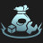
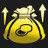
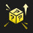
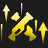
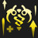
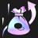
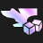
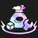
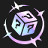
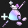

# Augment: silver, Count: 82
| key                          | name                    | icon                                                                           | desc                                                                                                                                    |
| -                            | -                       | -                                                                              | -                                                                                                                                       |
| AFK                          | AFK                     |                                                    | You cannot perform actions for the next 3 rounds. Afterwards, gain 20 gold.                                                             |
| Consistency                  | Consistency             |                                    | Gain double win and loss streak gold.                                                                                                   |
| ItemGrabBag1                 | Item Grab Bag I         |                                  | Gain 1 random completed item.                                                                                                           |
| LategameSpecialist           | Lategame Specialist     |                      | When you reach Level 9, gain 44 gold.                                                                                                   |
| PandorasBench                | Pandora's Bench         |                                | Gain 2 gold. At the start of every round, champions on the 3 rightmost bench slots transform into random champions of the same cost.    |
| PandorasItems                | Pandora's Items         |                                | Gain a random component. Round Start: items on your bench are randomized (excluding Tactician's Crown, Spatula, and consumables).       |
| Recombobulator               | Recombobulator          |                              | Champions on your board permanently transform into random champions 1 Tier higher. Gain 2 Magnetic Removers.                            |
| TinyTitans                   | Tiny Titans             |                                      | Your Tactician heals 30 Health, grows larger, and has 130 maximum Health.                                                               |
| YoungAndWildAndFree          | Young and Wild and Free |                    | You can always move freely on Carousel rounds. Gain a random component.                                                                 |
| CyberneticBulk1              | Cybernetic Bulk I       |                            | Your champions holding an item gain 250 health.                                                                                         |
| CyberneticLeech1             | Cybernetic Leech I      |                          | Your units holding an item gain 80 Health and 13% Omnivamp.                                                                             |
| LongTimeCrafting             | Latent Forge            |                          | Gain an Ornn Item Anvil after 8 player combats.                                                                                         |
| Formation1                   | Unified Resistance I    |                                      | If you have 3 or more units in the same row at the start of combat, they all gain 18 Armor and Magic Resist.                            |
| SilverSpoon                  | Silver Spoon            |                                    | Gain 10 XP.                                                                                                                             |
| CustomerIsAlwaysRight        | Component Buffet        |                | Gain a random component. Whenever you would get a random component, instead gain a component anvil.                                     |
| Inconsistency                | Inconsistency           |                                | If your streak is less than 2, gain 2 gold.                                                                                             |
| IronAssets                   | Iron Assets             |                                      | Gain a Component Anvil and 2 Gold.                                                                                                      |
| OnARoll                      | On a Roll               |                                            | Whenever you star-up a champion, gain a free reroll. Gain 2 gold.                                                                       |
| SocialDistancing             | Social Distancing I     |                          | Units that begin combat with no adjacent allies gain 12% Attack Damage and Ability Power.                                               |
| OneTwosThree                 | One Twos Three          |                                  | Gain 1 Tier one unit, 2 Tier two units, and 1 Tier three unit.                                                                          |
| IndomitableWill              | Indomitable Will        |                            | When your units score a Takedown they shed all negative effects and become immune to Crowd Control for 10 seconds.                      |
| MissedConnections            | Missed Connections      |                        | Gain a copy of each Tier One champion.                                                                                                  |
| BloodMoney                   | Blood Money             |                                      | Gain 1 gold per 3 Health your Tactician loses.                                                                                          |
| HealingOrbsI                 | Healing Orbs I          |                                  | When an enemy dies, the nearest allied unit is healed for 300.                                                                          |
| ShadowIslesTrait             | Shadow Isles Heart      |                          | Your team counts as having 1 additional Shadow Isles. Gain a Viego and 1 gold.                                                          |
| ZaunTrait                    | Zaun Heart              |                                        | Your team counts as having 1 additional Zaun. Gain a Warwick.                                                                           |
| ArmorcladTrait               | Juggernaut Heart        |                              | Your team counts as having 1 additional Juggernaut. Gain a Sett.                                                                        |
| BastionTrait                 | Bastion Heart           |                                  | Your team counts as having 1 additional Bastion. Gain a Kassadin.                                                                       |
| BruiserTrait                 | Bruiser Heart           |                                  | Your team counts as having 1 additional Bruiser. Gain a Vi.                                                                             |
| ChallengerTrait              | Challenger Heart        |                            | Your team counts as having 1 additional Challenger. Gain a Warwick.                                                                     |
| DeadeyeTrait                 | Deadeye Heart           |                                  | Your team counts as having 1 additional Deadeye. Gain an Ashe.                                                                          |
| PreserverTrait               | Invoker Heart           |                              | Your team counts as having 1 additional Invoker. Gain a Soraka.                                                                         |
| RogueTrait                   | Rogue Heart             |                                      | Your team counts as having 1 additional Rogue. Gain a Zed.                                                                              |
| SlayerTrait                  | Slayer Heart            |                                    | Your team counts as having 1 additional Slayer. Gain a Kled.                                                                            |
| SorcererTrait                | Sorcerer Heart          |                                | Your team counts as having 1 additional Sorcerer. Gain a Swain.                                                                         |
| MarksmanTrait                | Gunner Heart            |                                | Your team counts as having 1 additional Gunner. Gain a Jinx.                                                                            |
| LesserJeweledLotus           | Jeweled Lotus I         |                      | Combat Start: Your strongest unit gains 40% critical strike chance and their spells can critically strike.                              |
| BronzeTicket                 | Bronze Ticket           |                                  | Every 4 Shop refreshes, gain a free refresh.                                                                                            |
| BuildingACollection          | Buried Treasures I      |                    | At the start of the next 2 rounds, gain a random item component.                                                                        |
| BranchingOut                 | Branching Out           |                                  | Gain a random Emblem and a Reforger.                                                                                                    |
| Commander_SmallForge         | Small Forge             |                  | Gain a Component Anvil and 4 Gold.                                                                                                      |
| Commander_SmallForgePlus     | Job's Done              |          | Gain 2 Component Anvils.                                                                                                                |
| Harmacist1                   | Harmacist I             |                                      | Your units heal for 10% of the damage they deal, and they convert 20% of excess healing to true damage on their next attack.            |
| Commander_Experience1        | Knowledge Download I    |                | Gain 12 XP.                                                                                                                             |
| ArmyBuilding                 | Army Building           |                                  | Gain a Lesser Champion Duplicator. This happens a second time after 7 player combats.                                                   |
| RiskyMoves                   | Risky Moves             |                                      | Your Tactician loses 20 Health, but after 7 Player combats, gain 30 Gold.                                                               |
| OneTwoFive                   | One, Two, Five!         |                                      | Gain 1 random component, 2 Gold, and 1 random Tier 5 champion(s).                                                                       |
| AirspeedVelocity1            | Unburdened I            |                        | Your units without items equipped gain 30% Attack Speed.                                                                                |
| BalancedBudget               | Balanced Budget         |                              | At the start of the next 4 rounds, Gain 4 Gold.                                                                                         |
| Transfusion                  | Transfusion I           |                                    | Your team gains 20 Health, plus 2 Health per missing Tactician Health.                                                                  |
| DravenSpoilsOfWar            | Spoils of War I         |                        | When you kill an enemy unit, there's a 20% chance to drop loot.                                                                         |
| Commander_Money              | Money!                  |                            | Gain 10 Gold. In 4 turns, gain 10 Gold again.                                                                                           |
| PumpingUp                    | Pumping Up I            |                                        | Your units gain 8% Attack Speed. Each round, increase this by 0.5%.                                                                     |
| BattleReady                  | Battle Ready            |                                    | Your team deals 3% more damage and takes 3% less damage.                                                                                |
| GottaGoFast                  | Gotta Go Fast!          |                                    | Your team generates 10% more mana and moves 20% faster.                                                                                 |
| Commander_TinyPower1         | Tiny Power I            |                  | Your units gain 7% Attack Damage, Ability Power, and Attack Speed.                                                                      |
| FinalGrabBag                 | Final Grab Bag          |                                  | Gain a random component, 10 gold, and a Reforger.                                                                                       |
| Commander_PartialAscension   | Partial Ascension       |      | After 15 seconds of combat, your units deal 30% more damage.                                                                            |
| Commander_TeamingUp1         | Seeing Double I         |                  | Gain a random item made from 2 of the same component and 2 gold.                                                                        |
| Commander_RollingForDays     | Rolling For Days I      |          | Gain 10 free shop refreshes. These shop refreshes carry over between rounds.                                                            |
| TinyGrabBag                  | Tiny Grab Bag           |                                    | Gain a random component, 4 gold, a Magnetic Remover.                                                                                    |
| Commander_WellEarnedComforts | Well-Earned Comforts I  |  | Your units gain 60 Health for each item equipped.                                                                                       |
| TopDeck                      | Training Reward         |                                            | Gain 7 gold and a Lesser Champion Duplicator.                                                                                           |
| ItPaysToLearn                | It Pays To Learn        |                                | Gain 10 XP and 8 gold.                                                                                                                  |
| RedBuff                      | Red Buff                |                                            | Your units' attacks burn their targets for 8% of their maximum Health over 5 seconds and reduce their targets' healing received by 50%. |
| AllNatural                   | All Natural I           |                                      | Your Champions with no items equipped gain 120 Health and heal for 1% of their max Health each second.                                  |
| BardPlaybook1                | Caretaker's Ally        |                                | Each time you level up, gain the same random Tier 2 champion.                                                                           |
| Legend_LongTimeCrafting      | Latent Forge            |            | Gain an Ornn Item Anvil after 8 player combats.                                                                                         |
| Legend_AFK                   | AFK                     |                                      | You cannot perform actions for the next 3 rounds. Afterwards, gain 18 gold.                                                             |
| Legend_LesserJeweledLotus    | Jeweled Lotus I         |        | Combat Start: Your strongest unit gains 25% critical strike chance and their spells can critically strike.                              |
| Legend_DravenSpoilsOfWar     | Spoils of War I         |          | When you kill an enemy unit, there's a 25% chance to drop loot.                                                                         |
| Legend_TinyTitans            | Tiny Titans             |                        | Your Tactician heals 30 Health, grows larger, and has 130 maximum Health.                                                               |
| Legend_BranchingOut          | Branching Out           |                    | Gain a random Emblem and a Reforger.                                                                                                    |
| Legend_CuttingCorners        | Cutting Corners         |                | Leveling up costs 3 XP less. You can now reach Level 10.                                                                                |
| Legend_PumpingUp             | Pumping Up I            |                          | Your units gain 8% Attack Speed. Each round, increase this by 0.5%. (current Attack Speed: %)                                           |
| Legend_BuildingACollection   | Buried Treasures I      |      | Gain a random item component at the start of the next 2 rounds. Now starts granting items the round the augment is selected.            |
| Legend_OnARoll               | Bronze Ticket           |                              | Every 4 Shop refreshes, gain a free refresh.                                                                                            |
| Legend_Transfusion           | Transfusion I           |                      | Your team gains 20 Health, plus 2 Health per missing Tactician Health.                                                                  |
| Legend_PandorasItems         | Pandora's Items         |                  | Gain a random component. Round Start: items on your bench are randomized (excluding Tactician's Crown, Spatula, and consumables).       |
| Legend_BardPlaybook1         | Caretaker's Ally        |                  | Each time you level up, gain the same random Tier 2 champion.                                                                           |
| Legend_OneTwosThree          | One Twos Three          |                    | Gain 1 Tier one unit, 2 Tier two units, and 1 Tier three unit.                                                                          |
| CuttingCorners               | Cutting Corners         |                              | Leveling up costs 3 XP less. You can now reach Level 10.                                                                                |
# Augment: gold, Count: 141
| key                             | name                     | icon                                                                                 | desc                                                                                                                                                                                                  |
| -                               | -                        | -                                                                                    | -                                                                                                                                                                                                     |
| HyperRoll                       | Hustler                  |                                              | Instead of having no interest, you get 3 golds at the beginning of player combat rounds.                                                                                                              |
| JeweledLotus                    | Jeweled Lotus II         |                                        | Your units' Abilities can critically strike. Your units gain 15% Critical Strike chance.                                                                                                              |
| LastStand                       | Last Stand               |                                              | The first time you would be eliminated or reduced to 1 Health, instead remain alive. After this effect triggers, your units permanently gain 180 Health, 18 Armor and Magic Resist, and 18% Omnivamp. |
| MetabolicAccelerator            | Metabolic Accelerator    |                        | Your Tactician moves faster and heals 2 Health after a PvP round.                                                                                                                                     |
| PortableForge                   | Portable Forge           |                                      | Open an Armory and choose 1 of 2 unique Artifacts crafted by Ornn.                                                                                                                                    |
| RichGetRicher                   | Rich Get Richer          |                                      | Gain 12 gold. Your maximum interest is increased to 7.                                                                                                                                                |
| RichGetRicherPlus               | Rich Get Richer+         |                              | Gain 18 gold. Your maximum interest is increased to 7.                                                                                                                                                |
| SalvageBin                      | Salvage Bin              |                                            | Gain a random completed item now, and a component after 7 player combats. Selling champions breaks apart their full items into components (excluding Tactician's Crown).                              |
| SalvageBinPlus                  | Salvage Bin+             |                                    | Gain a random completed item now, and a component after 4 player combats. Selling champions breaks apart their full items into components (excluding Tactician's Crown).                              |
| ScopedWeapons1                  | Scoped Weapons           |                                    | Your units that start combat in the back 2 rows gain +2 Attack Range and 15% Attack Speed.                                                                                                            |
| ThreesCompany                   | Three's Company          |                                      | Gain 4 random Tier 3 champions.                                                                                                                                                                       |
| TomeOfTraits1                   | Ancient Archives I       |                                      | Gain 1 Tome of Traits and 5 gold.                                                                                                                                                                     |
| TradeSector                     | Trade Sector             |                                          | Gain a free Shop refresh each round.                                                                                                                                                                  |
| Traitless2                      | Built Different II       |                                            | Your units with no Traits active gain 200-425 Health and 40-60% Attack Speed (based on current Stage).                                                                                                |
| Twins2                          | Double Trouble II        |                                                    | When you field exactly 2 copies of a champion, they both gain 33% Attack Damage and 33 Ability Power, Armor, and Magic Resist. When you 3-star, gain a 2-star copy.                                   |
| SilverTicket                    | Silver Ticket            |                                        | Each time your Shop is refreshed, you have a 30% chance to gain a free refresh.                                                                                                                       |
| CyberneticBulk2                 | Cybernetic Bulk II       |                                  | Your champions holding an item gain 350 health.                                                                                                                                                       |
| CapriciousForge                 | Capricious Forge         |                                  | Gain a Blacksmith's Gloves, which equips two temporary Ornn Artifacts each round.                                                                                                                     |
| CyberneticLeech2                | Cybernetic Leech II      |                                | Your units holding an item gain 120 Health and 18% Omnivamp.                                                                                                                                          |
| Formation2                      | Unified Resistance II    |                                            | If you have 3 or more units in the same row at the start of combat, they all gain 30 Armor and Magic Resist.                                                                                          |
| TonsOfStats                     | Tons of Stats!           |                                          | Your team gains 35 Health, 5% Attack Damage, 5 Ability Power, 5 Armor, 5 Magic Resist, 5% Attack Speed, and 5 Mana.                                                                                   |
| StarsAreBorn                    | Stars are Born           |                                        | The first tier 1 unit and tier 2 unit you buy are upgraded to 2-star. Gain a 3 gold.                                                                                                                  |
| ImpromptuInventions             | Scrappy Inventions       |                          | At the start of combat, maximum of 5 components on your champions turn into  temporary items for the rest of combat. At the start of the next 2 stages, gain a component.                             |
| KnowledgeIsPower                | Library Card             |                                | Gain a Tome of Traits and a Component Anvil                                                                                                                                                           |
| SocialDistancing2               | Social Distancing II     |                              | Units that begin combat with no adjacent allies gain 18% Attack Damage and Ability Power.                                                                                                             |
| EnduranceTraining               | Endurance Training       |                              | Your champions permanently gain 18 Health every time they kill an enemy. Champions start with 100 bonus Health.                                                                                       |
| EarlyEducation                  | Early Education          |                                    | Your champions permanently gain 1 Ability Power whenever they kill an enemy. Champions start with 15 bonus Ability Power.                                                                             |
| AllThatShimmers                 | All That Shimmers        |                                  | Gain a Shimmerscale Item armory that offers 3 options. Shimmerscale items aid gold generation.                                                                                                        |
| Shoplifting                     | Shoplifting              |                                          | After your first shop refresh each turn, gain the highest cost champion for free.                                                                                                                     |
| Infusion                        | Infusion                 |                                                | Your team restores 20 Mana every 5 seconds.                                                                                                                                                           |
| Sleightofhand                   | Sleight of Hand          |                                      | Gain a Thiefs Gloves. Your allies holding Thiefs Gloves gain 30% Attack Speed.                                                                                                                        |
| ACutAbove                       | A Cut Above              |                                              | Gain a Deathblade. Champions with Deathblade have a 33% chance to drop 1 gold on kill.                                                                                                                |
| EnshroudingStillness            | Mana Burn                |                        | Gain a Shroud of Stillness. All enemies take 2% of their maximum health as true damage each second until the first time they cast their spell. No longer damages units without mana.                  |
| Idealism                        | Idealism                 |                                                | Gain a Hand of Justice. Champions with a Hand of Justice deal 13% increased damage.                                                                                                                   |
| HealingOrbsII                   | Healing Orbs II          |                                      | When an enemy dies, the nearest allied unit is healed for 500.                                                                                                                                        |
| GargantuanResolve               | Gargantuan Resolve       |                              | Gain a Titan's Resolve. Your Titan's Resolves can continue stacking to 35 instead of 25.                                                                                                              |
| GiftsFromTheFallen              | Gifts from the Fallen    |                            | Your units gain 4% Attack Damage, 4 Ability Power, 4 Armor, and 4 Magic Resist. When one of your units dies, all your units gain these stats again.                                                   |
| Martyr                          | Martyr                   |                                                    | Whenever one of your units dies, all allies heal for 10% of Maximum health                                                                                                                            |
| LongDistanceRelationship2       | Long Distance Pals II    |              | Combat start: Your two furthest champions form a bond, sharing 25% of their Armor, Magic Resist, Attack Damage, and Ability Power with each other.                                                    |
| FreljordTrait                   | Freljord Heart           |                                      | Your team counts as having 1 additional Freljord. Gain an Ashe.                                                                                                                                       |
| DemaciaCrest                    | Demacia Crest            |                                        | Gain a Demacia Emblem and a Galio.                                                                                                                                                                    |
| IoniaCrest                      | Ionia Crest              |                                            | Gain a Ionia Emblem and a Sett.                                                                                                                                                                       |
| NoxusCrest                      | Noxus Crest              |                                            | Gain a Noxus Emblem and a Swain.                                                                                                                                                                      |
| PiltoverTrait                   | Piltover Heart           |                                      | Your team counts as having 1 additional Piltover. Gain a Vi.                                                                                                                                          |
| ShurimaCrest                    | Shurima Crest            |                                        | Gain a Shurima Emblem and a Taliyah.                                                                                                                                                                  |
| TargonTrait                     | Targon Heart             |                                          | Your team counts as having 1 additional Targon. Gain a Soraka.                                                                                                                                        |
| VoidTrait                       | Void Crest               |                                              | Gain a Void Emblem, Kassadin.                                                                                                                                                                         |
| ZaunCrest                       | Zaun Crest               |                                              | Gain a Zaun Emblem and a Warwick.                                                                                                                                                                     |
| ArmorcladCrest                  | Juggernaut Crest         |                                    | Gain an Juggernaut Emblem and a Sett.                                                                                                                                                                 |
| BastionCrest                    | Bastion Crest            |                                        | Gain a Bastion Emblem and a Kassadin.                                                                                                                                                                 |
| BruiserCrest                    | Bruiser Crest            |                                        | Gain a Bruiser Emblem and a Vi.                                                                                                                                                                       |
| ChallengerCrest                 | Challenger Crest         |                                  | Gain a Challenger Emblem and a Warwick.                                                                                                                                                               |
| DeadeyeCrest                    | Deadeye Crest            |                                        | Gain a Deadeye Emblem and an Ashe.                                                                                                                                                                    |
| PreserverCrest                  | Invoker Crest            |                                    | Gain an Invoker Emblem and a Soraka.                                                                                                                                                                  |
| RogueCrest                      | Rogue Crest              |                                            | Gain a Rogue Emblem and a Zed.                                                                                                                                                                        |
| SlayerCrest                     | Slayer Crest             |                                          | Gain a Slayer Emblem and a Kled.                                                                                                                                                                      |
| SorcererCrest                   | Sorcerer Crest           |                                      | Gain a Sorcerer Emblem and a Swain.                                                                                                                                                                   |
| StrategistTrait                 | Strategist Heart         |                                  | Your team counts as having 1 additional Strategist. Gain a Swain.                                                                                                                                     |
| MarksmanCrest                   | Gunner Crest             |                                      | Gain a Gunner Emblem and a Jinx.                                                                                                                                                                      |
| Contagion                       | Contagion                |                                              | Combat Start: Infect the highest health enemy, increasing their damage taken by 20%. Every 5 seconds or on death, the infection spreads to 2 nearby units.                                            |
| BuildingACollectionPlus         | Buried Treasures II      |                  | At the start of the next 3 rounds, gain a random item component.                                                                                                                                      |
| KnowYourEnemy                   | Know Your Enemy          |                                      | Your units deal 12% increased damage. If you and your opponent have any of the same traits activated, they deal 20% increased damage instead.                                                         |
| Commander_MediumForge           | Medium Forge             |                      | Gain a Completed Item Anvil and 7 Gold.                                                                                                                                                               |
| Commander_MediumForgePlus       | Job Well Done            |              | Gain a Completed Item Anvil and a Component Anvil.                                                                                                                                                    |
| Harmacist2                      | Harmacist II             |                                            | Your units heal for 15% of the damage they deal, and they convert 25% of excess healing to true damage on their next attack.                                                                          |
| Commander_Experience2           | Knowledge Download II    |                      | Gain 22 XP.                                                                                                                                                                                           |
| PandorasItems2                  | Pandora's Items II       |                                    | Gain 2 random components. Round Start: items on your bench are randomized (excluding Tactician's Crown, Spatula, and consumables).                                                                    |
| WhatDoesntKillYou               | What Doesn't Kill You    |                              | After losing your combat, gain 2 gold. Every 5 losses, gain a random component.                                                                                                                       |
| NotToday                        | Not Today                |                                                | Gain an Edge of Night. Allies holding Edge of Night gain 35% Attack Speed.                                                                                                                            |
| AirspeedVelocity2               | Unburdened II            |                              | Your units without items equipped gain 55% Attack Speed.                                                                                                                                              |
| DemaciaPetriciteShackles        | Petricite Shackles       |                | Your Demacians deal 15% more damage, increased to 22% against Noxians and enemies with 100 or more maximum Mana. Gain 3 Demacians.                                                                    |
| ReturnOnInvestment              | Return on Investment     |                            | After you refresh your shop 20 times, gain a Tactician's Crown.                                                                                                                                       |
| JustKeepRolling                 | Frequent Flier           |                                  | After you refresh your shop 8 times, your refreshes cost 1 for the rest of the game.                                                                                                                  |
| FreljordGlacialBreeze           | Glacial Breeze           |                      | When your Freljordian Storm strikes, your units are shielded for 15% of their maximum Health and gain 8% Attack Speed. Gain 2 Freljord units.                                                         |
| BalancedBudget2                 | Balanced Budget II       |                                  | At the start of the next 4 rounds, Gain 6 Gold.                                                                                                                                                       |
| TransfusionPlus                 | Transfusion II           |                                  | Your team gains 40 Health, plus 3 Health per missing Tactician Health.                                                                                                                                |
| DravenSpoilsOfWar2              | Spoils of War II         |                            | When you kill an enemy unit, there's a 30% chance to drop loot.                                                                                                                                       |
| Commander_Money2                | Money Money!             |                                | Gain 16 Gold. In 4 turns, gain 16 Gold again.                                                                                                                                                         |
| ShadowIslesHauntedShell         | Haunted Shell            |                  | If Shadow Isles is active, your units gain 13 Armor and Magic Resistance for the rest of combat each time an ally dies. Gain 2 Shadow Isles units.                                                    |
| PumpingUp2                      | Pumping Up II            |                                            | Your units gain 10% Attack Speed. Each round, increase this by 1%.                                                                                                                                    |
| BattleReadyII                   | Battle Ready II          |                                      | Your team deals 6% more damage and takes 6% less damage.                                                                                                                                              |
| GottaGoFastII                   | Gotta Go Fast! II        |                                      | Your team generates 25% more mana and moves 40% faster.                                                                                                                                               |
| Commander_TinyPower2            | Tiny Power II            |                        | Your units gains 10% Attack Damage, Ability Power, and Attack Speed.                                                                                                                                  |
| Commander_Ascension             | Ascension                |                          | After 15 seconds of combat, your units deal 50% more damage.                                                                                                                                          |
| FinalGrabBagPlus                | Final Grab Bag II        |                                | Gain 2 random components, 12 gold, and a Magentic Remover.                                                                                                                                            |
| ItemGrabBagPlus                 | Item Grab Bag II         |                                  | Gain a random completed item, a random component, and 5 gold.                                                                                                                                         |
| Commander_TeamingUp2            | Seeing Double II         |                        | Gain a random item made from 2 of the same component and 10 gold.                                                                                                                                     |
| Commander_RollingForDays2       | Rolling For Days II      |              | Gain 15 free shop refreshes, These shop refreshes carry over between rounds.                                                                                                                          |
| BigGrabBag                      | Big Grab Bag             |                                            | Gain 2 random components, 8 gold, and a Reforger.                                                                                                                                                     |
| Commander_WellEarnedComforts2   | Well-Earned Comforts II  |      | Your units gain 111 Health for each item equipped.                                                                                                                                                    |
| TopDeckPlus                     | Training Reward II       |                                          | Gain 15 gold and a Lesser Champion Duplicator.                                                                                                                                                        |
| ItPaysToLearnII                 | It Pays to Learn II      |                                  | Gain 16 XP and 12 gold.                                                                                                                                                                               |
| DangerousToGoAlone              | Parting Gifts            |                            | When a unit dies, they pass a temporary copy of one of their items to the nearest ally with open slots and shield them for 40% of their maximum Health.                                               |
| ShurimaShurimasLegacy           | Shurima's Legacy         |                      | Once assembled, your Sun Disc attacks enemies for 160-800 Magic Damage every 2 seconds (based on current Stage). Gain 3 Shurimans.                                                                    |
| ShadowIslesCrest                | Shadow Isles Crest       |                                | Gain a Shadow Isles Emblem, a Maokai, and 1 gold.                                                                                                                                                     |
| GunnerSpiritOfTheDuelist        | Dueling Gunners          |                | Your Gunner units gain 8% Attack Speed, plus 2% per Gunner stack. Gain 2 Gunners.                                                                                                                     |
| YouHaveMySword                  | You Have My Sword        |                                    | Gain a B.F. Sword. Your units gain 18% Attack Damage.                                                                                                                                                 |
| YouHaveMyBow                    | You Have My Bow          |                                        | Gain a Recurve Bow. Your units gain 15% Attack Speed.                                                                                                                                                 |
| OldMansWalkingStick             | Magic Wand               |                          | Gain a Needlessly Large Rod. Your units gain 20% Ability Power.                                                                                                                                       |
| EscortQuest                     | Escort Quest             |                                          | Gain a Training Dummy. Each round, if it survives combat, gain 3 gold.                                                                                                                                |
| ThreesACrowd                    | Three's a Crowd          |                                        | Your units gain 111 health for each Tier-3 unique unit you field.                                                                                                                                     |
| TwoHealthy                      | Two Healthy              |                                            | Your units gain 111 health for each Tier-2 unique unit you field.                                                                                                                                     |
| TargonStaffOfFlowingWaters      | Stellacorn's Blessing    |            | While you have the Targon trait activated, your units gain 45% Attack Speed for 4 seconds after being healed or shielded. Gain 2 Targonians.                                                          |
| StrategistTacticalSuperiority   | Tactical Superiority     |      | Your units gain 5% Attack Damage and Ability Power for each of their traits you have activated, doubled when you field a Strategist. Gain 2 Strategists.                                              |
| SorcererOverchargedManafont     | Overcharged Manafont     |          | Combat Start: Your Sorcerer units gain 10 mana. The first time each Sorcerer gets a take down each combat, they gain 20 mana. Gain 2 Sorcerers.                                                       |
| AllNatural2                     | All Natural II           |                                          | Your units with no items equipped gain 150 Health and heal for 2% of their max Health each second.                                                                                                    |
| LearningFromExperience2         | Patient Study            |                  | After player combat, gain 2 XP if you won or 3 XP if you lost. You can now reach Level 10.                                                                                                            |
| PiltoverShimmeringInventors     | Shimmering Inventors     |          | Your Piltover units gain 7% Bonus Damage every 10 gold you have (Max: 40%), and have a 33% chance to drop 1 gold at round start. Gain an Ekko.                                                        |
| SlayerSlayersResolve            | Slayer's Resolve         |                        | When your Slayer units take or deal damage, they gain 2 Armor and Magic Resistance for the rest of combat (This can stack up to 25 times). Gain 2 Slayers.                                            |
| RogueVampiricBlades             | Vampiric Blades          |                          | Your team gains 10% Omnivamp. Your Rogue units gain 20% instead. Gain 2 Rogues.                                                                                                                       |
| InvokerLovingInvocation         | Loving Invocation        |                  | Your team gains 2 Ability Power until the end of combat each time your Invoker units cast their Abilities. Gain 2 Invokers.                                                                           |
| DeadeyeSuppressingFire          | Suppressing Fire         |                    | The target of your Deadeye units' shared attack is stunned for 8 seconds. Gain 2 Deadeyes.                                                                                                            |
| MulticasterPracticeMakesPerfect | Perfected Repetition     |  | Each time your Multicaster units deal ability damage, they gain 6%% Ability power (Max: 90%%) until the end of combat. Gain 2 Multicasters.                                                           |
| ChallengerDefensiveDash         | Defensive Dash           |                  | Combat Start and on takedown: Your Challenger units gain a 75-225 health shield for 2.5 seconds (based on current Stage). Gain 2 Challenger units.                                                    |
| YordleUnstableYordlePortal      | Unstable Yordle Delivery |            | Round Start: Gain a random Yordle or 1-5 gold (based on current Stage). Gain 3 Yordles.                                                                                                               |
| IoniaSentinelsSpirit            | Sentinel's Spirit        |                        | While in spirit form, your Ionia units gain 15% Attack Speed and shield themselves for 15% of their maximum Health. Gain 3 Ionians.                                                                   |
| JuggernautCantStopMe            | Adrenaline Rush          |                        | Your Juggernaut units deal 10% extra damage, increased to 25% for the rest of combat when they fall below 50% Health.  Gain 2 Juggernauts.                                                            |
| BastionMorningLight             | Morning Light            |                          | When your Bastion units drop below 50% Health, they heal for 40% of their maximum Health over 4 seconds. Gain 2 Bastion units.                                                                        |
| VoidRapidIncubation             | Stable Evolution         |                          | Your Void units gain 60 Health and 6% Attack Damage and Ability Power for each star level they have. Gain 3 Void units.                                                                               |
| CombatCaster                    | Combat Caster            |                                        | Your units gain a 90-170 (based on current Stage) health shield for 6 seconds after casting their spell.                                                                                              |
| BruiserTitanicStrength          | Titanic Strength         |                    | Bruisers gain % increased Attack Damage equal to 1.5% of their maximum Health. Gain 2 Bruisers.                                                                                                       |
| NoxusTotalDomination            | Total Domination         |                        | Attacks and Abilities of your Noxus units execute enemies below 8% of their maximum Health, increased by +1% for each player you've Conquered. Gain 3 Noxians.                                        |
| ZaunChemicallyEnhancedBulk      | Chemtech Enhancements    |            | Your Chem Modded units gain 500 Health. Allies that start combat adjacent to them gain 100 Health. Gain 2 Zaun units.                                                                                 |
| BardPlaybook2                   | Caretaker's Favor        |                                      | Gain a component anvil when you reach level 5, 6, 7, and 8.                                                                                                                                           |
| Legend_PortableForge            | Portable Forge           |                        | Open an Armory and choose 1 of 2 unique Artifacts crafted by Ornn.                                                                                                                                    |
| Legend_RichGetRicher            | Rich Get Richer          |                        | Gain 12 gold. Your maximum interest is increased to 7.                                                                                                                                                |
| Legend_JeweledLotus             | Jeweled Lotus II         |                          | Your units' Abilities can critically strike. Your units gain 10% Critical Strike chance.                                                                                                              |
| Legend_DravenSpoilsOfWar2       | Spoils of War II         |              | When you kill an enemy unit, there's a 30% chance to drop loot.                                                                                                                                       |
| Legend_MetabolicAccelerator     | Metabolic Accelerator    |          | Your Tactician moves faster and heals 2 Health after a PvP round.                                                                                                                                     |
| Legend_TomeOfTraits1            | Ancient Archives I       |                        | Gain 1 Tome of Traits and 5 gold.                                                                                                                                                                     |
| Legend_LearningFromExperience2  | Patient Study            |    | After player combat, gain 2 XP if you won or 3 XP if you lost. You can now reach Level 10.                                                                                                            |
| Legend_PumpingUp2               | Pumping Up II            |                              | Your units gain 10% Attack Speed. Each round, increase this by 1%. (current Attack Speed: %)                                                                                                          |
| Legend_BuildingACollectionPlus  | Buried Treasures II      |    | Gain a random item component at the start of the next 3 rounds. Now starts granting items the round the augment is selected.                                                                          |
| Legend_TradeSector              | Trade Sector             |                            | Gain a free Shop refresh each round. Gain a 2 gold.                                                                                                                                                   |
| Legend_TransfusionPlus          | Transfusion II           |                    | Your team gains 40 Health, plus 3 Health per missing Tactician Health.                                                                                                                                |
| Legend_PandorasItems2           | Pandora's Items II       |                      | Gain 1 completed item. Round Start: items on your bench are randomized (excluding Tactician's Crown, Spatula, and consumables).                                                                       |
| Legend_BardPlaybook2            | Caretaker's Favor        |                        | Gain a component anvil when you reach level 5, 6, 7, and 8.                                                                                                                                           |
| Legend_StarsAreBorn             | Stars are Born           |                          | The first tier 1 unit and tier 2 unit you buy are upgraded to 2-star. Gain a 6 gold.                                                                                                                  |
| Dedication                      | Dedication               |                                            | The first time you field at least 4 distinct units of the same trait in a player combat, gain an Emblem for that trait.                                                                               |
| PortableForgePlus               | Portable Forge           |                              | Open an Armory and choose 1 of 3 unique Artifacts crafted by Ornn.                                                                                                                                    |
| PortableForgePlusPlus           | Portable Forge           |                      | Open an Armory and choose 1 of 4 unique Artifacts crafted by Ornn.                                                                                                                                    |
# Augment: prismatic, Count: 100
| key                                | name                     | icon                                                                                       | desc                                                                                                                                                                                  |
| -                                  | -                        | -                                                                                          | -                                                                                                                                                                                     |
| TomeOfTraits2                      | Ancient Archives II      |                                            | Gain 2 Tome of Traits and 3 gold.                                                                                                                                                     |
| BinaryAirdrop                      | Binary Airdrop           |                                            | Your champions equipped with 2 items temporarily gain a random completed item at the start of combat. Gain 1 random item components.                                                  |
| BirthdayPresents                   | Birthday Present         |                                      | Gain a 2-star champion and 2 gold every time you level up. The champion's tier is your level minus 4 (min: Tier 1).                                                                   |
| SacrificialPact                    | Cruel Pact               |                                        | Buying XP costs 5 Health instead of gold. Heal 2 Health before each player combat.                                                                                                    |
| CursedCrown                        | Cursed Crown             |                                                | Gain +2 maximum team size, but take 100% increased player damage.                                                                                                                     |
| GachaAddict                        | Golden Ticket            |                                                | Each time your Shop is refreshed, you have a 50% chance to gain a free refresh.                                                                                                       |
| LivingForge                        | Living Forge             |                                                | Gain an Ornn Item Anvil now and after every 10 player combats.                                                                                                                        |
| LuckyGloves                        | Lucky Gloves             |                                                | Thief's Gloves will always give your champions ideal items. Gain 3 Sparring Gloves.                                                                                                   |
| MaxLevel10                         | Level Up!                |                                                  | When you buy XP, gain an additional 3. Gain 2 immediately. You can now reach level 10.                                                                                                |
| RadiantRelics                      | Radiant Relics           |                                            | Open an Armory and choose 1 of 5 unique Radiant items.                                                                                                                                |
| SlowAndSteady                      | March of Progress        |                                            | Gain 3 XP now, and bonus XP equal to your level at the start of every player combat round. You can no longer use gold to level up.                                                    |
| TheGoldenEgg                       | The Golden Egg           |                                              | Gain a massive golden egg that hatches in 11 turns. Victorious player combats accelerate the hatch timer by an additional turn.                                                       |
| Traitless3                         | Built Different III      |                                                  | Your units with no Traits active gain 270-600 Health and 50-70% Attack Speed (based on current Stage).                                                                                |
| Twins3                             | Double Trouble III       |                                                          | When you field exactly 2 copies of a champion, they both gain 44% Attack Damage and 44 Ability Power, Armor, and Magic Resist. When you 3-star, gain a 2-star copy.                   |
| WoodlandCharm                      | Woodland Charm           |                                            | Your highest Health champion is cloned. Clones cannot hold items.                                                                                                                     |
| PhreakyFriday                      | Phreaky Friday           |                                            | Gain an Infinity Force. After 5 Player combats, gain a second Infinity Force.                                                                                                         |
| CyberneticBulk3                    | Cybernetic Bulk III      |                                        | Your champions holding an item gain 500 health.                                                                                                                                       |
| StarterKit                         | Starter Kit              |                                                  | Gain a Tier 4 champion, and a 2-star Tier 1 champion that shares a trait with them. At the next 1 stages, gain the Tier 4 champion again.                                             |
| CyberneticLeech3                   | Cybernetic Leech III     |                                      | Your units holding an item gain 225 Health and 25% Omnivamp.                                                                                                                          |
| TacticiansTools                    | Tactician's Tools        |                                        | Gain two Spatulas.                                                                                                                                                                    |
| SocialDistancing3                  | Social Distancing III    |                                    | Units that begin combat with no adjacent allies gain 25% Attack Damage and Ability Power.                                                                                             |
| FinalReserves                      | Final Reserves           |                                            | The first time you would be eliminated or reduced to 1 Health, instead remain alive. After this effect triggers, at the beginning of your next planning phase gain 80 XP and 40 Gold. |
| RollTheDice                        | Roll The Dice            |                                                | Gain a Radiant Thieves Gloves.                                                                                                                                                        |
| WhatTheForge                       | What The Forge           |                                              | All Completed items you own or receive are reforged into random Ornn Artifacts (excluding Tactician's Crown and Emblems). Units gain 160 Health per equipped Artifact.                |
| HedgeFund                          | Hedge Fund               |                                                    | You have no interest cap. Gain 22 gold.                                                                                                                                               |
| HedgeFundPlus                      | Hedge Fund+              |                                            | You have no interest cap. Gain 32 gold.                                                                                                                                               |
| DemaciaCrown                       | Demacia Crown            |                                              | Gain a Demacia Emblem, a Recurve Bow, and a Garen.                                                                                                                                    |
| FreljordTrait2                     | Freljord Soul            |                                          | Your team counts as having 1 additional Freljord. Gain an Archangel's Staff and a Lissandra.                                                                                          |
| IoniaCrown                         | Ionia Crown              |                                                  | Gain an Ionia Emblem, a Guardbreaker, and a Karma.                                                                                                                                    |
| NoxusCrown                         | Noxus Crown              |                                                  | Gain a Noxus Emblem, a Sparring Gloves, and a Darius.                                                                                                                                 |
| PiltoverTrait2                     | Piltover Soul            |                                          | Your team counts as having 1 additional Piltover. Gain a Giant Slayer and a Jayce.                                                                                                    |
| ShurimaCrown                       | Shurima Crown            |                                              | Gain a Shurima Emblem, a Protector’s Vow, and a Akshan.                                                                                                                               |
| TargonTrait2                       | Targon Soul              |                                              | Your team counts as having 1 additional Targon. Gain a Redemption and a Taric.                                                                                                        |
| VoidTrait2                         | Void Crown               |                                                  | Gain a Void Emblem, Zz'Rot Portal and a Rek'Sai.                                                                                                                                      |
| ZaunCrown                          | Zaun Crown               |                                                    | Gain a Zaun Emblem, a Guardbreaker, and an Ekko.                                                                                                                                      |
| ArmorcladCrown                     | Juggernaut Crown         |                                          | Gain an Juggernaut Emblem, a Bloodthirster, and a Darius.                                                                                                                             |
| BastionCrown                       | Bastion Crown            |                                              | Gain a Bastion Emblem,  a Sunfire Cape, and a Taric.                                                                                                                                  |
| BruiserCrown                       | Bruiser Crown            |                                              | Gain a Bruiser Emblem, a Redemption, and a Rek'Sai.                                                                                                                                   |
| ChallengerCrown                    | Challenger Crown         |                                        | Gain a Challenger Emblem, a Hand of Justice, and a Kalista.                                                                                                                           |
| DeadeyeCrown                       | Deadeye Crown            |                                              | Gain a Deadeye Emblem, a Guinsoo's Rageblade, and an Akshan.                                                                                                                          |
| MulticasterTrait2                  | Multicaster Soul         |                                    | Your team counts as having 1 additional Multicaster. Gain a Jeweled Gauntlet and a Vel'Koz.                                                                                           |
| PreserverCrown                     | Invoker Crown            |                                          | Gain a Invoker Emblem, a Jeweled Gauntlet, and a Karma.                                                                                                                               |
| RogueCrown                         | Rogue Crown              |                                                  | Gain a Rogue Emblem, a Hand of Justice, and a Katarina.                                                                                                                               |
| SlayerCrown                        | Slayer Crown             |                                                | Gain a Slayer Emblem, a Titan’s Resolve, and a Kled.                                                                                                                                  |
| SorcererCrown                      | Sorcerer Crown           |                                            | Gain a Sorcerer Emblem, a Spear of Shojin, and a Vel'Koz.                                                                                                                             |
| StrategistTrait2                   | Strategist Soul          |                                      | Your team counts as having 1 additional Strategist. Gain a Chalice of Power and a Swain.                                                                                              |
| MarksmanCrown                      | Gunner Crown             |                                            | Gain a Gunner Emblem, a Runann's Hurricane, and a Jayce.                                                                                                                              |
| GreaterJeweledLotus                | Jeweled Lotus III        |                                | Your units' Abilities can critically strike. Your units gain 45% Critical Strike chance.                                                                                              |
| BuildingACollectionPlusPlus        | Buried Treasures III     |                | At the start of the next 5 rounds, gain a random item component.                                                                                                                      |
| OneHundredDuckSizedHorses          | Endless Hordes           |                    | Gain +3 maximum team size, but your units can only hold 1 item and their total health is reduced by 20%. Gain 6 gold.                                                                 |
| Commander_LargeForge               | Large Forge              |                              | Gain an Ornn Item Anvil and a Component Item Anvil.                                                                                                                                   |
| Commander_LargeForgePlus           | Masterful Job            |                      | Gain an Ornn Item Anvil and a Completed Item Anvil                                                                                                                                    |
| Harmacist3                         | Harmacist III            |                                                  | Your units heal for 25% of the damage they deal, and they convert 30% of excess healing to true damage on their next attack.                                                          |
| Commander_Experience3              | Knowledge Download III   |                            | Gain 36 XP.                                                                                                                                                                           |
| PandorasRadiantBox                 | Pandora's Box            |                                  | Gain a random Radiant item. Round Start: items on your bench are randomized (excluding Tactician's Crown, Spatula, and consumables).                                                  |
| BalancedBudget3                    | Balanced Budget III      |                                        | At the start of the next 4 rounds, Gain 11 Gold.                                                                                                                                      |
| TransfusionPlusPlus                | Transfusion III          |                                | Your team gains 50 Health, plus 5 Health per missing Tactician Health.                                                                                                                |
| DravenSpoilsOfWar3                 | Spoils of War III        |                                  | When you kill an enemy unit, there's a 40% chance to drop amazing loot.                                                                                                               |
| Commander_Money3                   | Money Money Money!       |                                      | Gain 25 Gold. In 4 turns, gain 25 Gold again.                                                                                                                                         |
| PumpingUp3                         | Pumping Up III           |                                                  | Your units gain 12% Attack Speed. Each round, increase this by 2%.                                                                                                                    |
| BattleReadyIII                     | Battle Ready III         |                                          | Your team deals 8% more damage and takes 8% less damage.                                                                                                                              |
| TiniestTitan                       | Tiniest Titan            |                                              | Your tactician is small and speedy, heals 2 Health after a PVP round, and grants 2 Gold per round.                                                                                    |
| GottaGoFastIII                     | Gotta Go Fast!!! III     |                                          | Your team generates 35% more mana and moves 50% faster.                                                                                                                               |
| Commander_TinyPower3               | Tiny Power III           |                              | Your units gains 16% Attack Damage, Ability Power, and Attack Speed.                                                                                                                  |
| Commander_FinalAscension           | Final Ascension          |                      | Your units deal 15% more damage. After 15 seconds, this effect triples.                                                                                                               |
| FinalGrabBagPlusPlus               | Urf's Grab Bag           |                              | Gain 2 random components, a Champion Duplicator, and a Spatula.                                                                                                                       |
| Commander_TeamingUp3               | Seeing Double III        |                              | Gain 2 random items made from 2 of the same component and 4 gold.                                                                                                                     |
| Commander_RollingForDays3          | Rolling For Days III     |                    | Gain 25 free shop refreshes, These shop refreshes carry over between rounds.                                                                                                          |
| ItemGrabBagPlusPlus                | Item Grab Bag III        |                                | Gain 2 random full items and 8 Gold.                                                                                                                                                  |
| GiantGrabBag                       | Giant Grab Bag           |                                              | Gain 3 random components, 10 gold, and a Lesser Champion Duplicator.                                                                                                                  |
| Commander_WellEarnedComforts3      | Well-Earned Comforts III |            | Your units gain 120 Health and 8% Attack Speed for each item equipped.                                                                                                                |
| TopDeckPlusPlus                    | Training Reward III      |                                        | Gain 24 gold and a Champion Duplicator.                                                                                                                                               |
| ItPaysToLearnIII                   | It Pays to Learn III     |                                      | Gain 20 XP and 16 gold.                                                                                                                                                               |
| ShadowIslesCrown                   | Shadow Isles Crown       |                                      | Gain a Shadow Isles Emblem, a Tear of the Goddess, and a Kalista.                                                                                                                     |
| WanderingTrainer                   | Wandering Trainer        |                                      | Gain 4 gold and a Training Dummy. It has 3 random emblems equipped, which cannot be removed.                                                                                          |
| MoneyHealsAllWounds                | Wellness Trust           |                                | Round Start: Gain 3 gold. If you have at least 40 gold, your Tactician heals 2 Health.                                                                                                |
| BlindingSpeed                      | Blinding Speed           |                                            | Gain a Rapid Firecannon and a Guinsoo's Rageblade, a Magnetic Remover.                                                                                                                |
| ImpenetrableBulwark                | Impenetrable Bulwark     |                                | Gain a Bramble Vest and a Dragon's Claw, a Magnetic Remover.                                                                                                                          |
| UnleashedArcana                    | Unleashed Arcana         |                                        | Gain a Jeweled Gauntlet and a Rabadon's Deathcap, a Magnetic Remover.                                                                                                                 |
| OverwhelmingForce                  | Overwhelming Force       |                                    | Gain a Deathblade and an Infinity Edge, a Magnetic Remover.                                                                                                                           |
| HighEndSector                      | High End Sector          |                                            | Gain 1 gold per round. When you level up, gain a number of free shop refreshes equal to your level.                                                                                   |
| BardPlaybook3                      | Caretaker's Chosen       |                                            | As you level, gain more powerful items. At level 4 - gain a Component Anvil, at level 6 - gain a Completed Item Anvil, at level 8 - open a radiant item armory.                       |
| Legend_LivingForge                 | Living Forge             |                                  | Gain an Ornn Item Anvil now and after every 10 player combats.                                                                                                                        |
| Legend_HedgeFund                   | Hedge Fund               |                                      | You have no interest cap. Gain 16 gold.                                                                                                                                               |
| Legend_GreaterJeweledLotus         | Jeweled Lotus III        |                  | Your units' Abilities can critically strike. Your units gain 45% Critical Strike chance.                                                                                              |
| Legend_DravenSpoilsOfWar3          | Spoils of War III        |                    | When you kill an enemy unit, there's a 40% chance to drop amazing loot.                                                                                                               |
| Legend_TiniestTitan                | Tiniest Titan            |                                | Your tactician is small and speedy, heals 2 Health after a PVP round, and grants 2 Gold per round.                                                                                    |
| Legend_TomeOfTraits2               | Ancient Archives II      |                              | Gain 2 Tome of Traits and 3 gold.                                                                                                                                                     |
| Legend_MaxLevel10                  | Level Up!                |                                    | When you buy XP, gain an additional 3. Gain 4 immediately. You can now reach level 10.                                                                                                |
| Legend_PumpingUp3                  | Pumping Up III           |                                    | Your units gain 12% Attack Speed. Each round, increase this by 2%. (current Attack Speed: %)                                                                                          |
| Legend_BuildingACollectionPlusPlus | Buried Treasures III     |  | Gain a random item component at the start of the next 5 rounds. Now starts granting items the round the augment is selected.                                                          |
| Legend_HighEndSector               | Shopping spree           |                              | Gain 1 gold per round. When you level up, gain a number of free shop refreshes equal to your level, which carry over your rounds.                                                     |
| Legend_TransfusionPlusPlus         | Transfusion III          |                  | Your team gains 50 Health, plus 5 Health per missing Tactician Health.                                                                                                                |
| Legend_PandorasRadiantBox          | Pandora's Box            |                    | Gain a random Radiant item. Round Start: items on your bench are randomized (excluding Tactician's Crown, Spatula, and consumables).                                                  |
| Legend_BardPlaybook3               | Caretaker's Chosen       |                              | As you level, gain more powerful items. At level 4 - gain a Component Anvil, at level 6 - gain a Completed Item Anvil, at level 7 - open a radiant item armory.                       |
| Legend_StarterKit                  | Starter Kit              |                                    | Gain a Tier 4 champion, and a 2-star Tier 2 champion that shares a trait with them. At the next 1 stages, gain the Tier 4 champion again.                                             |
| PhreakyFridayPlus                  | Phreaky Friday+          |                                    | Gain an Infinity Force. After 3 Player combats, gain a second Infinity Force.                                                                                                         |
| InfernalContract                   | Infernal Contract        |                                      | Your max level is 7. Gain 85 Gold.                                                                                                                                                    |
| HedgeFundPlusPlus                  | Hedge Fund++             |                                    | You have no interest cap. Gain 44 gold.                                                                                                                                               |
| OneHundredDuckSizedHorsesplus      | Endless Hordes+          |            | Gain +3 maximum team size. Your units can only hold 1 item. Gain 12 gold.                                                                                                             |
# Augment: champion, Count: 5
| key           | name            | icon                                             | desc                                                                                                                                                                                               |
| -             | -               | -                                                | -                                                                                                                                                                                                  |
| SettTheBoss   | The Boss        |      | Gain a Sett. The first time your strongest Sett falls below 60% Health, he takes a break to do sit-ups. Each sit-up heals him 10% of his max Health and grants 45% Attack Speed and Ability Power. |
| WarwickCarry  | Ravenous Hunter |    | Gain a Warwick. When your strongest Warwick takes or deals damage, he gains 5% Attack Damage and 5 Ability Power, Armor, and Magic Resist, stacking up to 40 times.                                |
| KassadinCarry | Riftwalk        |  | Before casting, your strongest Kassadin gains 32 AP and blinks to the furthest enemy within 3 hexes, but his spell no longer disarms or shields. His mana cost is reduced by 30. Gain a Kassadin.  |
| GalioCarry    | Winds of War    |        | Gain a Galio. Your strongest Galio's spell is larger, and enemies hit take magic damage equal to 8% of their max Health each second.                                                               |
| SwainCarry    | Demonflare      |        | Gain a Swain. Your strongest Swain deals 4% increased damage per 100 max Health.                                                                                                                   |
