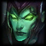
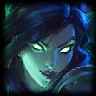
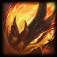
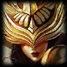
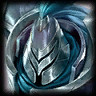

# Cost: 1, Count: 13
| key      | name     | icon                                     |
| -        | -        | -                                        |
| Aatrox   | Aatrox   |      |
| Gragas   | Gragas   |      |
| Kalista  | Kalista  |    |
| Khazix   | Khazix   |      |
| Kled     | Kled     |          |
| Leona    | Leona    |        |
| Olaf     | Olaf     |          |
| Poppy    | Poppy    |        |
| Senna    | Senna    |        |
| Udyr     | Udyr     |          |
| Vayne    | Vayne    |        |
| Vladimir | Vladimir |  |
| Ziggs    | Ziggs    |        |
# Cost: 2, Count: 13
| key      | name     | icon                                     |
| -        | -        | -                                        |
| Brand    | Brand    |        |
| Hecarim  | Hecarim  |    |
| Irelia   | Irelia   |      |
| Kennen   | Kennen   |      |
| Nautilus | Nautilus |  |
| Pyke     | Pyke     |          |
| Sejuani  | Sejuani  |    |
| Sett     | Sett     |          |
| Soraka   | Soraka   |      |
| Syndra   | Syndra   |      |
| Thresh   | Thresh   |      |
| Tristana | Tristana |  |
| Varus    | Varus    |        |
# Cost: 3, Count: 12
| key         | name        | icon                                           |
| -           | -           | -                                              |
| Ashe        | Ashe        |                |
| LeeSin      | LeeSin      |            |
| Lulu        | Lulu        |                |
| Lux         | Lux         |                  |
| MissFortune | MissFortune |  |
| Nidalee     | Nidalee     |          |
| Nocturne    | Nocturne    |        |
| Nunu        | Nunu        |                |
| Rakan       | Rakan       |              |
| Riven       | Riven       |              |
| Yasuo       | Yasuo       |              |
| Zyra        | Zyra        |                |
# Cost: 4, Count: 11
| key          | name         | icon                                             |
| -            | -            | -                                                |
| Aphelios     | Aphelios     |          |
| Diana        | Diana        |                |
| Draven       | Draven       |              |
| Fiddlesticks | Fiddlesticks |  |
| Galio        | Galio        |                |
| Ivern        | Ivern        |                |
| Jax          | Jax          |                    |
| Karma        | Karma        |                |
| Lucian       | Lucian       |              |
| Rell         | Rell         |                  |
| Velkoz       | Vel'koz      |              |
# Cost: 5, Count: 8
| key          | name         | icon                                             |
| -            | -            | -                                                |
| Akshan       | Akshan       |              |
| Garen        | Garen        |                |
| Gwen         | Gwen         |                  |
| Heimerdinger | Heimerdinger |  |
| Kayle        | Kayle        |                |
| Teemo        | Teemo        |                |
| Viego        | Viego        |                |
| Volibear     | Volibear     |          |
